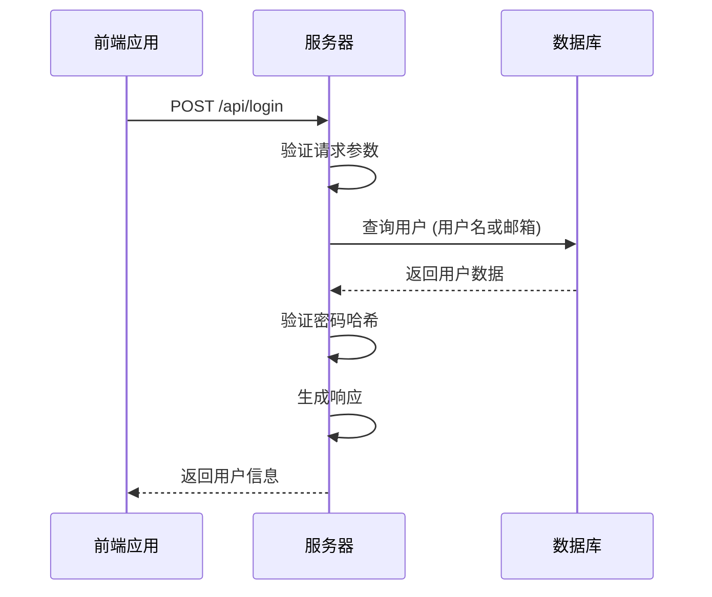
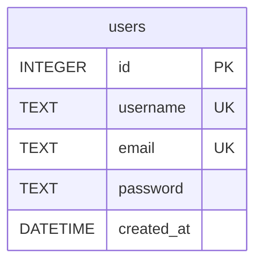
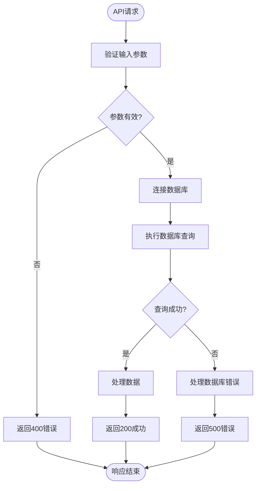

# API文档

<cite>
**本文档中引用的文件**   
- [server.js](file://backend/server.js#L1-L160)
- [migrate.js](file://backend/migrate.js#L1-L94)
- [users.json](file://backend/users.json#L1-L8)
- [Settings.tsx](file://src/components/Settings.tsx#L1-L402)
- [vite-env.d.ts](file://src/vite-env.d.ts#L1-L10)
</cite>

## 目录
1. [项目结构](#项目结构)
2. [核心API端点](#核心api端点)
3. [用户认证机制](#用户认证机制)
4. [数据模型与数据库](#数据模型与数据库)
5. [错误处理与响应格式](#错误处理与响应格式)
6. [前端集成示例](#前端集成示例)
7. [安全机制](#安全机制)
8. [测试与调试](#测试与调试)

## 项目结构

项目采用前后端分离架构，后端API服务位于`backend`目录，前端组件位于`src`目录。后端使用Express框架提供RESTful API，前端使用React框架构建用户界面。

```mermaid
graph TB
subgraph "前端"
UI[用户界面]
Settings[Settings.tsx]
API_BASE_URL[API配置]
end
subgraph "后端"
Server[server.js]
Database[users.db]
Migration[migrate.js]
end
UI --> Server : HTTP请求
Settings --> Server : /api/register, /api/login
API_BASE_URL --> Server : 基础URL配置
Server --> Database : SQLite操作
Migration --> Database : 数据迁移
```

**图源**
- [server.js](file://backend/server.js#L1-L160)
- [Settings.tsx](file://src/components/Settings.tsx#L1-L402)

## 核心API端点

### 注册接口
**HTTP方法**: POST  
**URL路径**: `/api/register`  
**请求头要求**: 
- `Content-Type: application/json`
- `Origin: http://officetools.guluwater.com` 或 `http://localhost:5173`

**请求参数 (body)**:
- `username` (字符串, 必填): 用户名
- `email` (字符串, 必填): 邮箱地址
- `password` (字符串, 必填): 密码

**成功响应 (200)**:
```json
{
  "success": true,
  "message": "注册成功",
  "user": {
    "id": 1,
    "username": "testuser",
    "email": "test@example.com"
  }
}
```

**失败响应示例**:

状态码 400 - 缺少必填字段:
```json
{
  "success": false,
  "message": "用户名、邮箱和密码不能为空"
}
```

状态码 400 - 用户已存在:
```json
{
  "success": false,
  "message": "用户名已存在"
}
```

状态码 500 - 服务器错误:
```json
{
  "success": false,
  "message": "注册失败"
}
```

**curl命令示例**:
```bash
curl -X POST http://localhost:3088/api/register \
  -H "Content-Type: application/json" \
  -d '{
    "username": "newuser",
    "email": "newuser@example.com",
    "password": "password123"
  }'
```

### 登录接口
**HTTP方法**: POST  
**URL路径**: `/api/login`  
**请求头要求**: 
- `Content-Type: application/json`
- `Origin: http://officetools.guluwater.com` 或 `http://localhost:5173`

**请求参数 (body)**:
- `username` (字符串, 必填): 用户名或邮箱
- `password` (字符串, 必填): 密码

**成功响应 (200)**:
```json
{
  "success": true,
  "message": "登录成功",
  "user": {
    "id": 1,
    "username": "testuser",
    "email": "test@example.com"
  }
}
```

**失败响应示例**:

状态码 400 - 缺少必填字段:
```json
{
  "success": false,
  "message": "用户名和密码不能为空"
}
```

状态码 401 - 认证失败:
```json
{
  "success": false,
  "message": "用户名或密码错误"
}
```

状态码 500 - 服务器错误:
```json
{
  "success": false,
  "message": "数据库错误"
}
```

**curl命令示例**:
```bash
curl -X POST http://localhost:3088/api/login \
  -H "Content-Type: application/json" \
  -d '{
    "username": "testuser",
    "password": "password123"
  }'
```

### 获取用户列表接口
**HTTP方法**: GET  
**URL路径**: `/api/users`  
**请求头要求**: 
- `Origin: http://officetools.guluwater.com` 或 `http://localhost:5173`

**成功响应 (200)**:
```json
{
  "success": true,
  "users": [
    {
      "id": 1,
      "username": "testuser",
      "email": "test@example.com",
      "created_at": "2025-07-08T09:48:45.808Z"
    }
  ]
}
```

**失败响应示例**:

状态码 500 - 查询失败:
```json
{
  "success": false,
  "message": "查询失败: SQL error"
}
```

**curl命令示例**:
```bash
curl -X GET http://localhost:3088/api/users
```

**本节来源**
- [server.js](file://backend/server.js#L38-L160)

## 用户认证机制

### 认证流程


**图源**
- [server.js](file://backend/server.js#L85-L129)

### 实现细节
1. **多方式登录**: 支持使用用户名或邮箱登录
2. **密码验证**: 使用bcrypt进行安全的密码哈希验证
3. **会话管理**: 当前实现中，登录成功后返回用户信息，但未使用JWT令牌或会话令牌
4. **CORS配置**: 仅允许特定来源的跨域请求

**本节来源**
- [server.js](file://backend/server.js#L85-L129)
- [Settings.tsx](file://src/components/Settings.tsx#L1-L402)

## 数据模型与数据库

### 数据库结构


**表结构**:
- `id`: 主键，自增整数
- `username`: 唯一文本字段，用户名
- `email`: 唯一文本字段，邮箱地址
- `password`: 文本字段，存储bcrypt哈希密码
- `created_at`: DATETIME字段，默认为当前时间戳

### 数据库初始化
```javascript
function initDatabase() {
  const db = new Database(DB_FILE);
  
  db.exec(`
    CREATE TABLE IF NOT EXISTS users (
      id INTEGER PRIMARY KEY AUTOINCREMENT,
      username TEXT UNIQUE NOT NULL,
      email TEXT UNIQUE NOT NULL,
      password TEXT NOT NULL,
      created_at DATETIME DEFAULT CURRENT_TIMESTAMP
    )
  `);
  
  db.close();
  console.log('数据库初始化完成');
}
```

### 数据迁移
`migrate.js`文件包含数据库迁移逻辑：
1. 检查`users`表是否存在`email`列
2. 如果不存在，则添加`email`列并为现有用户生成默认邮箱
3. 从`users.json`文件迁移用户数据到SQLite数据库

**本节来源**
- [server.js](file://backend/server.js#L1-L52)
- [migrate.js](file://backend/migrate.js#L1-L94)
- [users.json](file://backend/users.json#L1-L8)

## 错误处理与响应格式

### 响应格式规范
所有API响应遵循统一的JSON格式：
```json
{
  "success": true/false,
  "message": "操作结果描述",
  "user" or "users": "相关数据"
}
```

### 错误处理策略


**图源**
- [server.js](file://backend/server.js#L38-L160)

### 状态码映射
- **200 OK**: 操作成功
- **400 Bad Request**: 客户端请求错误（缺少参数、数据格式错误）
- **401 Unauthorized**: 认证失败（用户名或密码错误）
- **500 Internal Server Error**: 服务器内部错误

**本节来源**
- [server.js](file://backend/server.js#L38-L160)

## 前端集成示例

### API配置
前端通过环境变量配置API基础URL：
```typescript
// src/vite-env.d.ts
interface ImportMetaEnv {
  readonly VITE_API_BASE_URL?: string
}

// src/components/Settings.tsx
const API_BASE_URL = import.meta.env.VITE_API_BASE_URL || 'http://localhost:3088';
```

### 登录功能实现
```typescript
const handleLogin = async (values: LoginForm) => {
  setLoading(true);
  try {
    const response = await fetch(`${API_BASE_URL}/api/login`, {
      method: 'POST',
      headers: {
        'Content-Type': 'application/json',
      },
      body: JSON.stringify(values),
    });
    
    const data = await response.json();
    
    if (response.ok) {
      message.success(data.message);
      setIsLoggedIn(true);
      setCurrentUser(data.user);
      loginForm.resetFields();
    } else {
      message.error(data.message);
    }
  } catch (error) {
    message.error('网络错误，请检查后端服务是否启动');
  } finally {
    setLoading(false);
  }
};
```

### 注册功能实现
```typescript
const handleRegister = async (values: RegisterForm) => {
  if (values.password !== values.confirmPassword) {
    message.error('两次输入的密码不一致');
    return;
  }
  
  setLoading(true);
  try {
    const response = await fetch(`${API_BASE_URL}/api/register`, {
      method: 'POST',
      headers: {
        'Content-Type': 'application/json',
      },
      body: JSON.stringify({
        username: values.username,
        email: values.email,
        password: values.password,
      }),
    });
    
    const data = await response.json();
    
    if (response.ok) {
      message.success(data.message);
      registerForm.resetFields();
    } else {
      message.error(data.message);
    }
  } catch (error) {
    message.error('网络错误，请检查后端服务是否启动');
  } finally {
    setLoading(false);
  }
};
```

**本节来源**
- [Settings.tsx](file://src/components/Settings.tsx#L1-L402)
- [vite-env.d.ts](file://src/vite-env.d.ts#L1-L10)

## 安全机制

### 密码安全
- **bcrypt哈希**: 使用bcrypt算法对密码进行哈希处理，哈希成本因子为10
- **密码验证**: 通过`bcrypt.compare()`方法安全地验证密码
- **哈希存储**: 数据库中仅存储密码哈希值，不存储明文密码

```javascript
// 密码哈希
const hashedPassword = await bcrypt.hash(password, 10);

// 密码验证
const isValidPassword = await bcrypt.compare(password, user.password);
```

### 输入验证
- **必填字段检查**: 对注册和登录接口的必填字段进行验证
- **唯一性约束**: 数据库层面确保用户名和邮箱的唯一性
- **SQL参数化查询**: 使用参数化查询防止SQL注入攻击

### 跨域安全
- **CORS策略**: 仅允许特定来源的跨域请求
- **凭证支持**: 配置`credentials: true`以支持跨域凭证

```javascript
app.use(cors({
  origin: ['http://officetools.guluwater.com', 'http://localhost:5173'],
  credentials: true
}));
```

**本节来源**
- [server.js](file://backend/server.js#L46-L89)
- [server.js](file://backend/server.js#L85-L129)

## 测试与调试

### 本地开发环境
- **服务器端口**: 3088
- **API基础URL**: `http://localhost:3088`
- **数据库文件**: `backend/users.db`

### 启动服务
```bash
cd backend
npm start
```

### 测试用例
1. **注册测试**:
   - 使用新用户名和邮箱注册
   - 验证返回200状态码和成功消息
   - 尝试使用相同用户名注册，验证返回400错误

2. **登录测试**:
   - 使用正确凭据登录，验证返回200状态码
   - 使用错误凭据登录，验证返回401错误
   - 不提供用户名或密码，验证返回400错误

3. **用户列表测试**:
   - 发送GET请求到`/api/users`
   - 验证返回所有用户信息

### 调试技巧
- 查看服务器控制台日志:
  ```
  服务器运行在 http://localhost:3088
  数据库文件: backend\users.db
  ```
- 检查数据库文件是否存在和可访问
- 验证前端环境变量配置是否正确

**本节来源**
- [server.js](file://backend/server.js#L1-L160)
- [Settings.tsx](file://src/components/Settings.tsx#L1-L402)