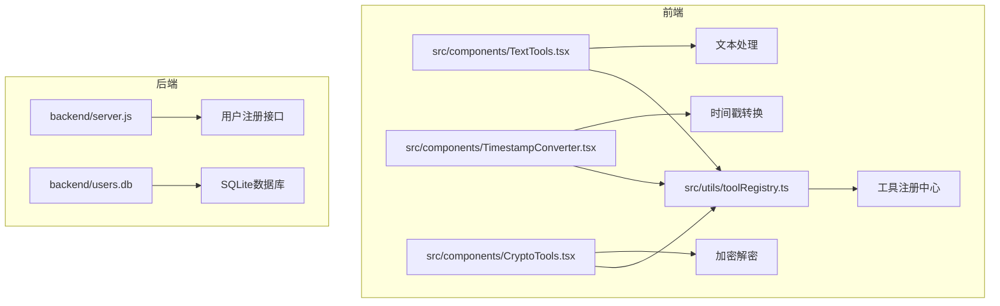
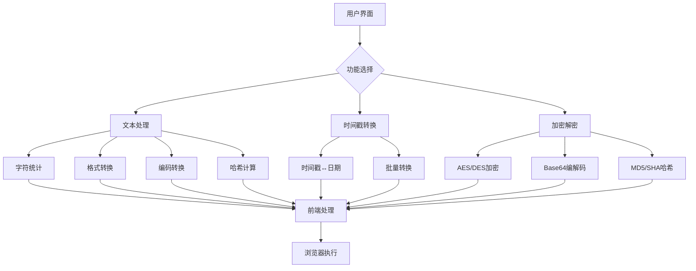
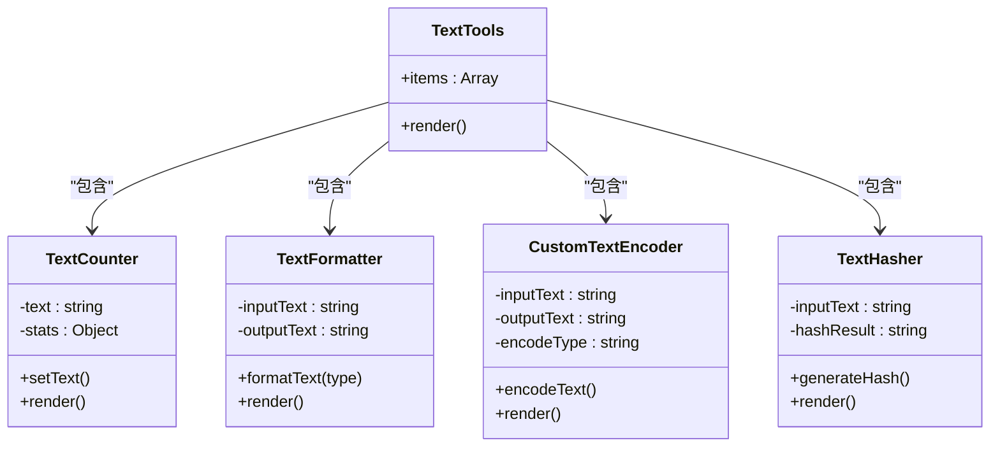
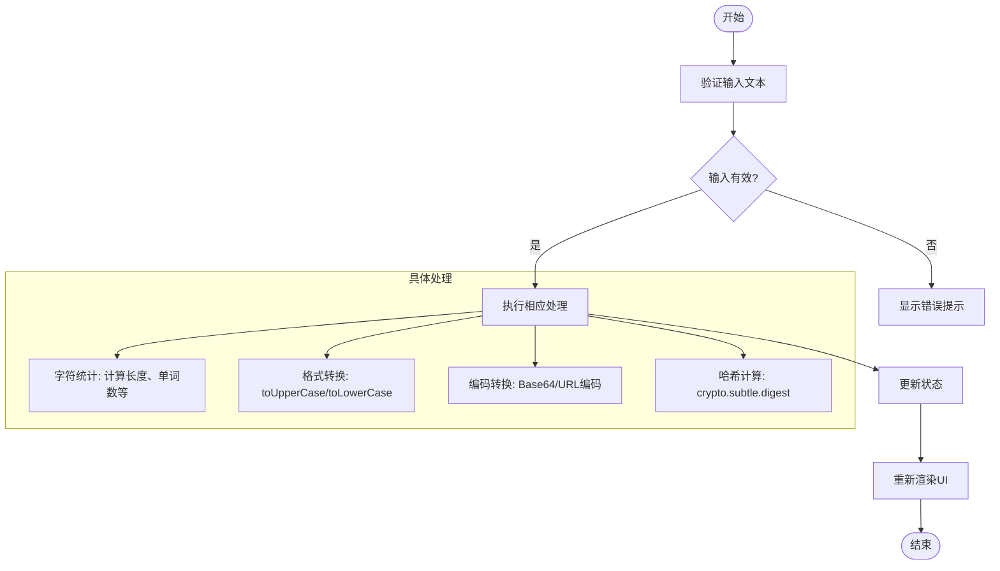
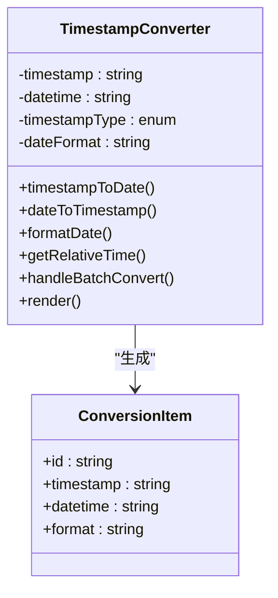
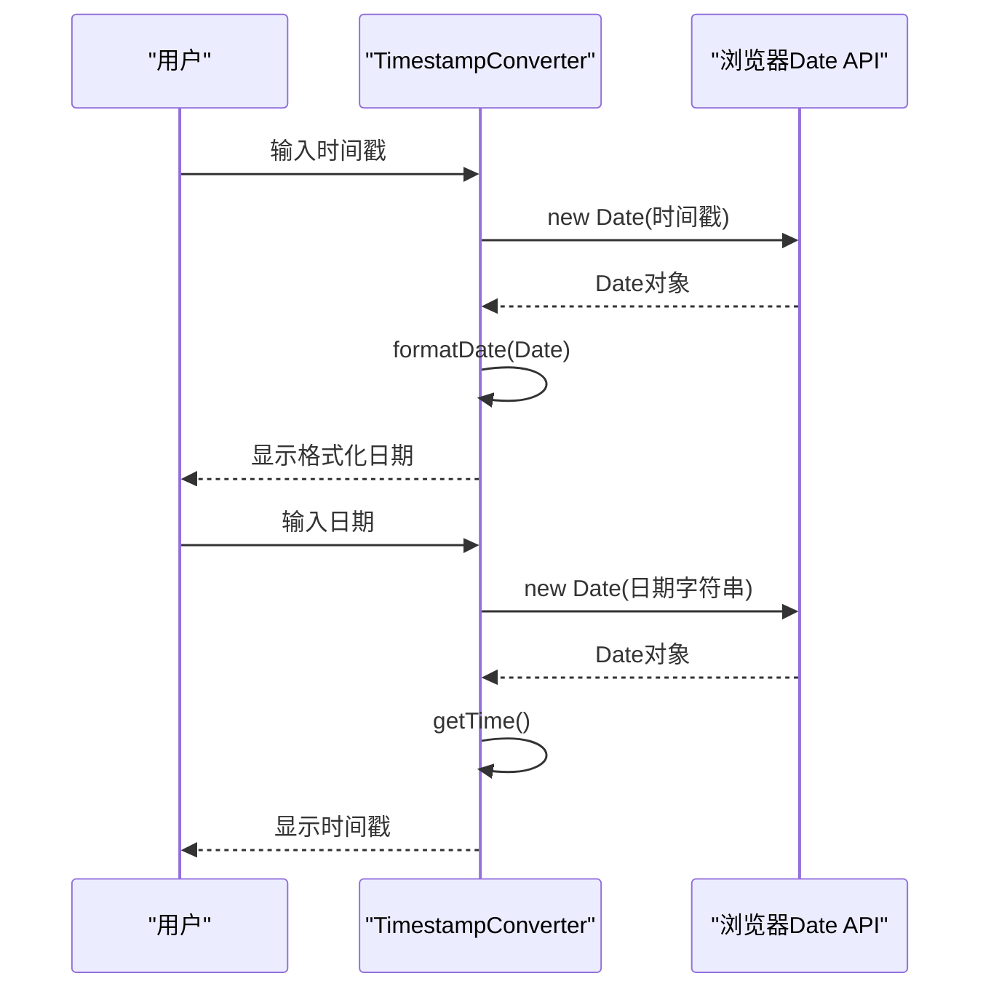
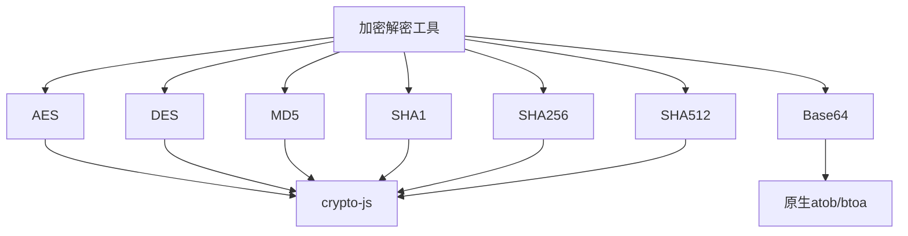
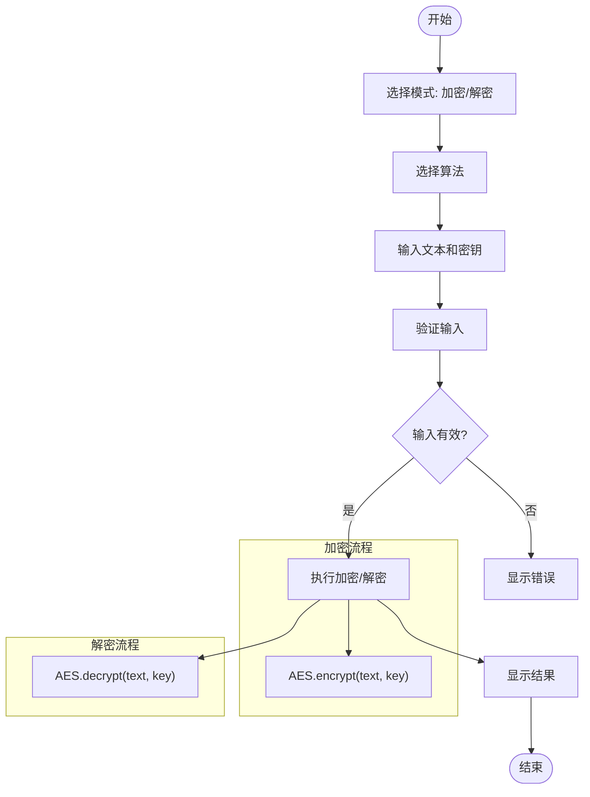
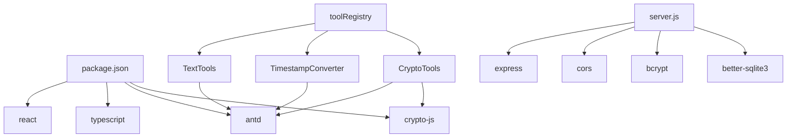

# 实用工具API

<cite>
**本文档引用的文件**  
- [TextTools.tsx](file://src/components/TextTools.tsx)
- [TimestampConverter.tsx](file://src/components/TimestampConverter.tsx)
- [CryptoTools.tsx](file://src/components/CryptoTools.tsx)
- [server.js](file://backend/server.js)
- [toolRegistry.ts](file://src/utils/toolRegistry.ts)
- [tools.ts](file://src/types/tools.ts)
</cite>

## 目录
1. [简介](#简介)
2. [项目结构](#项目结构)
3. [核心组件](#核心组件)
4. [架构概述](#架构概述)
5. [详细组件分析](#详细组件分析)
6. [依赖分析](#依赖分析)
7. [性能考虑](#性能考虑)
8. [故障排除指南](#故障排除指南)
9. [结论](#结论)

## 简介
本API文档旨在全面介绍办公工具项目中的实用工具类功能，涵盖文本处理、时间戳转换、编码解码、哈希计算等核心功能。文档详细说明了前端实现逻辑、功能模块划分以及与后端接口的交互方式。尽管当前后端主要提供用户注册等基础功能，但前端已实现完整的工具链，支持无状态的高性能数据处理。文档将重点分析这些工具函数的设计模式、数据流和用户交互逻辑，为后续API扩展提供技术参考。

## 项目结构
项目采用前后端分离架构，前端基于React + TypeScript + Ant Design构建，后端使用Express框架。前端组件按功能模块化组织，实用工具相关功能集中在`src/components`目录下，通过`toolRegistry.ts`统一注册管理。

**图示来源**  
- [TextTools.tsx](file://src/components/TextTools.tsx)
- [TimestampConverter.tsx](file://src/components/TimestampConverter.tsx)
- [CryptoTools.tsx](file://src/components/CryptoTools.tsx)
- [toolRegistry.ts](file://src/utils/toolRegistry.ts)
- [server.js](file://backend/server.js)

**本节来源**  
- [TextTools.tsx](file://src/components/TextTools.tsx)
- [TimestampConverter.tsx](file://src/components/TimestampConverter.tsx)
- [CryptoTools.tsx](file://src/components/CryptoTools.tsx)
- [toolRegistry.ts](file://src/utils/toolRegistry.ts)

## 核心组件
核心实用工具组件包括`TextTools`、`TimestampConverter`和`CryptoTools`，分别处理文本操作、时间戳转换和加密解密功能。这些组件均采用React函数式组件+Hooks模式，通过Ant Design提供现代化UI。所有处理逻辑在前端完成，无需后端参与，确保了操作的即时性和无状态性。

**本节来源**  
- [TextTools.tsx](file://src/components/TextTools.tsx#L1-L238)
- [TimestampConverter.tsx](file://src/components/TimestampConverter.tsx#L1-L385)
- [CryptoTools.tsx](file://src/components/CryptoTools.tsx#L1-L399)

## 架构概述
系统采用前后端分离架构，前端负责所有实用工具的逻辑处理和用户界面，后端仅提供用户认证等基础服务。实用工具功能完全在客户端执行，利用浏览器原生API（如`crypto.subtle`）和第三方库（如`crypto-js`）实现高性能计算。

**图示来源**  
- [TextTools.tsx](file://src/components/TextTools.tsx)
- [TimestampConverter.tsx](file://src/components/TimestampConverter.tsx)
- [CryptoTools.tsx](file://src/components/CryptoTools.tsx)

## 详细组件分析

### 文本处理组件分析
`TextTools`组件提供四大功能：字符统计、格式转换、编码转换和哈希计算，通过Ant Design Tabs实现功能切换。

#### 功能结构

**图示来源**  
- [TextTools.tsx](file://src/components/TextTools.tsx#L1-L238)

#### 处理流程

**图示来源**  
- [TextTools.tsx](file://src/components/TextTools.tsx#L1-L238)

**本节来源**  
- [TextTools.tsx](file://src/components/TextTools.tsx#L1-L238)

### 时间戳转换组件分析
`TimestampConverter`组件提供双向时间戳转换、批量处理和实时时间显示功能。

#### 核心功能

**图示来源**  
- [TimestampConverter.tsx](file://src/components/TimestampConverter.tsx#L1-L385)

#### 转换流程

**图示来源**  
- [TimestampConverter.tsx](file://src/components/TimestampConverter.tsx#L1-L385)

**本节来源**  
- [TimestampConverter.tsx](file://src/components/TimestampConverter.tsx#L1-L385)

### 加密解密组件分析
`CryptoTools`组件集成多种加密算法，提供AES、DES、Base64和哈希计算功能。

#### 算法支持

**图示来源**  
- [CryptoTools.tsx](file://src/components/CryptoTools.tsx#L1-L399)

#### 操作流程

**图示来源**  
- [CryptoTools.tsx](file://src/components/CryptoTools.tsx#L1-L399)

**本节来源**  
- [CryptoTools.tsx](file://src/components/CryptoTools.tsx#L1-L399)

## 依赖分析
项目依赖关系清晰，前端工具组件相互独立，通过统一入口注册。后端与前端工具功能无直接依赖，仅通过API提供用户认证服务。

**图示来源**  
- [package.json](file://package.json)
- [backend/package.json](file://backend/package.json)
- [TextTools.tsx](file://src/components/TextTools.tsx)
- [TimestampConverter.tsx](file://src/components/TimestampConverter.tsx)
- [CryptoTools.tsx](file://src/components/CryptoTools.tsx)
- [toolRegistry.ts](file://src/utils/toolRegistry.ts)
- [server.js](file://backend/server.js)

**本节来源**  
- [package.json](file://package.json)
- [backend/package.json](file://backend/package.json)

## 性能考虑
所有实用工具功能均在前端执行，具有以下性能优势：
- **无网络延迟**：所有计算在客户端完成，响应即时
- **无状态设计**：不依赖服务器状态，可无限扩展
- **浏览器优化**：利用现代浏览器的JS引擎和Web Crypto API
- **内存效率**：组件按需加载，避免资源浪费

建议的优化策略：
- 对于大文本处理，可实现分块处理避免阻塞UI
- 哈希计算可使用Web Workers避免主线程阻塞
- 结果可本地缓存以提高重复操作性能

## 故障排除指南
常见问题及解决方案：

**问题1：Base64编码/解码失败**
- **原因**：输入文本包含特殊字符或编码问题
- **解决方案**：使用`encodeURIComponent`和`unescape`预处理文本

**问题2：AES解密失败**
- **原因**：密钥不匹配或输入格式错误
- **解决方案**：确保加密和解密使用相同密钥，检查输入是否为有效加密文本

**问题3：时间戳转换结果异常**
- **原因**：时间戳单位错误（秒/毫秒混淆）
- **解决方案**：在界面中明确选择时间戳类型

**问题4：哈希计算性能低下**
- **原因**：处理超大文件
- **解决方案**：实现流式处理或使用Web Workers

**本节来源**  
- [TextTools.tsx](file://src/components/TextTools.tsx#L1-L238)
- [CryptoTools.tsx](file://src/components/CryptoTools.tsx#L1-L399)
- [TimestampConverter.tsx](file://src/components/TimestampConverter.tsx#L1-L385)

## 结论
本项目前端实用工具功能完善，架构清晰，所有数据处理均在客户端完成，确保了高性能和无状态特性。尽管当前后端未提供相应的REST API，但前端实现为后续API开发提供了完整的功能参考。建议未来可将核心算法封装为后端微服务，提供统一的API接口，同时保持前端的即时操作体验。跨域资源共享（CORS）已在后端配置，为API扩展做好了准备。