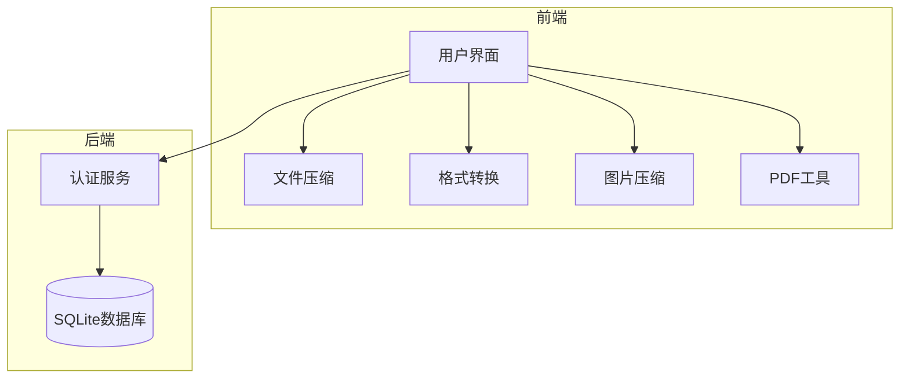
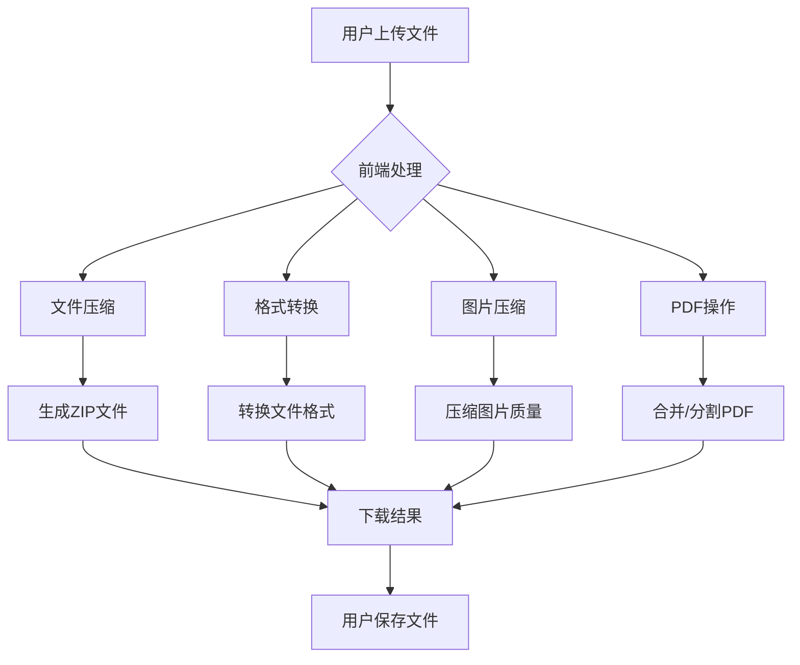
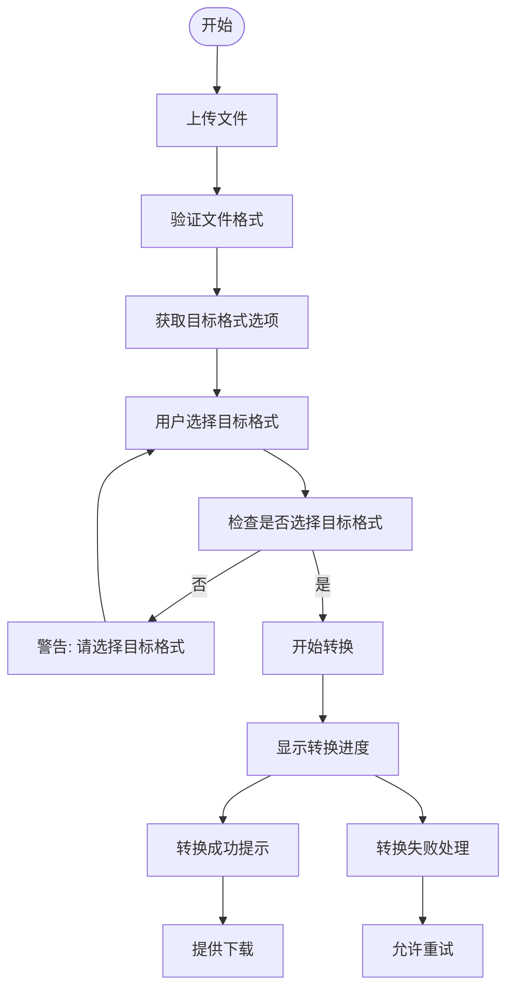
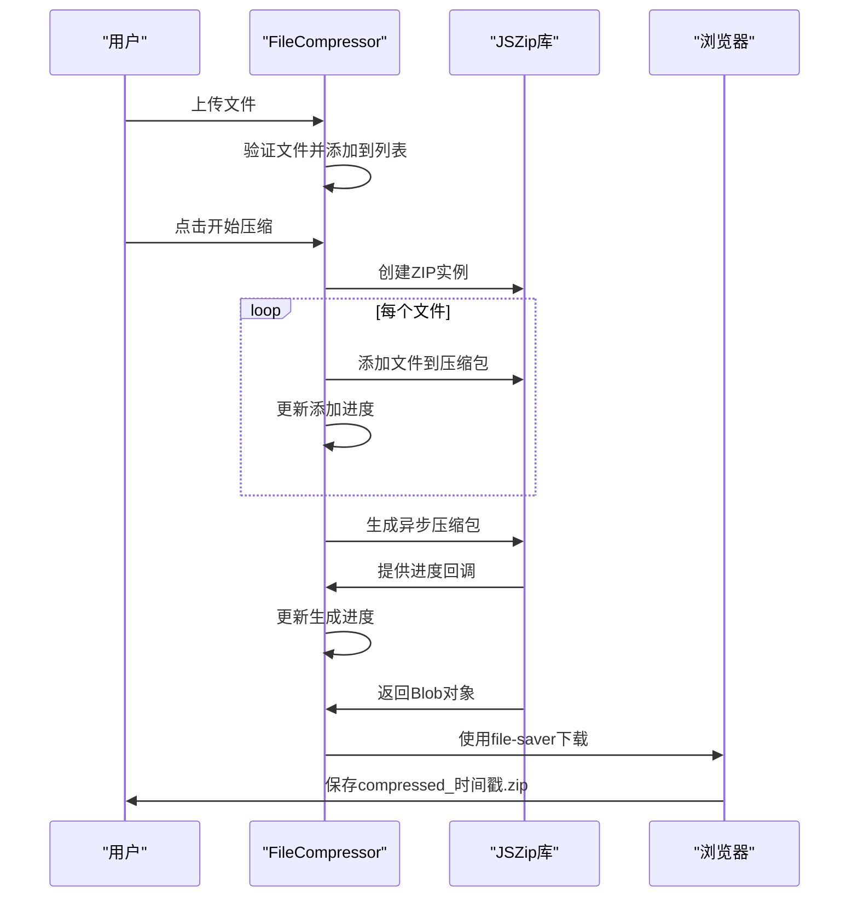
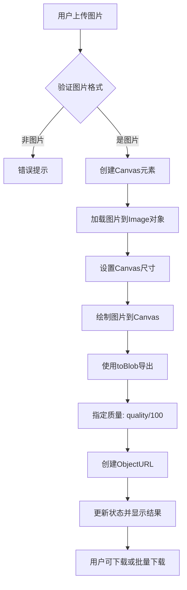
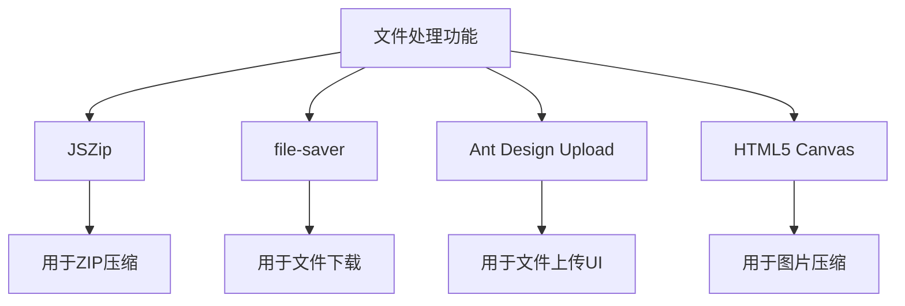

# 文件处理API

<cite>
**本文档引用的文件**   
- [server.js](file://backend/server.js)
- [FileConverter.tsx](file://src/components/FileConverter.tsx)
- [FileCompressor.tsx](file://src/components/FileCompressor.tsx)
- [ImageCompressor.tsx](file://src/components/ImageCompressor.tsx)
- [PDFTools.tsx](file://src/components/PDFTools.tsx)
- [toolRegistry.ts](file://src/utils/toolRegistry.ts)
- [App.tsx](file://src/App.tsx)
</cite>

## 目录
1. [简介](#简介)
2. [项目结构](#项目结构)
3. [核心组件](#核心组件)
4. [架构概述](#架构概述)
5. [详细组件分析](#详细组件分析)
6. [依赖分析](#依赖分析)
7. [性能考虑](#性能考虑)
8. [故障排除指南](#故障排除指南)
9. [结论](#结论)

## 简介
本项目是一个多功能办公工具集合，专注于前端文件处理功能，包括文件压缩、格式转换、图片压缩、PDF操作等。后端主要提供用户认证服务，所有文件处理逻辑均在前端实现。本文档详细说明了文件处理相关功能的实现机制、支持格式、用户交互流程及未来可扩展的API设计建议。

## 项目结构
项目采用前后端分离架构，前端使用React + TypeScript + Vite构建，后端使用Express提供基础API服务。文件处理功能完全在前端实现，利用浏览器原生API和第三方库完成所有操作。



**图示来源**
- [server.js](file://backend/server.js)
- [App.tsx](file://src/App.tsx)

**本节来源**
- [server.js](file://backend/server.js)
- [App.tsx](file://src/App.tsx)

## 核心组件
项目中的文件处理功能由多个独立的React组件实现，每个组件负责特定的文件操作任务。核心文件处理组件包括文件压缩、格式转换、图片压缩和PDF工具，所有操作均在客户端完成，无需后端支持。

**本节来源**
- [FileCompressor.tsx](file://src/components/FileCompressor.tsx)
- [FileConverter.tsx](file://src/components/FileConverter.tsx)
- [ImageCompressor.tsx](file://src/components/ImageCompressor.tsx)
- [PDFTools.tsx](file://src/components/PDFTools.tsx)

## 架构概述
系统采用纯前端文件处理架构，所有文件操作均在用户浏览器中完成。这种设计避免了文件上传到服务器的安全和隐私问题，同时减少了服务器负载。后端仅提供用户认证等基础服务，不参与任何文件处理流程。



**图示来源**
- [FileCompressor.tsx](file://src/components/FileCompressor.tsx)
- [FileConverter.tsx](file://src/components/FileConverter.tsx)
- [ImageCompressor.tsx](file://src/components/ImageCompressor.tsx)
- [PDFTools.tsx](file://src/components/PDFTools.tsx)

## 详细组件分析
对每个文件处理组件进行深入分析，包括其实现逻辑、技术细节和用户交互流程。

### 文件转换组件分析
`FileConverter`组件提供多格式文件转换功能，支持文档、图片和数据文件之间的格式转换。

#### 组件逻辑流程图


**图示来源**
- [FileConverter.tsx](file://src/components/FileConverter.tsx#L0-L160)

#### 支持的文件格式
```json
{
  "document": ["pdf", "docx", "txt", "rtf"],
  "image": ["jpg", "png", "webp", "gif", "bmp"],
  "data": ["csv", "xlsx", "json", "xml"]
}
```

**本节来源**
- [FileConverter.tsx](file://src/components/FileConverter.tsx#L0-L160)

### 文件压缩组件分析
`FileCompressor`组件使用JSZip库将多个文件压缩为ZIP格式，支持批量处理和进度显示。

#### 压缩流程序列图


**图示来源**
- [FileCompressor.tsx](file://src/components/FileCompressor.tsx#L0-L167)

#### JSZip配置参数
- **type**: 'blob' - 输出为Blob对象以便下载
- **compression**: 'DEFLATE' - 使用DEFLATE压缩算法
- **compressionOptions.level**: 6 - 压缩级别（1-9，6为平衡点）

**本节来源**
- [FileCompressor.tsx](file://src/components/FileCompressor.tsx#L0-L167)

### 图片压缩组件分析
`ImageCompressor`组件使用HTML5 Canvas API压缩图片质量，支持调整压缩质量和批量处理。

#### 图片压缩算法流程


**图示来源**
- [ImageCompressor.tsx](file://src/components/ImageCompressor.tsx#L0-L212)

#### 核心压缩逻辑
```typescript
canvas.toBlob((blob) => {
  resolve(blob!);
}, 'image/jpeg', quality / 100);
```
该逻辑将任何格式的图片转换为JPEG格式，并根据用户选择的质量百分比进行压缩。

**本节来源**
- [ImageCompressor.tsx](file://src/components/ImageCompressor.tsx#L0-L212)

### PDF工具组件分析
`PDFTools`组件提供PDF文件的合并和分割功能，目前为占位实现。

#### 功能状态说明
当前PDF工具组件中的合并和分割功能仅为UI演示，实际逻辑使用`setTimeout`模拟处理过程，未集成真正的PDF处理库。

```typescript
// 模拟PDF合并逻辑
const mergePDFs = () => {
  setProcessing(true);
  setTimeout(() => {
    setProcessing(false);
    message.success('PDF合并完成');
  }, 2000);
};
```

**本节来源**
- [PDFTools.tsx](file://src/components/PDFTools.tsx#L0-L123)

## 依赖分析
分析文件处理功能的依赖关系和技术栈。



**图示来源**
- [FileCompressor.tsx](file://src/components/FileCompressor.tsx)
- [ImageCompressor.tsx](file://src/components/ImageCompressor.tsx)

**本节来源**
- [FileCompressor.tsx](file://src/components/FileCompressor.tsx)
- [ImageCompressor.tsx](file://src/components/ImageCompressor.tsx)
- [package-lock.json](file://package-lock.json)

## 性能考虑
由于所有文件处理都在前端完成，性能主要受用户设备能力影响。大文件处理可能导致浏览器卡顿，建议限制单个文件大小。图片压缩使用Canvas操作，对内存消耗较大，应避免同时处理过多大尺寸图片。ZIP压缩使用Web Workers友好型的JSZip，但大量文件压缩仍可能阻塞主线程。

## 故障排除指南
- **文件上传失败**: 检查浏览器是否阻止了文件访问权限
- **压缩过程卡住**: 尝试减少同时处理的文件数量或降低图片压缩质量
- **转换功能无响应**: 当前格式转换功能仅为框架，实际转换逻辑未实现
- **PDF功能无效**: PDF合并和分割功能尚未实现真实逻辑
- **下载失败**: 检查浏览器是否阻止了自动下载

**本节来源**
- [FileConverter.tsx](file://src/components/FileConverter.tsx)
- [FileCompressor.tsx](file://src/components/FileCompressor.tsx)
- [ImageCompressor.tsx](file://src/components/ImageCompressor.tsx)

## 结论
当前项目的所有文件处理功能均在前端实现，后端`server.js`中未定义任何文件上传或转换的API端点。这种设计保护了用户文件隐私，但限制了复杂文件处理能力。未来可扩展REST API接口，如:
- `POST /api/convert` - 文件格式转换服务
- `POST /api/compress` - 高级压缩服务
- `POST /api/pdf/merge` - PDF合并服务
- `POST /api/pdf/split` - PDF分割服务

这些API可作为可选的代理转换服务，为需要更强大处理能力的用户提供后端支持，同时保持前端处理作为默认和隐私优先的选项。