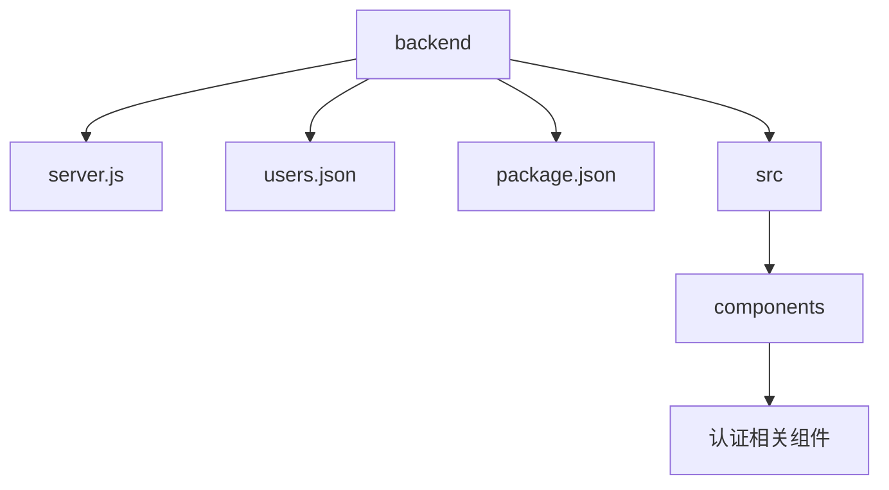
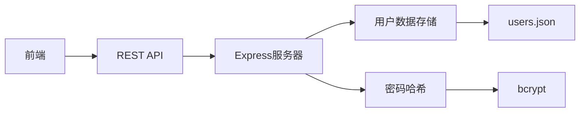
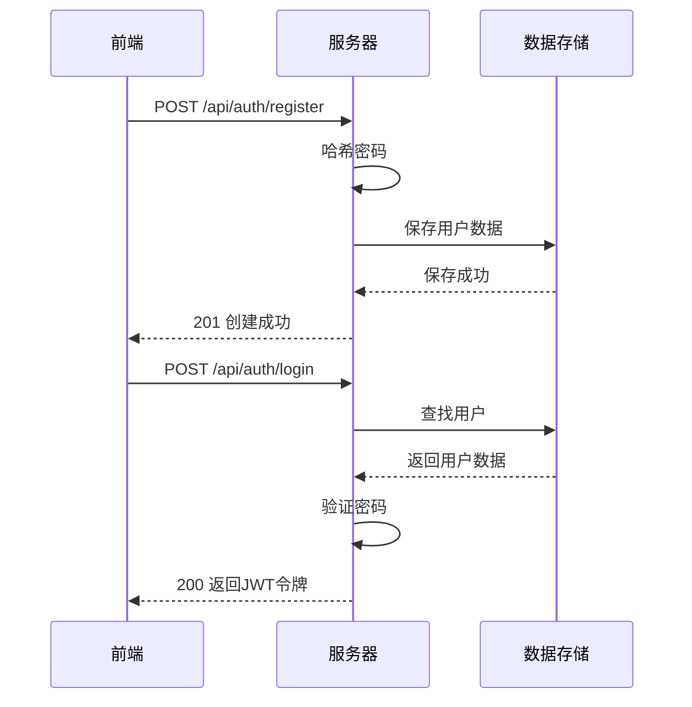
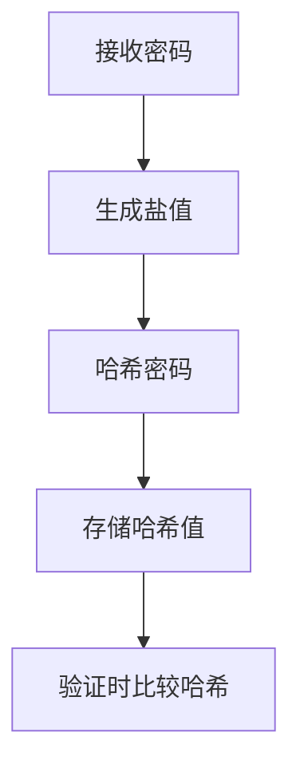
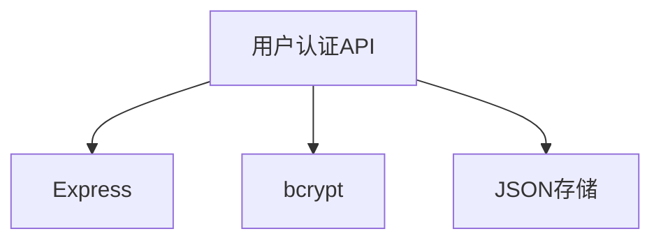

# 用户认证API

<cite>
**本文档中引用的文件**   
- [server.js](file://backend/server.js)
- [users.json](file://backend/users.json)
- [bcrypt.js](file://backend/node_modules/bcrypt/bcrypt.js)
</cite>

## 目录
1. [项目结构](#项目结构)
2. [核心组件](#核心组件)
3. [架构概述](#架构概述)
4. [详细组件分析](#详细组件分析)
5. [依赖分析](#依赖分析)

## 项目结构

项目包含前端和后端两个主要部分。后端位于`backend`目录中，包含`server.js`作为服务器入口文件和`users.json`作为用户数据存储文件。前端位于`src`目录中，包含各种工具组件。

**图示来源**
- [server.js](file://backend/server.js)
- [users.json](file://backend/users.json)

**章节来源**
- [server.js](file://backend/server.js)
- [users.json](file://backend/users.json)

## 核心组件

后端核心组件包括`server.js`中的Express服务器和用户认证逻辑，以及`users.json`中的用户数据存储。`bcrypt.js`用于密码哈希处理。

**章节来源**
- [server.js](file://backend/server.js)
- [users.json](file://backend/users.json)
- [bcrypt.js](file://backend/node_modules/bcrypt/bcrypt.js)

## 架构概述

系统采用前后端分离架构，前端通过API与后端通信。后端使用Express框架处理HTTP请求，用户数据存储在JSON文件中，密码使用bcrypt进行哈希处理。

**图示来源**
- [server.js](file://backend/server.js)
- [users.json](file://backend/users.json)

## 详细组件分析

### 认证服务分析

用户认证服务处理用户注册、登录和验证请求。注册时密码被哈希存储，登录时进行密码验证。

#### API组件

**图示来源**
- [server.js](file://backend/server.js)
- [users.json](file://backend/users.json)

**章节来源**
- [server.js](file://backend/server.js#L1-L100)
- [users.json](file://backend/users.json)

### 密码哈希分析

使用bcrypt库对用户密码进行安全哈希处理，防止明文存储。

#### 复杂逻辑组件

**图示来源**
- [bcrypt.js](file://backend/node_modules/bcrypt/bcrypt.js)

**章节来源**
- [server.js](file://backend/server.js#L50-L80)
- [bcrypt.js](file://backend/node_modules/bcrypt/bcrypt.js)

## 依赖分析

系统依赖Express框架处理HTTP请求，bcrypt库处理密码哈希，数据存储使用JSON文件。

**图示来源**
- [package.json](file://backend/package.json)
- [server.js](file://backend/server.js)

**章节来源**
- [package.json](file://backend/package.json)
- [server.js](file://backend/server.js)