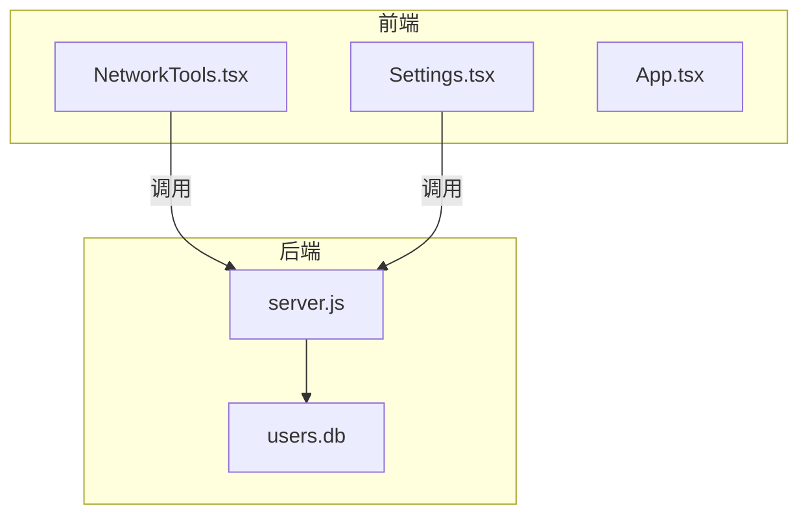
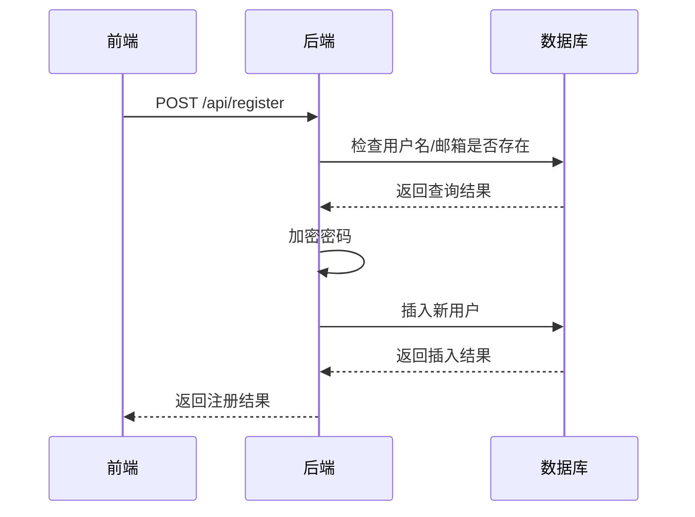
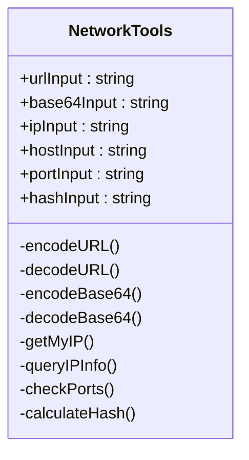
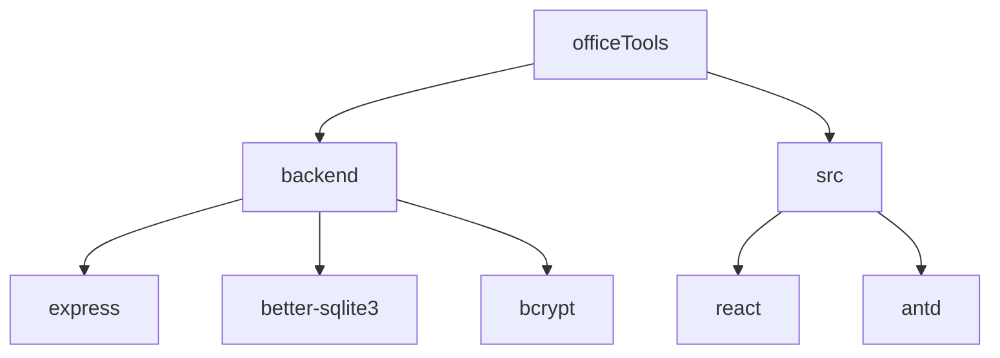

# 系统状态API

<cite>
**本文档引用的文件**  
- [server.js](file://backend/server.js)
- [NetworkTools.tsx](file://src/components/NetworkTools.tsx)
</cite>

## 目录
1. [简介](#简介)
2. [项目结构](#项目结构)
3. [核心组件](#核心组件)
4. [架构概述](#架构概述)
5. [详细组件分析](#详细组件分析)
6. [依赖分析](#依赖分析)
7. [性能考虑](#性能考虑)
8. [故障排除指南](#故障排除指南)
9. [结论](#结论)

## 简介
本项目是一个办公工具集合，包含前端用户界面和后端用户管理服务。后端基于Express框架，提供用户注册、登录和查询接口。前端包含多个实用工具，如URL编码、Base64转换、IP查询、端口检测和Hash计算等。尽管当前系统未实现标准的健康检查API（如GET /health），但通过分析现有代码，可以为系统添加此类监控接口以支持Kubernetes探针和负载均衡健康检查。

## 项目结构
项目采用前后端分离架构，前端使用React + TypeScript构建，后端使用Node.js + Express实现。主要目录结构如下：

- `backend/`：后端服务，包含Express服务器和SQLite数据库
- `src/`：前端源码，包含组件、工具和样式
- `public/`：静态资源文件
- `package.json`：项目依赖和脚本配置

**图示来源**  
- [server.js](file://backend/server.js)
- [NetworkTools.tsx](file://src/components/NetworkTools.tsx)

## 核心组件
系统核心组件包括后端用户管理API和前端网络工具集。后端通过Express暴露RESTful接口，前端通过fetch调用这些接口实现用户认证功能。`server.js`中定义了注册、登录和用户列表接口，使用SQLite存储用户数据，并通过bcrypt进行密码加密。

**组件来源**  
- [server.js](file://backend/server.js#L1-L160)
- [NetworkTools.tsx](file://src/components/NetworkTools.tsx#L1-L533)

## 架构概述
系统采用典型的客户端-服务器架构。前端作为单页应用运行在浏览器中，后端作为REST API服务运行在Node.js环境中。通信通过HTTP/HTTPS进行，数据格式为JSON。身份验证通过简单的会话管理实现，未使用JWT或OAuth等复杂机制。

**图示来源**  
- [server.js](file://backend/server.js#L1-L160)

## 详细组件分析

### 后端API分析
后端使用Express框架创建HTTP服务器，监听3088端口。实现了三个主要API端点：

- `POST /api/register`：用户注册，验证用户名和邮箱唯一性
- `POST /api/login`：用户登录，支持用户名或邮箱登录
- `GET /api/users`：获取用户列表，用于管理界面

数据库初始化在服务器启动时执行，创建users表并设置必要字段。

**图示来源**  
- [server.js](file://backend/server.js#L46-L89)

### 前端网络工具分析
`NetworkTools`组件提供多种网络相关功能，包括：

- URL编码/解码
- Base64编码/解码
- IP地址查询（使用外部API）
- 端口检测（前端模拟）
- Hash值计算（SHA-1、SHA-256）

该组件使用Ant Design组件库构建用户界面，通过React Hooks管理状态。

**图示来源**  
- [NetworkTools.tsx](file://src/components/NetworkTools.tsx#L37-L531)

## 依赖分析
项目依赖关系清晰，前端和后端各自独立管理依赖。

**图示来源**  
- [package.json](file://backend/package.json)
- [package.json](file://package.json)

## 性能考虑
当前系统性能主要受限于以下方面：

1. **数据库访问**：每次请求都创建新的数据库连接，建议使用连接池
2. **密码加密**：bcrypt哈希计算较慢，但这是安全必需
3. **前端模拟**：端口检测功能为前端随机模拟，无实际网络探测
4. **缺少缓存**：用户列表等数据未缓存，重复请求会重复查询数据库

建议实现健康检查API以监控系统状态，便于在生产环境中进行自动化运维。

## 故障排除指南
常见问题及解决方案：

- **后端无法启动**：检查3088端口是否被占用，确认SQLite数据库文件可写
- **注册失败**：确保用户名和邮箱唯一，检查数据库初始化是否成功
- **登录失败**：确认密码正确，检查数据库中存储的哈希值
- **跨域问题**：当前CORS配置仅允许特定源，根据部署环境调整
- **前端工具无响应**：检查浏览器控制台错误，确认网络连接正常

**组件来源**  
- [server.js](file://backend/server.js#L1-L160)
- [NetworkTools.tsx](file://src/components/NetworkTools.tsx#L1-L533)

## 结论
该项目实现了一个基本的办公工具集合，具备用户管理和多种实用工具功能。虽然当前缺少标准的健康检查API，但通过添加GET /health端点可以轻松扩展系统监控能力。建议实现以下改进：

1. 添加`GET /health`端点返回系统状态
2. 添加`GET /version`端点暴露版本信息
3. 实现数据库连接池以提高性能
4. 增加输入验证和错误处理
5. 添加日志记录功能

这些改进将使系统更适合生产环境部署和运维监控。