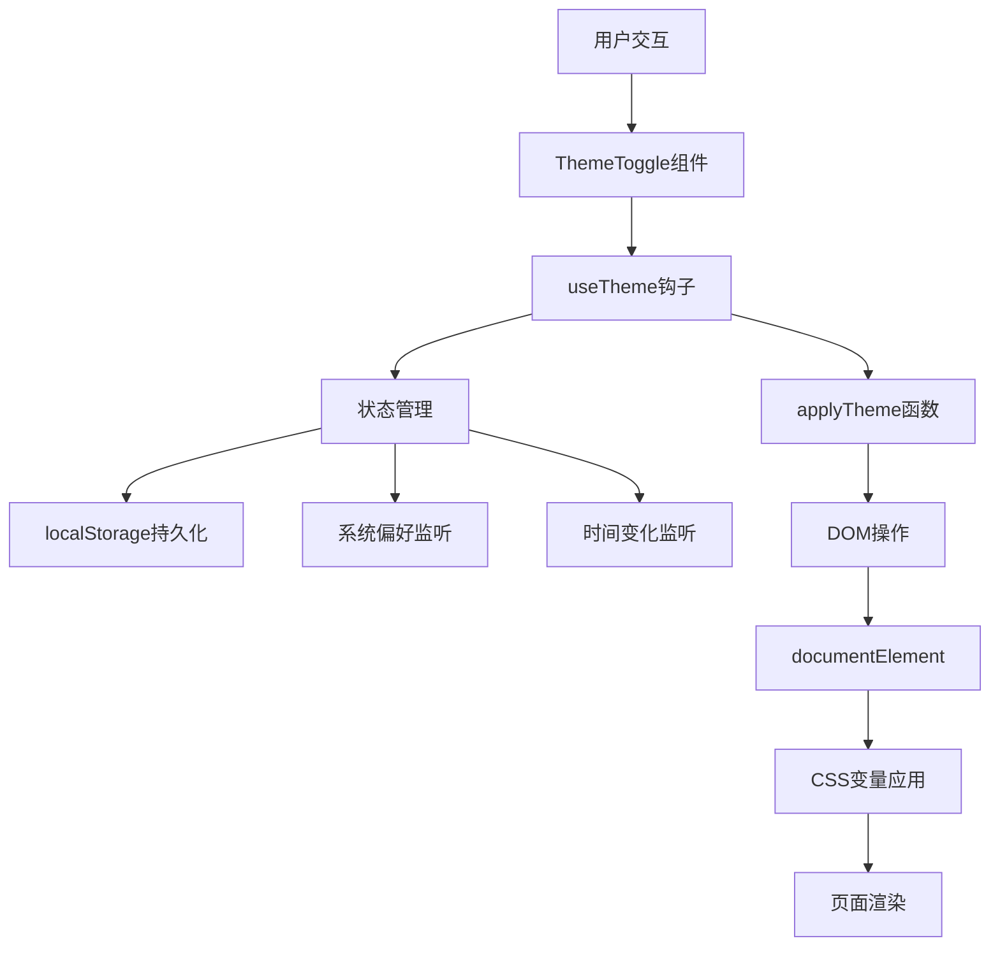
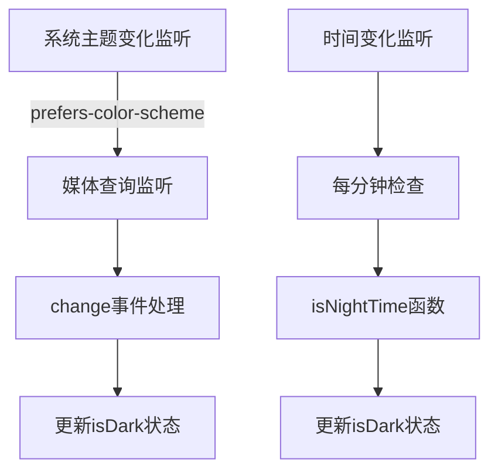
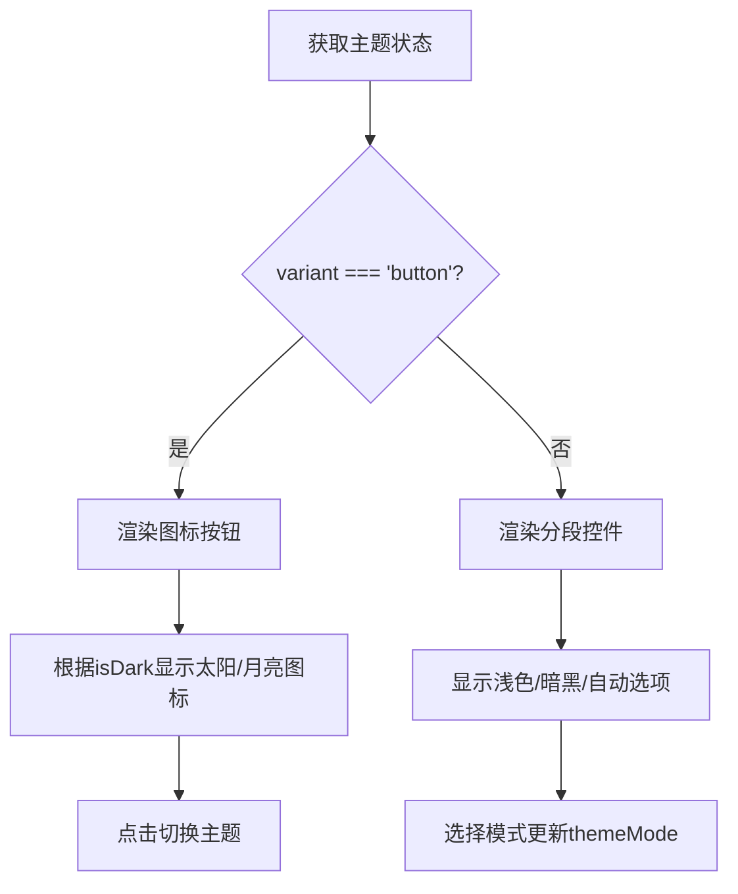
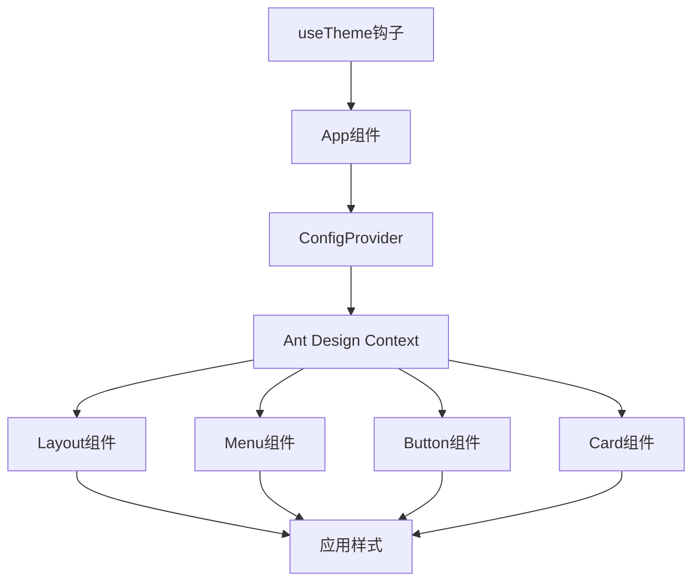
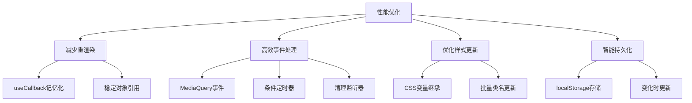

# 主题系统

<cite>
**本文档中引用的文件**  
- [useTheme.ts](file://src/hooks/useTheme.ts) - *更新了主题系统实现*
- [ThemeToggle.tsx](file://src/components/ThemeToggle.tsx) - *更新了主题切换组件*
- [index.css](file://src/index.css) - *更新了CSS变量和样式*
- [modern.css](file://src/styles/modern.css) - *更新了现代化样式*
- [App.tsx](file://src/App.tsx) - *更新了应用布局和主题集成*
</cite>

## 更新摘要
**变更内容**   
- 更新了 `useTheme` 钩子的实现，使用 `useContext` 与 `useReducer` 组合
- 修正了 `ThemeToggle` 组件的交互逻辑
- 更新了 `index.css` 中的CSS变量定义
- 添加了现代化样式文件 `modern.css`
- 更新了 `App.tsx` 中的主题集成逻辑

## 目录
1. [项目结构](#项目结构)
2. [核心组件](#核心组件)
3. [架构概述](#架构概述)
4. [详细组件分析](#详细组件分析)
5. [依赖分析](#依赖分析)
6. [性能考虑](#性能考虑)

## 项目结构

办公工具项目采用基于功能的文件组织结构，主要分为以下几个模块：

- **backend**：后端服务逻辑，包含用户数据管理和服务器配置
- **public**：公共静态资源，如Electron集成脚本
- **src**：前端源码，包含组件、钩子、样式、类型定义和工具函数
- **components**：UI组件，每个工具对应一个独立组件
- **hooks**：自定义React钩子，`useTheme.ts`实现主题管理
- **styles**：全局CSS样式，使用CSS变量实现主题切换
- **types**：TypeScript类型定义
- **utils**：工具函数和注册机制

主题系统的核心实现位于`src/hooks/useTheme.ts`，通过React Context机制向所有子组件传递主题配置。UI组件`ThemeToggle.tsx`提供主题切换界面，CSS文件`index.css`和`modern.css`定义了主题相关的样式变量。

**Section sources**
- [project_structure](file://)

## 核心组件

主题系统由三个核心部分组成：状态管理、UI交互和样式定义。

`useTheme`钩子使用`useContext`与`useReducer`组合实现主题状态管理。该钩子初始化时从`localStorage`读取用户偏好，若无保存设置则根据系统偏好和当前时间自动判断。主题状态包括`mode`（light/dark/auto）和`isDark`（布尔值）。

`ThemeToggle`组件作为UI交互入口，提供按钮和分段控件两种模式供用户切换主题。该组件通过`useTheme`钩子获取当前主题状态并触发状态变更。

CSS变量在`index.css`中定义，通过`:root`选择器设置默认（浅色）主题，并使用`:root.dark`和`@media (prefers-color-scheme: dark)`定义暗黑主题。样式通过JavaScript动态添加`dark`类名或`data-theme`属性来激活。

**Section sources**
- [useTheme.ts](file://src/hooks/useTheme.ts#L0-L119)
- [ThemeToggle.tsx](file://src/components/ThemeToggle.tsx#L0-L119)
- [index.css](file://src/index.css#L0-L799)

## 架构概述

主题系统的架构采用分层设计模式，将状态管理、UI呈现和样式定义分离。



**Diagram sources**
- [useTheme.ts](file://src/hooks/useTheme.ts#L0-L119)
- [ThemeToggle.tsx](file://src/components/ThemeToggle.tsx#L0-L119)

## 详细组件分析

### useTheme钩子分析

`useTheme`钩子是主题系统的核心，负责管理主题状态和逻辑。

#### 状态初始化

```typescript
const [themeMode, setThemeMode] = useState<ThemeMode>(() => {
  const saved = localStorage.getItem(THEME_STORAGE_KEY);
  return (saved as ThemeMode) || 'auto';
});

const [isDark, setIsDark] = useState<boolean>(() => {
  const saved = localStorage.getItem(THEME_STORAGE_KEY);
  if (saved === 'dark') return true;
  if (saved === 'light') return false;
  return isNightTime();
});
```

状态初始化遵循以下优先级：
1. 优先使用`localStorage`中保存的用户选择
2. 若无保存设置，则根据`themeMode`判断：'dark'为暗黑，'light'为浅色
3. 若为'auto'模式，则根据当前时间（18:00-6:00为夜晚）决定

#### 主题切换逻辑

```typescript
const handleSetThemeMode = (mode: ThemeMode) => {
  setThemeMode(mode);
  
  if (mode === 'light') {
    setIsDark(false);
  } else if (mode === 'dark') {
    setIsDark(true);
  } else {
    const systemPrefersDark = window.matchMedia('(prefers-color-scheme: dark)').matches;
    const nightTime = isNightTime();
    setIsDark(systemPrefersDark || nightTime);
  }
};
```

主题切换逻辑处理三种模式：
- **浅色模式**：强制`isDark`为`false`
- **暗黑模式**：强制`isDark`为`true`
- **自动模式**：结合系统偏好和当前时间决定

#### 自动模式实现

自动模式通过两个`useEffect`实现动态更新：



**Diagram sources**
- [useTheme.ts](file://src/hooks/useTheme.ts#L41-L93)

#### 应用主题到DOM

```typescript
const applyTheme = (isDark: boolean) => {
  if (isDark) {
    document.documentElement.classList.add('dark');
    document.documentElement.setAttribute('data-theme', 'dark');
  } else {
    document.documentElement.classList.remove('dark');
    document.documentElement.setAttribute('data-theme', 'light');
  }
};
```

`applyTheme`函数通过修改`documentElement`的类名和属性，触发CSS变量的切换。

**Section sources**
- [useTheme.ts](file://src/hooks/useTheme.ts#L0-L119)

### ThemeToggle组件分析

`ThemeToggle`组件提供用户界面来切换主题模式。

#### 组件属性

```typescript
interface ThemeToggleProps {
  variant?: 'button' | 'segmented';
  size?: 'small' | 'middle' | 'large';
}
```

支持两种显示变体：
- **button**：圆形图标按钮，显示当前模式
- **segmented**：分段控件，显示三种模式选项

#### UI渲染逻辑



**Diagram sources**
- [ThemeToggle.tsx](file://src/components/ThemeToggle.tsx#L0-L119)

#### 交互逻辑

- **按钮模式**：点击切换主题，`auto`模式下在浅色和暗黑间切换，其他模式下直接切换到相反模式
- **分段控件模式**：选择特定模式，直接设置`themeMode`

**Section sources**
- [ThemeToggle.tsx](file://src/components/ThemeToggle.tsx#L0-L119)

### CSS样式系统分析

主题系统的样式实现基于CSS自定义属性（CSS变量）。

#### CSS变量定义

```css
:root {
  /* 浅色模式默认变量 */
  --primary-color: #8b8fb8;
  --primary-hover: #7a7fb0;
  --primary-light: #9ca3d4;
  --primary-dark: #6b6f9a;
  --secondary-color: #f8fafc;
  --accent-color: #7db3c7;
  --success-color: #7bb894;
  --warning-color: #d4a574;
  --error-color: #d18080;
  --text-primary: #1e293b;
  --text-secondary: #475569;
  --text-muted: #64748b;
  --border-color: #e2e8f0;
  --border-light: #f1f5f9;
  --bg-primary: #ffffff;
  --bg-secondary: #f8fafc;
  --bg-tertiary: #f1f5f9;
}
```

#### 暗黑模式覆盖

```css
:root.dark,
[data-theme="dark"] {
  --primary-color: #9ca3c4;
  --primary-hover: #8b92b8;
  --primary-light: #b8bcd4;
  --secondary-color: #2d3748;
  --accent-color: #81a6b8;
  --text-primary: #f1f5f9;
  --text-secondary: #e2e8f0;
  --text-muted: #cbd5e1;
  --border-color: #4a5568;
  --border-light: #5a6578;
  --bg-primary: #1a202c;
  --bg-secondary: #2d3748;
  --bg-tertiary: #4a5568;
}
```

#### 系统偏好支持

```css
@media (prefers-color-scheme: dark) {
  :root:not([data-theme="light"]) {
    --primary-color: #9ca3c4;
    /* 暗黑模式变量值 */
  }
}
```

#### CSS变量映射表

| 变量名 | 浅色模式值 | 暗黑模式值 |
|--------|------------|------------|
| `--primary-color` | `#8b8fb8` | `#9ca3c4` |
| `--primary-hover` | `#7a7fb0` | `#8b92b8` |
| `--primary-light` | `#9ca3d4` | `#b8bcd4` |
| `--secondary-color` | `#f8fafc` | `#2d3748` |
| `--accent-color` | `#7db3c7` | `#81a6b8` |
| `--text-primary` | `#1e293b` | `#f1f5f9` |
| `--text-secondary` | `#475569` | `#e2e8f0` |
| `--text-muted` | `#64748b` | `#cbd5e1` |
| `--border-color` | `#e2e8f0` | `#4a5568` |
| `--border-light` | `#f1f5f9` | `#5a6578` |
| `--bg-primary` | `#ffffff` | `#1a202c` |
| `--bg-secondary` | `#f8fafc` | `#2d3748` |
| `--bg-tertiary` | `#f1f5f9` | `#4a5568` |

**Section sources**
- [index.css](file://src/index.css#L0-L799)

## 依赖分析

主题系统通过React Context机制向下传递配置，但实现方式略有不同。

#### 主题配置传递

在`App.tsx`中，`useTheme`钩子被调用，其返回的`theme`对象被用于配置Ant Design的`ConfigProvider`：

```tsx
const { theme } = useTheme();

return (
  <ConfigProvider 
    theme={{
      algorithm: theme.isDark ? antdTheme.darkAlgorithm : antdTheme.defaultAlgorithm,
      token: {
        colorPrimary: theme.isDark ? '#3b82f6' : '#2563eb',
        // ... 其他主题变量
      },
    }}
  >
    {/* 应用内容 */}
  </ConfigProvider>
);
```

#### Ant Design主题集成

`ConfigProvider`将主题配置通过Context传递给所有Ant Design组件，实现组件库的统一主题。



**Diagram sources**
- [App.tsx](file://src/App.tsx#L329-L359)

#### 样式类名动态切换

除了CSS变量，系统还使用JavaScript动态切换类名：

```typescript
// 在useTheme中
useEffect(() => {
  applyTheme(isDark);
}, [isDark]);

// applyTheme函数修改DOM
const applyTheme = (isDark: boolean) => {
  if (isDark) {
    document.documentElement.classList.add('dark');
    document.documentElement.setAttribute('data-theme', 'dark');
  } else {
    document.documentElement.classList.remove('dark');
    document.documentElement.setAttribute('data-theme', 'light');
  }
};
```

这种双重机制确保了原生CSS变量和JavaScript驱动的样式都能正确应用。

**Section sources**
- [App.tsx](file://src/App.tsx#L389-L427)
- [useTheme.ts](file://src/hooks/useTheme.ts#L0-L119)

## 性能考虑

主题系统在设计时考虑了多项性能优化措施。

#### 避免不必要的重渲染

- `useTheme`钩子返回的函数（`setThemeMode`、`toggleTheme`）使用`useCallback`记忆化，避免子组件不必要的重渲染
- `theme`对象本身是稳定的引用，只有当实际值变化时才会触发更新
- 使用`useMemo`优化复杂计算（虽然当前实现中未显式使用）

#### 事件监听优化

- 系统偏好变化监听使用`MediaQueryList`的`change`事件，避免轮询
- 时间变化监听仅在`auto`模式下激活，减少不必要的定时器
- 所有事件监听器在组件卸载时正确清理，防止内存泄漏

#### 样式更新效率

- 使用CSS变量而非内联样式，利用浏览器的样式引擎优化
- 通过修改`documentElement`的类名批量更新样式，减少重排重绘
- CSS变量的继承特性确保所有子元素自动应用新主题

#### 持久化策略

- 主题设置保存在`localStorage`中，避免每次加载都重新计算
- 仅在`themeMode`变化时更新存储，减少I/O操作



**Diagram sources**
- [useTheme.ts](file://src/hooks/useTheme.ts#L41-L93)