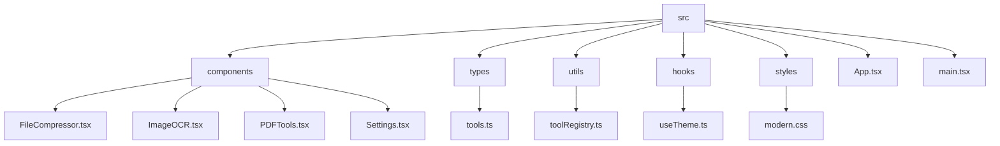
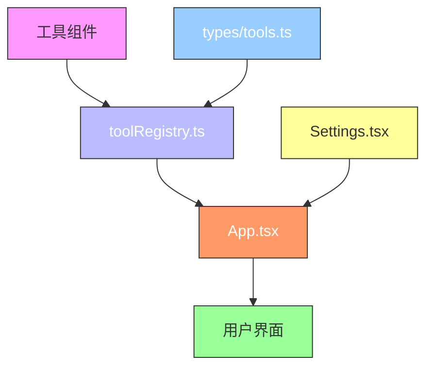
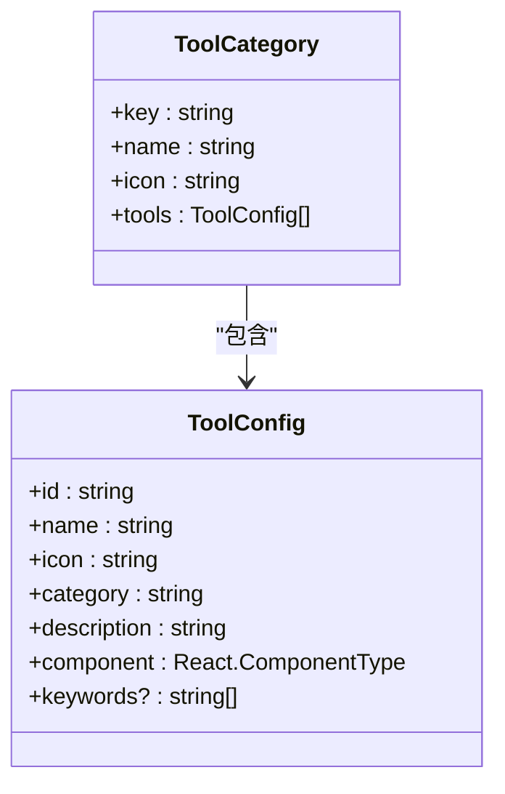
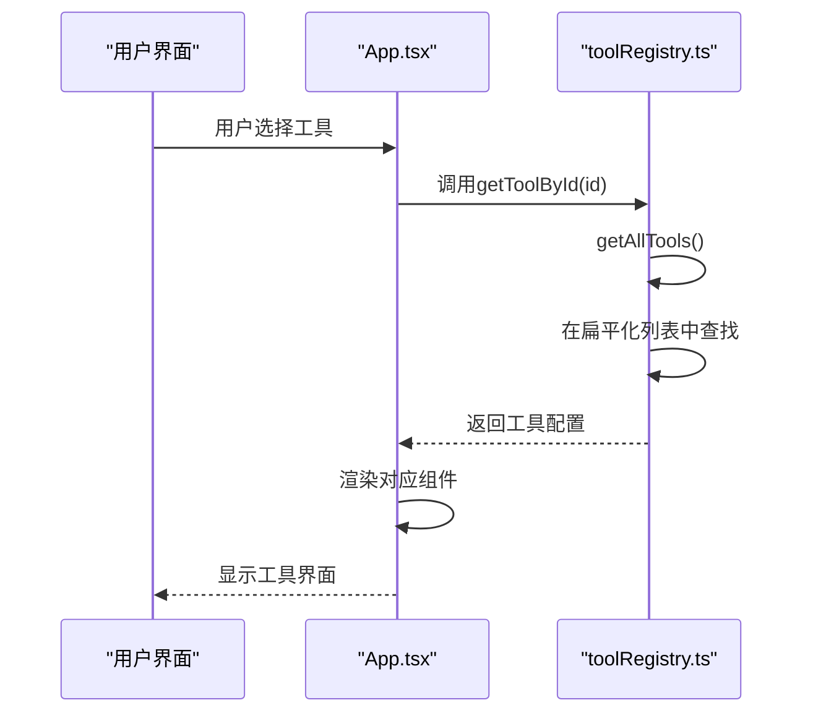
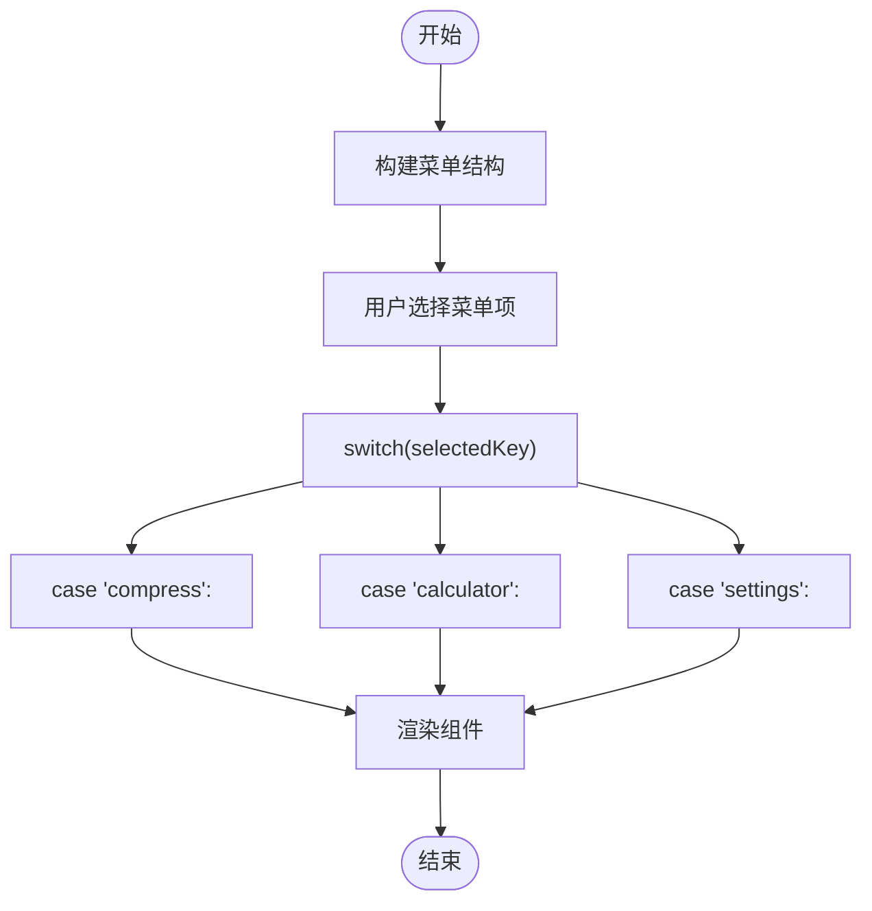
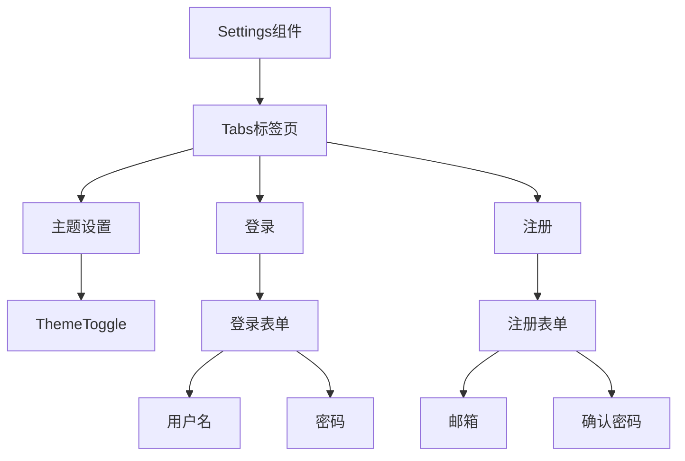
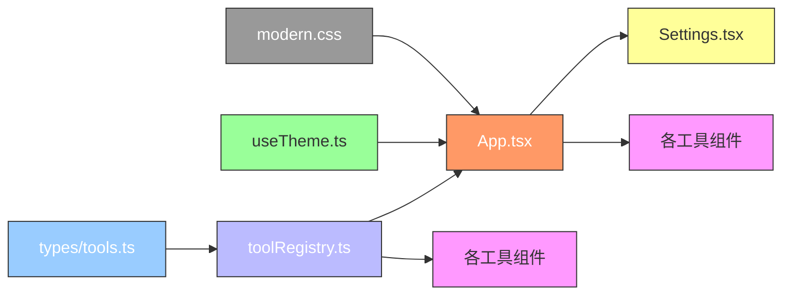

# 工具注册系统

<cite>
**本文档中引用的文件**  
- [toolRegistry.ts](file://src/utils/toolRegistry.ts#L1-L229)
- [tools.ts](file://src/types/tools.ts#L1-L59)
- [App.tsx](file://src/App.tsx#L1-L645)
- [Settings.tsx](file://src/components/Settings.tsx#L1-L402)
</cite>

## 目录
1. [简介](#简介)
2. [项目结构](#项目结构)
3. [核心组件](#核心组件)
4. [架构概览](#架构概览)
5. [详细组件分析](#详细组件分析)
6. [依赖分析](#依赖分析)
7. [性能考虑](#性能考虑)
8. [故障排除指南](#故障排除指南)
9. [结论](#结论)

## 简介
本项目是一个集成多种办公工具的前端应用，采用集中式工具注册模式实现功能模块的动态管理和扩展。系统通过`toolRegistry.ts`文件统一注册所有工具组件，并在主应用`App.tsx`中根据注册信息生成导航菜单和路由逻辑。该设计模式实现了工具的松耦合管理，新增工具只需实现组件并调用注册函数即可自动集成到系统中，极大提升了应用的可维护性和扩展性。

## 项目结构
项目采用典型的React + TypeScript架构，按功能划分目录结构，主要包括组件、类型定义、工具函数和样式文件。

**图示来源**  
- [App.tsx](file://src/App.tsx#L1-L645)
- [toolRegistry.ts](file://src/utils/toolRegistry.ts#L1-L229)

**本节来源**  
- [App.tsx](file://src/App.tsx#L1-L645)
- [toolRegistry.ts](file://src/utils/toolRegistry.ts#L1-L229)

## 核心组件
系统的核心是`toolRegistry.ts`中实现的集中式工具注册系统。该系统通过`toolCategories`数组定义所有工具的分类和元数据，并提供`getAllTools`、`getToolById`和`getToolsByCategory`等工具发现函数，实现了工具的统一管理和动态查找。

**本节来源**  
- [toolRegistry.ts](file://src/utils/toolRegistry.ts#L1-L229)
- [tools.ts](file://src/types/tools.ts#L1-L59)

## 架构概览
整个系统的架构围绕工具注册中心展开，形成清晰的依赖关系和数据流。

**图示来源**  
- [toolRegistry.ts](file://src/utils/toolRegistry.ts#L1-L229)
- [App.tsx](file://src/App.tsx#L1-L645)

## 详细组件分析

### 工具类型与分类设计分析
系统通过`ToolConfig`和`ToolCategory`接口定义了严格的类型结构，确保了类型安全和代码可维护性。

#### 类图：工具类型结构

**图示来源**  
- [tools.ts](file://src/types/tools.ts#L1-L59)

**本节来源**  
- [tools.ts](file://src/types/tools.ts#L1-L59)

### 工具注册与发现机制分析
`toolRegistry.ts`实现了完整的工具注册与发现机制，其核心是静态定义的`toolCategories`数组和三个工具查找函数。

#### 时序图：工具发现流程

**图示来源**  
- [toolRegistry.ts](file://src/utils/toolRegistry.ts#L173-L228)
- [App.tsx](file://src/App.tsx#L250-L289)

**本节来源**  
- [toolRegistry.ts](file://src/utils/toolRegistry.ts#L1-L229)

### 主应用集成分析
`App.tsx`通过静态菜单配置和`renderContent`函数实现了与工具注册系统的集成，虽然当前实现存在重复定义，但整体架构清晰。

#### 流程图：内容渲染逻辑

**图示来源**  
- [App.tsx](file://src/App.tsx#L250-L289)

**本节来源**  
- [App.tsx](file://src/App.tsx#L1-L645)

### 设置界面分析
`Settings.tsx`组件实现了主题设置和用户登录功能，展示了系统配置能力。

#### 组件结构图

**图示来源**  
- [Settings.tsx](file://src/components/Settings.tsx#L1-L402)

**本节来源**  
- [Settings.tsx](file://src/components/Settings.tsx#L1-L402)

## 依赖分析
系统各组件之间的依赖关系清晰，形成了良好的分层架构。

**图示来源**  
- [toolRegistry.ts](file://src/utils/toolRegistry.ts#L1-L229)
- [App.tsx](file://src/App.tsx#L1-L645)

**本节来源**  
- [toolRegistry.ts](file://src/utils/toolRegistry.ts#L1-L229)
- [App.tsx](file://src/App.tsx#L1-L645)

## 性能考虑
当前工具注册系统采用静态数据结构，具有以下性能特点：

- **优点**：
  - 工具列表在应用启动时一次性加载，无需额外请求
  - `getAllTools()`使用`flatMap`高效生成扁平化列表
  - 工具查找为O(n)时间复杂度，对于当前工具数量级性能足够

- **优化建议**：
  - 可考虑对`getToolById`结果进行缓存，避免重复查找
  - 大量工具时可引入Map数据结构提升查找效率至O(1)
  - 组件采用懒加载（lazy loading）减少初始包体积

## 故障排除指南
### 常见问题及解决方案

**问题1：新增工具未显示在菜单中**
- **原因**：工具已注册但未添加到`App.tsx`的菜单配置中
- **解决方案**：在`App.tsx`的`menuItems`中添加对应菜单项

**问题2：工具组件无法加载**
- **原因**：`toolRegistry.ts`中组件导入路径错误
- **解决方案**：检查组件导入语句和文件路径是否正确

**问题3：类型错误**
- **原因**：工具配置不符合`ToolConfig`接口定义
- **解决方案**：确保所有必填字段（id, name, icon, category, description, component）都已正确设置

**问题4：图标不显示**
- **原因**：Ant Design图标未正确导入或引用
- **解决方案**：检查图标导入语句和使用方式

**本节来源**  
- [toolRegistry.ts](file://src/utils/toolRegistry.ts#L1-L229)
- [App.tsx](file://src/App.tsx#L1-L645)

## 结论
本工具注册系统采用集中式管理模式，通过`toolRegistry.ts`实现了工具的统一注册和发现。系统设计具有良好的扩展性，新增工具只需实现组件并在`toolRegistry.ts`中注册即可。尽管当前`App.tsx`中存在菜单配置的重复定义，但整体架构清晰，类型安全，易于维护。建议未来将菜单配置也从注册系统中动态生成，以完全消除重复代码，实现真正的动态菜单。