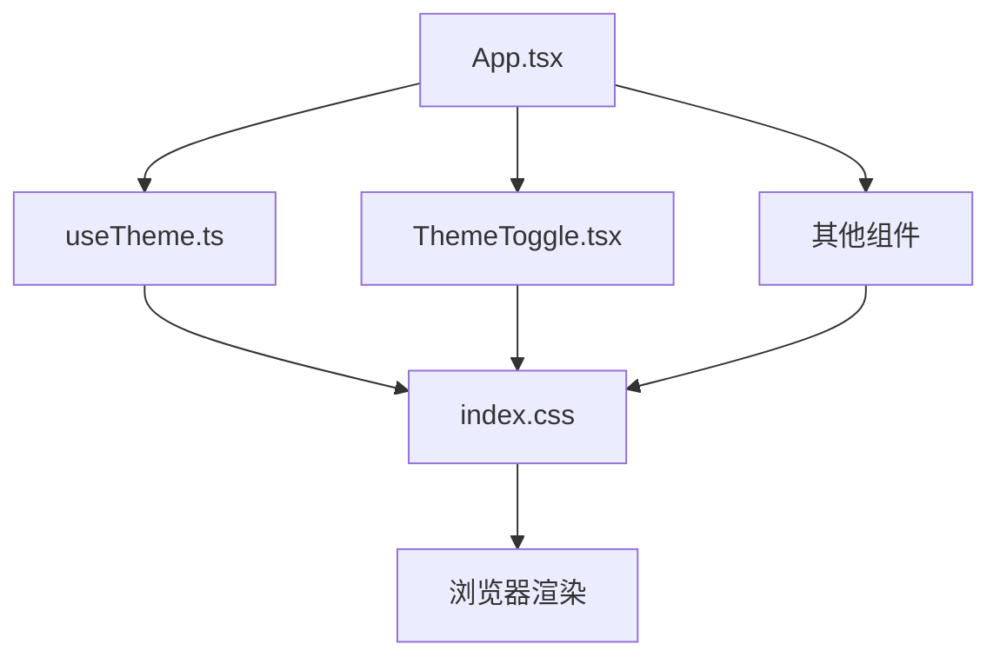
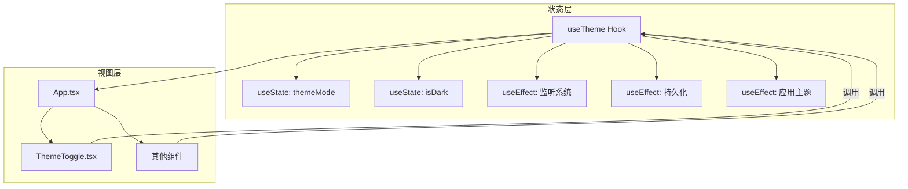
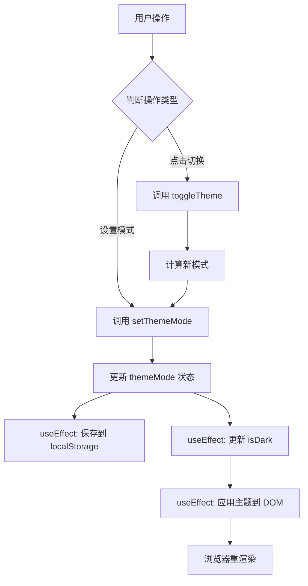
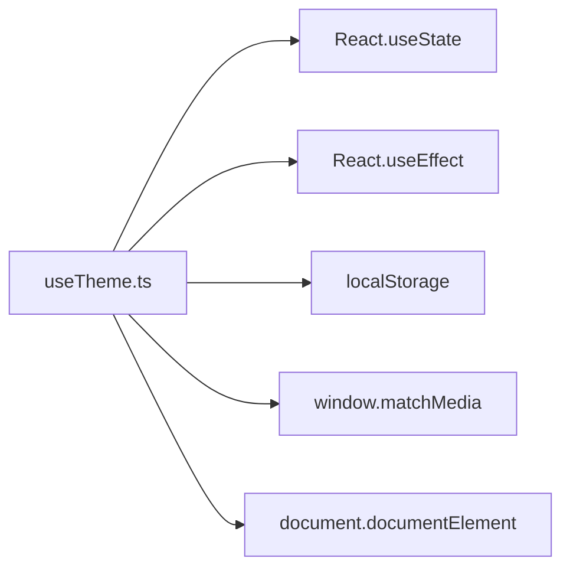

# 状态管理

<cite>
**本文档引用的文件**   
- [useTheme.ts](file://src/hooks/useTheme.ts)
- [App.tsx](file://src/App.tsx)
- [ThemeToggle.tsx](file://src/components/ThemeToggle.tsx)
- [index.css](file://src/index.css)
- [modern.css](file://src/styles/modern.css)
</cite>

## 目录
1. [简介](#简介)
2. [项目结构](#项目结构)
3. [核心组件](#核心组件)
4. [架构概述](#架构概述)
5. [详细组件分析](#详细组件分析)
6. [依赖分析](#依赖分析)
7. [性能考虑](#性能考虑)
8. [故障排除指南](#故障排除指南)
9. [结论](#结论)

## 简介
本文档全面解析 `officeTools` 项目的全局状态管理机制，重点聚焦于 `useTheme` 自定义 Hook 如何利用 React Context API 实现主题状态管理。文档详细阐述了暗色模式切换逻辑、状态持久化到 `localStorage` 的实现细节，以及 `App.tsx` 中核心状态的定义与更新策略。同时，分析了 `ThemeToggle` 组件如何通过 `useTheme` Hook 读取和修改主题状态，并探讨了状态提升模式在工具组件间共享数据的应用场景。通过状态流图展示了从用户交互到状态更新再到视图重渲染的完整链条，并对比了 Context API 与其他状态管理方案的取舍考量。

## 项目结构
`officeTools` 项目采用功能模块化的文件组织方式，将代码按功能和类型进行清晰划分。核心状态管理逻辑位于 `src/hooks/useTheme.ts`，而全局状态的定义和初始化则在 `src/App.tsx` 中完成。UI 组件分散在 `src/components` 目录下，其中 `ThemeToggle.tsx` 是主题切换功能的具体实现。样式文件集中存放在 `src/styles` 目录，通过 CSS 变量和类名控制主题的视觉表现。



**图示来源**
- [App.tsx](file://src/App.tsx#L1-L645)
- [useTheme.ts](file://src/hooks/useTheme.ts#L1-L120)
- [ThemeToggle.tsx](file://src/components/ThemeToggle.tsx#L1-L119)
- [index.css](file://src/index.css#L1-L1152)

**本节来源**
- [App.tsx](file://src/App.tsx#L1-L645)
- [project_structure](file://#L1-L50)

## 核心组件
本项目的核心状态管理由 `useTheme` 自定义 Hook 驱动，它封装了主题模式（light/dark/auto）和暗色状态（isDark）的逻辑。`App.tsx` 作为应用的根组件，通过 `useState` 定义了 `selectedKey` 和 `collapsed` 等核心状态，用于控制当前激活的工具和侧边栏的展开/折叠。`ThemeToggle` 组件则作为用户与主题状态交互的界面，它通过 `useTheme` Hook 读取当前主题并提供切换功能。

**本节来源**
- [useTheme.ts](file://src/hooks/useTheme.ts#L1-L120)
- [App.tsx](file://src/App.tsx#L1-L645)
- [ThemeToggle.tsx](file://src/components/ThemeToggle.tsx#L1-L119)

## 架构概述
`officeTools` 的状态管理架构基于 React 的 Context API 和自定义 Hook 模式。`useTheme` Hook 内部使用 `useState` 创建状态，并通过 `useEffect` 实现副作用（如监听系统偏好、更新 DOM、持久化存储）。该 Hook 将状态和更新函数封装后返回，实现了逻辑的复用。`App.tsx` 作为状态的提供者（Provider），将 `useTheme` 返回的状态传递给所有子组件。子组件（如 `ThemeToggle`）作为消费者（Consumer），通过调用 `useTheme` 来访问和修改全局状态，从而形成一个清晰的单向数据流。



**图示来源**
- [useTheme.ts](file://src/hooks/useTheme.ts#L1-L120)
- [App.tsx](file://src/App.tsx#L1-L645)

## 详细组件分析
### useTheme Hook 分析
`useTheme` 是一个精心设计的自定义 Hook，它实现了复杂的主题管理逻辑。

#### 状态定义与初始化
Hook 使用两个 `useState` 来管理状态：
- `themeMode`: 存储用户选择的主题模式（'light', 'dark', 'auto'），其初始值从 `localStorage` 中读取，若无则默认为 'auto'。
- `isDark`: 一个布尔值，表示当前是否为暗色模式，它由 `themeMode` 和外部条件（系统偏好、时间）共同决定。

```typescript
const [themeMode, setThemeMode] = useState<ThemeMode>(() => {
  const saved = localStorage.getItem(THEME_STORAGE_KEY);
  return (saved as ThemeMode) || 'auto';
});

const [isDark, setIsDark] = useState<boolean>(() => {
  const saved = localStorage.getItem(THEME_STORAGE_KEY);
  if (saved === 'dark') return true;
  if (saved === 'light') return false;
  return isNightTime(); // auto模式下的初始判断
});
```

#### 副作用处理
Hook 利用 `useEffect` 处理关键的副作用：
1.  **监听系统主题变化**：当 `themeMode` 为 'auto' 时，监听 `window.matchMedia('(prefers-color-scheme: dark)')` 的变化，并同步更新 `isDark` 状态。
2.  **监听时间变化**：在 'auto' 模式下，每分钟检查一次当前时间是否为夜晚（18:00-6:00），并据此更新 `isDark`。
3.  **应用主题到 DOM**：每当 `isDark` 变化时，通过 `applyTheme` 函数修改 `document.documentElement` 的 `classList` 和 `data-theme` 属性，从而触发 CSS 样式切换。
4.  **持久化主题设置**：每当 `themeMode` 变化时，将其值保存到 `localStorage`，确保用户偏好在页面刷新后得以保留。



**图示来源**
- [useTheme.ts](file://src/hooks/useTheme.ts#L41-L119)

**本节来源**
- [useTheme.ts](file://src/hooks/useTheme.ts#L1-L120)

### App.tsx 状态分析
`App.tsx` 是应用的根组件，它定义了多个核心状态：
- `selectedKey`: 使用 `useState` 定义，类型为 `MenuKey`，用于跟踪当前选中的工具。其初始值为 `'compress'`。
- `collapsed`: 一个布尔状态，用于控制侧边栏的展开/折叠。
- `theme`: 通过 `useTheme` Hook 获取全局主题状态。

这些状态通过 JSX 的 `props` 传递给子组件，例如将 `selectedKey` 传递给 `Menu` 组件以高亮当前项，将 `theme` 传递给 `ThemeToggle` 以显示当前模式。

```typescript
const [selectedKey, setSelectedKey] = useState<MenuKey>('compress');
const [collapsed, setCollapsed] = useState(false);
const { theme } = useTheme();
```

**本节来源**
- [App.tsx](file://src/App.tsx#L59-L199)

### ThemeToggle 组件分析
`ThemeToggle` 组件是主题状态的消费者。它通过 `import { useTheme, ThemeMode } from '../hooks/useTheme';` 导入 `useTheme` Hook，并调用它来获取 `theme` 对象、`setThemeMode` 和 `toggleTheme` 函数。

- **读取状态**：组件通过 `theme.mode` 和 `theme.isDark` 获取当前的主题模式和暗色状态，并据此渲染不同的 UI（如 Segmented 控件的选中项、按钮图标、提示文字）。
- **修改状态**：组件通过 `onChange` 事件调用 `setThemeMode` 来改变主题模式，或通过 `onClick` 事件调用 `toggleTheme` 来快速切换亮/暗模式。

```typescript
const { theme, setThemeMode, toggleTheme } = useTheme();
// ... 在JSX中使用
<Segmented value={theme.mode} onChange={(value) => setThemeMode(value as ThemeMode)} />
<Button onClick={toggleTheme} icon={theme.isDark ? <MoonOutlined /> : <SunOutlined />} />
```

**本节来源**
- [ThemeToggle.tsx](file://src/components/ThemeToggle.tsx#L3-L119)

## 依赖分析
`useTheme` Hook 的实现依赖于多个浏览器 API 和 React 特性：
- **React Hooks**: `useState` 用于状态管理，`useEffect` 用于处理副作用。
- **浏览器 API**: `localStorage` 用于持久化存储，`window.matchMedia` 用于监听系统主题偏好。
- **CSS**: 通过操作 DOM 的 `classList` 和 `data-theme` 属性来触发 CSS 样式变化。



**图示来源**
- [useTheme.ts](file://src/hooks/useTheme.ts#L1-L120)

**本节来源**
- [useTheme.ts](file://src/hooks/useTheme.ts#L1-L120)

## 性能考虑
`useTheme` Hook 在性能方面做了良好优化：
- **避免不必要的重渲染**：通过将 `theme` 对象作为单一状态返回，减少了因多个状态分散而导致的组件重渲染。
- **精确的依赖数组**：`useEffect` 的依赖数组（如 `[themeMode]`, `[isDark]`）确保了副作用只在必要时执行。
- **资源清理**：在监听 `matchMedia` 和 `setInterval` 时，`useEffect` 的清理函数会正确移除事件监听器和清除定时器，防止内存泄漏。

## 故障排除指南
- **主题不切换**：检查 `localStorage` 中 `office-tools-theme` 的值是否正确，以及 `index.css` 或 `modern.css` 文件是否正确加载。
- **auto 模式失效**：确认浏览器是否支持 `prefers-color-scheme` 媒体查询，并检查 `isNightTime` 函数的时间逻辑是否符合预期。
- **样式未应用**：确保 `applyTheme` 函数被正确调用，并且 `document.documentElement` 上的 `dark` 类名或 `data-theme` 属性已更新。

**本节来源**
- [useTheme.ts](file://src/hooks/useTheme.ts#L1-L120)
- [index.css](file://src/index.css#L1-L1152)
- [modern.css](file://src/styles/modern.css#L1-L326)

## 结论
`officeTools` 项目通过 `useTheme` 自定义 Hook 和 React Context API 的结合，实现了一个高效、可维护的全局主题状态管理系统。该方案将状态逻辑与 UI 完全解耦，便于复用和测试。通过 `localStorage` 实现持久化，并利用 `useEffect` 监听系统和时间变化，提供了灵活的 'auto' 模式。与 Redux 或 MobX 等第三方状态管理库相比，此方案更轻量级，对于本项目的需求而言，是更合适的选择，避免了过度工程化。