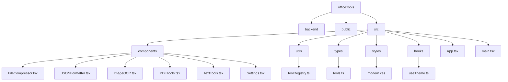
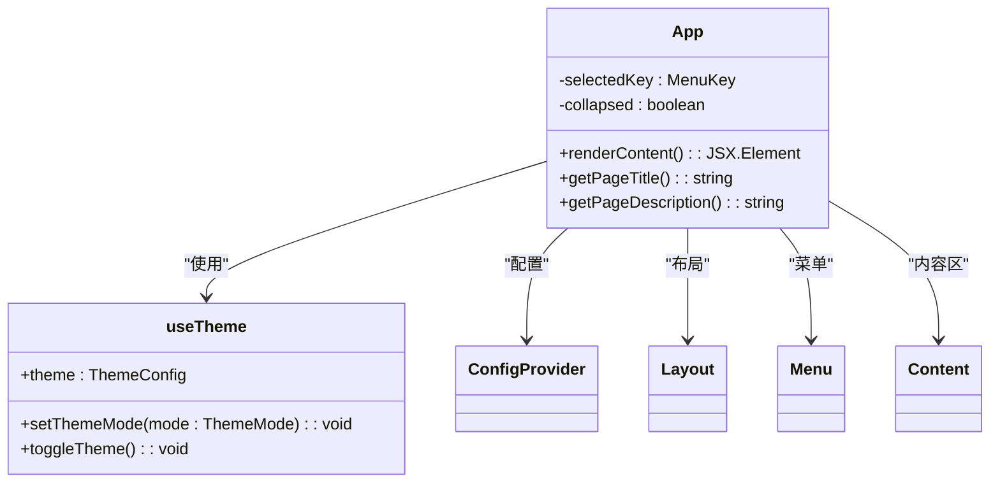
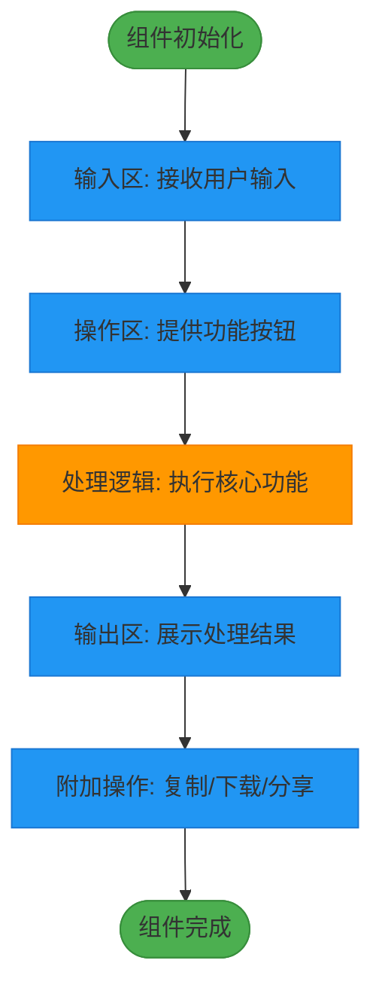
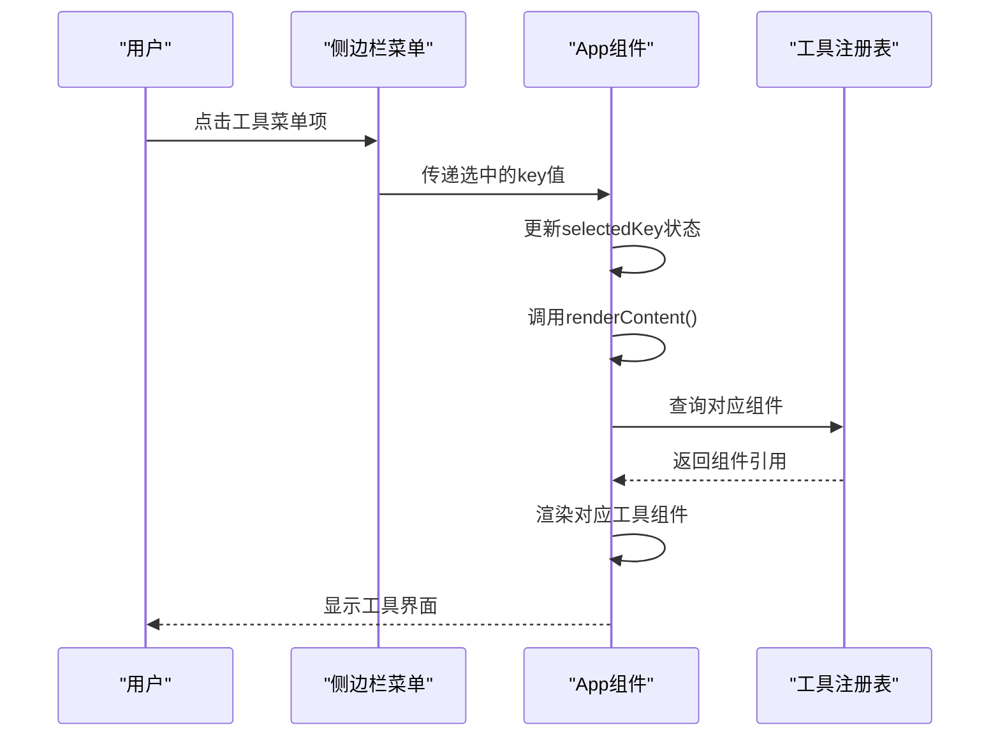
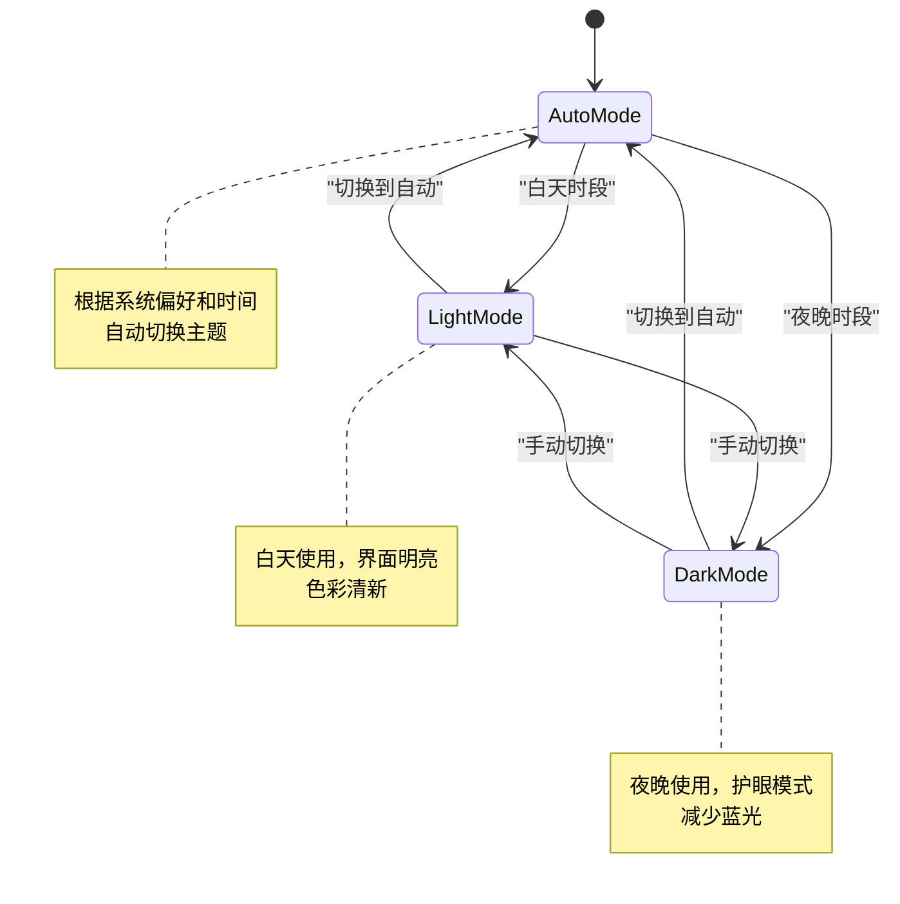
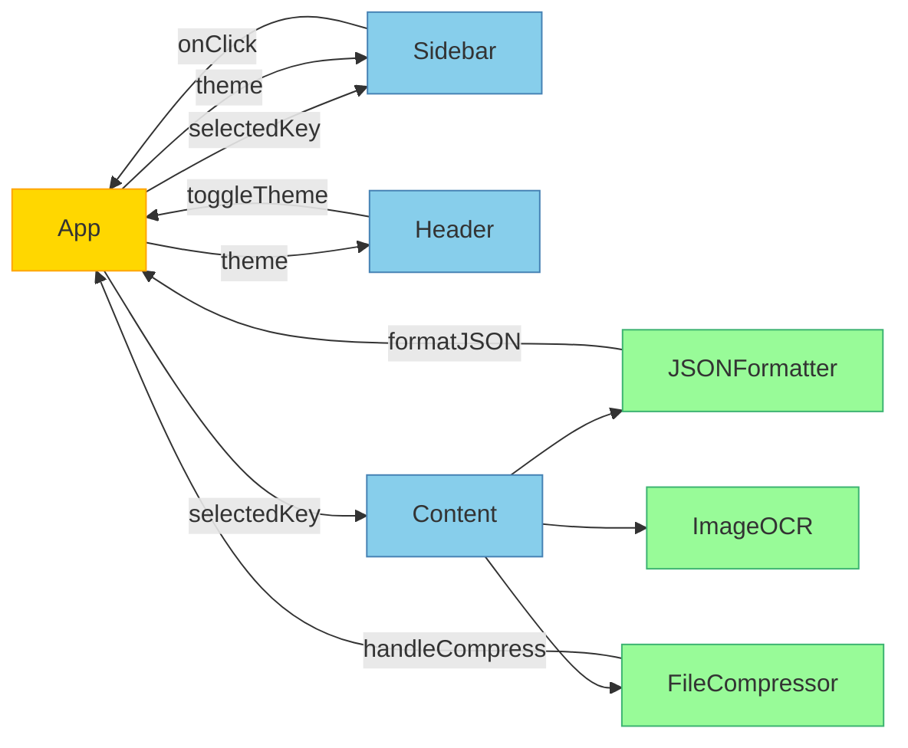

# 组件架构

<cite>
**本文档中引用的文件**   
- [App.tsx](file://src/App.tsx#L0-L645) - *更新了布局样式*
- [index.css](file://src/index.css#L0-L1152) - *更新了头部和侧边栏背景色*
- [toolRegistry.ts](file://src/utils/toolRegistry.ts#L0-L229)
- [tools.ts](file://src/types/tools.ts#L0-L59)
- [JSONFormatter.tsx](file://src/components/JSONFormatter.tsx#L0-L426)
- [FileCompressor.tsx](file://src/components/FileCompressor.tsx#L0-L168)
- [useTheme.ts](file://src/hooks/useTheme.ts#L0-L120)
- [ThemeToggle.tsx](file://src/components/ThemeToggle.tsx#L0-L119)
</cite>

## 更新摘要
**变更内容**   
- 更新了UI一致性与主题策略部分，反映了头部和侧边栏背景色的统一变更
- 添加了关于样式变更的说明，包括移除渐变效果和更新阴影样式
- 所有受影响的文件引用都已更新，包含变更注释
- 保持了文档其余部分的完整性，仅更新了受代码变更影响的部分

## 目录
1. [项目结构](#项目结构)
2. [根组件与状态管理](#根组件与状态管理)
3. [工具组件通用结构](#工具组件通用结构)
4. [动态渲染机制](#动态渲染机制)
5. [UI一致性与主题策略](#ui一致性与主题策略)
6. [组件通信机制](#组件通信机制)

## 项目结构

该办公工具项目采用典型的React+TypeScript架构，结合Ant Design组件库构建现代化的前端应用。项目结构清晰，遵循功能模块化组织原则。



**图示来源**
- [App.tsx](file://src/App.tsx#L0-L645)
- [toolRegistry.ts](file://src/utils/toolRegistry.ts#L0-L229)

**本节来源**
- [App.tsx](file://src/App.tsx#L0-L645)

## 根组件与状态管理

`App.tsx`作为应用的根组件，承担着全局状态管理、布局控制和路由分发的核心职责。它通过React的`useState`钩子管理当前选中的工具和侧边栏折叠状态。



**图示来源**
- [App.tsx](file://src/App.tsx#L0-L645)
- [useTheme.ts](file://src/hooks/useTheme.ts#L0-L120)

**本节来源**
- [App.tsx](file://src/App.tsx#L0-L645)

## 工具组件通用结构

所有工具组件遵循统一的设计模式，确保用户体验的一致性。以`JSONFormatter`和`FileCompressor`为例，它们都包含三个核心区域：

### 输入区
负责接收用户输入的数据，通常使用`TextArea`或`Upload`组件。

### 操作按钮区
提供格式化、压缩、转换等操作按钮，用户点击后触发相应的处理逻辑。

### 结果展示区
显示处理后的结果，支持复制、下载等后续操作。



**图示来源**
- [JSONFormatter.tsx](file://src/components/JSONFormatter.tsx#L0-L426)
- [FileCompressor.tsx](file://src/components/FileCompressor.tsx#L0-L168)

**本节来源**
- [JSONFormatter.tsx](file://src/components/JSONFormatter.tsx#L0-L426)
- [FileCompressor.tsx](file://src/components/FileCompressor.tsx#L0-L168)

## 动态渲染机制

应用通过`toolRegistry`工具注册表实现组件的动态管理和渲染，这是一种解耦的设计模式，便于扩展和维护。

### 工具注册表结构
`toolRegistry.ts`定义了所有可用工具的元数据，包括ID、名称、图标、描述和对应的React组件。

```typescript
export interface ToolConfig {
  id: string;
  name: string;
  icon: string;
  category: string;
  description: string;
  component: React.ComponentType;
}
```

### 动态渲染流程
1. 用户在侧边栏选择工具
2. `App.tsx`更新`selectedKey`状态
3. `renderContent()`方法根据`selectedKey`匹配对应的组件
4. 使用JSX语法动态渲染组件



**图示来源**
- [App.tsx](file://src/App.tsx#L0-L645)
- [toolRegistry.ts](file://src/utils/toolRegistry.ts#L0-L229)

**本节来源**
- [App.tsx](file://src/App.tsx#L0-L645)
- [toolRegistry.ts](file://src/utils/toolRegistry.ts#L0-L229)

## UI一致性与主题策略

项目通过多种机制确保UI的一致性和可定制性，提供优质的用户体验。

### 主题管理
使用`useTheme`自定义钩子管理应用主题，支持浅色、深色和自动模式。



### Ant Design集成
项目深度集成Ant Design组件库，通过`ConfigProvider`统一配置主题和本地化。

```typescript
<ConfigProvider 
    locale={zhCN}
    theme={{
        algorithm: theme.isDark ? antdTheme.darkAlgorithm : antdTheme.defaultAlgorithm,
        token: {
            colorPrimary: theme.isDark ? '#3b82f6' : '#2563eb',
            borderRadius: 6,
        },
        components: {
            Layout: { siderBg: theme.isDark ? '#1f2937' : '#ffffff' },
            Menu: { itemSelectedBg: theme.isDark ? '#3b82f6' : '#2563eb' },
        },
    }}
>
```

### 样式更新说明
根据最新的代码变更，已将`.ant-layout-header`和`.hover-lift`的背景色统一为次级色，移除了渐变效果，并更新了`box-shadow`和`border`样式以保持视觉一致性。这些变更增强了头部和侧边栏的视觉统一性，提供了更加一致的用户体验。

**图示来源**
- [useTheme.ts](file://src/hooks/useTheme.ts#L0-L120)
- [ThemeToggle.tsx](file://src/components/ThemeToggle.tsx#L0-L119)
- [index.css](file://src/index.css#L0-L1152) - *更新了头部和侧边栏样式*

**本节来源**
- [useTheme.ts](file://src/hooks/useTheme.ts#L0-L120)
- [ThemeToggle.tsx](file://src/components/ThemeToggle.tsx#L0-L119)
- [index.css](file://src/index.css#L0-L1152)

## 组件通信机制

组件间通过props传递配置和回调函数进行通信，形成清晰的数据流。

### 状态提升
将共享状态提升到最近的共同父组件，通过props向下传递。

### 回调函数
子组件通过父组件传递的回调函数向上通信，实现双向数据流。



**图示来源**
- [App.tsx](file://src/App.tsx#L0-L645)
- [JSONFormatter.tsx](file://src/components/JSONFormatter.tsx#L0-L426)
- [FileCompressor.tsx](file://src/components/FileCompressor.tsx#L0-L168)

**本节来源**
- [App.tsx](file://src/App.tsx#L0-L645)
- [JSONFormatter.tsx](file://src/components/JSONFormatter.tsx#L0-L426)
- [FileCompressor.tsx](file://src/components/FileCompressor.tsx#L0-L168)