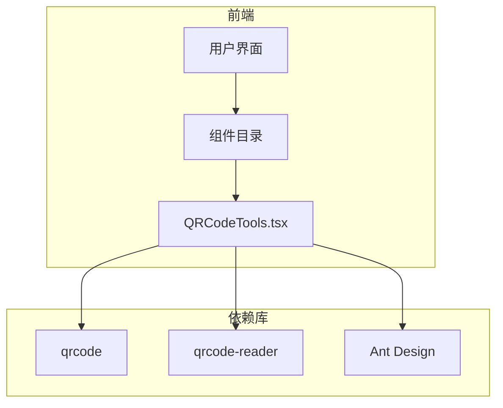
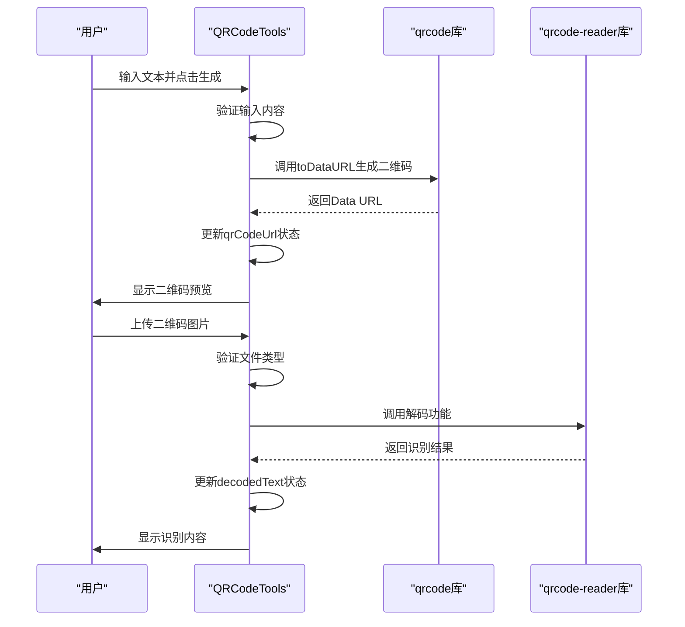
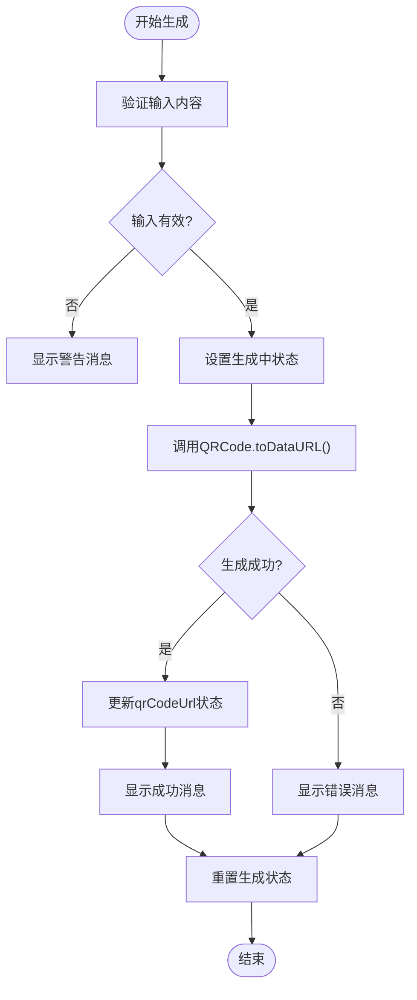
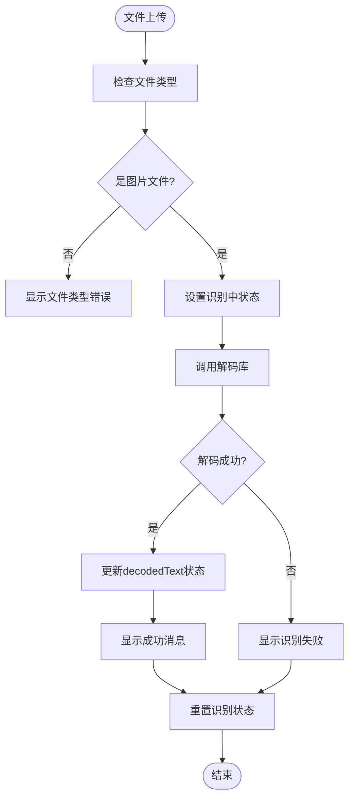
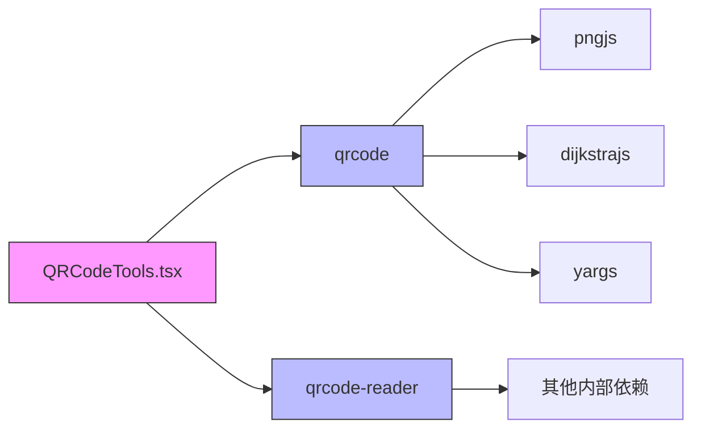

# 二维码工具

<cite>
**本文档引用的文件**  
- [QRCodeTools.tsx](file://src/components/QRCodeTools.tsx)
- [package.json](file://package.json)
- [package-lock.json](file://package-lock.json)
</cite>

## 目录
1. [简介](#简介)
2. [项目结构](#项目结构)
3. [核心组件](#核心组件)
4. [架构概述](#架构概述)
5. [详细组件分析](#详细组件分析)
6. [依赖分析](#依赖分析)
7. [性能考虑](#性能考虑)
8. [故障排除指南](#故障排除指南)
9. [结论](#结论)

## 简介
本项目是一个多功能办公工具集，其中`QRCodeTools.tsx`组件提供了二维码的生成与识别功能。该组件基于React和Ant Design构建，利用`qrcode`库实现二维码生成，支持自定义尺寸、颜色和纠错等级。虽然代码中提及使用`jsQR`进行解码，但实际实现中使用了`qrcode-reader`库。用户可通过输入文本、URL或联系人信息生成二维码，并能上传图片识别其中内容。界面采用标签页设计，分别提供生成和识别功能，操作直观便捷。

## 项目结构
项目采用标准的React+Vite架构，组件化设计清晰。`QRCodeTools.tsx`位于`src/components`目录下，是二维码功能的核心实现文件。项目依赖Ant Design作为UI框架，通过模块化方式组织各类工具组件。

**图示来源**  
- [QRCodeTools.tsx](file://src/components/QRCodeTools.tsx)
- [package.json](file://package.json)

## 核心组件
`QRCodeTools`组件是二维码功能的核心，实现了生成和识别两大功能模块。生成部分通过`qrcode`库将用户输入的内容转换为Data URL格式的二维码图像，支持实时预览。识别部分通过文件上传接口读取图片，调用解码库提取信息。组件状态管理清晰，使用`useState`管理输入内容、二维码图像URL、识别结果等状态，并通过`App.useApp()`获取全局消息提示功能，提供友好的用户反馈。

**组件来源**  
- [QRCodeTools.tsx](file://src/components/QRCodeTools.tsx#L1-L242)

## 架构概述
该组件采用React函数式组件配合Hooks的现代前端架构。整体流程为：用户在"生成二维码"标签页输入内容 → 调用`generateQRCode`函数 → 使用`qrcode`库生成Data URL → 更新状态并显示预览。在"识别二维码"标签页，用户上传图片 → `handleImageUpload`函数处理文件 → 调用解码服务 → 更新`decodedText`状态显示结果。错误处理贯穿始终，对空输入、文件类型错误等情况均有相应提示。

**图示来源**  
- [QRCodeTools.tsx](file://src/components/QRCodeTools.tsx#L42-L121)
- [package.json](file://package.json#L30-L31)

## 详细组件分析

### 二维码生成分析
生成功能的核心是`generateQRCode`异步函数。它首先验证输入内容是否为空，然后调用`QRCode.toDataURL()`方法生成二维码。该方法接受三个主要参数：`width`控制图像尺寸，`errorCorrectionLevel`设置纠错等级（L/M/Q/H），`margin`定义边距。生成成功后，返回的Data URL被存储在`qrCodeUrl`状态中，触发UI更新显示预览。用户可随时下载生成的二维码图片，系统会创建一个隐藏的`<a>`标签并触发点击事件实现下载。

**图示来源**  
- [QRCodeTools.tsx](file://src/components/QRCodeTools.tsx#L42-L64)

**组件来源**  
- [QRCodeTools.tsx](file://src/components/QRCodeTools.tsx#L42-L64)

### 二维码识别分析
识别功能通过`handleImageUpload`函数实现。当用户选择图片文件后，该函数首先检查文件类型是否为图片，然后设置`decoding`状态为true显示加载中提示。虽然代码注释提到使用`jsQR`库，但根据`package.json`依赖，实际应使用`qrcode-reader`库进行解码。解码成功后，结果存储在`decodedText`状态中，并通过文本域展示给用户。用户可复制识别出的内容到剪贴板，系统使用`navigator.clipboard.writeText()`实现此功能。

**图示来源**  
- [QRCodeTools.tsx](file://src/components/QRCodeTools.tsx#L122-L145)
- [package.json](file://package.json#L31)

**组件来源**  
- [QRCodeTools.tsx](file://src/components/QRCodeTools.tsx#L122-L145)

## 依赖分析
项目通过`package.json`明确定义了二维码相关依赖。`qrcode`库（v1.5.3）用于生成二维码，它依赖`pngjs`进行PNG图像处理。`qrcode-reader`库（v1.0.4）用于识别二维码，作为解码功能的实现基础。这些依赖通过npm包管理器安装，版本锁定在`package-lock.json`中，确保了构建的一致性。组件通过标准的ES模块语法`import QRCode from 'qrcode'`引入这些库，实现了功能的模块化集成。

**图示来源**  
- [package.json](file://package.json#L30-L31)
- [package-lock.json](file://package-lock.json#L5702-L5738)

**组件来源**  
- [package.json](file://package.json#L30-L31)

## 性能考虑
组件在性能方面做了基本优化。生成二维码时使用异步操作，避免阻塞UI线程。通过`loading`状态提示用户操作正在进行，提升了用户体验。图像预览直接使用Data URL，避免了额外的服务器请求。然而，对于大尺寸或高复杂度的二维码生成，仍可能造成短暂的界面卡顿。建议在后续优化中考虑使用Web Worker将生成任务移至后台线程执行，进一步提升响应速度。

## 故障排除指南
常见问题及解决方案：
- **二维码无法生成**：检查输入内容是否为空，确保`qrcode`库正确安装。
- **识别功能失效**：确认上传的图片包含清晰的二维码，检查`qrcode-reader`库是否正常工作。
- **下载功能无效**：某些浏览器可能阻止自动下载，提示用户手动保存。
- **跨域问题**：若在Electron应用中使用，需确保文件协议权限正确配置。
- **内存泄漏**：在`handleImageUpload`中创建的文件URL应适时释放，避免内存占用过高。

**组件来源**  
- [QRCodeTools.tsx](file://src/components/QRCodeTools.tsx#L42-L145)

## 结论
`QRCodeTools`组件成功集成了二维码的生成与识别功能，提供了直观易用的用户界面。通过`qrcode`和`qrcode-reader`两个专用库，实现了高质量的二维码处理能力。组件设计合理，状态管理清晰，错误处理完善。未来可考虑增加更多功能，如自定义二维码颜色、Logo嵌入、批量处理等，进一步提升实用性。整体代码质量较高，遵循了现代前端开发的最佳实践，是项目中一个功能完整、实现良好的工具组件。