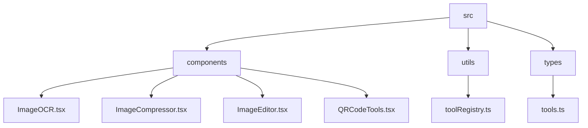
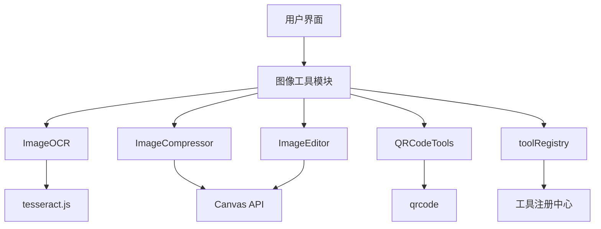
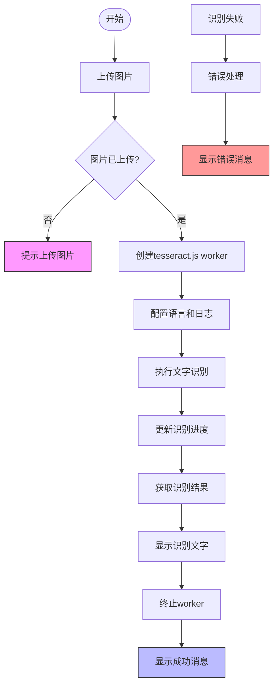
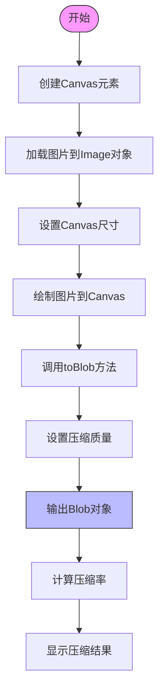
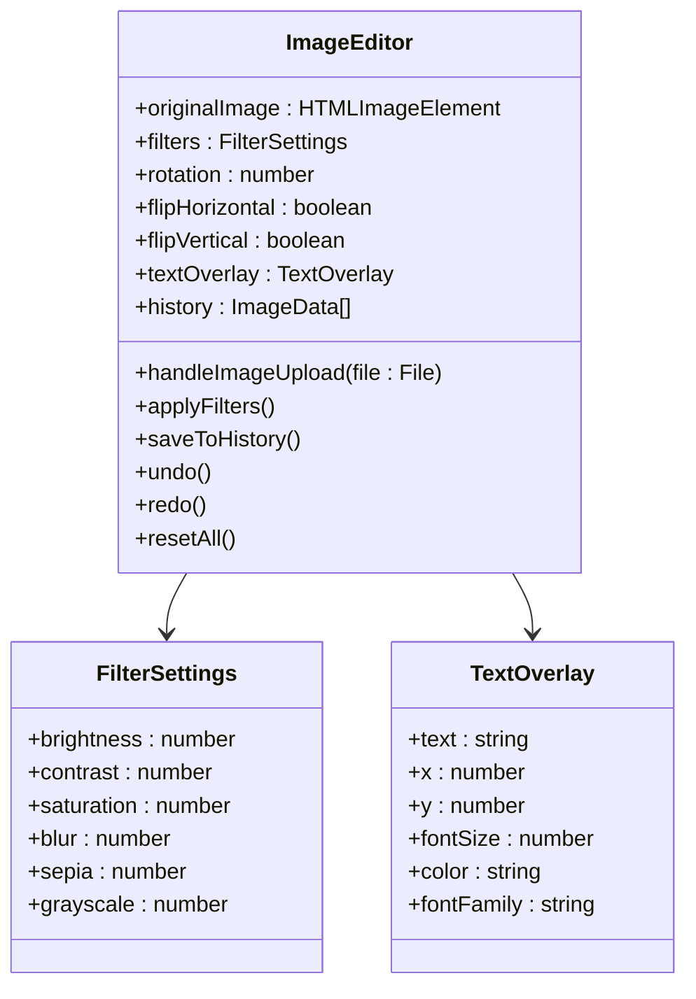
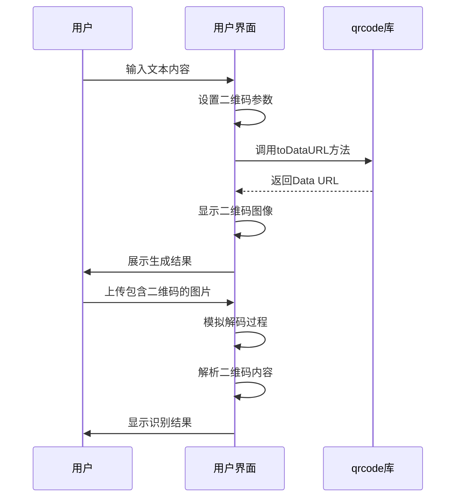
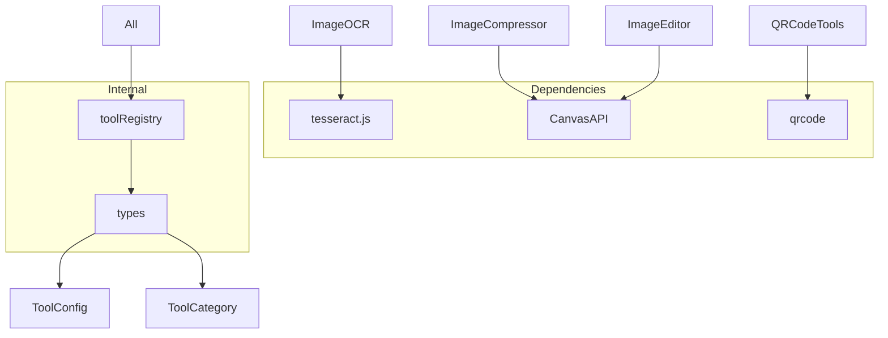

# 图像工具模块

<cite>
**本文档引用的文件**   
- [ImageOCR.tsx](file://src\components\ImageOCR.tsx)
- [ImageCompressor.tsx](file://src\components\ImageCompressor.tsx)
- [ImageEditor.tsx](file://src\components\ImageEditor.tsx)
- [QRCodeTools.tsx](file://src\components\QRCodeTools.tsx)
- [toolRegistry.ts](file://src\utils\toolRegistry.ts)
- [tools.ts](file://src\types\tools.ts)
- [package-lock.json](file://package-lock.json)
</cite>

## 目录
1. [简介](#简介)
2. [项目结构](#项目结构)
3. [核心组件](#核心组件)
4. [架构概述](#架构概述)
5. [详细组件分析](#详细组件分析)
6. [依赖分析](#依赖分析)
7. [性能考虑](#性能考虑)
8. [故障排除指南](#故障排除指南)
9. [结论](#结论)

## 简介
本项目是一个多功能办公工具集合，其中图像工具模块提供了图片OCR识别、图片压缩、图片编辑和二维码生成等核心功能。这些工具通过统一的接口注册机制集成到系统中，为用户提供便捷的图像处理服务。模块采用React框架构建，利用tesseract.js实现浏览器端文字识别，使用Canvas API进行图像压缩与编辑，并通过qrcode库生成二维码。

## 项目结构
项目采用功能模块化组织方式，将不同类型的工具分门别类地组织在components目录下。图像处理相关组件集中存放，便于维护和扩展。

**图源**
- [ImageOCR.tsx](file://src\components\ImageOCR.tsx)
- [ImageCompressor.tsx](file://src\components\ImageCompressor.tsx)
- [ImageEditor.tsx](file://src\components\ImageEditor.tsx)
- [QRCodeTools.tsx](file://src\components\QRCodeTools.tsx)
- [toolRegistry.ts](file://src\utils\toolRegistry.ts)
- [tools.ts](file://src\types\tools.ts)

**章节来源**
- [ImageOCR.tsx](file://src\components\ImageOCR.tsx)
- [ImageCompressor.tsx](file://src\components\ImageCompressor.tsx)
- [ImageEditor.tsx](file://src\components\ImageEditor.tsx)
- [QRCodeTools.tsx](file://src\components\QRCodeTools.tsx)

## 核心组件
图像工具模块包含四个核心组件：ImageOCR用于图片文字识别，ImageCompressor实现图片压缩，ImageEditor提供图片编辑功能，QRCodeTools负责二维码生成与识别。这些组件通过统一的工具注册机制被系统识别和加载，形成完整的图像处理解决方案。

**章节来源**
- [ImageOCR.tsx](file://src\components\ImageOCR.tsx)
- [ImageCompressor.tsx](file://src\components\ImageCompressor.tsx)
- [ImageEditor.tsx](file://src\components\ImageEditor.tsx)
- [QRCodeTools.tsx](file://src\components\QRCodeTools.tsx)

## 架构概述
系统采用模块化架构设计，各图像处理工具作为独立组件开发，通过统一的接口注册到系统中。这种设计实现了功能解耦，便于维护和扩展。

**图源**
- [ImageOCR.tsx](file://src\components\ImageOCR.tsx)
- [ImageCompressor.tsx](file://src\components\ImageCompressor.tsx)
- [ImageEditor.tsx](file://src\components\ImageEditor.tsx)
- [QRCodeTools.tsx](file://src\components\QRCodeTools.tsx)
- [toolRegistry.ts](file://src\utils\toolRegistry.ts)

## 详细组件分析

### 图片OCR识别分析
ImageOCR组件实现了基于tesseract.js的浏览器端图像文字识别功能，支持多语言识别和进度反馈。

#### 组件工作流程

**图源**
- [ImageOCR.tsx](file://src\components\ImageOCR.tsx#L0-L100)

**章节来源**
- [ImageOCR.tsx](file://src\components\ImageOCR.tsx#L0-L201)

### 图片压缩分析
ImageCompressor组件利用Canvas API实现图像质量压缩，通过调整JPEG质量参数来平衡文件大小与视觉质量。

#### 压缩实现原理

**图源**
- [ImageCompressor.tsx](file://src\components\ImageCompressor.tsx#L30-L60)

**章节来源**
- [ImageCompressor.tsx](file://src\components\ImageCompressor.tsx#L0-L213)

### 图片编辑分析
ImageEditor组件提供了丰富的图片编辑功能，包括滤镜调整、旋转、翻转和文字添加等。

#### 编辑功能架构

**图源**
- [ImageEditor.tsx](file://src\components\ImageEditor.tsx#L0-L480)

**章节来源**
- [ImageEditor.tsx](file://src\components\ImageEditor.tsx#L0-L480)

### 二维码生成分析
QRCodeTools组件实现了二维码的生成与识别功能，通过qrcode库将文本内容转换为可扫描的二维码图像。

#### 生成与识别流程

**图源**
- [QRCodeTools.tsx](file://src\components\QRCodeTools.tsx#L0-L242)

**章节来源**
- [QRCodeTools.tsx](file://src\components\QRCodeTools.tsx#L0-L242)

## 依赖分析
图像工具模块依赖多个外部库和内部组件，通过工具注册机制实现动态加载。

**图源**
- [package-lock.json](file://package-lock.json)
- [toolRegistry.ts](file://src\utils\toolRegistry.ts)
- [tools.ts](file://src\types\tools.ts)

**章节来源**
- [package-lock.json](file://package-lock.json)
- [toolRegistry.ts](file://src\utils\toolRegistry.ts)
- [tools.ts](file://src\types\tools.ts)

## 性能考虑
图像处理操作可能消耗大量计算资源，特别是在处理大型图像时。系统通过以下方式优化性能：

1. **异步处理**：所有图像处理操作均在异步函数中执行，避免阻塞UI线程
2. **进度反馈**：为长时间运行的操作提供进度指示器，提升用户体验
3. **内存管理**：及时释放Object URL和worker资源，防止内存泄漏
4. **批量处理**：支持多文件同时处理，提高操作效率

虽然当前实现中未包含针对超大图像的分块处理机制，但架构设计允许未来添加此类优化。tesseract.js的Web Worker实现确保了OCR识别不会冻结用户界面。

**章节来源**
- [ImageOCR.tsx](file://src\components\ImageOCR.tsx)
- [ImageCompressor.tsx](file://src\components\ImageCompressor.tsx)
- [ImageEditor.tsx](file://src\components\ImageEditor.tsx)

## 故障排除指南
### 常见问题及解决方案

**问题1：OCR识别失败**
- **可能原因**：网络问题导致tesseract.js模型加载失败
- **解决方案**：检查网络连接，尝试重新识别

**问题2：图片压缩后质量过低**
- **可能原因**：压缩质量设置过低
- **解决方案**：调整质量滑块至80%以上，平衡文件大小与视觉质量

**问题3：二维码无法识别**
- **可能原因**：上传的图片中二维码模糊或被遮挡
- **解决方案**：使用清晰、完整的二维码图片进行识别

**问题4：内存不足错误**
- **可能原因**：处理过于庞大的图像文件
- **解决方案**：先使用其他工具将大图缩小后再进行处理

**章节来源**
- [ImageOCR.tsx](file://src\components\ImageOCR.tsx)
- [ImageCompressor.tsx](file://src\components\ImageCompressor.tsx)
- [ImageEditor.tsx](file://src\components\ImageEditor.tsx)
- [QRCodeTools.tsx](file://src\components\QRCodeTools.tsx)

## 结论
图像工具模块提供了一套完整的图像处理解决方案，涵盖了从文字识别到格式转换的多种实用功能。通过模块化设计和统一注册机制，系统具有良好的可扩展性和维护性。各组件充分利用现代浏览器API和第三方库，实现了高效、用户友好的图像处理体验。未来可进一步优化大型图像处理性能，添加更多高级编辑功能，提升整体用户体验。