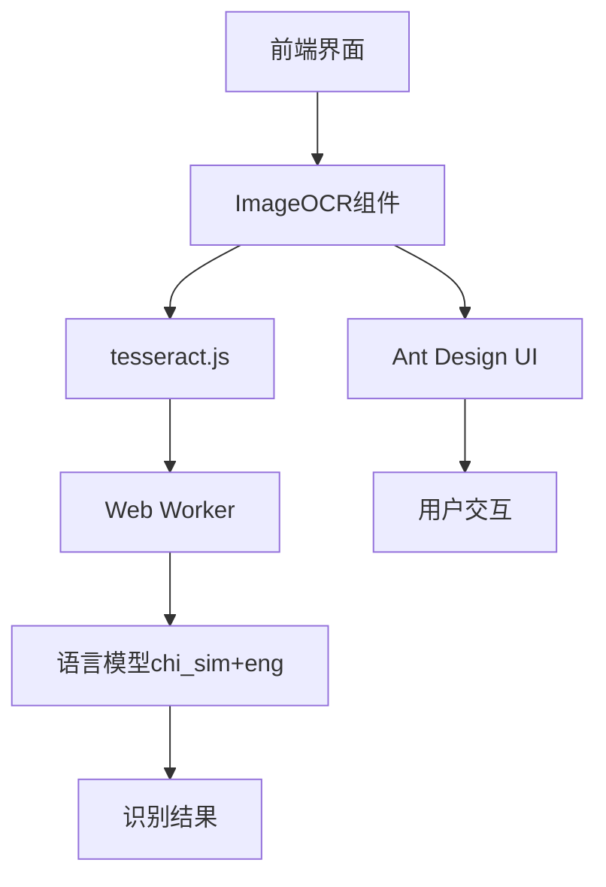
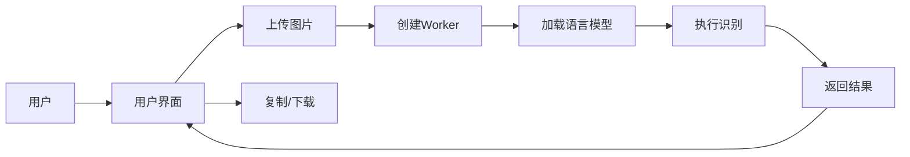
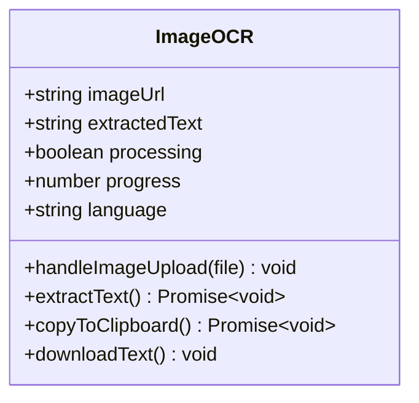
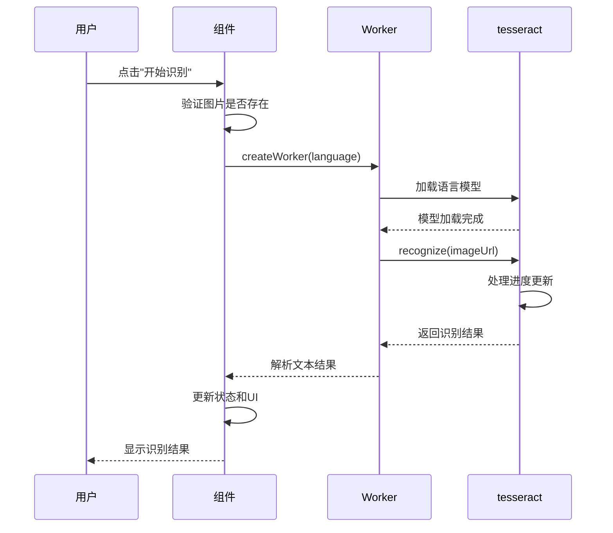
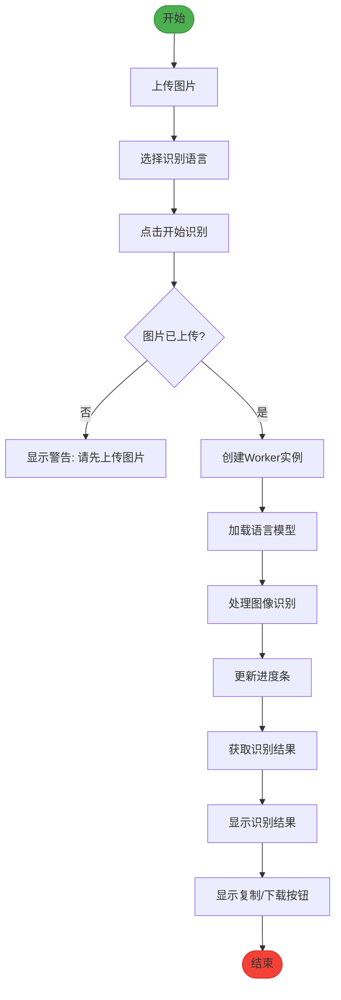
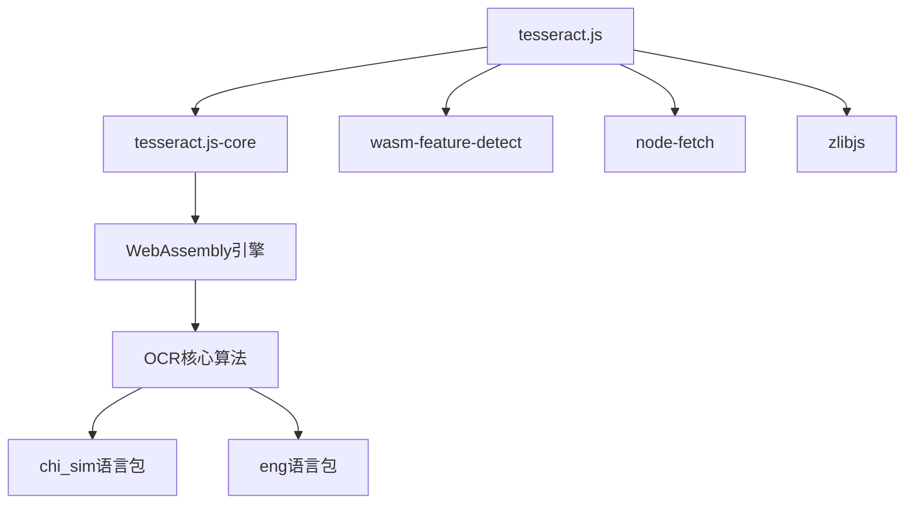
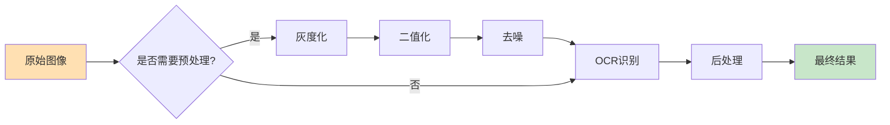

# 图片OCR识别

<cite>
**本文档引用的文件**   
- [ImageOCR.tsx](file://src/components/ImageOCR.tsx)
- [package.json](file://package.json)
</cite>

## 目录
1. [简介](#简介)
2. [项目结构](#项目结构)
3. [核心组件](#核心组件)
4. [架构概述](#架构概述)
5. [详细组件分析](#详细组件分析)
6. [依赖分析](#依赖分析)
7. [性能考虑](#性能考虑)
8. [故障排除指南](#故障排除指南)
9. [结论](#结论)

## 简介
本项目是一个多功能办公工具集，其中`ImageOCR.tsx`组件实现了基于`tesseract.js`的前端图像文字识别功能。该组件允许用户通过拖拽或上传方式提交图片，并在浏览器内完成OCR（光学字符识别）处理，支持中英文混合识别。整个过程在前端完成，无需服务器参与，保护用户隐私。

## 项目结构
项目采用典型的React + Vite架构，组件按功能组织在`src/components`目录下。`ImageOCR.tsx`作为独立组件，集成了图像上传、预览、OCR识别和结果处理等完整流程。

**图源**
- [ImageOCR.tsx](file://src/components/ImageOCR.tsx)

## 核心组件
`ImageOCR.tsx`是实现OCR功能的核心组件，使用React函数式组件和Hooks管理状态。它通过`tesseract.js`的`createWorker`方法创建Web Worker，在后台线程执行OCR任务，避免阻塞主线程。

**组件源**
- [ImageOCR.tsx](file://src/components/ImageOCR.tsx#L1-L201)

## 架构概述
系统采用前后端分离架构，OCR处理完全在浏览器端完成。tesseract.js利用WebAssembly技术提升识别速度，通过Worker线程实现异步处理。

**图源**
- [ImageOCR.tsx](file://src/components/ImageOCR.tsx#L1-L201)

## 详细组件分析

### ImageOCR组件分析
该组件实现了完整的OCR工作流，包括用户交互、状态管理和错误处理。

#### 状态管理
组件使用多个useState Hook管理状态：
- `imageUrl`: 存储上传图片的URL
- `extractedText`: 存储识别结果
- `processing`: 标记处理状态
- `progress`: 跟踪识别进度
- `language`: 选择识别语言

**图源**
- [ImageOCR.tsx](file://src/components/ImageOCR.tsx#L1-L201)

#### 识别流程
识别过程通过async/await实现异步处理，确保UI流畅。

**图源**
- [ImageOCR.tsx](file://src/components/ImageOCR.tsx#L45-L85)

### 用户交互流程
组件提供了直观的用户界面，支持多种交互方式。

**图源**
- [ImageOCR.tsx](file://src/components/ImageOCR.tsx)

## 依赖分析
项目依赖tesseract.js进行OCR处理，该库基于WebAssembly技术，提供高效的识别能力。

**图源**
- [package.json](file://package.json#L38-L40)

## 性能考虑
### 当前实现分析
- **Worker创建**: `createWorker(language, 1, {logger})` 创建单个Worker实例
- **语言模型**: 同时加载`chi_sim+eng`双语言模型
- **进度反馈**: 通过logger回调实时更新进度条
- **资源管理**: 识别完成后调用`worker.terminate()`释放资源

### 优化建议
1. **WebAssembly优化**: 确保使用tesseract.js的WebAssembly版本，比ASM.js版本快3-5倍
2. **预加载策略**: 在组件挂载时预加载Worker，减少首次识别延迟
3. **图像预处理**: 增加灰度化、二值化等预处理步骤提升准确率
4. **缓存机制**: 缓存已加载的Worker实例，避免重复创建开销

**图源**
- [ImageOCR.tsx](file://src/components/ImageOCR.tsx)

## 故障排除指南
### 常见问题及解决方案
1. **语言包加载失败**
   - 检查网络连接
   - 确认tesseract.js版本兼容性
   - 查看浏览器控制台错误信息

2. **识别准确率低**
   - 确保图像清晰、文字区域明亮
   - 尝试预处理图像（灰度化、对比度增强）
   - 选择正确的语言模型

3. **性能问题**
   - 在低性能设备上使用单语言模型
   - 限制图像尺寸（建议不超过2MB）
   - 考虑降级到简单模式

4. **跨域问题**
   - 确保图片URL同源或支持CORS
   - 使用FileReader读取本地文件

**组件源**
- [ImageOCR.tsx](file://src/components/ImageOCR.tsx#L60-L85)

## 结论
`ImageOCR.tsx`组件成功实现了浏览器端的图像文字识别功能，具有以下特点：
- 使用tesseract.js在前端完成OCR，保护用户隐私
- 通过Web Worker避免阻塞主线程，保持UI流畅
- 支持中英文混合识别，满足多语言需求
- 提供直观的进度反馈和用户交互

建议未来版本增加图像预处理功能，如灰度化、二值化等，以进一步提升识别准确率。同时可考虑实现Worker池管理，优化多任务处理性能。