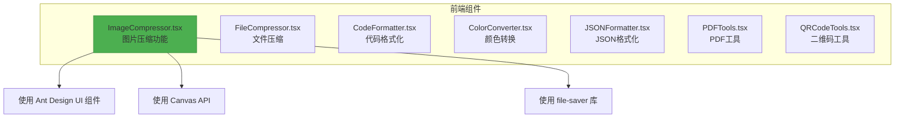
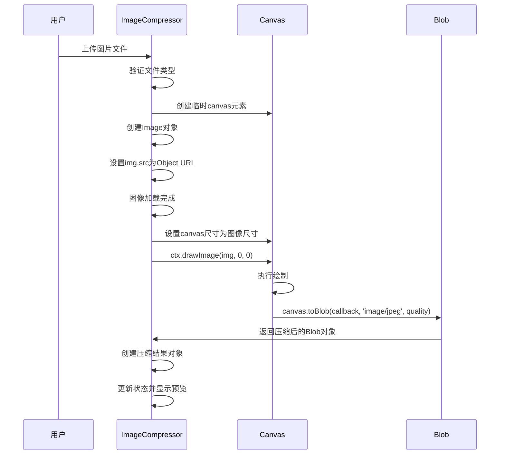
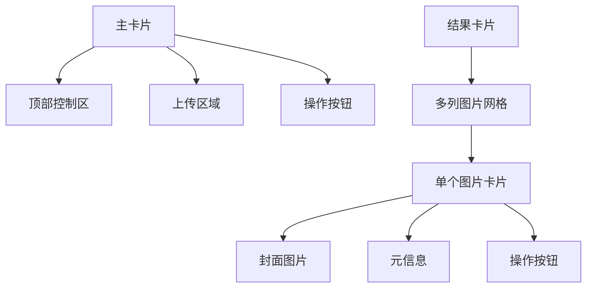

# 图片压缩

<cite>
**本文档中引用的文件**
- [ImageCompressor.tsx](file://src/components/ImageCompressor.tsx)
</cite>

## 目录
1. [项目结构](#项目结构)
2. [核心功能分析](#核心功能分析)
3. [图像压缩技术详解](#图像压缩技术详解)
4. [用户交互与UI实现](#用户交互与ui实现)
5. [性能与内存管理](#性能与内存管理)
6. [错误处理与用户体验](#错误处理与用户体验)
7. [总结](#总结)

## 项目结构

根据项目目录结构，`ImageCompressor.tsx` 是位于 `src/components/` 目录下的一个独立功能组件，属于一个多功能办公工具集的一部分。该组件与其他工具（如文件压缩、代码格式化、颜色转换等）并列组织，采用基于功能的模块化架构。



**Diagram sources**
- [ImageCompressor.tsx](file://src/components/ImageCompressor.tsx)

**Section sources**
- [ImageCompressor.tsx](file://src/components/ImageCompressor.tsx)

## 核心功能分析

`ImageCompressor` 组件实现了完整的图片上传、压缩、预览和下载流程。其核心功能围绕以下几个关键函数展开：

- `handleImageUpload`: 处理文件上传事件
- `compressImage`: 执行图像压缩逻辑
- `downloadImage`: 触发单个文件下载
- `downloadAll`: 批量下载所有压缩图片
- `clearAll`: 清空当前压缩结果

这些函数共同构成了一个流畅的用户体验闭环。

**Section sources**
- [ImageCompressor.tsx](file://src/components/ImageCompressor.tsx#L16-L210)

## 图像压缩技术详解

### 基于Canvas API的压缩实现

该组件利用HTML5的Canvas API实现无损客户端图像压缩。核心流程如下：



**Diagram sources**
- [ImageCompressor.tsx](file://src/components/ImageCompressor.tsx#L50-L75)

**Section sources**
- [ImageCompressor.tsx](file://src/components/ImageCompressor.tsx#L50-L75)

### 压缩算法核心代码

```typescript
const compressImage = (file: File, quality: number): Promise<Blob> => {
  return new Promise((resolve) => {
    const canvas = document.createElement('canvas');
    const ctx = canvas.getContext('2d')!;
    const img = new Image();
    
    img.onload = () => {
      canvas.width = img.width;
      canvas.height = img.height;
      ctx.drawImage(img, 0, 0);
      
      canvas.toBlob((blob) => {
        resolve(blob!);
      }, 'image/jpeg', quality / 100);
    };
    
    img.src = URL.createObjectURL(file);
  });
};
```

**关键步骤说明：**

1. **创建Canvas上下文**：动态创建`<canvas>`元素并获取2D渲染上下文。
2. **加载源图像**：使用`Image`对象异步加载用户上传的图片。
3. **绘制图像**：通过`drawImage`方法将原始图像完整绘制到canvas上。
4. **质量控制压缩**：调用`toBlob`接口，指定MIME类型为`image/jpeg`，并传入`quality`参数（0-1之间）来控制压缩质量。
5. **返回结果**：将压缩后的Blob对象通过Promise返回。

### 图像格式与压缩效率分析

| 图像格式 | 压缩类型 | 适用场景 | 在本组件中的实现 |
|---------|---------|---------|----------------|
| JPEG | 有损压缩 | 照片、复杂色彩图像 | 默认输出格式 |
| PNG | 无损压缩 | 透明背景、简单图形 | 不支持直接输出 |
| WebP | 有损/无损 | 现代浏览器、高效压缩 | 输入支持，输出为JPEG |

本组件统一将所有输入图像转换为JPEG格式进行压缩，确保了最大的兼容性和压缩效率。

### 压缩参数与数学逻辑

用户可通过滑块调节压缩质量（10%-100%），该值直接映射到`toBlob`的第三个参数：

```javascript
quality / 100 // 将百分比转换为0-1的小数
```

压缩率计算公式：
```
压缩率 = (1 - 压缩后大小 / 原始大小) × 100%
```

此计算在成功压缩后通过`message.success`提示用户。

**Section sources**
- [ImageCompressor.tsx](file://src/components/ImageCompressor.tsx#L50-L75)

## 用户交互与UI实现

### 文件上传交互

组件使用Ant Design的`Dragger`组件实现拖拽上传功能：

```tsx
<Dragger
  multiple
  accept="image/*"
  beforeUpload={handleImageUpload}
  showUploadList={false}
>
  <p className="ant-upload-drag-icon">
    <InboxOutlined />
  </p>
  <p className="ant-upload-text">点击或拖拽图片到此区域进行压缩</p>
  <p className="ant-upload-hint">支持 JPG、PNG、WebP 等格式，可批量处理</p>
</Dragger>
```

**特性说明：**
- `multiple`: 允许批量上传
- `accept="image/*"`: 限制文件类型为图片
- `beforeUpload`: 指定处理函数，阻止默认上传行为
- `showUploadList={false}`: 隐藏默认上传列表，使用自定义展示

**Section sources**
- [ImageCompressor.tsx](file://src/components/ImageCompressor.tsx#L138-L150)

### 压缩质量调节

通过`Slider`组件提供直观的质量调节：

```tsx
<Slider
  min={10}
  max={100}
  value={quality}
  onChange={setQuality}
  marks={{
    10: '最小',
    50: '平衡',
    80: '高质量',
    100: '原始'
  }}
/>
```

**交互逻辑：**
- 滑块值实时绑定到`quality`状态
- 变化时立即更新，影响后续上传图片的压缩质量
- 标记点提供语义化参考

**Section sources**
- [ImageCompressor.tsx](file://src/components/ImageCompressor.tsx#L118-L128)

### 结果展示与操作

使用嵌套的`Card`组件构建清晰的UI层次：



**Section sources**
- [ImageCompressor.tsx](file://src/components/ImageCompressor.tsx#L100-L210)

### 文件大小格式化

`formatFileSize`函数将字节大小转换为可读格式：

```typescript
const formatFileSize = (bytes: number): string => {
  if (bytes === 0) return '0 Bytes';
  const k = 1024;
  const sizes = ['Bytes', 'KB', 'MB', 'GB'];
  const i = Math.floor(Math.log(bytes) / Math.log(k));
  return parseFloat((bytes / Math.pow(k, i)).toFixed(2)) + ' ' + sizes[i];
};
```

**计算逻辑：**
1. 以1024为基数进行单位换算
2. 使用对数计算合适的单位级别
3. 保留两位小数提高可读性

此函数被广泛用于显示原始大小、压缩后大小和节省空间。

**Section sources**
- [ImageCompressor.tsx](file://src/components/ImageCompressor.tsx#L28-L35)

## 性能与内存管理

### 大图处理策略

虽然当前实现未显式限制分辨率，但通过以下方式间接缓解内存压力：
- 异步处理避免阻塞UI线程
- 每次处理完成后释放临时资源

### 内存泄漏防护

`clearAll`函数正确释放了所有创建的Object URL：

```typescript
const clearAll = () => {
  compressedImages.forEach(image => URL.revokeObjectURL(image.url));
  setCompressedImages([]);
};
```

**重要性：** `URL.createObjectURL`会创建内存引用，必须通过`revokeObjectURL`显式释放，否则会导致内存泄漏。

### 批量下载优化

`downloadAll`函数使用`setTimeout`实现批量下载的错峰处理：

```typescript
const downloadAll = () => {
  compressedImages.forEach((image, index) => {
    setTimeout(() => {
      downloadImage(image);
    }, index * 100);
  });
};
```

这种做法避免了短时间内发起大量下载请求可能引发的浏览器限制或性能问题。

**Section sources**
- [ImageCompressor.tsx](file://src/components/ImageCompressor.tsx#L170-L177)

## 错误处理与用户体验

### 错误提示机制

使用`message`组件提供友好的用户反馈：

```typescript
// 文件类型错误
message.error('请选择图片文件');

// 压缩失败
message.error('图片压缩失败');

// 压缩成功
message.success(`图片压缩完成，压缩率: ${((1 - compressed.size / file.size) * 100).toFixed(1)}%`);
```

这些提示信息增强了应用的交互性和可用性。

### 处理状态反馈

通过`processing`状态和`Progress`组件显示处理中状态：

```tsx
{processing && <Progress percent={0} style={{ marginTop: 16 }} />}
```

尽管当前进度条是静态的（固定0%），但它向用户传达了“正在处理”的明确信号。

**Section sources**
- [ImageCompressor.tsx](file://src/components/ImageCompressor.tsx#L164-L166)

## 总结

`ImageCompressor`组件是一个功能完整、用户体验良好的前端图片压缩工具。它巧妙地利用Canvas API实现了客户端无损压缩，避免了服务器端处理的开销。通过Ant Design构建了直观的用户界面，并实现了完整的文件上传、压缩、预览、下载和清理流程。

**主要优点：**
- 完全客户端处理，保护用户隐私
- 实时质量调节，即时反馈压缩效果
- 批量处理能力，提高工作效率
- 清晰的视觉反馈和错误提示

**潜在改进方向：**
- 添加最大尺寸限制以防止内存溢出
- 实现真正的进度显示（如分块处理）
- 支持输出格式选择（PNG/WebP）
- 增加图像尺寸调整功能

该组件的设计体现了现代Web应用的典型特征：响应式UI、异步处理、资源管理和良好的用户体验。