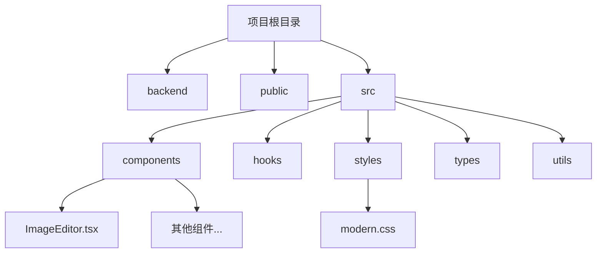
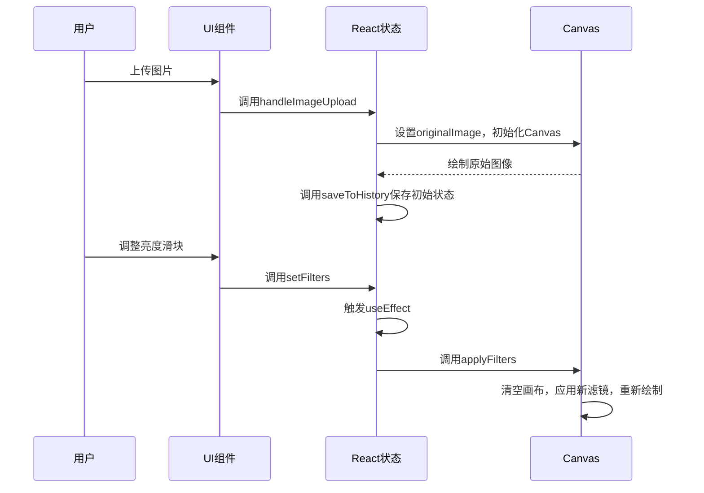
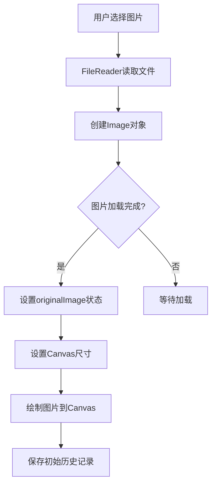
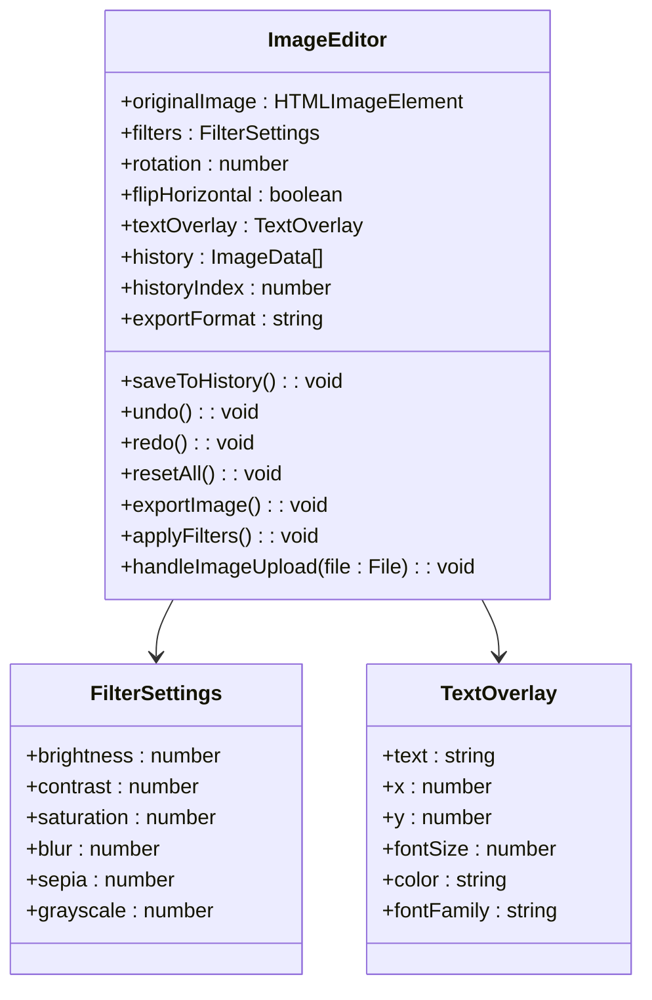
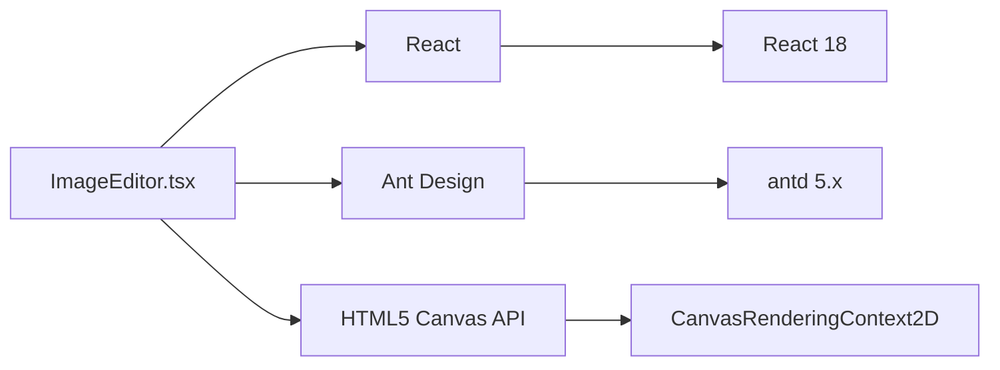

# 图片编辑器

<cite>
**本文档中引用的文件**   
- [ImageEditor.tsx](file://src/components/ImageEditor.tsx)
</cite>

## 目录
1. [简介](#简介)
2. [项目结构](#项目结构)
3. [核心组件](#核心组件)
4. [架构概述](#架构概述)
5. [详细组件分析](#详细组件分析)
6. [依赖分析](#依赖分析)
7. [性能考虑](#性能考虑)
8. [故障排除指南](#故障排除指南)
9. [结论](#结论)

## 简介
本项目是一个基于React的多功能办公工具集，其中`ImageEditor.tsx`组件提供了完整的图片编辑功能。该组件利用HTML5 Canvas实现图像处理，支持裁剪、旋转、缩放、滤镜调整、文字叠加等操作。用户可以通过直观的界面上传图片并进行各种编辑，最终将结果导出为PNG、JPEG或WebP格式。组件采用函数式组件与React Hooks结合的方式开发，使用Ant Design作为UI框架，确保了良好的用户体验和响应式设计。

## 项目结构
项目采用典型的React应用结构，主要分为`backend`（后端服务）、`public`（公共资源）和`src`（源代码）三个目录。`src`目录下包含`components`（组件）、`hooks`（自定义Hook）、`styles`（样式）、`types`（类型定义）、`utils`（工具函数）等子目录，体现了清晰的模块化设计。`ImageEditor`作为核心功能组件之一，位于`src/components/ImageEditor.tsx`，与其他工具组件并列，通过`App.tsx`统一集成。

**图源**
- [ImageEditor.tsx](file://src/components/ImageEditor.tsx)

## 核心组件
`ImageEditor`组件是本工具的核心，它封装了图片编辑的所有功能。组件使用`useState`管理图像数据、滤镜设置、旋转角度、翻转状态、文字叠加和导出格式等状态。通过`useRef`获取Canvas元素的引用，以便进行2D绘图操作。`useEffect`钩子用于监听状态变化并自动重新应用滤镜。组件的UI由多个Ant Design的`Card`、`Slider`、`Button`等组件构成，布局清晰，交互友好。

**节源**
- [ImageEditor.tsx](file://src/components/ImageEditor.tsx#L1-L50)

## 架构概述
`ImageEditor`组件的架构围绕HTML5 Canvas构建，采用“状态驱动视图”的React设计模式。当用户上传图片后，组件将图片绘制到Canvas上。后续的所有编辑操作（如调整滤镜、旋转、添加文字）都不会直接修改原始图片，而是通过修改状态，然后在`useEffect`中重新执行`applyFilters`函数，将原始图片、当前变换和滤镜效果重新绘制到Canvas上。这种设计保证了原始数据的安全性，并实现了非破坏性编辑。

**图源**
- [ImageEditor.tsx](file://src/components/ImageEditor.tsx#L100-L200)

## 详细组件分析
### 图像加载与渲染流程
图像加载始于用户通过`Upload`组件选择文件。`beforeUpload`属性指定的`handleImageUpload`函数被触发。该函数使用`FileReader`读取文件内容为Data URL，然后创建一个`Image`对象。当`Image`对象的`onload`事件触发时，说明图片已成功解码，此时将`Image`对象存入`originalImage`状态。同时，根据图片的原始尺寸设置Canvas的宽高，并将图片绘制到Canvas上，完成初始渲染。

**图源**
- [ImageEditor.tsx](file://src/components/ImageEditor.tsx#L144-L197)

**节源**
- [ImageEditor.tsx](file://src/components/ImageEditor.tsx#L144-L197)

### 滤镜与变换实现
组件通过Canvas 2D上下文的`filter`属性实现滤镜效果。`applyFilters`函数构建一个包含`brightness`、`contrast`、`saturate`、`blur`、`sepia`和`grayscale`的CSS filter字符串，并将其赋值给`ctx.filter`。在绘制图片前，通过`ctx.translate`、`ctx.rotate`和`ctx.scale`方法应用旋转和翻转变换。这些变换以画布中心为原点进行，确保了旋转和缩放的中心对齐。`ctx.save()`和`ctx.restore()`用于保存和恢复Canvas状态，防止变换影响后续绘制（如文字叠加）。

**节源**
- [ImageEditor.tsx](file://src/components/ImageEditor.tsx#L101-L149)

### 文字叠加功能
文字叠加功能允许用户在图片上添加自定义文字。相关状态由`textOverlay`对象管理，包括文字内容、位置（x, y）、字号、颜色和字体。UI提供了输入框和滑块来修改这些属性。在`applyFilters`函数的最后，如果`textOverlay.text`不为空，组件会使用`ctx.font`、`ctx.fillStyle`和`ctx.fillText`方法将文字绘制到Canvas上。文字的位置是相对于Canvas左上角的绝对坐标。

**节源**
- [ImageEditor.tsx](file://src/components/ImageEditor.tsx#L144-L197)

### 撤销/重做功能设计
撤销/重做功能采用了简化的历史记录模式，而非严格的命令模式。组件使用`history`数组存储`ImageData`对象（通过`ctx.getImageData`捕获的像素数据），并用`historyIndex`指针指向当前状态。每次执行可能改变图像的操作（如应用滤镜、旋转）后，都会调用`saveToHistory`，它会截断`historyIndex`之后的历史记录（实现“分支”），并将当前Canvas的像素数据推入数组。`undo`和`redo`函数通过移动`historyIndex`指针，并使用`ctx.putImageData`将对应的历史状态恢复到Canvas上来实现。

**图源**
- [ImageEditor.tsx](file://src/components/ImageEditor.tsx#L50-L100)

**节源**
- [ImageEditor.tsx](file://src/components/ImageEditor.tsx#L50-L100)

### 图像导出流程
导出功能通过`exportImage`函数实现。当用户点击“导出图片”按钮时，该函数被调用。首先检查Canvas是否存在。然后创建一个`<a>`元素，设置其`download`属性为文件名（包含用户选择的格式），并使用`canvas.toDataURL()`方法将Canvas内容转换为指定格式（PNG、JPEG、WebP）的Data URL，赋值给`href`属性。最后，通过程序化调用`link.click()`触发浏览器的下载对话框。整个过程无需与服务器交互，完全在客户端完成。

**节源**
- [ImageEditor.tsx](file://src/components/ImageEditor.tsx#L191-L243)

## 依赖分析
`ImageEditor`组件主要依赖于React和Ant Design库。它使用React的`useState`、`useRef`和`useEffect`等Hooks管理状态和副作用。UI完全由Ant Design的组件（如`Card`、`Button`、`Slider`、`Upload`、`Input`、`Select`、`ColorPicker`）构建，确保了风格统一。组件内部逻辑依赖于浏览器原生的Canvas API进行图像处理。项目没有使用fabric.js等第三方Canvas库，而是直接操作Canvas 2D上下文，保持了轻量级。

**图源**
- [ImageEditor.tsx](file://src/components/ImageEditor.tsx#L1-L10)

## 性能考虑
该组件的性能主要受Canvas尺寸和历史记录长度的影响。大尺寸图片会占用更多内存，且`getImageData`和`putImageData`操作会更耗时。目前的撤销/重做机制会将整个Canvas的像素数据存储在内存中，对于大图片或长历史记录，可能导致内存占用过高。一个优化方向是限制历史记录的步数，或只存储变换参数而非完整的像素数据（但这会牺牲非线性操作的撤销能力）。此外，`useEffect`在每次滤镜或变换状态变化时都重新绘制，对于复杂的滤镜链，可能会有性能瓶颈，可以考虑防抖或节流。

## 故障排除指南
- **问题：上传图片后无反应**
  - 检查浏览器控制台是否有错误。
  - 确认上传的文件是有效的图片格式（JPEG, PNG, WebP等）。
  - 检查`FileReader`是否被正确调用。

- **问题：滤镜或旋转操作无效**
  - 确认`originalImage`状态已正确设置。
  - 检查`applyFilters`函数是否被执行（可通过`useEffect`的依赖项）。
  - 确保Canvas上下文（`ctx`）存在。

- **问题：撤销/重做功能失效**
  - 检查`saveToHistory`是否在每次编辑操作后被调用。
  - 确认`history`数组和`historyIndex`的状态是否正确更新。
  - 检查`putImageData`的参数是否有效。

- **问题：导出的图片为空或损坏**
  - 确认Canvas上已有内容。
  - 检查`toDataURL`的格式参数是否正确。
  - 确保浏览器支持该图片格式的导出。

**节源**
- [ImageEditor.tsx](file://src/components/ImageEditor.tsx#L191-L243)

## 结论
`ImageEditor`组件是一个功能完整、结构清晰的前端图片编辑工具。它巧妙地结合了React的状态管理和HTML5 Canvas的强大绘图能力，实现了非破坏性的图片编辑体验。组件的代码组织良好，职责分明，易于维护和扩展。通过分析其源码，我们可以深入理解如何在现代Web应用中实现复杂的交互式图形功能。未来可以考虑增加真正的裁剪功能、图层管理或更高级的滤镜，以进一步提升其能力。