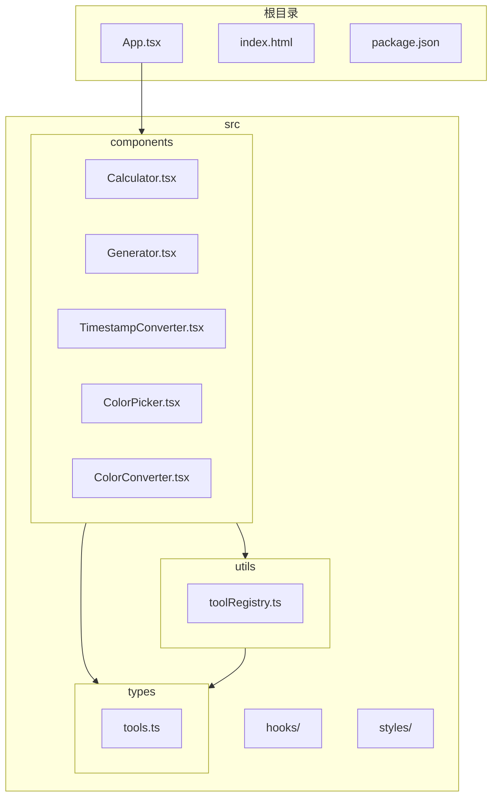
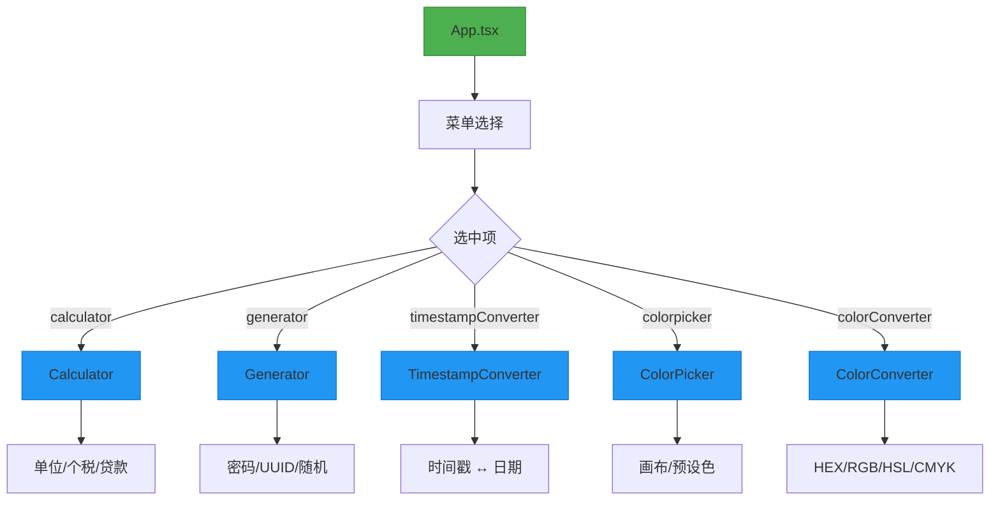
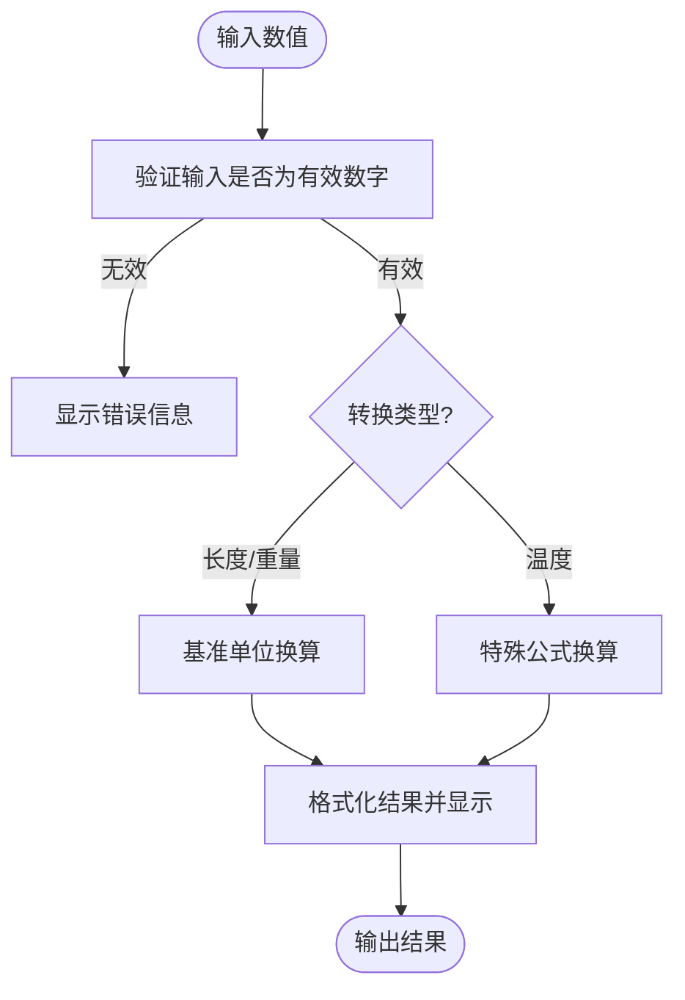
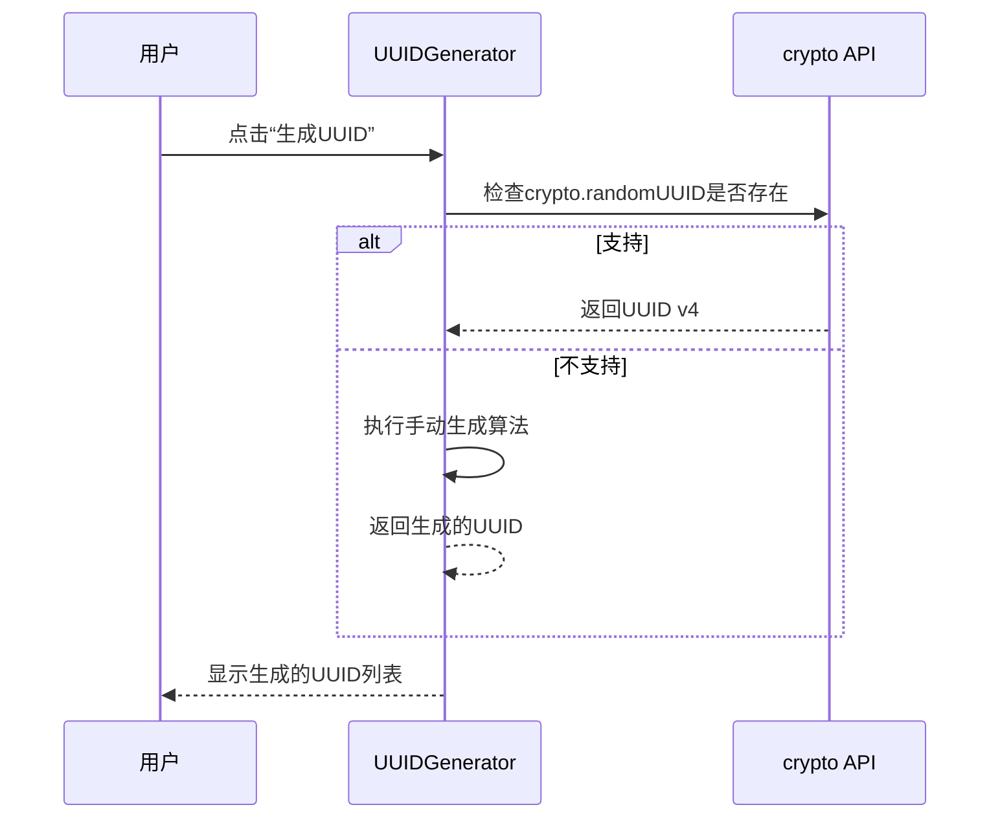
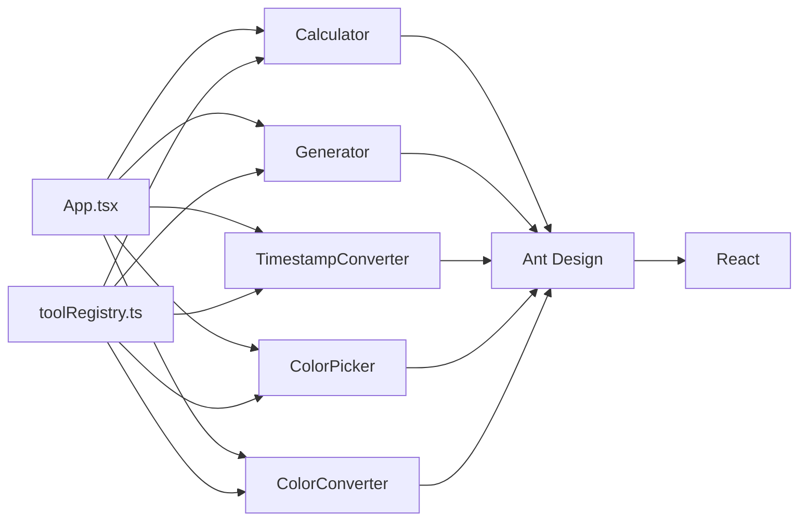

# 实用工具模块

<cite>
**本文档引用的文件**  
- [Calculator.tsx](file://src/components/Calculator.tsx) - *在最近的提交中更新*
- [Generator.tsx](file://src/components/Generator.tsx) - *在最近的提交中更新*
- [TimestampConverter.tsx](file://src/components/TimestampConverter.tsx)
- [ColorPicker.tsx](file://src/components/ColorPicker.tsx)
- [ColorConverter.tsx](file://src/components/ColorConverter.tsx)
- [App.tsx](file://src/App.tsx)
- [toolRegistry.ts](file://src/utils/toolRegistry.ts)
- [tools.ts](file://src/types/tools.ts)
</cite>

## 更新摘要
**已做更改**   
- 更新了“核心组件”和“详细组件分析”部分，以反映`Calculator.tsx`和`Generator.tsx`中Ant Design Tabs组件的重构
- 更新了相关代码示例以展示新的`items`属性用法
- 修正了与Tabs实现相关的架构概览图
- 增强了源代码跟踪，为更新的文件添加了变更注释

## 目录
1. [简介](#简介)
2. [项目结构](#项目结构)
3. [核心组件](#核心组件)
4. [架构概览](#架构概览)
5. [详细组件分析](#详细组件分析)
6. [依赖分析](#依赖分析)
7. [性能考量](#性能考量)
8. [故障排除指南](#故障排除指南)
9. [结论](#结论)

## 简介
本项目“办公工具”是一个集成多种实用功能的前端应用，旨在为用户提供高效、便捷的日常办公与开发辅助。其中，“实用工具模块”作为核心功能之一，包含计算器、生成器、时间戳转换、颜色取值器和颜色转换工具等组件，覆盖了从基础计算到数据生成、时间处理和色彩管理的广泛需求。这些工具不仅满足普通用户的日常使用，也为开发者提供了调试和开发支持。本文档将系统性地介绍这些工具的功能实现、技术原理和实际应用场景。

## 项目结构
项目采用典型的React + TypeScript + Vite技术栈，结合Ant Design组件库构建用户界面。整体结构清晰，遵循功能模块化组织原则。

**图示来源**  
- [App.tsx](file://src/App.tsx)
- [toolRegistry.ts](file://src/utils/toolRegistry.ts)
- [tools.ts](file://src/types/tools.ts)

**本节来源**  
- [App.tsx](file://src/App.tsx)
- [project_structure](file://.project_structure)

## 核心组件
实用工具模块的核心组件包括：
- **计算器 (Calculator.tsx)**：提供单位转换、个税计算和房贷计算功能。
- **生成器 (Generator.tsx)**：用于生成密码、UUID和随机数据。
- **时间戳转换器 (TimestampConverter.tsx)**：实现时间戳与日期时间的双向转换。
- **颜色取值器 (ColorPicker.tsx)**：提供交互式颜色选择功能。
- **颜色转换器 (ColorConverter.tsx)**：支持多种颜色格式间的转换。

这些组件均以函数式组件（React.FC）的形式实现，利用React Hooks（如`useState`, `useEffect`）管理状态和副作用，代码简洁且易于维护。

**本节来源**  
- [Calculator.tsx](file://src/components/Calculator.tsx)
- [Generator.tsx](file://src/components/Generator.tsx)
- [TimestampConverter.tsx](file://src/components/TimestampConverter.tsx)
- [ColorPicker.tsx](file://src/components/ColorPicker.tsx)
- [ColorConverter.tsx](file://src/components/ColorConverter.tsx)

## 架构概览
整个应用采用基于路由的组件渲染模式。`App.tsx`文件负责管理全局状态（如当前选中的菜单项）和渲染主界面。工具模块的注册和分类在`toolRegistry.ts`中定义，通过`toolCategories`数组集中管理所有工具的元数据（如名称、图标、描述和对应的React组件）。

**图示来源**  
- [App.tsx](file://src/App.tsx#L119-L224)
- [toolRegistry.ts](file://src/utils/toolRegistry.ts#L78-L130)

## 详细组件分析
本节将深入分析实用工具模块中各核心组件的实现细节。

### 计算器分析
`Calculator.tsx`组件通过`Tabs`组件实现了功能的分页展示，包含“单位转换”、“个税计算”和“房贷计算”三个子功能。

#### 单位转换逻辑
该功能支持长度、重量和温度的单位转换。其核心在于预定义的`units`对象，它为每个类别（如长度）下的单位（如米、厘米）定义了转换因子（`factor`）。转换时，程序将输入值先转换为基准单位（如米），再转换为目标单位。

**图示来源**  
- [Calculator.tsx](file://src/components/Calculator.tsx#L50-L100)

**本节来源**  
- [Calculator.tsx](file://src/components/Calculator.tsx#L1-L319)

#### 个税计算算法
个税计算遵循中国累进税率表。程序首先计算年应纳税所得额（年收入减去6万元起征点），然后遍历预定义的税率区间（`taxBrackets`），找到适用的税率和速算扣除数，最终计算出年税额和月税额。

**本节来源**  
- [Calculator.tsx](file://src/components/Calculator.tsx#L150-L200)

### 生成器分析
`Generator.tsx`组件同样使用`Tabs`组织功能，提供密码、UUID和随机数据的生成。

#### 密码生成算法
密码生成器允许用户自定义长度和字符集（大写字母、小写字母、数字、特殊符号）。其核心算法是`generatePassword`函数：
1. 根据用户选项拼接`charset`字符串。
2. 使用`Math.random()`生成0到`charset.length`之间的随机索引。
3. 循环指定长度，从`charset`中按随机索引选取字符并拼接成最终密码。

**本节来源**  
- [Generator.tsx](file://src/components/Generator.tsx#L50-L100)

#### UUID生成机制
UUID生成器优先使用浏览器内置的`crypto.randomUUID()` API（v4版本），以确保生成的UUID具有高随机性和安全性。在不支持此API的旧环境中，程序会回退到一个基于`Math.random()`的手动实现，通过替换模板字符串`'xxxxxxxx-xxxx-4xxx-yxxx-xxxxxxxxxxxx'`中的`x`和`y`来生成UUID。

**图示来源**  
- [Generator.tsx](file://src/components/Generator.tsx#L150-L200)

### 时间戳转换器分析
`TimestampConverter.tsx`组件提供了时间戳与人类可读日期之间的双向转换。

#### 转换实现机制
- **时间戳转日期**：程序将输入的时间戳（秒或毫秒）转换为`Date`对象，然后调用`formatDate`函数，根据用户选择的格式（如`YYYY-MM-DD HH:mm:ss`）进行字符串格式化。
- **日期转时间戳**：程序将输入的日期字符串传递给`new Date()`构造函数，得到`Date`对象，再通过`getTime()`方法获取毫秒级时间戳，并根据用户选择转换为秒级。

该组件还实现了批量转换功能，允许用户粘贴多行输入（时间戳或日期），程序会自动识别并转换每一行。

**本节来源**  
- [TimestampConverter.tsx](file://src/components/TimestampConverter.tsx#L50-L150)

### 颜色取值器分析
`ColorPicker.tsx`组件提供了一个功能丰富的颜色选择界面。

#### 功能实现
- **预设调色板**：提供了一个包含常用颜色的网格，用户可直接点击选择。
- **色轮绘制**：使用`<canvas>`元素绘制了一个圆形色轮，用户可以通过拖拽来选择色相（Hue）。
- **颜色信息计算**：内部实现了`hexToRgb`、`rgbToHsl`、`rgbToHsv`等转换函数，当用户选择颜色后，会实时计算并显示该颜色在HEX、RGB、HSL、HSV等模式下的值。

**本节来源**  
- [ColorPicker.tsx](file://src/components/ColorPicker.tsx#L1-L707)

### 颜色转换器分析
`ColorConverter.tsx`组件专注于不同颜色格式间的数学转换。

#### 转换算法
该组件的核心是多个数学转换函数：
- **HEX转RGB**：通过正则表达式解析HEX字符串，将每两个十六进制字符转换为十进制数。
- **RGB转HSL/HSL**：基于标准的色彩空间转换公式，涉及最大值、最小值、亮度、饱和度和色相的复杂计算。
- **RGB转CMYK**：用于印刷的颜色模型，计算公式为`K = 1 - max(R,G,B)`，然后根据K值计算C、M、Y。

当用户通过颜色选择器改变颜色时，`updateAllFormats`函数会调用这些算法，同步更新所有格式的显示值。

**本节来源**  
- [ColorConverter.tsx](file://src/components/ColorConverter.tsx#L1-L334)

## 依赖分析
实用工具模块的组件之间相互独立，但都依赖于Ant Design提供的UI组件（如`Card`, `Input`, `Button`, `Tabs`）和React核心库。它们通过`App.tsx`被统一集成，并通过`toolRegistry.ts`进行注册和管理。

**图示来源**  
- [Calculator.tsx](file://src/components/Calculator.tsx#L1)
- [Generator.tsx](file://src/components/Generator.tsx#L1)
- [App.tsx](file://src/App.tsx#L39)
- [toolRegistry.ts](file://src/utils/toolRegistry.ts#L1)

## 性能考量
各工具组件的性能表现良好：
- **计算类工具**（如计算器、颜色转换器）的算法时间复杂度为O(1)，响应迅速。
- **生成类工具**（如生成器）的性能取决于生成数量，但`Math.random()`和`crypto` API的调用效率很高。
- **转换类工具**（如时间戳转换器）的字符串解析和`Date`对象操作是浏览器原生优化的，性能开销极小。
- **交互类工具**（如颜色取值器）的`<canvas>`绘制在现代浏览器中性能优异，实时拖拽流畅。

## 故障排除指南
- **问题：生成的密码/UUID为空或错误。**
  - **原因**：`Math.random()`在极少数情况下可能产生不均匀分布，或`crypto` API不可用。
  - **解决方案**：确保在支持`crypto.randomUUID()`的现代浏览器中运行。对于密码生成，检查字符集是否为空。

- **问题：时间戳转换结果不正确。**
  - **原因**：输入的时间戳单位（秒/毫秒）选择错误，或日期字符串格式不被`new Date()`正确解析。
  - **解决方案**：确认时间戳单位设置，并使用标准的ISO 8601或常见日期格式。

- **问题：颜色转换值显示NaN。**
  - **原因**：输入的HEX颜色值格式不正确（如缺少#号或非6位）。
  - **解决方案**：确保输入有效的HEX颜色代码（如`#FF0000`）。

**本节来源**  
- [Generator.tsx](file://src/components/Generator.tsx#L70-L80)
- [TimestampConverter.tsx](file://src/components/TimestampConverter.tsx#L60-L70)
- [ColorConverter.tsx](file://src/components/ColorConverter.tsx#L30-L40)

## 结论
实用工具模块通过一系列独立但功能强大的组件，为用户提供了全面的辅助功能。其代码结构清晰，实现逻辑严谨，充分利用了现代Web API（如`crypto`）和成熟的UI库（Ant Design）。这些工具不仅在功能上满足了多样化的需求，其良好的用户体验设计（如实时预览、一键复制）也极大地提升了使用效率。未来可考虑增加历史记录保存、自定义配置等功能，进一步提升用户粘性。