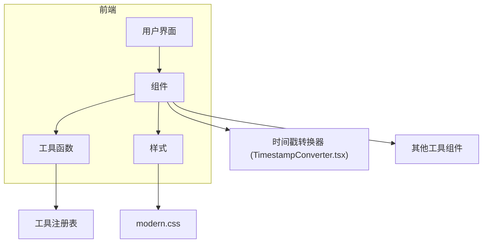
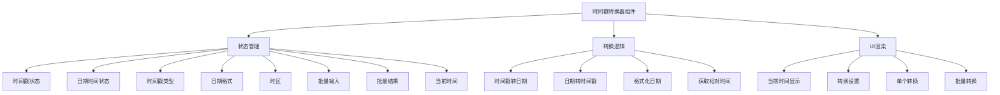
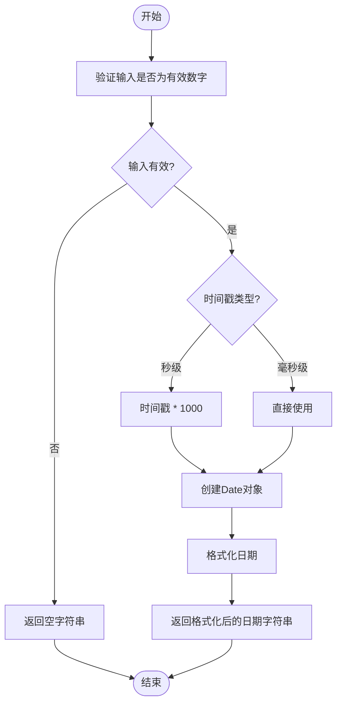
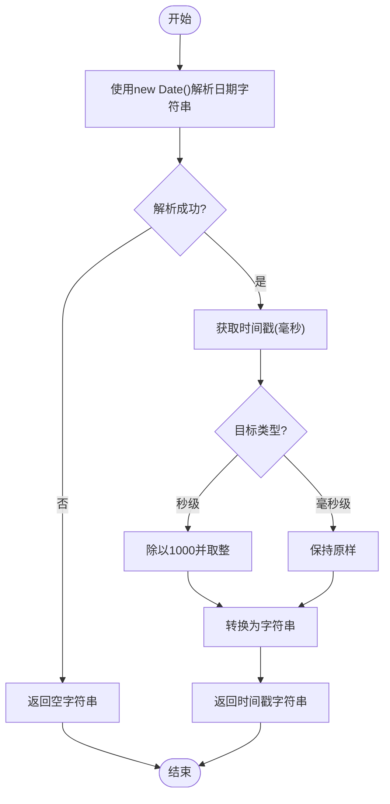
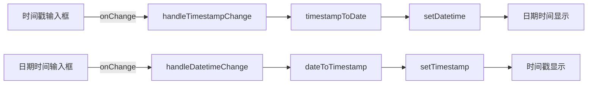
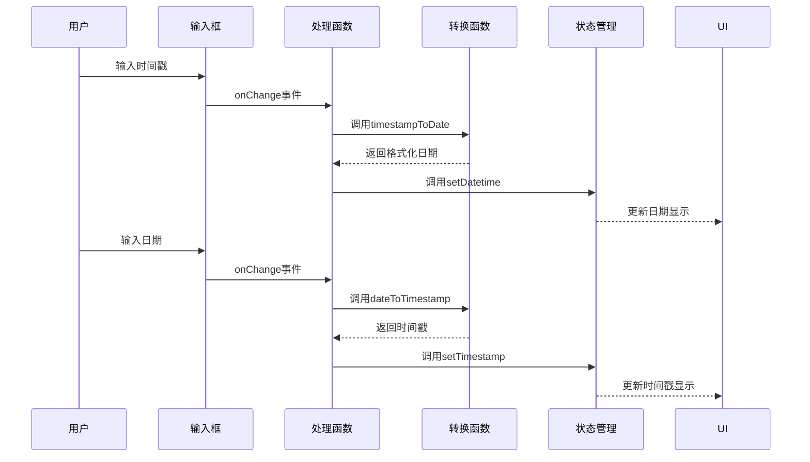
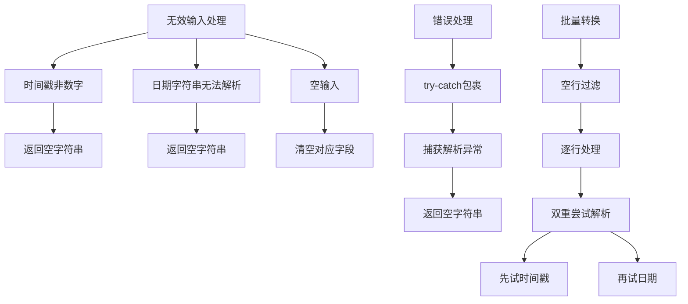
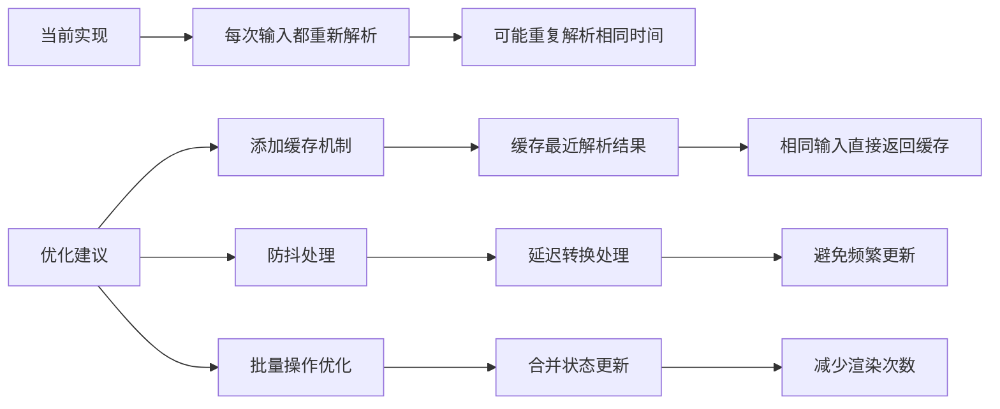
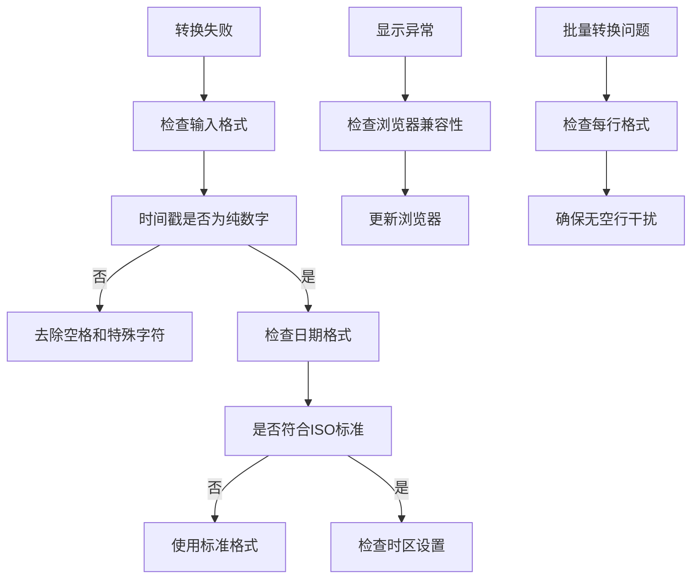

# 时间戳转换工具

<cite>
**本文档引用的文件**   
- [TimestampConverter.tsx](file://src/components/TimestampConverter.tsx)
</cite>

## 目录
1. [简介](#简介)
2. [项目结构](#项目结构)
3. [核心功能分析](#核心功能分析)
4. [架构概览](#架构概览)
5. [详细组件分析](#详细组件分析)
6. [依赖分析](#依赖分析)
7. [性能考虑](#性能考虑)
8. [故障排除指南](#故障排除指南)
9. [结论](#结论)

## 简介
时间戳转换工具是办公工具套件中的一个核心功能模块，旨在为用户提供便捷的时间格式转换服务。该工具支持Unix时间戳（秒级/毫秒级）、ISO 8601标准时间、UTC时间与本地时间之间的相互转换。通过直观的用户界面，用户可以轻松地在不同时间格式之间进行转换，并支持批量处理和实时预览功能。本工具广泛应用于开发调试、日志分析、API接口测试等场景。

## 项目结构
该项目采用典型的React前端架构，基于Vite构建，使用TypeScript进行类型安全开发。组件化设计使得各功能模块高度解耦，便于维护和扩展。时间戳转换器作为独立组件位于`src/components`目录下，与其他工具组件并列。



**图示来源**
- [TimestampConverter.tsx](file://src/components/TimestampConverter.tsx)

## 核心功能分析
时间戳转换工具实现了多种时间格式之间的无缝转换，包括时间戳与可读日期之间的双向转换、不同时间格式的预设选择以及时区处理等功能。工具还提供了实时同步更新、格式预览、批量转换等高级特性，极大提升了用户体验。

**本节来源**
- [TimestampConverter.tsx](file://src/components/TimestampConverter.tsx#L0-L385)

## 架构概览
该组件采用函数式组件配合React Hooks的现代React开发模式，利用`useState`管理各种状态（如时间戳、日期时间、时间戳类型、日期格式、时区等），并通过`useEffect`实现定时更新当前时间的功能。整体架构清晰，逻辑分离良好。



**图示来源**
- [TimestampConverter.tsx](file://src/components/TimestampConverter.tsx#L0-L385)

## 详细组件分析
### 时间格式转换逻辑分析
时间戳转换器的核心在于其精确的时间解析与格式化能力，依赖JavaScript内置的`Date`对象进行底层操作。

#### 时间戳转日期实现
该功能通过`timestampToDate`函数实现，根据用户选择的时间戳类型（秒级或毫秒级）对输入的时间戳进行相应处理。



**图示来源**
- [TimestampConverter.tsx](file://src/components/TimestampConverter.tsx#L31-L40)

#### 日期转时间戳实现
该功能通过`dateToTimestamp`函数实现，将任意可被`Date`对象解析的日期字符串转换为时间戳。



**图示来源**
- [TimestampConverter.tsx](file://src/components/TimestampConverter.tsx#L42-L52)

#### 日期格式化机制
`formatDate`函数实现了灵活的日期格式化功能，支持自定义格式字符串。

```mermaid
classDiagram
class formatDate {
+formatDate(date : Date, format : string) : string
-year : string
-month : string
-day : string
-hours : string
-minutes : string
-seconds : string
-milliseconds : string
}
formatDate --> Date : "输入"
formatDate --> String : "输出"
note right of formatDate
支持的格式标记 :
YYYY - 四位年份
MM - 两位月份
DD - 两位日期
HH - 两位小时
mm - 两位分钟
ss - 两位秒数
SSS - 三位毫秒
end note
```

**图示来源**
- [TimestampConverter.tsx](file://src/components/TimestampConverter.tsx#L54-L68)

### UI界面设计分析
#### 双栏输入输出设计
组件采用双栏布局，左侧为时间戳输入，右侧为日期时间输入，实现双向自动同步。



**图示来源**
- [TimestampConverter.tsx](file://src/components/TimestampConverter.tsx#L88-L95)

#### 自动同步更新机制
通过事件处理器实现输入变化时的自动转换和状态更新。



**图示来源**
- [TimestampConverter.tsx](file://src/components/TimestampConverter.tsx#L88-L95)

#### 格式预览功能
组件提供实时格式预览功能，用户选择不同日期格式时，当前时间会立即以新格式显示。

```mermaid
flowchart TD
A[选择日期格式] --> B[setDateFormat]
B --> C[触发重新渲染]
C --> D[formatDate(currentTime, 新格式)]
D --> E[更新当前时间显示]
E --> F[用户看到格式变化]
```

**图示来源**
- [TimestampConverter.tsx](file://src/components/TimestampConverter.tsx#L240-L242)

### 时区处理逻辑分析
尽管组件提供了时区选择器，但当前实现中时区选择并未实际影响时间转换逻辑。

```mermaid
classDiagram
class 时区处理
时区处理 : -timezone : string
时区处理 : -setTimezone : function
时区处理 : +时区选择器UI
note right of 时区处理
当前状态 :
- 时区状态被正确管理
- 选择器正常工作
- 但未集成到转换逻辑中
- 所有转换基于浏览器本地时区
end note
```

**图示来源**
- [TimestampConverter.tsx](file://src/components/TimestampConverter.tsx#L258-L267)

## 依赖分析
该组件主要依赖Ant Design组件库提供UI元素，如Card、Input、Button、Select等。这些依赖确保了界面的一致性和专业性。

```mermaid
graph TD
A[TimestampConverter] --> B[Ant Design]
A --> C[React]
A --> D[React DOM]
B --> B1[Card]
B --> B2[Input]
B --> B3[Button]
B --> B4[Select]
B --> B5[Typography]
B --> B6[Table]
B --> B7[Message]
C --> C1[useState]
C --> C2[useEffect]
note right of A
无外部时间处理库依赖
完全基于原生JavaScript Date对象
end note
```

**图示来源**
- [TimestampConverter.tsx](file://src/components/TimestampConverter.tsx#L1-L5)

## 性能考虑
### 边界情况处理
组件对各种边界情况进行了妥善处理，确保了稳定性和用户体验。



**本节来源**
- [TimestampConverter.tsx](file://src/components/TimestampConverter.tsx#L33-L52)

### 性能优化建议
虽然当前实现已经较为高效，但仍有一些优化空间。



**本节来源**
- [TimestampConverter.tsx](file://src/components/TimestampConverter.tsx)

## 故障排除指南
### 常见问题及解决方案
当用户遇到转换问题时，可以参考以下解决方案。



**本节来源**
- [TimestampConverter.tsx](file://src/components/TimestampConverter.tsx)

## 结论
时间戳转换工具是一个功能完整、设计良好的前端组件，提供了丰富的时间格式转换功能。其核心优势在于简洁直观的用户界面、双向自动同步的交互设计以及对各种边界情况的妥善处理。尽管当前时区选择功能尚未完全集成到转换逻辑中，但整体架构为后续功能扩展留下了良好基础。建议未来版本中完善时区处理逻辑，以提供更准确的跨时区时间转换服务。