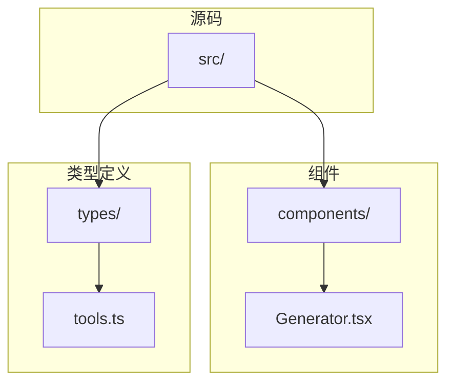
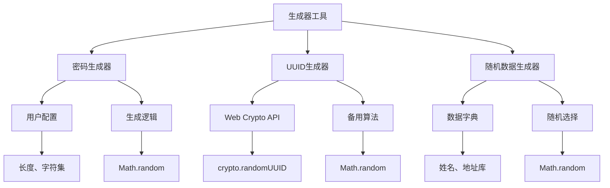
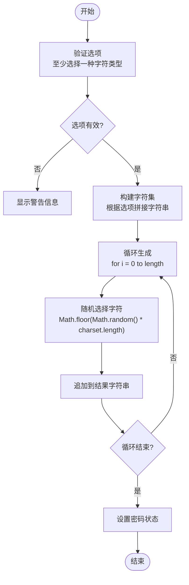
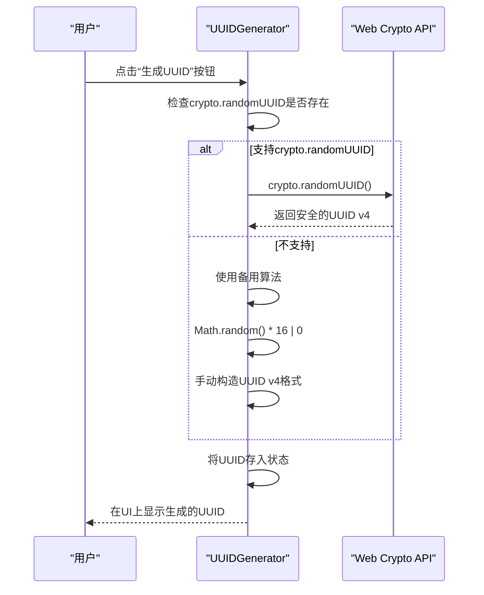
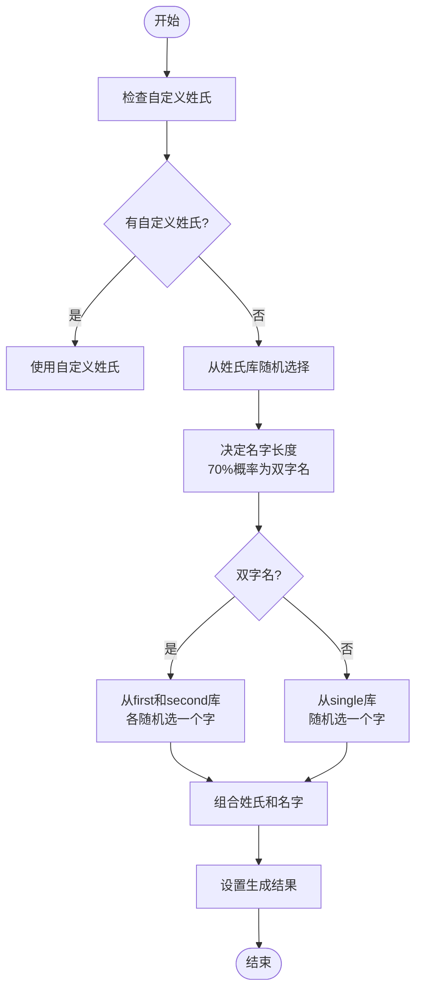
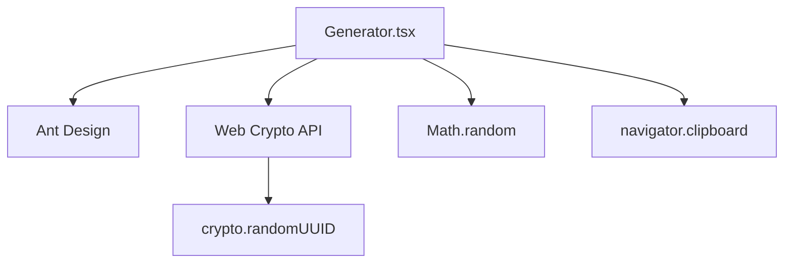

# 生成器工具

<cite>
**本文档中引用的文件**  
- [Generator.tsx](file://src\components\Generator.tsx) - *使用新版Ant Design Tabs items属性替换旧TabPane写法*
- [tools.ts](file://src\types\tools.ts)
</cite>

## 更新摘要
**已做更改**  
- 更新了架构概述和核心组件部分，以反映Ant Design Tabs从TabPane到items属性的重构
- 更新了相关图表以匹配新的代码结构
- 保持了文档其余部分的完整性，因为核心功能未发生变化

## 目录
1. [简介](#简介)
2. [项目结构](#项目结构)
3. [核心组件](#核心组件)
4. [架构概述](#架构概述)
5. [详细组件分析](#详细组件分析)
6. [依赖分析](#依赖分析)
7. [性能考虑](#性能考虑)
8. [故障排除指南](#故障排除指南)
9. [结论](#结论)

## 简介
本项目是一个多功能办公工具集合，其中`Generator.tsx`是核心组件之一，提供安全的字符串生成功能，包括随机密码、UUID、加密密钥以及模拟数据（如姓名、邮箱、电话、地址等）。该组件基于React和Ant Design构建，注重用户交互体验与生成结果的安全性。本文档将深入分析其密码学安全性实现、用户可配置选项、UUID标准符合性及安全最佳实践。

## 项目结构
项目采用典型的前端应用结构，`src/components`目录下存放所有功能组件，`Generator.tsx`位于其中，是“生成器”类工具的主入口。`src/types/tools.ts`定义了工具的类型接口，确保组件注册和管理的类型安全。

**图源**  
- [Generator.tsx](file://src\components\Generator.tsx)
- [tools.ts](file://src\types\tools.ts)

**本节来源**  
- [Generator.tsx](file://src\components\Generator.tsx)
- [tools.ts](file://src\types\tools.ts)

## 核心组件
`Generator.tsx`的核心功能由三个主要的React函数组件构成：`PasswordGenerator`、`UUIDGenerator`和`RandomDataGenerator`。它们分别负责密码、UUID和模拟数据的生成。这些组件通过`Tabs`的`items`属性进行组织，提供清晰的用户界面。

**本节来源**  
- [Generator.tsx](file://src\components\Generator.tsx)

## 架构概述
整个生成器工具的架构是模块化的，每个生成器都是一个独立的、状态管理良好的React组件。它们共享一些通用的UI元素，如输入框、按钮和复制功能，但各自拥有独立的生成逻辑。`Tabs`组件现在使用`items`属性来配置标签页，提高了代码的简洁性和一致性。

**图源**  
- [Generator.tsx](file://src\components\Generator.tsx)

## 详细组件分析

### 密码生成器分析
`PasswordGenerator`组件允许用户通过勾选复选框来选择包含大写字母、小写字母、数字和特殊符号的字符集，并通过滑块调整密码长度。

#### 生成逻辑流程图

**图源**  
- [Generator.tsx](file://src\components\Generator.tsx)

**本节来源**  
- [Generator.tsx](file://src\components\Generator.tsx)

### UUID生成器分析
`UUIDGenerator`组件实现了对RFC 4122标准版本4 UUID的生成。它优先使用现代浏览器提供的`crypto.randomUUID()` API，以确保密码学安全性。

#### 安全性实现序列图

**图源**  
- [Generator.tsx](file://src\components\Generator.tsx)

**本节来源**  
- [Generator.tsx](file://src\components\Generator.tsx)

### 随机数据生成器分析
`RandomDataGenerator`组件用于生成模拟的个人信息，如姓名、邮箱、电话和地址。它使用内置的中文姓氏、城市、街道等数据库进行随机组合。

#### 姓名生成流程图

**图源**  
- [Generator.tsx](file://src\components\Generator.tsx)

**本节来源**  
- [Generator.tsx](file://src\components\Generator.tsx)

## 依赖分析
`Generator.tsx`主要依赖于Ant Design组件库进行UI构建。对于密码学安全操作，它依赖于浏览器的Web Crypto API (`crypto.randomUUID`)。当该API不可用时，它会回退到`Math.random()`，这在安全性上是一个弱点。

**图源**  
- [Generator.tsx](file://src\components\Generator.tsx)

**本节来源**  
- [Generator.tsx](file://src\components\Generator.tsx)

## 性能考虑
该组件的性能表现良好。所有生成操作都是同步且计算量小的，不会造成界面卡顿。使用`Math.random()`虽然在密码学上不安全，但其性能远高于`crypto.getRandomValues`。对于UUID生成，优先使用`crypto.randomUUID`是一个良好的实践，因为它在现代浏览器中性能和安全性兼备。

## 故障排除指南
*   **问题：生成的密码或UUID无法复制到剪贴板。**
    *   **原因：** 浏览器权限问题或`navigator.clipboard` API不被支持。
    *   **解决方案：** 确保网站在安全上下文（HTTPS）中运行，并提示用户手动复制。

*   **问题：UUID生成器在旧版浏览器中生成的UUID不正确。**
    *   **原因：** 备用的`Math.random()`算法虽然遵循v4格式，但其随机性质量较低。
    *   **解决方案：** 建议用户升级到现代浏览器以获得最佳安全性和兼容性。

**本节来源**  
- [Generator.tsx](file://src\components\Generator.tsx)

## 结论
`Generator.tsx`实现了一个功能丰富的生成器工具。其在UUID生成上正确地优先使用了`crypto.randomUUID` API，符合安全最佳实践。然而，其核心的密码生成功能依赖于`Math.random()`，这存在被预测的风险，不适用于高安全场景。建议将密码生成逻辑重构为使用`crypto.getRandomValues`来填充字符数组，以确保真正的密码学安全性。此外，应添加“排除易混淆字符”等高级选项，并考虑在生成后短暂时间内自动清除剪贴板，以进一步提升安全性。