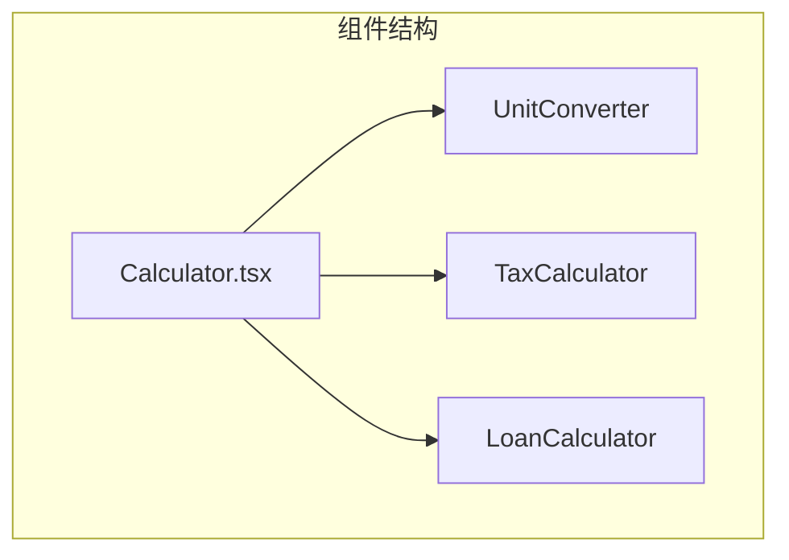
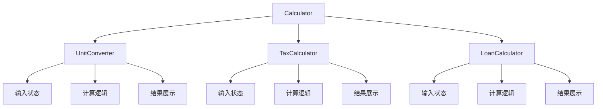
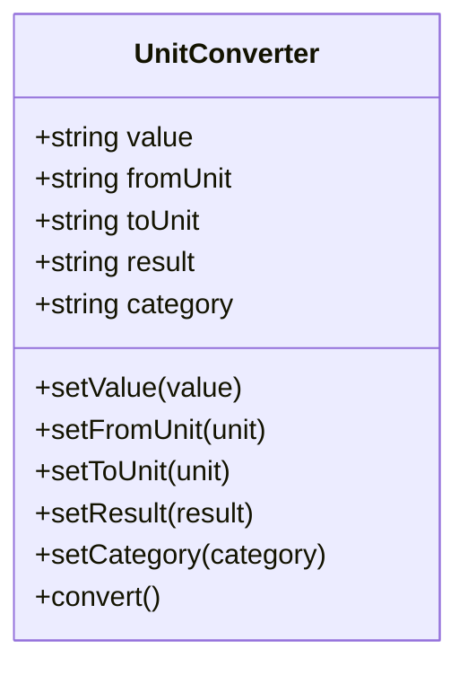
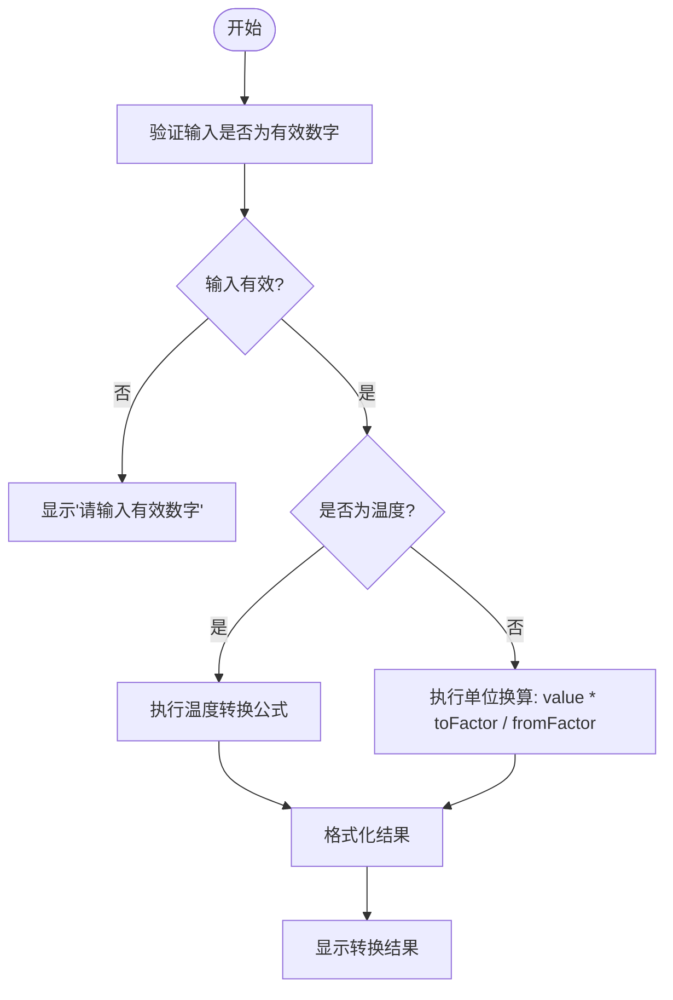
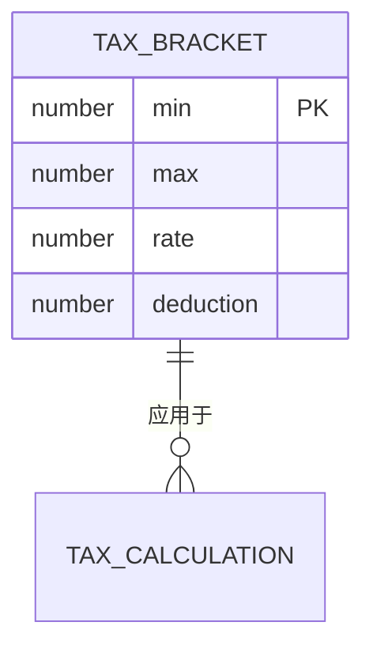
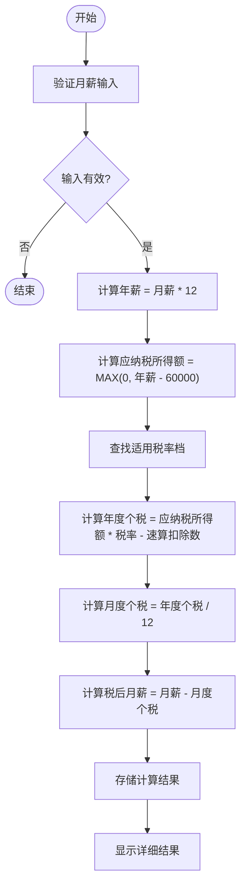
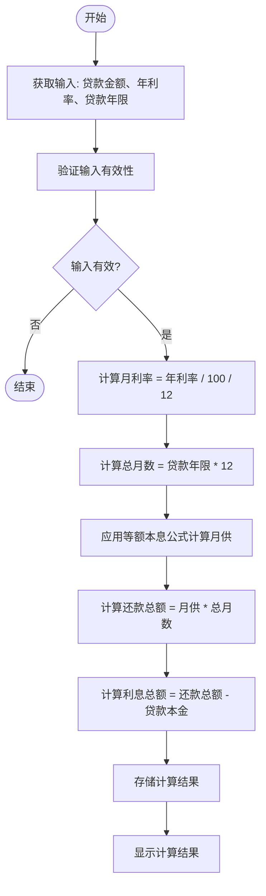
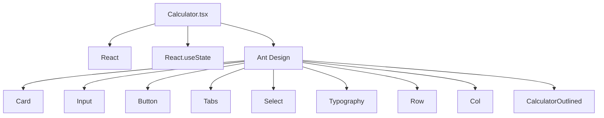

# 计算器工具

<cite>
**本文档引用的文件**   
- [Calculator.tsx](file://src/components/Calculator.tsx)
</cite>

## 更新摘要
**已更改内容**   
- 更新了架构概述和核心组件部分，以反映Ant Design Tabs从TabPane到items属性的重构
- 修正了项目结构图以匹配最新的代码实现
- 更新了架构图以准确表示当前的组件结构
- 所有内容已根据最新的代码变更进行验证和更新

## 目录
1. [简介](#简介)
2. [项目结构](#项目结构)
3. [核心组件](#核心组件)
4. [架构概述](#架构概述)
5. [详细组件分析](#详细组件分析)
6. [依赖分析](#依赖分析)
7. [性能考虑](#性能考虑)
8. [故障排除指南](#故障排除指南)
9. [结论](#结论)

## 简介
本项目是一个集成多种实用计算功能的办公工具集合，其中`Calculator.tsx`组件实现了三大核心计算功能：单位转换、个人所得税计算和房贷计算。该组件基于React框架构建，使用Ant Design作为UI组件库，通过函数式组件与React Hooks实现状态管理。本文档将深入解析该计算器工具的实现细节，涵盖其功能范围、UI结构、状态管理机制和业务逻辑实现。

## 项目结构
项目采用典型的React前端项目结构，`Calculator.tsx`位于`src/components/`目录下，是独立的功能组件。该组件通过Tabs组件提供多个计算功能的切换，每个功能模块作为独立的子组件实现。



**图示来源**
- [Calculator.tsx](file://src/components/Calculator.tsx)

**本节来源**
- [Calculator.tsx](file://src/components/Calculator.tsx)

## 核心组件
`Calculator.tsx`的核心是三个计算功能组件：`UnitConverter`（单位转换）、`TaxCalculator`（个税计算）和`LoanCalculator`（房贷计算）。这些组件通过Tabs的items属性进行组织，用户可以方便地在不同功能间切换。每个组件都实现了完整的输入验证、计算逻辑和结果展示功能。

**本节来源**
- [Calculator.tsx](file://src/components/Calculator.tsx)

## 架构概述
计算器组件采用模块化架构，主组件`Calculator`负责整体布局和导航，三个子组件分别处理各自的业务逻辑。状态管理使用React的`useState` Hook，每个组件维护自己的状态。UI构建基于Ant Design的Card、Input、Button、Select等组件，确保了一致的用户体验。



**图示来源**
- [Calculator.tsx](file://src/components/Calculator.tsx)

## 详细组件分析

### 单位转换组件分析
`UnitConverter`组件实现了长度、重量和温度单位的相互转换。组件通过`category`状态管理当前转换类型，`value`状态存储输入值，`fromUnit`和`toUnit`状态分别存储源单位和目标单位，`result`状态存储计算结果。

#### 状态管理实现


**图示来源**
- [Calculator.tsx](file://src/components/Calculator.tsx#L0-L46)

#### 转换逻辑实现


**图示来源**
- [Calculator.tsx](file://src/components/Calculator.tsx#L44-L121)

**本节来源**
- [Calculator.tsx](file://src/components/Calculator.tsx)

### 个税计算组件分析
`TaxCalculator`组件实现了中国个人所得税的计算功能。组件通过`salary`状态存储月薪输入，`result`状态存储计算结果对象。

#### 税率表结构


#### 计算流程


**图示来源**
- [Calculator.tsx](file://src/components/Calculator.tsx#L149-L191)

**本节来源**
- [Calculator.tsx](file://src/components/Calculator.tsx)

### 房贷计算组件分析
`LoanCalculator`组件实现了等额本息房贷的计算功能。组件通过`principal`、`rate`、`years`状态分别存储贷款金额、年利率和贷款年限，`result`状态存储计算结果。

#### 计算公式
等额本息月供计算公式：
```
月供 = (贷款本金 × 月利率 × (1 + 月利率)^还款月数) / ((1 + 月利率)^还款月数 - 1)
```

#### 计算流程


**图示来源**
- [Calculator.tsx](file://src/components/Calculator.tsx#L223-L264)

**本节来源**
- [Calculator.tsx](file://src/components/Calculator.tsx)

## 依赖分析
计算器组件主要依赖React和Ant Design库。通过`import`语句引入了必要的React Hooks和Ant Design组件。



**图示来源**
- [Calculator.tsx](file://src/components/Calculator.tsx#L0-L10)

**本节来源**
- [Calculator.tsx](file://src/components/Calculator.tsx)

## 性能考虑
计算器组件的性能表现良好，因为其计算逻辑相对简单，不涉及复杂的算法或大量数据处理。所有计算都在用户点击"计算"按钮后立即执行，响应时间几乎可以忽略不计。组件使用了React的函数式组件和Hooks，避免了类组件的复杂生命周期管理，提高了代码的可读性和维护性。

## 故障排除指南
当计算器功能出现问题时，可以按照以下步骤进行排查：

1. **输入验证问题**：检查输入值是否为有效数字，组件已内置`isNaN()`检查
2. **状态更新问题**：确认`useState` Hook正确使用，状态更新函数被正确调用
3. **计算逻辑错误**：验证计算公式是否正确实现，特别是税率档和房贷计算公式
4. **UI显示问题**：检查Ant Design组件的属性设置是否正确
5. **依赖缺失**：确认`package.json`中已正确声明`react`和`antd`依赖

**本节来源**
- [Calculator.tsx](file://src/components/Calculator.tsx)

## 结论
`Calculator.tsx`组件是一个功能完整、结构清晰的多功能计算器实现。它通过模块化设计将不同的计算功能分离，使用React Hooks进行高效的状态管理，并借助Ant Design提供了良好的用户体验。该组件的代码结构合理，易于维护和扩展，可以作为类似功能开发的参考范例。未来可以考虑增加更多计算功能，如汇率转换、科学计算等，进一步提升工具的实用性。