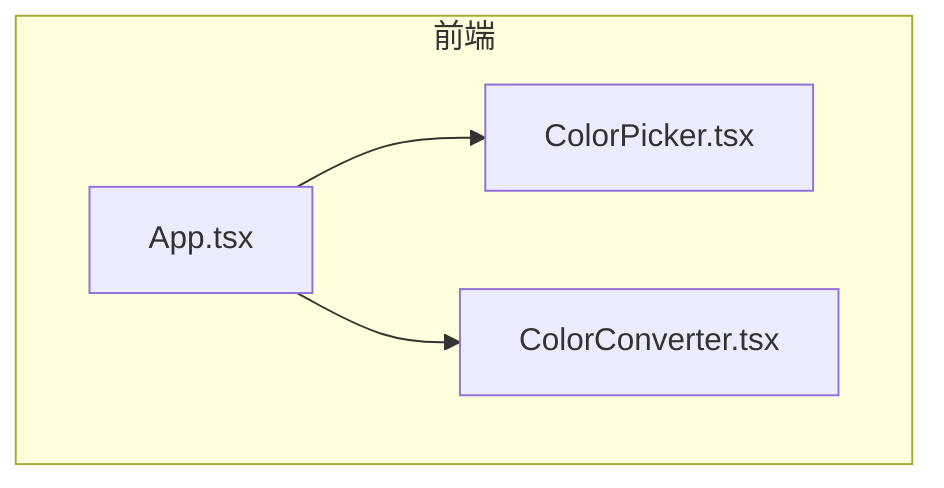
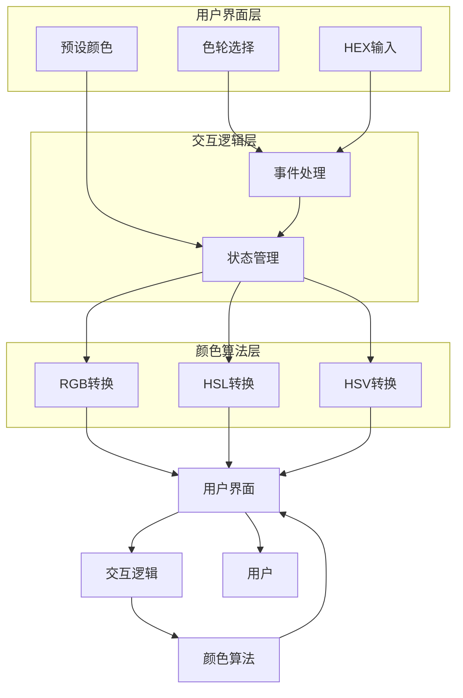
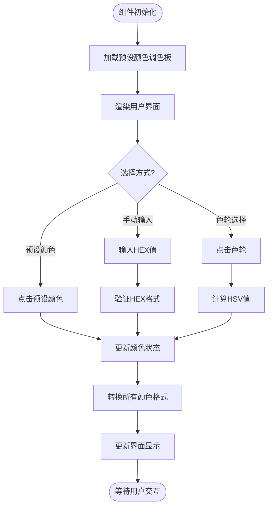
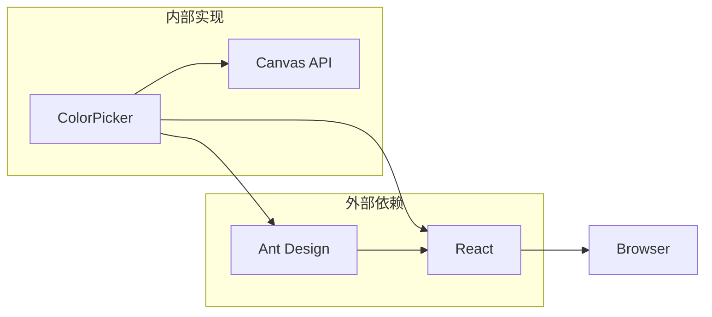

# 颜色取值器

<cite>
**本文档中引用的文件**   
- [ColorPicker.tsx](file://src/components/ColorPicker.tsx)
- [App.tsx](file://src/App.tsx)
</cite>

## 目录
1. [项目结构](#项目结构)
2. [核心组件](#核心组件)
3. [架构概述](#架构概述)
4. [详细组件分析](#详细组件分析)
5. [依赖分析](#依赖分析)

## 项目结构

项目采用功能模块化组织方式，将不同工具功能分离到独立组件中。`ColorPicker` 组件位于 `src/components/ColorPicker.tsx`，是办公工具套件中的一个独立功能模块。该组件通过 `App.tsx` 中的路由系统集成到主应用中，用户可通过侧边栏菜单访问。



**图源**
- [App.tsx](file://src/App.tsx#L38)
- [ColorPicker.tsx](file://src/components/ColorPicker.tsx#L1)

**本节来源**
- [App.tsx](file://src/App.tsx#L38)
- [ColorPicker.tsx](file://src/components/ColorPicker.tsx#L1)

## 核心组件

`ColorPicker` 组件实现了完整的颜色选择功能，支持多种颜色选择方式。组件使用 React 函数式组件和 Hooks 构建，通过 `useState` 管理颜色状态，`useRef` 引用 Canvas 元素，`useCallback` 优化性能。组件主要功能包括预设颜色选择、色轮选择、HEX 值手动输入等。

**本节来源**
- [ColorPicker.tsx](file://src/components/ColorPicker.tsx#L1-L30)

## 架构概述

颜色取值器采用分层架构设计，包含用户界面层、交互逻辑层和颜色算法层。用户界面层提供多种颜色选择方式，交互逻辑层处理用户操作并更新状态，颜色算法层负责颜色空间转换计算。



**图源**
- [ColorPicker.tsx](file://src/components/ColorPicker.tsx#L1-L707)

## 详细组件分析

### 颜色取值器分析

`ColorPicker` 组件提供了丰富的颜色选择功能，支持多种交互方式。用户可以通过点击预设颜色、使用色轮或手动输入 HEX 值来选择颜色。组件实时显示所选颜色的各种格式表示，并提供复制功能。

#### 功能实现分析


**图源**
- [ColorPicker.tsx](file://src/components/ColorPicker.tsx#L1-L707)

#### 颜色空间转换算法
```mermaid
classDiagram
class ColorConverter {
+hexToRgb(hex) {r, g, b}
+rgbToHsl(r, g, b) {h, s, l}
+rgbToHsv(r, g, b) {h, s, v}
+hsvToRgb(h, s, v) {r, g, b}
+rgbToHex(r, g, b) hex
}
class ColorPicker {
-selectedColor string
-colorInfo ColorInfo
-hsvValues {h, s, v}
+handleColorChange(color)
+handleHsvChange(newHsv)
+updateColorInfo(color)
+drawColorWheel()
+drawSaturationBrightness()
}
class ColorInfo {
+hex string
+rgb {r, g, b}
+hsl {h, s, l}
+hsv {h, s, v}
}
ColorPicker --> ColorConverter : "使用"
ColorPicker --> ColorInfo : "包含"
```

**图源**
- [ColorPicker.tsx](file://src/components/ColorPicker.tsx#L65-L168)

**本节来源**
- [ColorPicker.tsx](file://src/components/ColorPicker.tsx#L1-L707)

## 依赖分析

颜色取值器组件依赖 Ant Design UI 组件库提供基础界面元素，如按钮、输入框、卡片等。组件内部实现了完整的颜色转换算法，不依赖外部颜色处理库。通过 `useCallback` 和 `useRef` 等 React Hooks 优化性能和管理 DOM 引用。



**图源**
- [ColorPicker.tsx](file://src/components/ColorPicker.tsx#L1)
- [package.json](file://package.json)

**本节来源**
- [ColorPicker.tsx](file://src/components/ColorPicker.tsx#L1)
- [package.json](file://package.json)