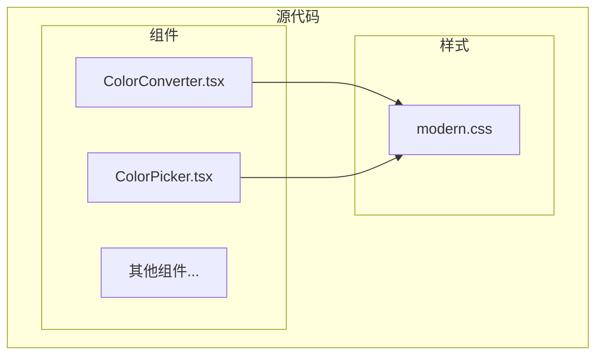
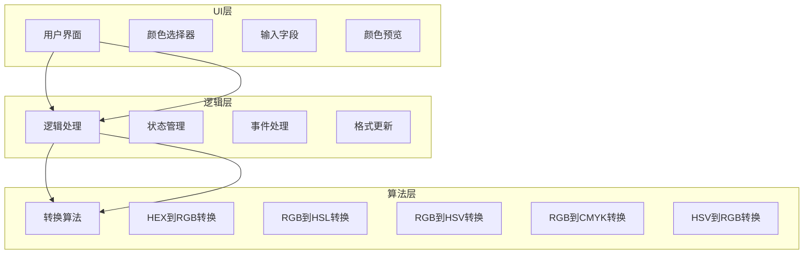
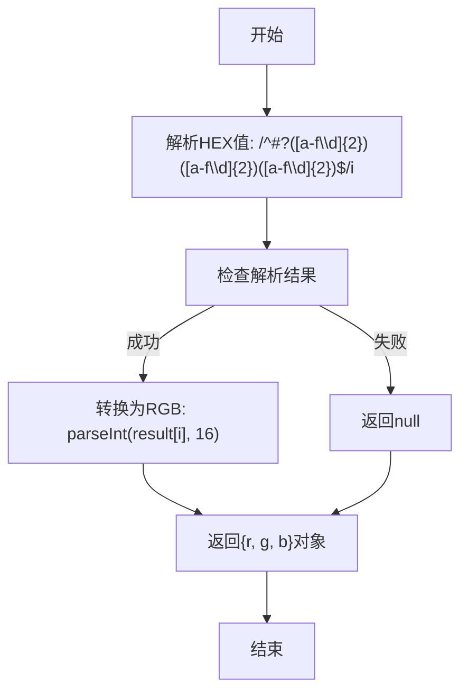
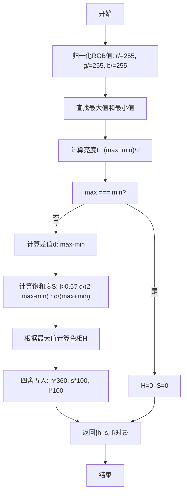
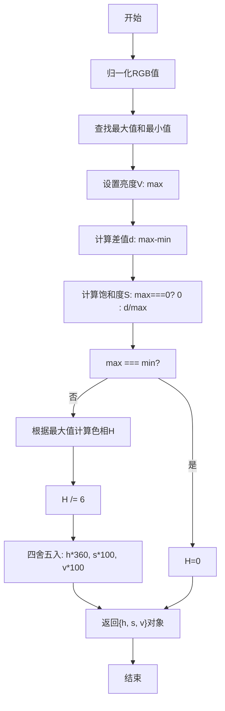
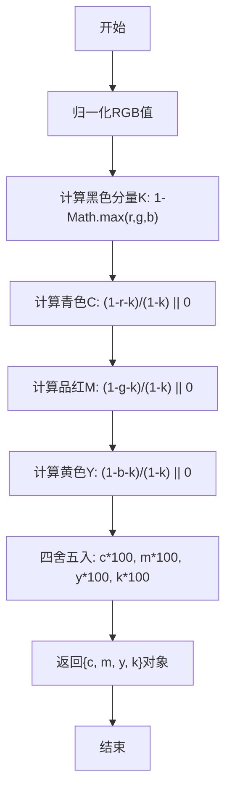
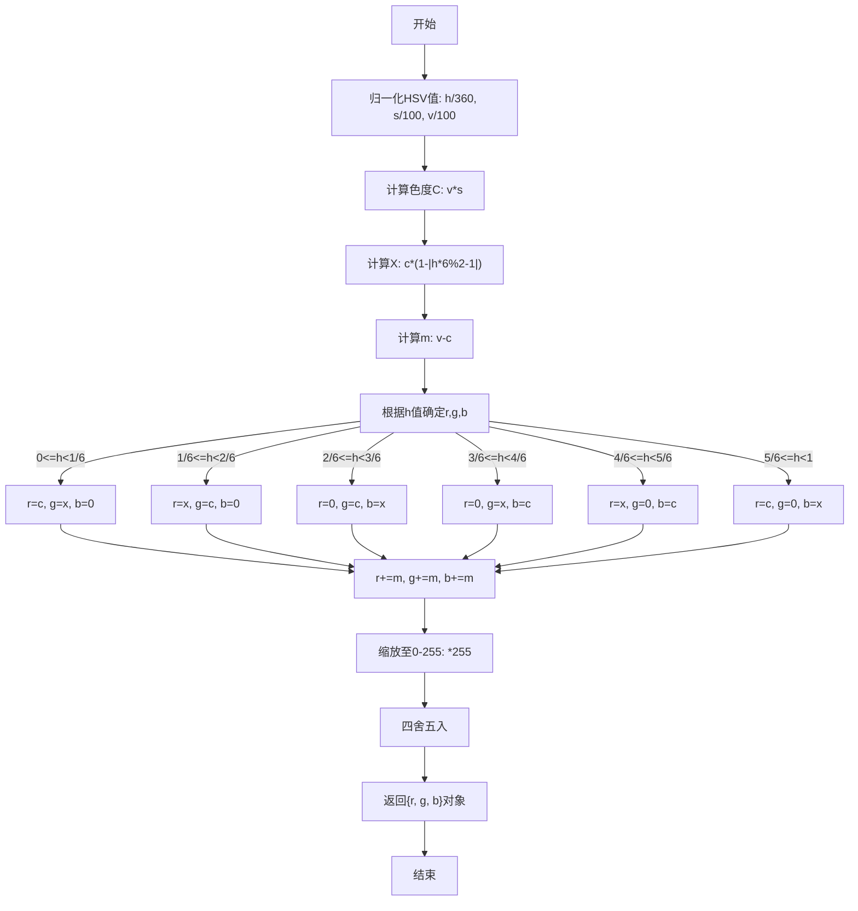
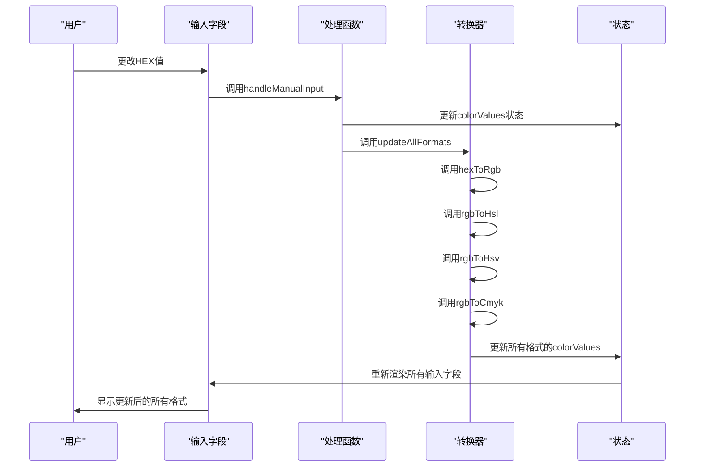
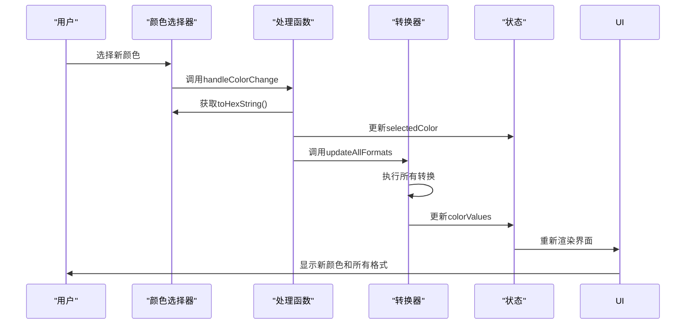
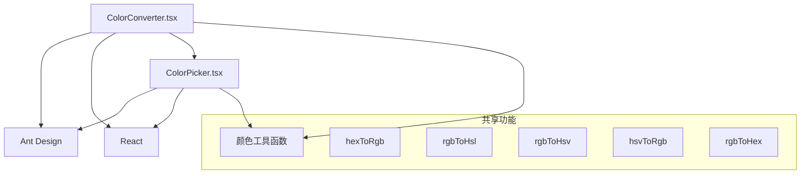

# 颜色转换工具

<cite>
**本文档中引用的文件**   
- [ColorConverter.tsx](file://src/components/ColorConverter.tsx)
- [ColorPicker.tsx](file://src/components/ColorPicker.tsx)
</cite>

## 目录
1. [项目结构](#项目结构)
2. [核心组件](#核心组件)
3. [架构概述](#架构概述)
4. [详细组件分析](#详细组件分析)
5. [依赖分析](#依赖分析)
6. [性能考虑](#性能考虑)
7. [故障排除指南](#故障排除指南)
8. [结论](#结论)

## 项目结构

项目结构遵循功能模块化组织方式，将不同工具组件分离到`src/components`目录下。颜色转换功能主要由`ColorConverter.tsx`和`ColorPicker.tsx`两个文件实现，它们位于组件目录中，与其他工具组件并列。



**图示来源**
- [ColorConverter.tsx](file://src/components/ColorConverter.tsx)
- [ColorPicker.tsx](file://src/components/ColorPicker.tsx)

**本节来源**
- [ColorConverter.tsx](file://src/components/ColorConverter.tsx)
- [ColorPicker.tsx](file://src/components/ColorPicker.tsx)

## 核心组件

`ColorConverter.tsx`是颜色转换工具的核心实现文件，提供了在HEX、RGB、HSL、HSV和CMYK等颜色模式之间转换的功能。该组件使用React函数式组件和Hooks实现状态管理和副作用处理。

组件包含以下主要功能：
- 颜色格式转换算法
- 多格式同步显示与编辑
- 颜色预览功能
- 剪贴板复制功能
- 随机颜色生成功能

```typescript
const ColorConverter: React.FC = () => {
  const [colorValues, setColorValues] = useState<ColorValues>({
    hex: '#FF0000',
    rgb: 'rgb(255, 0, 0)',
    hsl: 'hsl(0, 100%, 50%)',
    hsv: 'hsv(0, 100%, 100%)',
    cmyk: 'cmyk(0%, 100%, 100%, 0%)'
  });
  const [selectedColor, setSelectedColor] = useState<string>('#FF0000');
  // ...
};
```

**本节来源**
- [ColorConverter.tsx](file://src/components/ColorConverter.tsx#L1-L50)

## 架构概述

颜色转换工具采用基于React的组件化架构，使用Ant Design UI库构建用户界面。系统架构分为三个主要层次：UI层、逻辑层和算法层。



**图示来源**
- [ColorConverter.tsx](file://src/components/ColorConverter.tsx)
- [ColorPicker.tsx](file://src/components/ColorPicker.tsx)

## 详细组件分析

### 颜色转换算法分析

颜色转换工具实现了多种颜色空间之间的转换算法，包括HEX、RGB、HSL、HSV和CMYK格式。

#### HEX到RGB转换
HEX到RGB的转换通过正则表达式解析十六进制颜色值，然后将每个颜色分量从十六进制转换为十进制。



**图示来源**
- [ColorConverter.tsx](file://src/components/ColorConverter.tsx#L45-L55)

**本节来源**
- [ColorConverter.tsx](file://src/components/ColorConverter.tsx#L45-L55)

#### RGB到HSL转换
RGB到HSL的转换涉及归一化处理和极坐标变换。算法首先将RGB值归一化到[0,1]范围，然后计算亮度(L)、饱和度(S)和色相(H)。



**图示来源**
- [ColorConverter.tsx](file://src/components/ColorConverter.tsx#L57-L78)

**本节来源**
- [ColorConverter.tsx](file://src/components/ColorConverter.tsx#L57-L78)

#### RGB到HSV转换
RGB到HSV的转换类似于HSL转换，但使用不同的饱和度和亮度计算方法。



**图示来源**
- [ColorConverter.tsx](file://src/components/ColorConverter.tsx#L80-L101)

**本节来源**
- [ColorConverter.tsx](file://src/components/ColorConverter.tsx#L80-L101)

#### RGB到CMYK转换
RGB到CMYK的转换使用印刷色彩模型的数学公式。



**图示来源**
- [ColorConverter.tsx](file://src/components/ColorConverter.tsx#L103-L115)

**本节来源**
- [ColorConverter.tsx](file://src/components/ColorConverter.tsx#L103-L115)

#### HSV到RGB转换
HSV到RGB的转换是RGB到HSV转换的逆过程，使用圆柱坐标系到笛卡尔坐标系的变换。



**图示来源**
- [ColorPicker.tsx](file://src/components/ColorPicker.tsx#L122-L144)

**本节来源**
- [ColorPicker.tsx](file://src/components/ColorPicker.tsx#L122-L144)

### UI设计与交互分析

颜色转换工具的UI设计支持多格式同步显示与编辑，当任一输入字段更改时自动更新其他格式。

#### 状态管理流程


**图示来源**
- [ColorConverter.tsx](file://src/components/ColorConverter.tsx#L133-L178)

**本节来源**
- [ColorConverter.tsx](file://src/components/ColorConverter.tsx#L133-L178)

#### 颜色选择器交互


**图示来源**
- [ColorConverter.tsx](file://src/components/ColorConverter.tsx#L125-L131)

**本节来源**
- [ColorConverter.tsx](file://src/components/ColorConverter.tsx#L125-L131)

## 依赖分析

颜色转换工具主要依赖Ant Design UI库和React框架。组件之间通过共享的颜色转换算法实现功能复用。



**图示来源**
- [ColorConverter.tsx](file://src/components/ColorConverter.tsx)
- [ColorPicker.tsx](file://src/components/ColorPicker.tsx)

**本节来源**
- [ColorConverter.tsx](file://src/components/ColorConverter.tsx)
- [ColorPicker.tsx](file://src/components/ColorPicker.tsx)

## 性能考虑

颜色转换工具的性能主要受以下因素影响：

1. **算法复杂度**：所有颜色转换算法的时间复杂度均为O(1)，因为它们只涉及固定数量的数学运算。
2. **状态更新频率**：每次颜色更改都会触发所有格式的重新计算和UI重新渲染。
3. **精度控制**：使用Math.round()进行四舍五入，确保显示值的整洁性，但可能导致微小的精度损失。

优化建议：
- 对频繁调用的转换函数添加记忆化缓存
- 使用防抖技术处理手动输入，避免频繁重新计算
- 在大规模批量转换场景中，考虑使用Web Worker进行后台计算

## 故障排除指南

### 常见问题及解决方案

**问题：HEX值输入无效**
- **原因**：输入的HEX值格式不正确
- **解决方案**：确保输入以#开头，后跟6个十六进制字符（0-9, A-F）

**问题：颜色转换结果不准确**
- **原因**：舍入误差累积
- **解决方案**：检查转换算法中的四舍五入时机，考虑在最终显示时才进行四舍五入

**问题：UI未及时更新**
- **原因**：状态更新未正确触发
- **解决方案**：检查useState和useEffect的使用，确保依赖数组正确

### 调试技巧
1. 在关键转换函数中添加console.log输出中间值
2. 使用React DevTools检查组件状态变化
3. 验证输入值的正则表达式模式是否正确

**本节来源**
- [ColorConverter.tsx](file://src/components/ColorConverter.tsx)
- [ColorPicker.tsx](file://src/components/ColorPicker.tsx)

## 结论

颜色转换工具实现了多种颜色空间之间的精确转换，包括HEX、RGB、HSL、HSV和CMYK格式。核心算法基于标准的颜色空间转换数学公式，通过归一化处理和极坐标变换实现准确的颜色表示。

UI设计支持多格式同步显示与编辑，当任一输入字段更改时自动更新其他格式，提供流畅的用户体验。组件使用React Hooks进行状态管理，代码结构清晰，易于维护。

扩展方向建议：
1. 支持Alpha通道透明度
2. 添加颜色对比度检测功能
3. 实现色盲模拟模式
4. 增加调色板生成功能
5. 支持更多颜色空间（如Lab、XYZ）

这些改进将进一步增强工具的实用性和专业性，满足更广泛用户的需求。