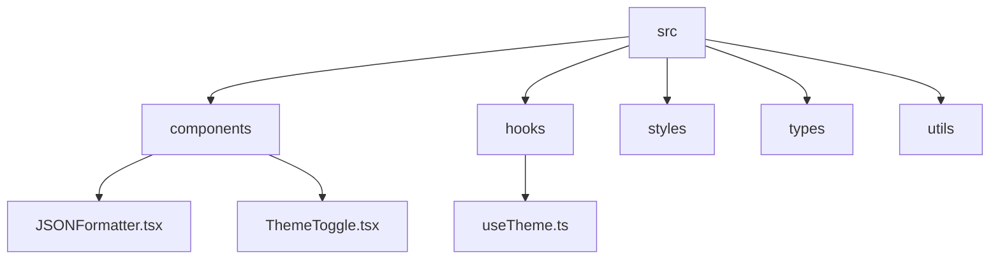
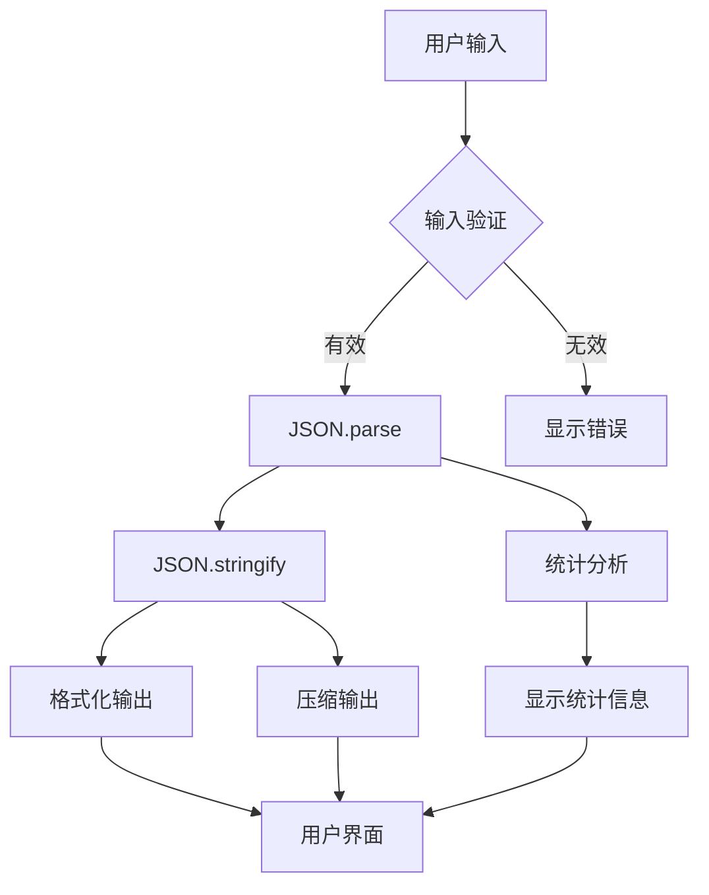
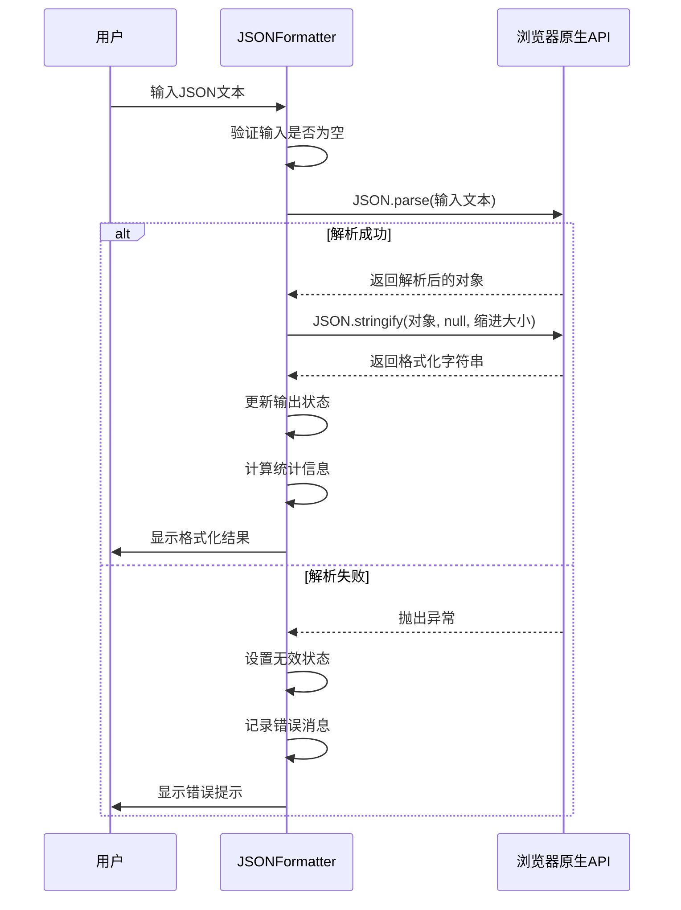
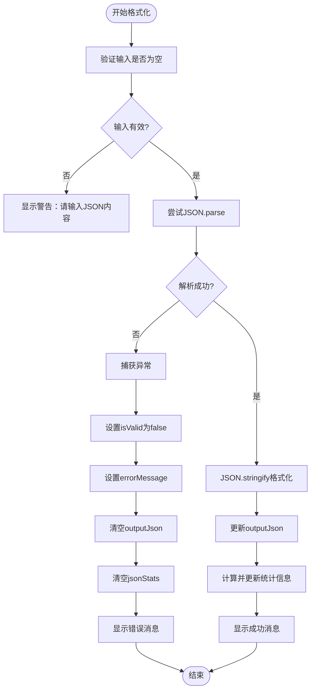
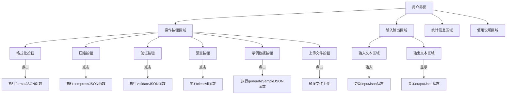
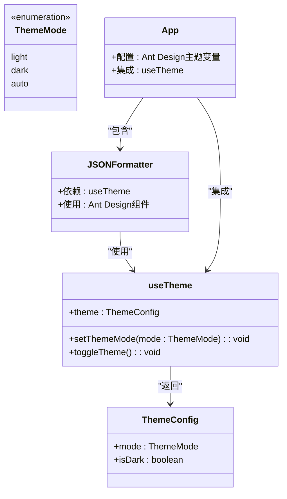
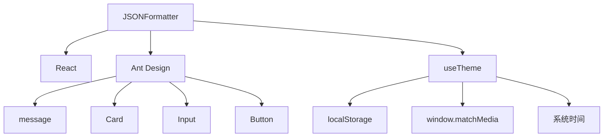

# JSON格式化工具

<cite>
**本文档中引用的文件**   
- [JSONFormatter.tsx](file://src/components/JSONFormatter.tsx)
- [useTheme.ts](file://src/hooks/useTheme.ts)
- [ThemeToggle.tsx](file://src/components/ThemeToggle.tsx)
- [App.tsx](file://src/App.tsx)
</cite>

## 目录
1. [简介](#简介)
2. [项目结构](#项目结构)
3. [核心组件](#核心组件)
4. [架构概述](#架构概述)
5. [详细组件分析](#详细组件分析)
6. [依赖分析](#依赖分析)
7. [性能考虑](#性能考虑)
8. [故障排除指南](#故障排除指南)
9. [结论](#结论)

## 简介
JSON格式化工具是一个功能完整的前端组件，用于处理JSON数据的格式化、压缩、验证和统计分析。该工具基于React和Ant Design构建，提供了直观的用户界面和丰富的功能集，包括文件上传/下载、内容复制、错误提示和示例数据生成。组件通过浏览器原生的`JSON.parse`和`JSON.stringify`方法实现核心功能，并结合Ant Design的消息提示系统提供用户友好的交互体验。

## 项目结构
该项目采用典型的React应用结构，将组件、钩子、样式和工具函数分别组织在不同的目录中。核心功能组件位于`src/components`目录下，而可复用的自定义钩子则存放在`src/hooks`目录中。这种组织方式遵循了功能分离的原则，提高了代码的可维护性和可扩展性。

**图示来源**
- [JSONFormatter.tsx](file://src/components/JSONFormatter.tsx)
- [useTheme.ts](file://src/hooks/useTheme.ts)
- [ThemeToggle.tsx](file://src/components/ThemeToggle.tsx)

**本节来源**
- [JSONFormatter.tsx](file://src/components/JSONFormatter.tsx)
- [useTheme.ts](file://src/hooks/useTheme.ts)

## 核心组件
JSON格式化工具的核心功能围绕JSON数据的解析、格式化和验证展开。组件使用React的`useState`钩子管理多个状态变量，包括输入内容、输出结果、缩进大小、有效性状态和错误消息。通过`JSON.parse`方法验证和解析输入的JSON字符串，利用`JSON.stringify`方法实现格式化和压缩功能。组件还实现了统计信息计算功能，能够分析JSON结构中的键、值、对象和数组数量。

**本节来源**
- [JSONFormatter.tsx](file://src/components/JSONFormatter.tsx#L0-L53)

## 架构概述
该组件采用函数式组件模式，结合React钩子实现状态管理和副作用处理。整体架构分为输入处理、核心处理和输出展示三个主要部分。输入处理部分负责接收用户输入的JSON文本；核心处理部分执行格式化、压缩和验证操作；输出展示部分呈现处理结果和相关统计信息。组件通过Ant Design的Card、Input、Button等UI组件构建用户界面，确保了良好的用户体验。

**图示来源**
- [JSONFormatter.tsx](file://src/components/JSONFormatter.tsx#L49-L97)

## 详细组件分析

### JSON格式化功能分析
JSON格式化工具的核心功能是将原始JSON字符串转换为易读的格式化版本。这一过程依赖于浏览器原生的`JSON.parse`和`JSON.stringify`方法，确保了处理的准确性和性能。

#### 格式化与压缩流程

**图示来源**
- [JSONFormatter.tsx](file://src/components/JSONFormatter.tsx#L49-L97)

#### 错误处理机制
组件实现了完善的错误处理机制，当用户输入非法JSON时，系统会捕获`JSON.parse`抛出的异常，并提供详细的错误信息反馈。

**图示来源**
- [JSONFormatter.tsx](file://src/components/JSONFormatter.tsx#L49-L97)

**本节来源**
- [JSONFormatter.tsx](file://src/components/JSONFormatter.tsx#L0-L53)
- [JSONFormatter.tsx](file://src/components/JSONFormatter.tsx#L49-L97)

### 用户界面交互设计
组件提供了丰富的用户界面交互功能，包括按钮操作、文本区域输入和结果显示。

#### UI交互流程

**图示来源**
- [JSONFormatter.tsx](file://src/components/JSONFormatter.tsx#L231-L272)

**本节来源**
- [JSONFormatter.tsx](file://src/components/JSONFormatter.tsx#L189-L235)

### 主题系统集成分析
JSON格式化工具通过应用级的主题系统实现了深色/浅色模式的切换，确保在不同环境下的可读性。

#### 主题集成实现

**图示来源**
- [useTheme.ts](file://src/hooks/useTheme.ts)
- [App.tsx](file://src/App.tsx)

**本节来源**
- [useTheme.ts](file://src/hooks/useTheme.ts#L0-L46)
- [ThemeToggle.tsx](file://src/components/ThemeToggle.tsx#L0-L45)

## 依赖分析
JSON格式化工具主要依赖于React框架和Ant Design UI库。通过`App.useApp()`获取消息提示功能，利用Ant Design的Card、Input、Button等组件构建用户界面。组件与主题系统的集成通过`useTheme`自定义钩子实现，该钩子管理应用的主题状态并响应系统偏好设置。

**图示来源**
- [JSONFormatter.tsx](file://src/components/JSONFormatter.tsx#L0-L53)
- [useTheme.ts](file://src/hooks/useTheme.ts#L0-L46)

**本节来源**
- [JSONFormatter.tsx](file://src/components/JSONFormatter.tsx#L0-L53)
- [useTheme.ts](file://src/hooks/useTheme.ts#L0-L46)

## 性能考虑
通过对代码的分析，当前版本的JSON格式化工具未实现虚拟滚动或懒加载等高级性能优化策略。对于大型JSON数据的处理，组件直接使用浏览器原生的`JSON.parse`和`JSON.stringify`方法，这些方法在处理大型数据时可能会导致界面卡顿。建议在未来的版本中考虑引入流式处理或分块处理机制来优化大型JSON文件的处理性能。

**本节来源**
- [JSONFormatter.tsx](file://src/components/JSONFormatter.tsx)

## 故障排除指南
当JSON格式化工具出现问题时，可以参考以下常见问题的解决方案：

**本节来源**
- [JSONFormatter.tsx](file://src/components/JSONFormatter.tsx#L307-L345)

### 常见问题及解决方案
1. **输入非法JSON时无错误提示**
   - 检查`isValid`和`errorMessage`状态变量是否正确更新
   - 确认`try-catch`块正确捕获`JSON.parse`异常

2. **格式化结果未显示**
   - 验证`outputJson`状态是否被正确设置
   - 检查`TextArea`组件的`value`属性绑定

3. **复制功能失效**
   - 确认浏览器支持`navigator.clipboard.writeText` API
   - 检查`copyToClipboard`函数的Promise处理

4. **文件上传无响应**
   - 验证文件输入元素的`id`与点击触发的元素是否匹配
   - 检查`FileReader`的`onload`事件处理

## 结论
JSON格式化工具是一个功能完善、用户友好的前端组件，通过浏览器原生API实现了JSON数据的格式化、压缩和验证功能。组件具有清晰的代码结构和良好的用户体验设计，集成了应用级的主题系统以支持深色/浅色模式。虽然当前版本在处理大型JSON数据时缺乏高级性能优化，但其基础架构为未来的功能扩展和性能改进提供了良好的基础。该工具在开发者调试API响应、配置文件校验等场景中具有广泛的应用价值。