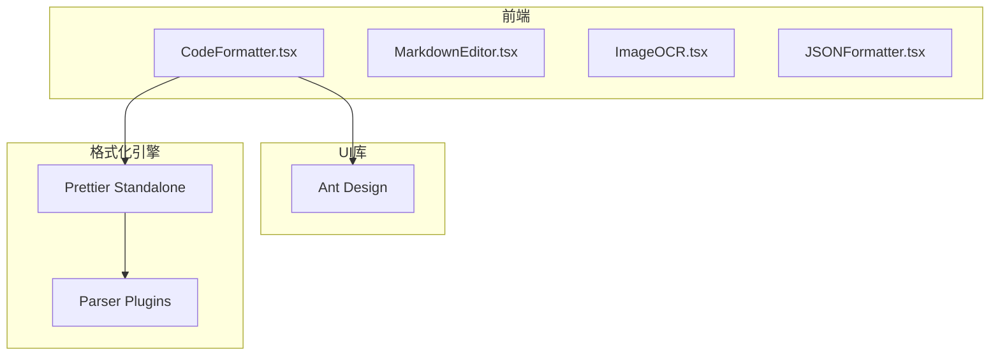
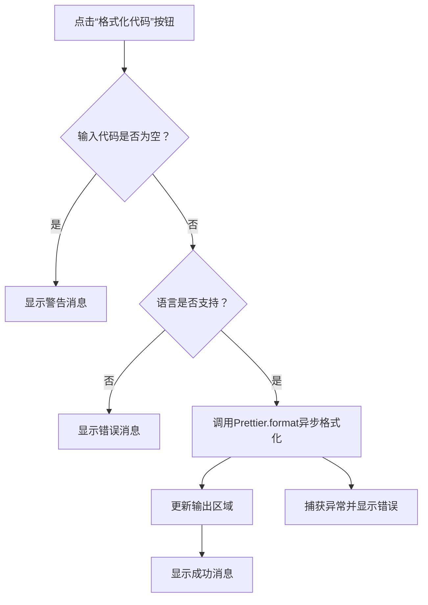

# 代码格式化工具

<cite>
**本文档中引用的文件**  
- [CodeFormatter.tsx](file://src/components/CodeFormatter.tsx) - *已更新：使用Ant Design Tabs items属性*
- [package.json](file://package.json) - *依赖配置*
- [ImageOCR.tsx](file://src/components/ImageOCR.tsx) - *Web Worker使用示例*
</cite>

## 更新摘要
**变更内容**  
- 更新了“核心组件分析”和“编辑器实现方式”部分，反映`Tabs`组件从`TabPane`子组件方式重构为`items`属性配置的变更
- 修正了现有文档中关于`Tabs`实现方式的过时描述
- 保持其他部分不变，因为相关提交仅涉及UI组件的实现方式变更，不影响核心功能逻辑
- 维护并更新了文档的源文件引用系统

## 目录
1. [项目结构](#项目结构)  
2. [核心组件分析](#核心组件分析)  
3. [Prettier集成与多语言支持](#prettier集成与多语言支持)  
4. [编辑器实现方式](#编辑器实现方式)  
5. [格式化按钮触发逻辑与异步执行](#格式化按钮触发逻辑与异步执行)  
6. [配置选项文档](#配置选项文档)  
7. [错误捕获机制](#错误捕获机制)  
8. [代码压缩功能](#代码压缩功能)  
9. [Web Worker应用分析](#web-worker应用分析)  

## 项目结构

该项目是一个多功能办公工具集，采用Vite + React + TypeScript技术栈构建，前端组件化设计清晰。项目结构按功能划分，`src/components`目录下包含多个独立工具组件，其中`CodeFormatter.tsx`负责代码格式化与压缩功能。



**图示来源**  
- [CodeFormatter.tsx](file://src/components/CodeFormatter.tsx#L1-L405)
- [package.json](file://package.json#L1-L77)

## 核心组件分析

`CodeFormatter` 是一个功能完整的代码格式化与压缩工具，提供用户友好的界面和丰富的配置选项。该组件基于React函数式组件开发，使用Ant Design构建UI，通过Prettier实现代码美化，并内置简易代码压缩功能。

主要功能模块包括：
- 多语言代码输入区域
- 可配置的格式化选项
- 格式化与压缩双模式切换
- 示例代码加载与清空功能
- 结果复制到剪贴板

该组件使用Ant Design的`Tabs`组件来组织“代码格式化”和“代码压缩”两个功能区域。根据最新的代码变更，`Tabs`的实现方式已从使用`TabPane`子组件的方式重构为使用`items`属性进行配置。

**组件来源**  
- [CodeFormatter.tsx](file://src/components/CodeFormatter.tsx#L1-L405)

## Prettier集成与多语言支持

### Prettier库的引入方式

`CodeFormatter.tsx`通过以下方式引入Prettier及其解析器插件：

```typescript
import prettier from 'prettier/standalone';
import parserBabel from 'prettier/parser-babel';
import parserHtml from 'prettier/parser-html';
import parserCss from 'prettier/parser-postcss';
import parserMarkdown from 'prettier/parser-markdown';
import parserTypescript from 'prettier/parser-typescript';
```

使用`prettier/standalone`版本可在浏览器环境中独立运行，无需Node.js环境，适合前端集成。

### 动态解析器配置策略

通过`getParserConfig`函数动态返回对应语言的解析器和插件配置，实现按需加载：

```typescript
const getParserConfig = (lang: string) => {
  const configs: { [key: string]: { parser: string; plugins: any[] } } = {
    javascript: { parser: 'babel', plugins: [parserBabel] },
    typescript: { parser: 'typescript', plugins: [parserTypescript] },
    html: { parser: 'html', plugins: [parserHtml] },
    css: { parser: 'css', plugins: [parserCss] },
    markdown: { parser: 'markdown', plugins: [parserMarkdown] },
  };
  return configs[lang];
};
```

此策略将Prettier核心库与各语言解析器作为独立模块引入，避免一次性加载所有解析器，有效减少初始包体积。

### 支持的语言类型

| 语言 | 解析器 | 插件模块 |
|------|--------|---------|
| JavaScript | babel | parser-babel |
| TypeScript | typescript | parser-typescript |
| HTML | html | parser-html |
| CSS | css | parser-postcss |
| Markdown | markdown | parser-markdown |

**代码来源**  
- [CodeFormatter.tsx](file://src/components/CodeFormatter.tsx#L41-L50)

## 编辑器实现方式

`CodeFormatter`未使用`contenteditable`或第三方高级编辑器（如Monaco Editor或CodeMirror），而是采用了Ant Design提供的`<TextArea>`组件作为代码输入区域。

```tsx
<TextArea
  value={inputCode}
  onChange={(e) => setInputCode(e.target.value)}
  placeholder="请输入要格式化的代码"
  rows={12}
  style={{ 
    fontFamily: 'Monaco, Menlo, "Ubuntu Mono", monospace',
    fontSize: '14px'
  }}
/>
```

优点：
- 轻量级，无需额外依赖
- 基本满足纯文本代码输入需求
- 配合等宽字体实现基础代码可读性

缺点：
- 无语法高亮
- 无自动补全
- 无错误提示

作为对比，项目中的`MarkdownEditor.tsx`也使用了相同的`TextArea`组件，表明该项目在多个文本处理工具中统一采用了轻量级编辑方案。

**组件来源**  
- [CodeFormatter.tsx](file://src/components/CodeFormatter.tsx#L177-L190)
- [MarkdownEditor.tsx](file://src/components/MarkdownEditor.tsx#L20-L21)

## 格式化按钮触发逻辑与异步执行

### 触发逻辑

格式化按钮通过`onClick={formatCode}`绑定事件处理器，其执行流程如下：



### 异步执行过程

`formatCode`方法为`async`函数，确保不会阻塞主线程：

```typescript
const formatCode = async () => {
  if (!inputCode.trim()) {
    message.warning('请输入要格式化的代码');
    return;
  }

  try {
    const config = getParserConfig(language);
    if (!config) {
      message.error('不支持的语言类型');
      return;
    }

    const formatted = await prettier.format(inputCode, {
      parser: config.parser,
      plugins: config.plugins,
      ...formatOptions
    });

    setOutputCode(formatted);
    message.success('代码格式化成功');
  } catch (error) {
    message.error('代码格式化失败: ' + (error instanceof Error ? error.message : '未知错误'));
    console.error('格式化错误:', error);
  }
};
```

尽管使用了`await`，但由于Prettier在浏览器中运行仍可能造成界面卡顿，理想情况下应结合Web Worker进一步优化。

**代码来源**  
- [CodeFormatter.tsx](file://src/components/CodeFormatter.tsx#L53-L78)

## 配置选项文档

`CodeFormatter`支持以下可调参数，通过`FormatOptions`接口定义：

```typescript
interface FormatOptions {
  tabWidth: number;
  useTabs: boolean;
  semi: boolean;
  singleQuote: boolean;
  trailingComma: 'none' | 'es5' | 'all';
  bracketSpacing: boolean;
  printWidth: number;
}
```

### 配置项说明

| 配置项 | 类型 | 默认值 | 说明 |
|--------|------|--------|------|
| **缩进大小 (tabWidth)** | number | 2 | 每个缩进级别的空格数 |
| **使用制表符 (useTabs)** | boolean | false | 是否使用Tab字符而非空格 |
| **分号 (semi)** | boolean | true | 是否在语句末尾添加分号 |
| **引号类型 (singleQuote)** | boolean | false | 是否使用单引号代替双引号 |
| **尾随逗号 (trailingComma)** | 'none' \| 'es5' \| 'all' | 'es5' | 对象/数组最后一个元素后是否添加逗号 |
| **括号间距 (bracketSpacing)** | boolean | true | 对象字面量中括号与内容之间是否加空格 |
| **行宽限制 (printWidth)** | number | 80 | 每行最大字符数，超过将换行 |

这些配置通过UI控件动态更新，例如：

```tsx
<Select 
  value={formatOptions.tabWidth} 
  onChange={(value) => setFormatOptions(prev => ({ ...prev, tabWidth: value }))}
>
  <Option value={2}>2 空格</Option>
  <Option value={4}>4 空格</Option>
  <Option value={8}>8 空格</Option>
</Select>
```

**代码来源**  
- [CodeFormatter.tsx](file://src/components/CodeFormatter.tsx#L15-L23)

## 错误捕获机制

`CodeFormatter`实现了完善的错误处理机制，确保用户操作的健壮性：

### 格式化错误处理

```typescript
try {
  const formatted = await prettier.format(inputCode, { ... });
  setOutputCode(formatted);
  message.success('代码格式化成功');
} catch (error) {
  message.error('代码格式化失败: ' + (error instanceof Error ? error.message : '未知错误'));
  console.error('格式化错误:', error);
}
```

- 使用`try-catch`捕获Prettier格式化异常
- 区分Error实例与其他类型错误
- 通过Ant Design的`message`组件向用户反馈
- 同时在控制台输出详细错误信息便于调试

### 输入验证

```typescript
if (!inputCode.trim()) {
  message.warning('请输入要格式化的代码');
  return;
}
```

在执行前检查输入有效性，避免无效操作。

### 语言支持验证

```typescript
const config = getParserConfig(language);
if (!config) {
  message.error('不支持的语言类型');
  return;
}
```

确保所选语言有对应的解析器配置。

**代码来源**  
- [CodeFormatter.tsx](file://src/components/CodeFormatter.tsx#L53-L78)

## 代码压缩功能

除格式化外，`CodeFormatter`还提供简易的代码压缩功能，通过`minifyCodeFunc`实现：

```typescript
const minifyCodeFunc = () => {
  // ...
  if (language === 'javascript' || language === 'typescript') {
    minified = inputCode
      .replace(/\/\*[\s\S]*?\*\//g, '') // 移除块注释
      .replace(/\/\/.*$/gm, '') // 移除行注释
      .replace(/\s+/g, ' ') // 压缩空白字符
      // ...更多替换
      .trim();
  }
  // ...其他语言处理
};
```

支持语言：
- JavaScript/TypeScript
- CSS/SCSS/Less
- HTML
- JSON（通过`JSON.stringify`压缩）

压缩率实时显示：
```tsx
<Text type="secondary">
  压缩率: {Math.round((1 - minifyCode.length / inputCode.length) * 100)}%
</Text>
```

**代码来源**  
- [CodeFormatter.tsx](file://src/components/CodeFormatter.tsx#L81-L137)

## Web Worker应用分析

### 当前状态

`CodeFormatter.tsx`**未使用Web Worker**。格式化操作直接在主线程中执行：

```typescript
const formatted = await prettier.format(inputCode, { ... });
```

对于大型代码文件，这可能导致界面卡顿或无响应。

### 对比分析：ImageOCR中的Web Worker使用

项目中`ImageOCR.tsx`正确使用了Web Worker进行OCR识别：

```typescript
const worker = await createWorker(language, 1, {
  logger: m => {
    if (m.status === 'recognizing text') {
      setProgress(Math.round(m.progress * 100));
    }
  }
});
const { data: { text } } = await worker.recognize(imageUrl);
await worker.terminate();
```

`createWorker`来自`tesseract.js`，封装了Web Worker通信机制，避免阻塞UI。

### 优化建议

为提升`CodeFormatter`性能，建议将Prettier格式化移至Web Worker：

```typescript
// worker.js
importScripts('prettier/standalone.js', 'prettier/parser-babel.js', ...);

self.onmessage = async function(e) {
  const { code, options } = e.data;
  const result = prettier.format(code, options);
  self.postMessage(result);
};
```

```typescript
// CodeFormatter.tsx
const formatCode = () => {
  const worker = new Worker('/formatWorker.js');
  worker.postMessage({ code: inputCode, options: { ... } });
  worker.onmessage = (e) => {
    setOutputCode(e.data);
    worker.terminate();
  };
};
```

此举可完全避免主线程阻塞，提升用户体验。

**代码来源**  
- [ImageOCR.tsx](file://src/components/ImageOCR.tsx#L39-L49)
- [CodeFormatter.tsx](file://src/components/CodeFormatter.tsx#L53-L78)