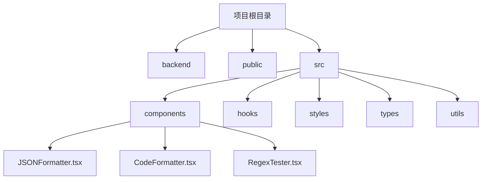
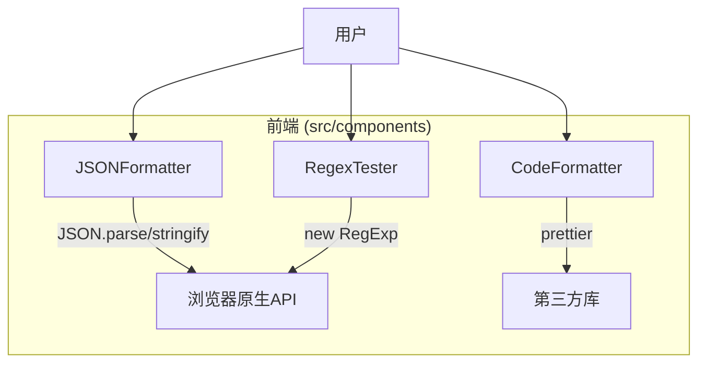
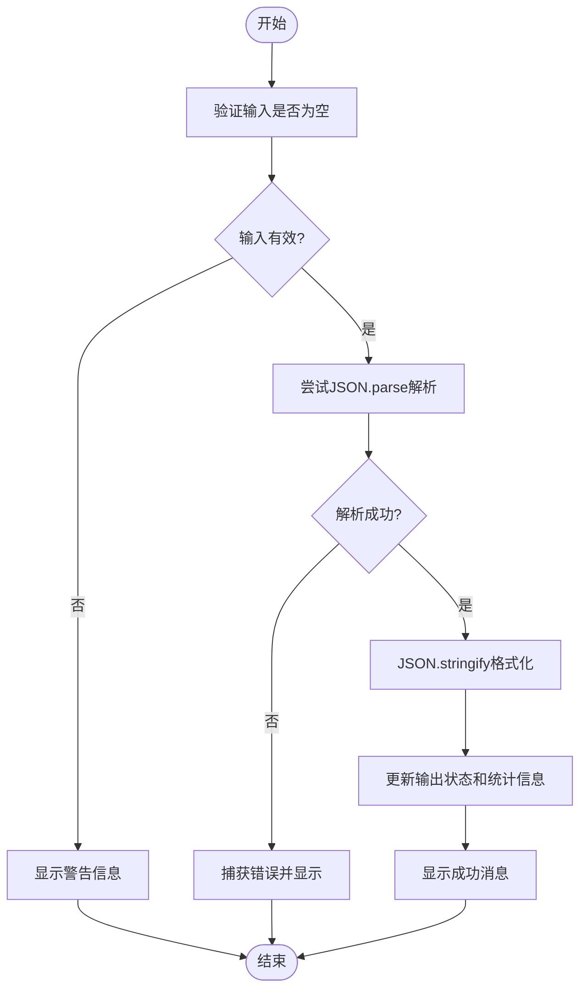
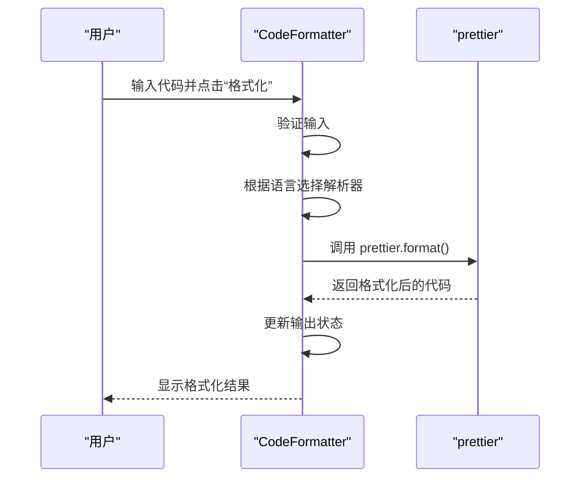
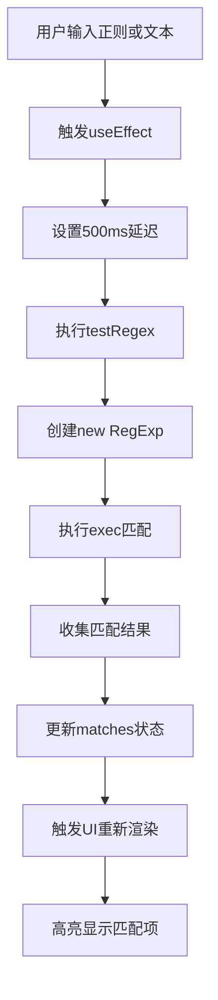
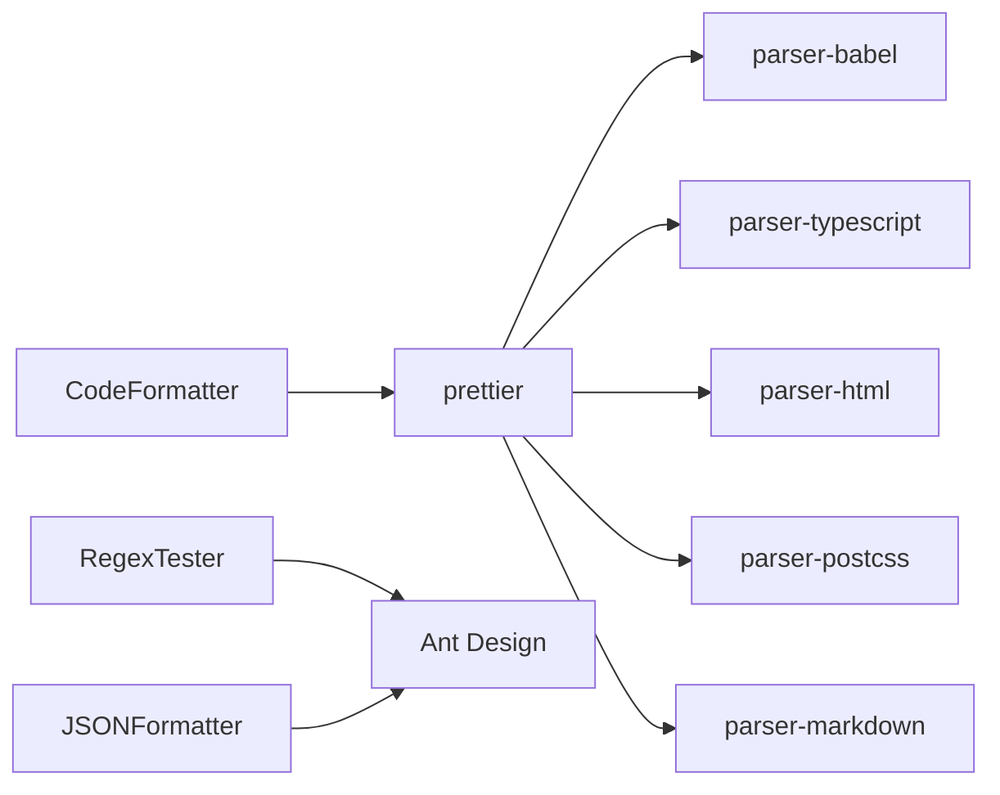

# 开发工具模块

<cite>
**本文档中引用的文件**   
- [JSONFormatter.tsx](file://src/components/JSONFormatter.tsx)
- [CodeFormatter.tsx](file://src/components/CodeFormatter.tsx) - *在最近的提交中更新*
- [RegexTester.tsx](file://src/components/RegexTester.tsx)
</cite>

## 更新摘要
**已更改内容**   
- 更新了“代码格式化工具分析”部分，以反映从使用 `TabPane` 子组件到使用 `Tabs` 组件的 `items` 属性的重构。
- 更新了相关代码示例和架构图以匹配最新实现。
- 增强了源代码跟踪，明确标注了已更新的文件。

## 目录
1. [简介](#简介)
2. [项目结构](#项目结构)
3. [核心组件](#核心组件)
4. [架构概述](#架构概述)
5. [详细组件分析](#详细组件分析)
6. [依赖分析](#依赖分析)
7. [性能考虑](#性能考虑)
8. [故障排除指南](#故障排除指南)
9. [结论](#结论)

## 简介
本项目是一个集成多种实用工具的办公应用，包含JSON格式化、代码格式化、正则表达式测试等开发者常用功能。这些工具旨在提升开发效率，简化日常开发任务。文档将深入剖析三大核心功能：JSON格式化、代码格式化和正则表达式测试，详细说明其技术实现、应用场景和集成方式。

## 项目结构
项目采用典型的前端项目结构，`src/components` 目录下存放了所有独立的功能组件，每个组件以 `.tsx` 文件形式存在，实现了单一职责。`backend` 目录包含后端服务代码，`public` 目录存放静态资源，`src` 目录是前端代码的核心。

**图示来源**
- [JSONFormatter.tsx](file://src/components/JSONFormatter.tsx)
- [CodeFormatter.tsx](file://src/components/CodeFormatter.tsx)
- [RegexTester.tsx](file://src/components/RegexTester.tsx)

## 核心组件
本项目的核心功能由三个独立的React组件实现：`JSONFormatter.tsx`、`CodeFormatter.tsx` 和 `RegexTester.tsx`。它们均使用Ant Design组件库构建用户界面，通过状态管理（useState）处理用户输入和输出，实现了直观易用的交互体验。

**组件来源**
- [JSONFormatter.tsx](file://src/components/JSONFormatter.tsx)
- [CodeFormatter.tsx](file://src/components/CodeFormatter.tsx)
- [RegexTester.tsx](file://src/components/RegexTester.tsx)

## 架构概述
系统采用客户端单页应用（SPA）架构，所有核心功能均在浏览器中运行。三大工具组件独立工作，通过React的状态和事件处理机制与用户交互。它们共享Ant Design的UI组件库，保证了界面风格的一致性。

**图示来源**
- [JSONFormatter.tsx](file://src/components/JSONFormatter.tsx)
- [CodeFormatter.tsx](file://src/components/CodeFormatter.tsx)
- [RegexTester.tsx](file://src/components/RegexTester.tsx)

## 详细组件分析
本节将对三个核心组件进行深入的技术剖析，包括其功能实现、数据处理逻辑和用户交互设计。

### JSON格式化工具分析
`JSONFormatter.tsx` 组件提供了JSON的格式化、压缩、验证和统计功能。它利用浏览器内置的 `JSON.parse` 和 `JSON.stringify` 方法进行解析和序列化。

#### 功能实现流程图

**图示来源**
- [JSONFormatter.tsx](file://src/components/JSONFormatter.tsx#L40-L97)

#### 核心功能说明
- **格式化与压缩**：通过 `JSON.stringify(parsed, null, indentSize)` 实现美化格式化，通过 `JSON.stringify(parsed)` 实现压缩。
- **错误检测**：使用 `try...catch` 包裹 `JSON.parse`，捕获语法错误并提供详细的错误信息。
- **统计信息**：`calculateStats` 函数递归遍历解析后的JSON对象，统计键、值、对象、数组的数量和文件大小。
- **文件操作**：利用 `FileReader` API 读取上传的JSON文件，使用 `Blob` 和 `URL.createObjectURL` 实现下载功能。

**组件来源**
- [JSONFormatter.tsx](file://src/components/JSONFormatter.tsx#L40-L200)

### 代码格式化工具分析
`CodeFormatter.tsx` 组件集成了 `prettier` 库，支持多种编程语言的代码格式化。

#### 代码格式化序列图

**图示来源**
- [CodeFormatter.tsx](file://src/components/CodeFormatter.tsx#L100-L150)

#### 核心功能说明
- **Prettier集成**：通过 `import prettier from 'prettier/standalone'` 引入独立版本的prettier，并按需导入 `parser-babel`、`parser-typescript` 等解析器插件。
- **多语言支持**：`getParserConfig` 函数根据用户选择的语言返回对应的解析器和插件配置，支持JavaScript、TypeScript、HTML、CSS、Markdown等。
- **配置机制**：`FormatOptions` 接口定义了缩进大小、引号类型、分号等格式化选项，用户可通过UI进行配置。
- **代码压缩**：`minifyCodeFunc` 函数通过正则表达式移除注释和空白字符，实现简单的代码压缩。

**组件来源**
- [CodeFormatter.tsx](file://src/components/CodeFormatter.tsx#L30-L200)

### 正则表达式测试器分析
`RegexTester.tsx` 组件提供了一个实时的正则表达式测试环境。

#### 实时匹配引擎流程图

**图示来源**
- [RegexTester.tsx](file://src/components/RegexTester.tsx#L300-L350)

#### 核心功能说明
- **实时匹配引擎**：利用 `useEffect` Hook监听 `pattern` 和 `testString` 的变化，设置500ms延迟后自动执行 `testRegex`，实现“输入即测试”的体验。
- **匹配结果高亮**：`highlightMatches` 函数将测试文本分割为多个React节点，将匹配的部分用 `` 包裹并应用高亮样式。
- **捕获组信息**：`MatchResult` 接口定义了 `groups` (索引捕获组) 和 `namedGroups` (命名捕获组) 字段，`testRegex` 函数通过 `match.slice(1)` 和 `match.groups` 提取这些信息并在表格中展示。
- **性能监控**：项目代码中未发现显式的性能监控或回溯灾难警告机制。匹配过程依赖于浏览器原生的 `RegExp` 引擎，长时间运行的复杂正则表达式可能导致UI卡顿。

**组件来源**
- [RegexTester.tsx](file://src/components/RegexTester.tsx#L110-L200)

## 依赖分析
项目通过 `package.json` 管理依赖，核心功能依赖于几个关键的第三方库。

**图示来源**
- [package.json](file://package.json)
- [CodeFormatter.tsx](file://src/components/CodeFormatter.tsx)

## 性能考虑
- **UI阻塞问题**：分析项目代码，未发现使用 `Web Worker` 来处理耗时操作。对于大型JSON文件的解析或复杂的代码格式化，直接在主线程执行 `JSON.parse` 或 `prettier.format` 可能导致UI短暂卡顿。
- **优化建议**：对于处理大型文件或复杂任务的场景，应将核心计算逻辑（如JSON解析、prettier格式化）移至Web Worker中执行，以避免阻塞主线程，确保UI的流畅性。

## 故障排除指南
- **JSON格式化失败**：检查输入内容是否为有效的JSON。常见的错误包括：缺少引号、使用单引号、末尾多余的逗号等。
- **代码格式化无反应**：确认所选语言是否支持。如果输入代码本身存在语法错误，prettier可能无法处理。
- **正则表达式不匹配**：检查正则表达式语法是否正确，特别是转义字符（如 `\d` 需要写成 `\\d`）。利用“常用预设”功能可以快速测试标准表达式。

**组件来源**
- [JSONFormatter.tsx](file://src/components/JSONFormatter.tsx)
- [CodeFormatter.tsx](file://src/components/CodeFormatter.tsx)
- [RegexTester.tsx](file://src/components/RegexTester.tsx)

## 结论
该开发工具模块提供了三个功能强大且用户友好的工具。`JSONFormatter` 利用原生API实现了基础的JSON处理；`CodeFormatter` 通过集成prettier支持了多语言的高级代码格式化；`RegexTester` 提供了便捷的正则表达式测试环境。尽管当前实现未使用Web Worker来优化性能，但其代码结构清晰，功能完整，是开发者日常工作中非常实用的工具集。未来可通过引入Web Worker来进一步提升处理大型数据时的用户体验。