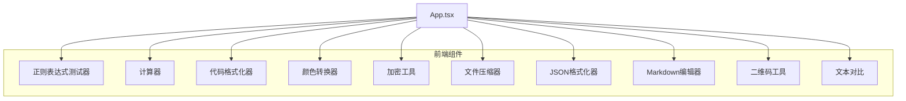
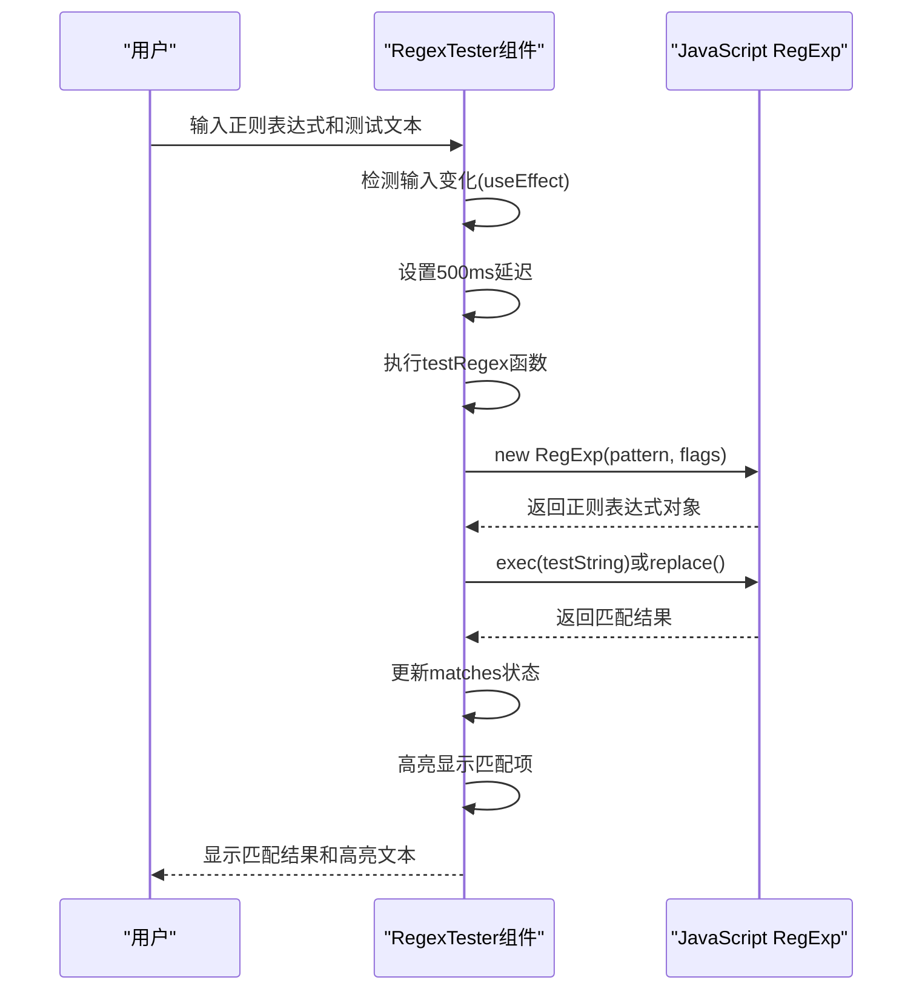
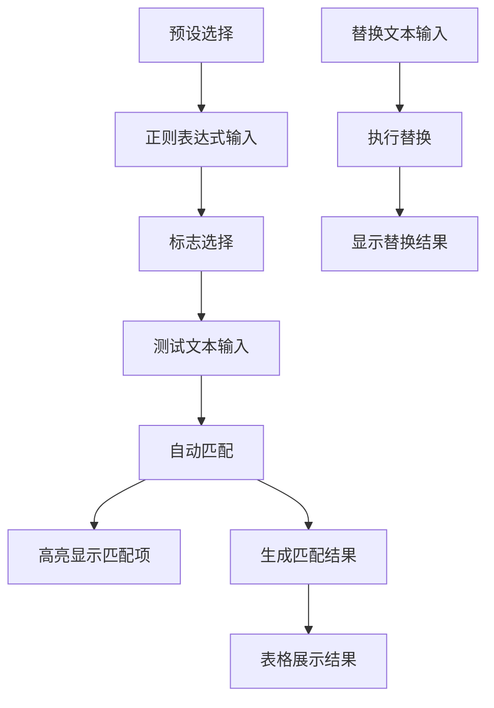
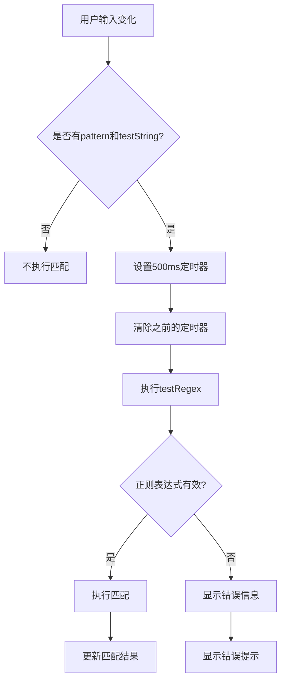
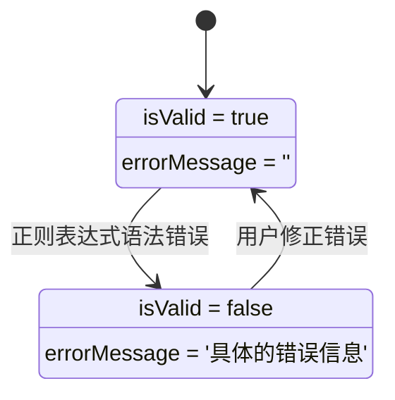
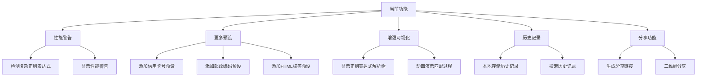

# 正则表达式测试工具

<cite>
**本文档引用的文件**  
- [RegexTester.tsx](file://src/components/RegexTester.tsx)
</cite>

## 目录
1. [项目结构](#项目结构)
2. [核心组件](#核心组件)
3. [详细组件分析](#详细组件分析)

## 项目结构
正则表达式测试工具是办公工具套件中的一个功能模块，位于`src/components/`目录下。该工具作为独立的React组件实现，与其他工具如计算器、代码格式化器、颜色转换器等并列存在。整个项目采用TypeScript和React技术栈，使用Ant Design作为UI组件库，提供了现代化的用户界面。



**图示来源**  
- [RegexTester.tsx](file://src/components/RegexTester.tsx)

**节来源**  
- [RegexTester.tsx](file://src/components/RegexTester.tsx)

## 核心组件
正则表达式测试器的核心功能是提供一个交互式环境，让用户能够实时测试和调试正则表达式。组件通过`useState`和`useEffect`等React Hooks管理状态和副作用，实现了输入即匹配的实时反馈机制。主要状态包括正则表达式模式、测试文本、匹配结果、错误信息等。

组件的关键特性包括：
- 实时匹配：当用户输入正则表达式或测试文本时，自动执行匹配操作
- 多种标志支持：支持g、i、m、s、u、y等正则表达式标志
- 预设功能：提供常用正则表达式的预设模板
- 结果高亮：在测试文本中高亮显示匹配项
- 分组信息：展示捕获组的详细信息
- 替换功能：支持正则表达式替换操作

```mermaid
classDiagram
class RegexTester {
+string pattern
+string testString
+string[] flags
+MatchResult[] matches
+boolean isValid
+string errorMessage
+string replaceText
+string replaceResult
+string selectedPreset
+testRegex() void
+performReplace() void
+loadPreset(presetName) void
+clearAll() void
+copyToClipboard(text) void
+highlightMatches(text, matches) ReactNode
}
class MatchResult {
+string match
+number index
+string[] groups
+{[key : string] : string} namedGroups
}
class RegexFlag {
+string key
+string label
+string description
}
RegexTester --> MatchResult : "包含"
RegexTester --> RegexFlag : "使用"
```

**图示来源**  
- [RegexTester.tsx](file://src/components/RegexTester.tsx#L0-L55)

**节来源**  
- [RegexTester.tsx](file://src/components/RegexTester.tsx)

## 详细组件分析

### 实时匹配引擎工作原理
正则表达式测试器通过JavaScript的`RegExp`对象实现输入即匹配功能。当用户输入正则表达式模式和测试文本时，组件会自动创建相应的正则表达式对象并执行匹配操作。



**图示来源**  
- [RegexTester.tsx](file://src/components/RegexTester.tsx#L304-L308)
- [RegexTester.tsx](file://src/components/RegexTester.tsx#L112-L163)

**节来源**  
- [RegexTester.tsx](file://src/components/RegexTester.tsx)

#### UI设计
正则表达式测试器的UI设计采用了卡片式布局，将不同功能区域清晰地分隔开来。主要包含以下几个核心元素：

1. **预设选择区域**：提供常用正则表达式的预设模板，用户可以快速选择并加载
2. **正则表达式输入区域**：包含输入框和标志选择器，用户可以输入正则表达式模式并选择相应的标志
3. **测试文本区域**：多行文本输入框，用户可以输入要测试的文本
4. **匹配结果区域**：以表格形式展示所有匹配项的详细信息
5. **替换功能区域**：提供替换文本输入和替换结果展示



**图示来源**  
- [RegexTester.tsx](file://src/components/RegexTester.tsx)

**节来源**  
- [RegexTester.tsx](file://src/components/RegexTester.tsx)

#### 特殊标志支持机制
正则表达式测试器支持多种标志，每种标志都有特定的功能：

- **g (全局匹配)**：查找所有匹配项，而不是在找到第一个匹配项后停止
- **i (忽略大小写)**：进行不区分大小写的匹配
- **m (多行模式)**：^和$不仅匹配整个字符串的开始和结束，还匹配每一行的开始和结束
- **s (点匹配所有)**：使点号`.`匹配包括换行符在内的所有字符
- **u (Unicode模式)**：启用完整的Unicode支持
- **y (粘性匹配)**：仅在正则表达式的lastIndex属性指定的位置匹配

```mermaid
classDiagram
class RegexFlag {
+string key
+string label
+string description
}
RegexFlag : key : 'g'
RegexFlag : label : 'Global'
RegexFlag : description : '全局匹配，查找所有匹配项'
RegexFlag : key : 'i'
RegexFlag : label : 'Ignore Case'
RegexFlag : description : '忽略大小写'
RegexFlag : key : 'm'
RegexFlag : label : 'Multiline'
RegexFlag : description : '多行模式，^ 和 $ 匹配行的开始和结束'
RegexFlag : key : 's'
RegexFlag : label : 'Dot All'
RegexFlag : description : '. 匹配包括换行符在内的任何字符'
RegexFlag : key : 'u'
RegexFlag : label : 'Unicode'
RegexFlag : description : 'Unicode 模式'
RegexFlag : key : 'y'
RegexFlag : label : 'Sticky'
RegexFlag : description : '粘性匹配，从 lastIndex 开始匹配'
```

**图示来源**  
- [RegexTester.tsx](file://src/components/RegexTester.tsx#L52-L81)

**节来源**  
- [RegexTester.tsx](file://src/components/RegexTester.tsx)

#### 性能监控逻辑
正则表达式测试器通过设置合理的延迟和错误处理机制来监控性能，防止潜在的回溯灾难。组件使用`useEffect` Hook监听正则表达式模式和测试文本的变化，但不是立即执行匹配操作，而是设置500毫秒的延迟。

这种延迟执行机制有几个优点：
1. 避免频繁的正则表达式编译和执行，提高性能
2. 给用户足够的时间完成输入，避免在输入过程中频繁触发匹配
3. 防止复杂的正则表达式导致界面卡顿

此外，组件还实现了错误处理机制，当正则表达式语法错误时，会捕获异常并显示友好的错误提示，而不是让应用崩溃。



**图示来源**  
- [RegexTester.tsx](file://src/components/RegexTester.tsx#L304-L308)
- [RegexTester.tsx](file://src/components/RegexTester.tsx#L112-L163)

**节来源**  
- [RegexTester.tsx](file://src/components/RegexTester.tsx)

#### 实际使用案例
正则表达式测试器提供了多个实际使用案例的预设，帮助用户快速上手：

1. **验证邮箱格式**：使用预设的邮箱正则表达式`^[a-zA-Z0-9._%+-]+@[a-zA-Z0-9.-]+\.[a-zA-Z]{2,}$`来验证邮箱地址的合法性
2. **提取日志信息**：使用数字提取预设`\d+(?:\.\d+)?`从日志文本中提取所有数字
3. **匹配URL地址**：使用URL预设正则表达式匹配HTTP和HTTPS链接
4. **验证手机号码**：使用`^1[3-9]\d{9}$`验证中国大陆手机号码
5. **匹配IP地址**：使用IPv4地址正则表达式验证IP地址格式

```mermaid
erDiagram
PRESET {
string name PK
string pattern
string testString
string description
}
PRESET ||--o{ EXAMPLE : "包含"
EXAMPLE {
string name PK
string pattern
string testString
string description
}
PRESET : name: '邮箱地址'
PRESET : pattern: '^[a-zA-Z0-9._%+-]+@[a-zA-Z0-9.-]+\\.[a-zA-Z]{2,}$'
PRESET : testString: 'user@example.com\ninvalid-email\ntest.email+tag@domain.co.uk'
PRESET : description: '匹配标准邮箱地址格式'
PRESET : name: '手机号码'
PRESET : pattern: '^1[3-9]\\d{9}$'
PRESET : testString: '13812345678\n12345678901\n1381234567'
PRESET : description: '匹配中国大陆手机号码'
PRESET : name: 'URL地址'
PRESET : pattern: 'https?:\\/\\/(?:[-\\w.])+(?:\\:[0-9]+)?(?:\\/(?:[\\w\\/_.])*(?:\\?(?:[\\w&=%.])*)?(?:\\#(?:[\\w.])*)?)?'
PRESET : testString: 'https://www.example.com\nhttp://localhost:3000/path?param=value#section\nftp://invalid.url'
PRESET : description: '匹配HTTP和HTTPS URL'
```

**图示来源**  
- [RegexTester.tsx](file://src/components/RegexTester.tsx#L52-L81)
- [RegexTester.tsx](file://src/components/RegexTester.tsx#L81-L117)

**节来源**  
- [RegexTester.tsx](file://src/components/RegexTester.tsx)

#### 错误处理机制
当正则表达式语法错误时，组件会捕获异常并提供清晰的用户反馈。错误处理机制主要包括：

1. 使用try-catch语句包裹正则表达式创建和执行代码
2. 当捕获到错误时，设置`isValid`状态为false，并显示错误信息
3. 在输入框旁边显示错误图标和错误消息
4. 提供友好的错误提示，帮助用户理解问题所在



**图示来源**  
- [RegexTester.tsx](file://src/components/RegexTester.tsx#L159-L163)

**节来源**  
- [RegexTester.tsx](file://src/components/RegexTester.tsx)

#### 优化建议
基于对正则表达式测试器的分析，提出以下优化建议：

1. **增加性能警告**：对于可能引起回溯灾难的复杂正则表达式，可以增加性能警告机制
2. **支持更多预设**：增加更多常用的正则表达式预设，如信用卡号、邮政编码等
3. **增强可视化**：提供正则表达式解析树的可视化，帮助用户理解正则表达式的匹配过程
4. **历史记录**：保存用户最近使用的正则表达式，方便重复使用
5. **分享功能**：允许用户将正则表达式和测试文本组合成链接分享给他人



**图示来源**  
- [RegexTester.tsx](file://src/components/RegexTester.tsx)

**节来源**  
- [RegexTester.tsx](file://src/components/RegexTester.tsx)