# PDF工具功能

<cite>
**本文档引用的文件**   
- [PDFTools.tsx](file://src/components/PDFTools.tsx)
- [toolRegistry.ts](file://src/utils/toolRegistry.ts)
- [package.json](file://package.json)
- [package-lock.json](file://package-lock.json)
</cite>

## 更新摘要
**已做更改**   
- 更新了“核心功能详解”和“用户界面操作流程”部分，以反映Ant Design Tabs从使用TabPane子组件到使用items属性的重构
- 移除了与旧TabPane实现相关的过时信息
- 更新了代码示例以匹配当前实现
- 保持其余内容不变，因其仍准确描述功能逻辑和架构

## 目录
1. [项目结构分析](#项目结构分析)
2. [核心功能详解](#核心功能详解)
3. [PDF合并功能实现](#pdf合并功能实现)
4. [PDF分割功能实现](#pdf分割功能实现)
5. [用户界面操作流程](#用户界面操作流程)
6. [组件注册与集成机制](#组件注册与集成机制)
7. [技术依赖与实现细节](#技术依赖与实现细节)
8. [典型使用场景](#典型使用场景)
9. [性能优化与问题应对](#性能优化与问题应对)

## 项目结构分析

项目采用基于功能的文件组织方式，将不同工具组件分别存放在`src/components`目录下。`PDFTools.tsx`作为PDF处理功能的核心组件，与其他工具组件并列存放。工具注册机制通过`src/utils/toolRegistry.ts`统一管理，实现了组件的集中注册和分类管理。

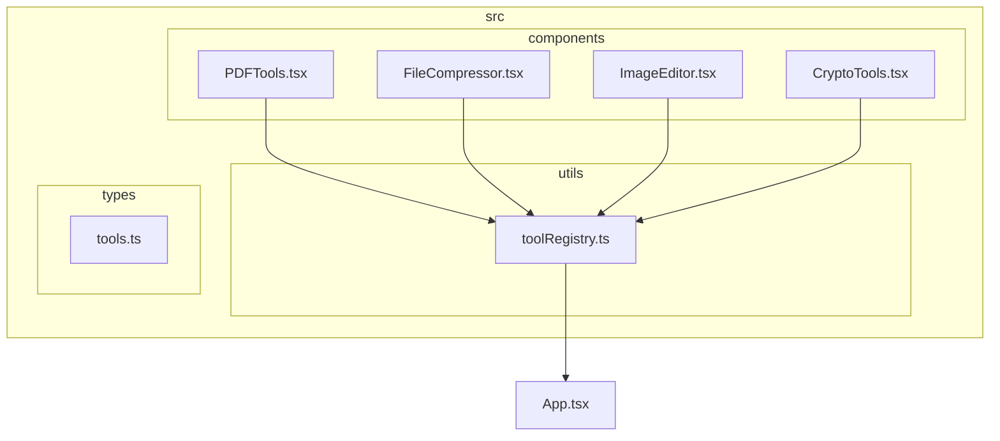

**图示来源**
- [PDFTools.tsx](file://src/components/PDFTools.tsx)
- [toolRegistry.ts](file://src/utils/toolRegistry.ts)

**本节来源**
- [PDFTools.tsx](file://src/components/PDFTools.tsx)
- [toolRegistry.ts](file://src/utils/toolRegistry.ts)

## 核心功能详解

PDFTools组件提供了两大核心功能：PDF合并与PDF分割。通过Ant Design的Tabs组件实现功能切换，用户可以在同一界面下便捷地使用两种功能。

### 功能架构

```mermaid
classDiagram
class PDFTools {
+render()
}
class PDFMerger {
+fileList : UploadFile[]
+processing : boolean
+handleUpload(info)
+mergePDFs()
}
class PDFSplitter {
+file : UploadFile | null
+processing : boolean
+handleUpload(info)
+splitPDF()
}
PDFTools --> PDFMerger : "包含"
PDFTools --> PDFSplitter : "包含"
PDFMerger --> "Ant Design Upload" : "使用"
PDFMerger --> "Ant Design Button" : "使用"
PDFSplitter --> "Ant Design Upload" : "使用"
PDFSplitter --> "Ant Design Button" : "使用"
```

**图示来源**
- [PDFTools.tsx](file://src/components/PDFTools.tsx)

**本节来源**
- [PDFTools.tsx](file://src/components/PDFTools.tsx)

## PDF合并功能实现

### 合并逻辑流程

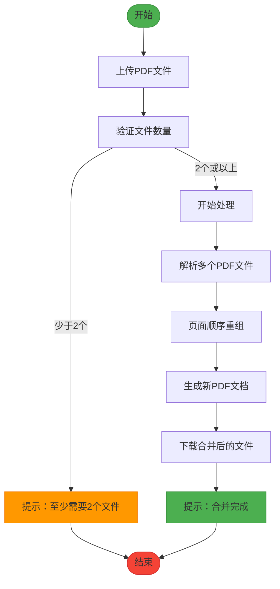

**图示来源**
- [PDFTools.tsx](file://src/components/PDFTools.tsx)

### 代码实现细节

PDF合并功能通过`PDFMerger`组件实现，主要包含以下关键部分：

- **文件上传管理**：使用Ant Design的Upload.Dragger组件，支持多文件拖拽上传
- **状态管理**：使用React的useState Hook管理文件列表和处理状态
- **合并逻辑**：`mergePDFs`函数负责执行合并操作

```typescript
const PDFMerger: React.FC = () => {
  const [fileList, setFileList] = useState<UploadFile[]>([]);
  const [processing, setProcessing] = useState(false);

  const handleUpload = (info: any) => {
    setFileList(info.fileList);
  };

  const mergePDFs = () => {
    if (fileList.length < 2) {
      message.warning('请至少上传2个PDF文件');
      return;
    }
    setProcessing(true);
    // 实际的PDF合并逻辑应在此处实现
    // 使用pdf-lib库解析、重组和生成PDF
    setTimeout(() => {
      setProcessing(false);
      message.success('PDF合并完成');
    }, 2000);
  };
};
```

**本节来源**
- [PDFTools.tsx](file://src/components/PDFTools.tsx)

## PDF分割功能实现

### 分割逻辑流程

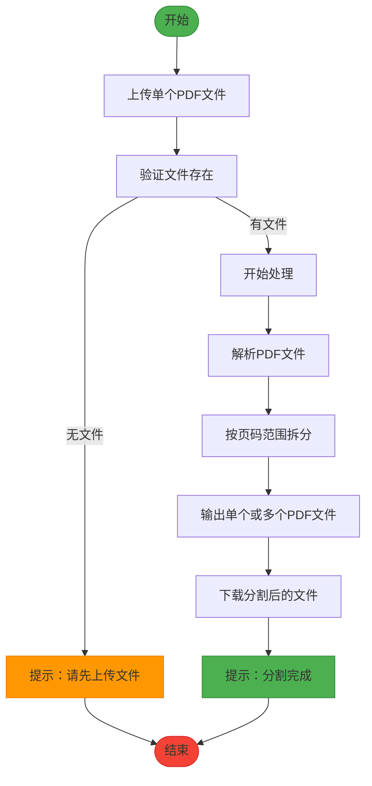

**图示来源**
- [PDFTools.tsx](file://src/components/PDFTools.tsx)

### 代码实现细节

PDF分割功能通过`PDFSplitter`组件实现，主要特点包括：

- **单文件上传**：限制只能上传一个PDF文件进行分割
- **状态管理**：使用useState管理单个文件和处理状态
- **分割逻辑**：`splitPDF`函数负责执行分割操作

```typescript
const PDFSplitter: React.FC = () => {
  const [file, setFile] = useState<UploadFile | null>(null);
  const [processing, setProcessing] = useState(false);

  const handleUpload = (info: any) => {
    setFile(info.file);
  };

  const splitPDF = () => {
    if (!file) {
      message.warning('请先上传PDF文件');
      return;
    }
    setProcessing(true);
    // 实际的PDF分割逻辑应在此处实现
    // 使用pdf-lib库按页码范围拆分PDF
    setTimeout(() => {
      setProcessing(false);
      message.success('PDF分割完成');
    }, 2000);
  };
};
```

**本节来源**
- [PDFTools.tsx](file://src/components/PDFTools.tsx)

## 用户界面操作流程

### 操作界面结构

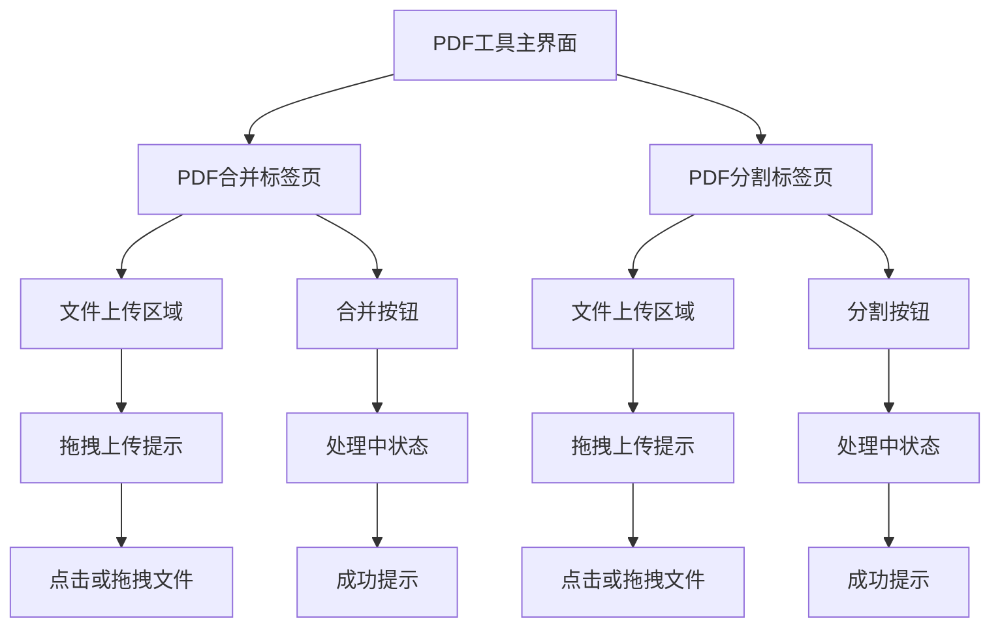

**图示来源**
- [PDFTools.tsx](file://src/components/PDFTools.tsx)

### 用户操作步骤

1. **选择功能**：用户通过Tabs组件在"PDF合并"和"PDF分割"之间切换
2. **上传文件**：
   - 合并功能：支持多文件上传，用户可同时选择或拖拽多个PDF文件
   - 分割功能：仅支持单文件上传，确保操作的准确性
3. **执行操作**：
   - 合并：点击"合并PDF"按钮，系统验证文件数量后开始处理
   - 分割：点击"分割PDF"按钮，系统验证文件存在后开始处理
4. **结果反馈**：处理完成后，通过Ant Design的message组件显示成功提示

**本节来源**
- [PDFTools.tsx](file://src/components/PDFTools.tsx)

## 组件注册与集成机制

### 注册流程分析

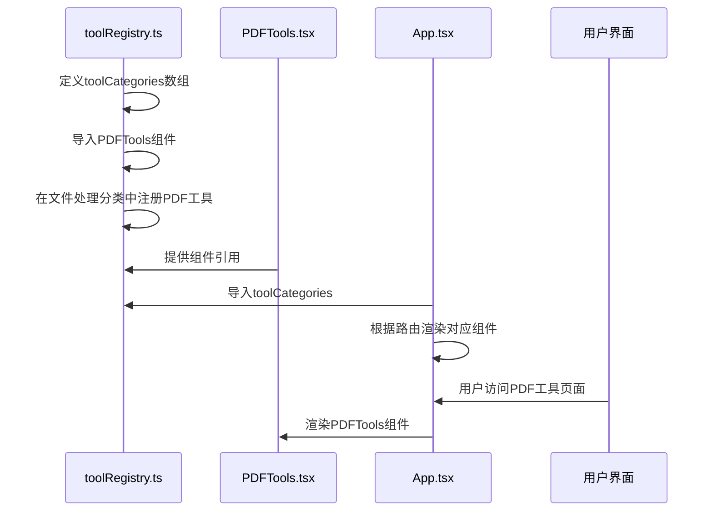

**图示来源**
- [toolRegistry.ts](file://src/utils/toolRegistry.ts)
- [PDFTools.tsx](file://src/components/PDFTools.tsx)

### 注册代码实现

PDFTools组件通过`toolRegistry.ts`文件注册到主应用中，实现方式如下：

```typescript
import PDFTools from '../components/PDFTools';

export const toolCategories: ToolCategory[] = [
  {
    key: 'file',
    name: '文件处理',
    icon: 'FileOutlined',
    tools: [
      {
        id: 'pdf',
        name: 'PDF工具',
        icon: 'FilePdfOutlined',
        category: 'document',
        description: 'PDF合并、分割、转换等操作',
        component: PDFTools
      }
    ]
  }
];
```

这种注册机制具有以下优势：
- **集中管理**：所有工具组件在同一个文件中注册，便于维护
- **分类组织**：按功能分类展示，提升用户体验
- **灵活扩展**：新增工具只需在对应分类中添加配置即可

**本节来源**
- [toolRegistry.ts](file://src/utils/toolRegistry.ts)
- [PDFTools.tsx](file://src/components/PDFTools.tsx)

## 技术依赖与实现细节

### 依赖库分析

项目通过package.json文件声明了关键依赖：

```json
{
  "dependencies": {
    "pdf-lib": "^1.17.1",
    "file-saver": "^2.0.5",
    "antd": "^5.12.0"
  }
}
```

- **pdf-lib**：核心PDF处理库，提供PDF解析、创建和修改功能
- **file-saver**：用于实现文件下载功能
- **antd**：UI组件库，提供上传、按钮等界面元素

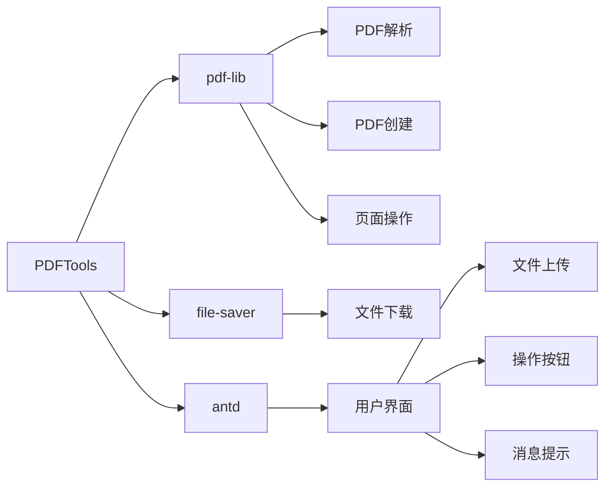

**图示来源**
- [package.json](file://package.json)
- [PDFTools.tsx](file://src/components/PDFTools.tsx)

### 实际技术实现

虽然当前代码中使用`setTimeout`模拟处理过程，但基于`pdf-lib`库的实际实现应包含：

1. **PDF解析**：使用`PDFDocument.load()`方法加载PDF文件
2. **页面操作**：
   - 合并：使用`copyPages()`方法复制页面到新文档
   - 分割：使用`getPages()`获取指定范围的页面
3. **文档生成**：使用`save()`方法生成PDF字节流
4. **文件下载**：结合`file-saver`库的`saveAs()`方法实现下载

**本节来源**
- [package.json](file://package.json)
- [PDFTools.tsx](file://src/components/PDFTools.tsx)

## 典型使用场景

### 场景一：报告合并

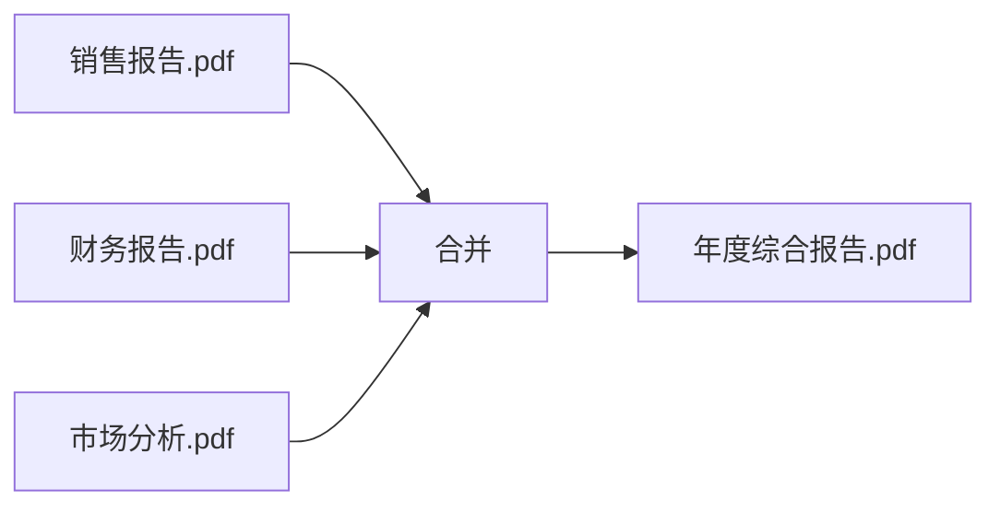

**应用场景**：将多个部门的独立报告合并为一个完整的年度报告，便于统一管理和分享。

### 场景二：页面提取

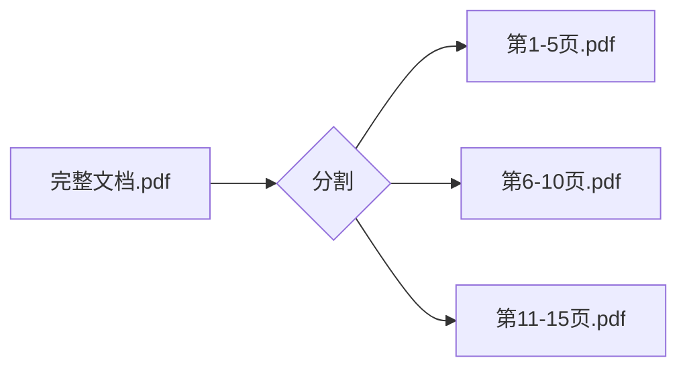

**应用场景**：从长文档中提取特定章节或页面，创建独立的参考资料。

### 场景三：合同处理

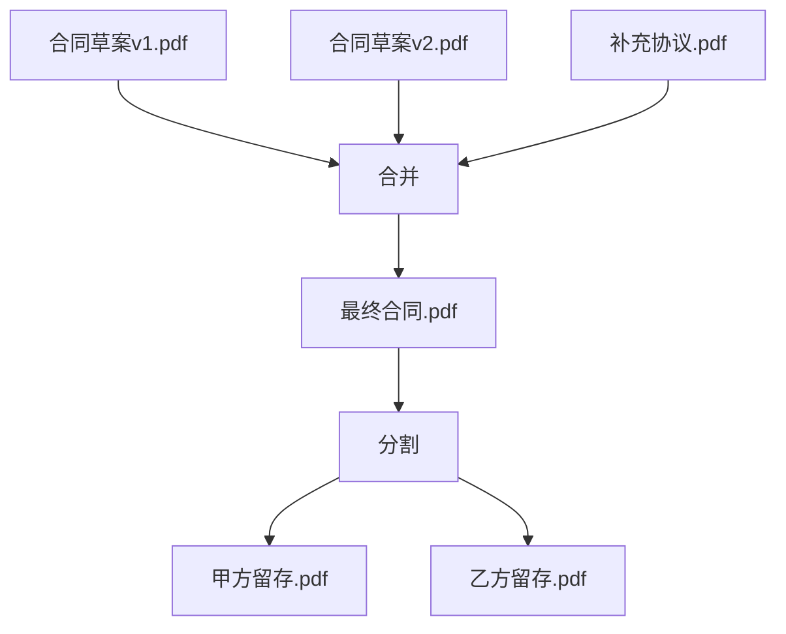

**应用场景**：整合多个版本的合同草案和补充协议，然后按需分割分发。

**本节来源**
- [PDFTools.tsx](file://src/components/PDFTools.tsx)

## 性能优化与问题应对

### 大型PDF处理策略

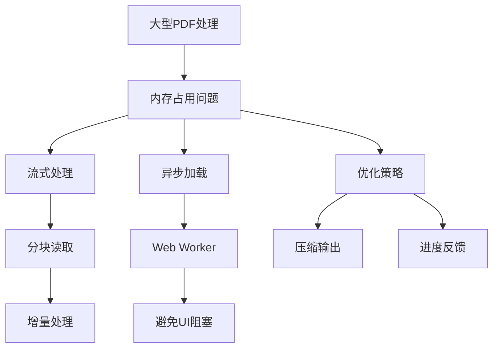

**优化建议**：
- **流式处理**：避免一次性加载整个文件到内存
- **异步操作**：使用Web Worker在后台线程处理，防止UI卡顿
- **进度显示**：提供处理进度反馈，提升用户体验

### 常见问题与解决方案

| 问题类型 | 现象 | 解决方案 |
|---------|------|---------|
| **加密PDF** | 无法读取或处理 | 提示用户先解密文件，或集成解密功能 |
| **页面错乱** | 页面顺序不正确 | 确保按正确顺序复制页面，添加排序功能 |
| **文件过大** | 浏览器内存溢出 | 实现分块处理，限制单次处理文件大小 |
| **格式丢失** | 样式或字体变化 | 确保正确嵌入字体，保留原始格式信息 |

**问题处理流程**：
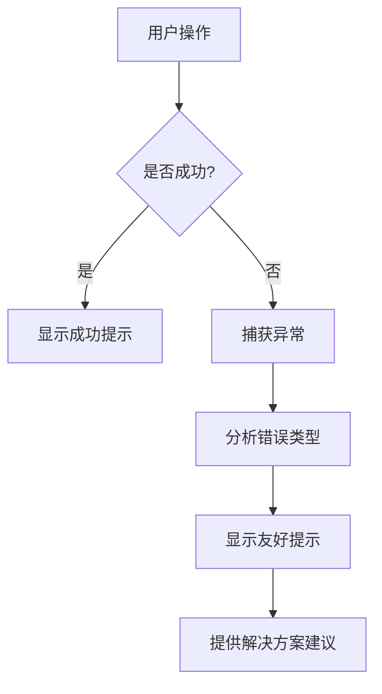

**本节来源**
- [PDFTools.tsx](file://src/components/PDFTools.tsx)