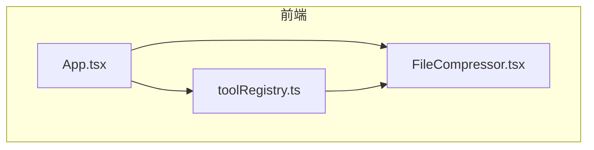
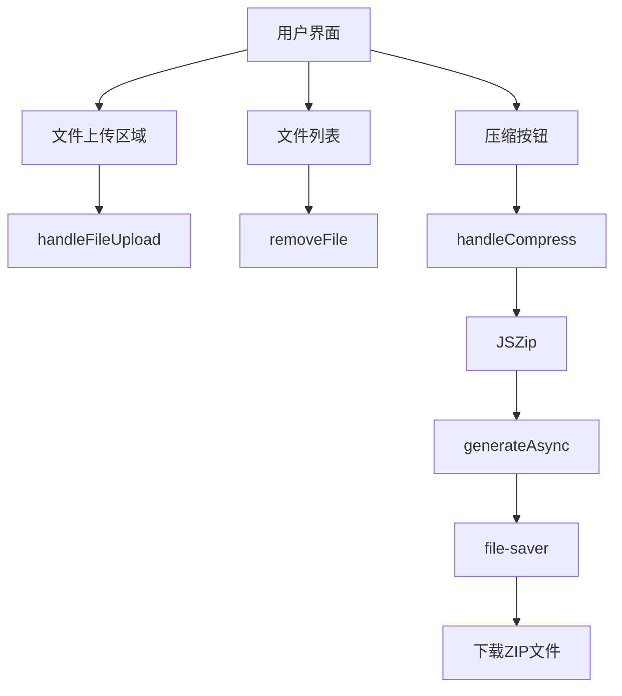
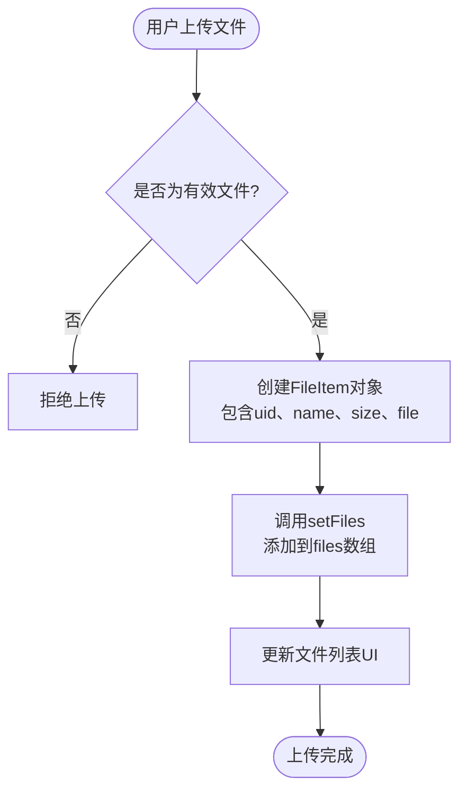
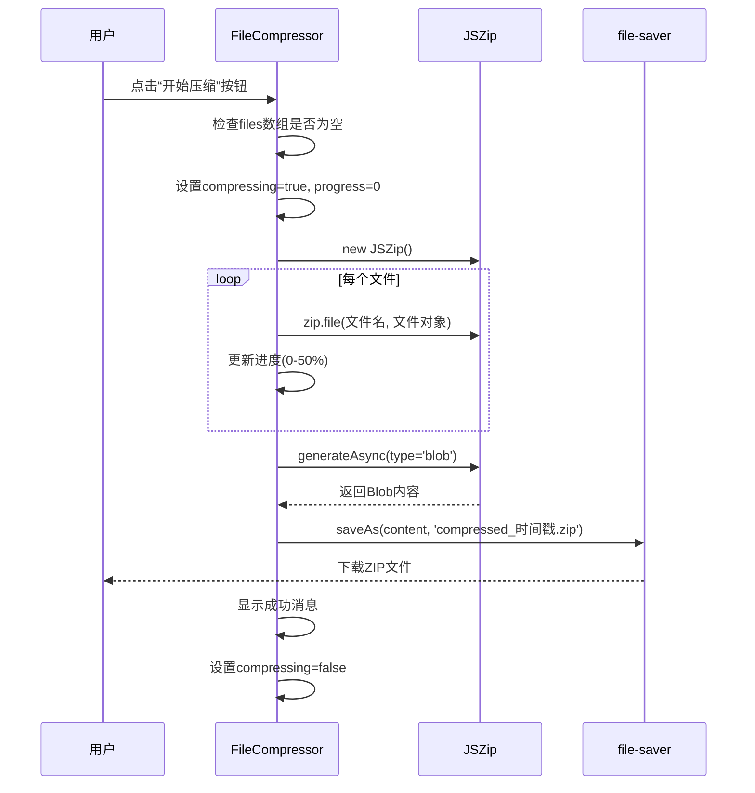
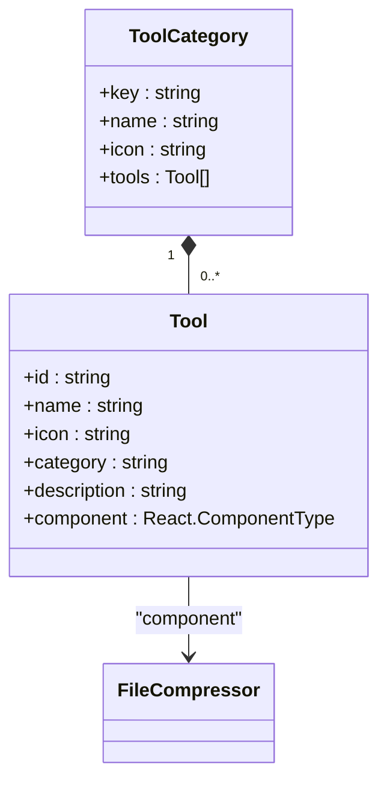
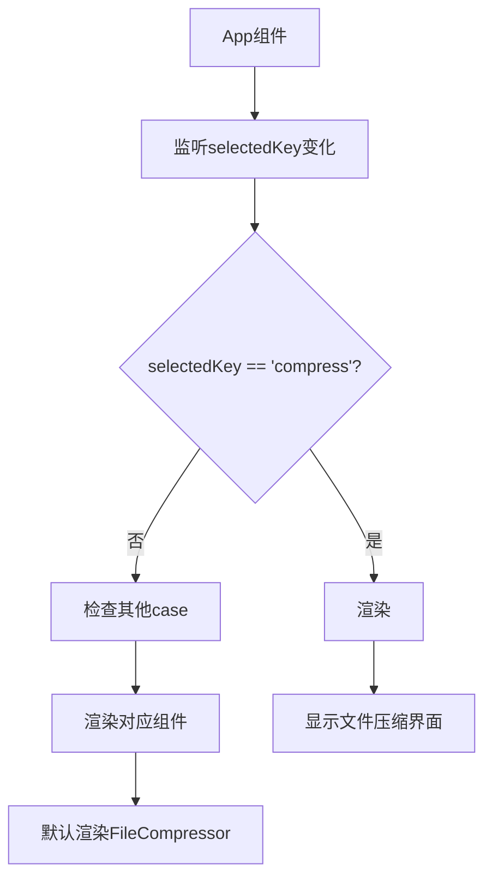
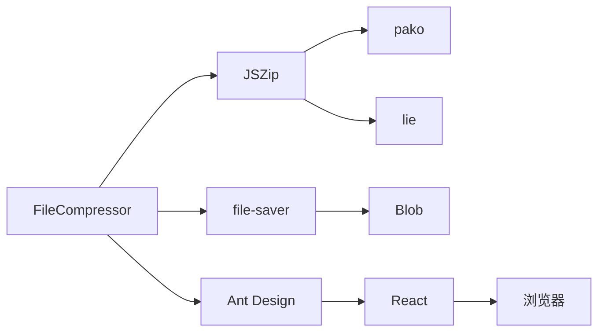

# 文件压缩功能

<cite>
**本文档引用的文件**  
- [FileCompressor.tsx](file://src/components/FileCompressor.tsx#L1-L168)
- [toolRegistry.ts](file://src/utils/toolRegistry.ts#L1-L229)
- [App.tsx](file://src/App.tsx#L1-L645)
</cite>

## 目录
1. [简介](#简介)
2. [项目结构](#项目结构)
3. [核心组件](#核心组件)
4. [架构概览](#架构概览)
5. [详细组件分析](#详细组件分析)
6. [依赖关系分析](#依赖关系分析)
7. [性能考量](#性能考量)
8. [故障排查指南](#故障排查指南)
9. [结论](#结论)

## 简介
本项目是一个集成多种办公工具的前端应用，其中“文件压缩”功能是其核心功能之一。该功能允许用户通过拖拽或点击上传多个文件，将其批量压缩为ZIP格式并自动下载。组件基于JSZip库实现压缩逻辑，结合Ant Design构建用户界面，支持实时进度反馈和文件管理操作。本文档将深入分析该功能的技术实现、架构设计及使用方式。

## 项目结构
项目采用典型的React + TypeScript + Vite架构，遵循模块化设计原则。主要功能组件位于`src/components/`目录下，工具注册机制通过`src/utils/toolRegistry.ts`统一管理，主应用入口为`src/App.tsx`。文件压缩功能作为独立组件实现，通过动态渲染机制集成到整体应用中。



**图表来源**  
- [App.tsx](file://src/App.tsx#L1-L645)
- [toolRegistry.ts](file://src/utils/toolRegistry.ts#L1-L229)
- [FileCompressor.tsx](file://src/components/FileCompressor.tsx#L1-L168)

**本节来源**  
- [App.tsx](file://src/App.tsx#L1-L645)
- [toolRegistry.ts](file://src/utils/toolRegistry.ts#L1-L229)

## 核心组件
文件压缩功能的核心是`FileCompressor.tsx`组件，它实现了完整的文件上传、压缩、进度反馈和下载流程。组件使用React函数式组件与Hooks（useState）管理状态，通过JSZip进行异步压缩，利用file-saver实现文件下载。用户界面采用Ant Design的Card、Upload、List、Progress等组件构建，提供直观的操作体验。

**本节来源**  
- [FileCompressor.tsx](file://src/components/FileCompressor.tsx#L1-L168)

## 架构概览
整个文件压缩功能的架构分为三层：UI层、逻辑层和工具层。UI层负责用户交互，逻辑层处理文件数据和压缩流程，工具层依赖JSZip和file-saver完成核心操作。组件通过`toolRegistry.ts`注册，并在`App.tsx`中根据菜单选择动态渲染。



**图表来源**  
- [FileCompressor.tsx](file://src/components/FileCompressor.tsx#L1-L168)

## 详细组件分析

### FileCompressor 组件分析
`FileCompressor`组件是文件压缩功能的实现主体，包含文件输入处理、状态管理、压缩逻辑和UI渲染。

#### 数据结构与状态管理
组件定义了`FileItem`接口用于描述文件信息，并使用多个useState Hook管理组件状态：

```typescript
interface FileItem {
  uid: string;
  name: string;
  size: number;
  file: File;
}

const [files, setFiles] = useState<FileItem[]>([]);
const [compressing, setCompressing] = useState(false);
const [progress, setProgress] = useState(0);
```

**本节来源**  
- [FileCompressor.tsx](file://src/components/FileCompressor.tsx#L12-L21)

#### 文件上传与处理逻辑
组件通过Ant Design的`Dragger`组件实现拖拽上传功能，`beforeUpload`属性绑定`handleFileUpload`函数拦截默认上传行为，将文件添加到本地状态而非上传到服务器。



**图表来源**  
- [FileCompressor.tsx](file://src/components/FileCompressor.tsx#L30-L45)

**本节来源**  
- [FileCompressor.tsx](file://src/components/FileCompressor.tsx#L30-L45)

#### 压缩与下载流程
`handleCompress`函数是压缩功能的核心，采用异步方式处理文件压缩和下载：



**图表来源**  
- [FileCompressor.tsx](file://src/components/FileCompressor.tsx#L47-L90)

**本节来源**  
- [FileCompressor.tsx](file://src/components/FileCompressor.tsx#L47-L90)

### 工具注册与动态渲染机制
文件压缩组件通过`toolRegistry.ts`注册，并在`App.tsx`中实现动态渲染，形成插件化架构。

#### 工具注册机制
`toolRegistry.ts`文件定义了工具分类和注册表，将`FileCompressor`组件注册到“文件处理”类别下：



**图表来源**  
- [toolRegistry.ts](file://src/utils/toolRegistry.ts#L1-L229)

**本节来源**  
- [toolRegistry.ts](file://src/utils/toolRegistry.ts#L1-L229)

#### 动态渲染机制
`App.tsx`通过`renderContent()`函数根据当前选中的菜单项动态渲染对应的组件：



**图表来源**  
- [App.tsx](file://src/App.tsx#L262-L350)

**本节来源**  
- [App.tsx](file://src/App.tsx#L262-L350)

## 依赖关系分析
文件压缩功能依赖多个外部库和内部模块，形成清晰的依赖链。



**图表来源**  
- [package.json](file://package.json#L45-L75)
- [FileCompressor.tsx](file://src/components/FileCompressor.tsx#L1-L168)

**本节来源**  
- [package.json](file://package.json#L45-L75)
- [FileCompressor.tsx](file://src/components/FileCompressor.tsx#L1-L168)

## 性能考量
文件压缩功能在性能方面有以下特点和优化点：

1. **内存使用**：JSZip在内存中构建整个ZIP包，对于大文件或大量文件可能消耗较多内存。
2. **进度反馈**：通过分阶段更新进度（添加文件占50%，生成压缩包占50%），提供平滑的用户体验。
3. **异步处理**：使用`generateAsync`方法避免阻塞UI线程，保持界面响应性。
4. **优化建议**：
   - 对于超大文件，可考虑分块压缩或流式处理
   - 添加文件大小限制，防止内存溢出
   - 实现压缩级别选择，平衡压缩率与速度

## 故障排查指南
### 常见问题及解决方案

**问题1：压缩失败，无任何提示**
- **可能原因**：JSZip处理过程中抛出异常未被捕获
- **解决方案**：检查`handleCompress`函数中的try-catch块，确保错误被正确捕获和显示

**问题2：中文文件名乱码**
- **可能原因**：ZIP文件默认使用ASCII编码文件名
- **解决方案**：在JSZip配置中添加`createFolders: true`和适当的编码处理，或建议用户使用英文文件名

**问题3：大文件压缩卡顿**
- **可能原因**：同步操作阻塞UI线程
- **解决方案**：确保使用`generateAsync`而非同步方法，考虑Web Worker进行后台压缩

**问题4：下载的ZIP文件损坏**
- **可能原因**：Blob生成不完整或下载中断
- **解决方案**：检查`generateAsync`的完成状态，确保在`finally`块中正确清理状态

**本节来源**  
- [FileCompressor.tsx](file://src/components/FileCompressor.tsx#L47-L90)

## 结论
文件压缩功能通过`FileCompressor.tsx`组件实现了完整的前端文件压缩解决方案。组件基于JSZip库，结合React状态管理和Ant Design UI组件，提供了直观易用的用户界面。通过`toolRegistry.ts`的注册机制和`App.tsx`的动态渲染，实现了模块化和可扩展的架构设计。该功能支持多文件拖拽上传、实时进度反馈和一键下载，满足了基本的文件压缩需求。未来可进一步优化大文件处理性能，增加压缩配置选项，提升用户体验。