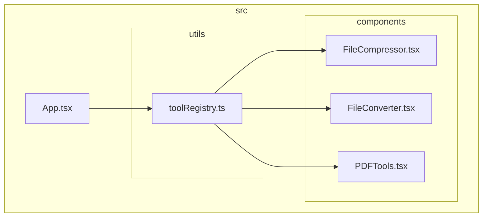
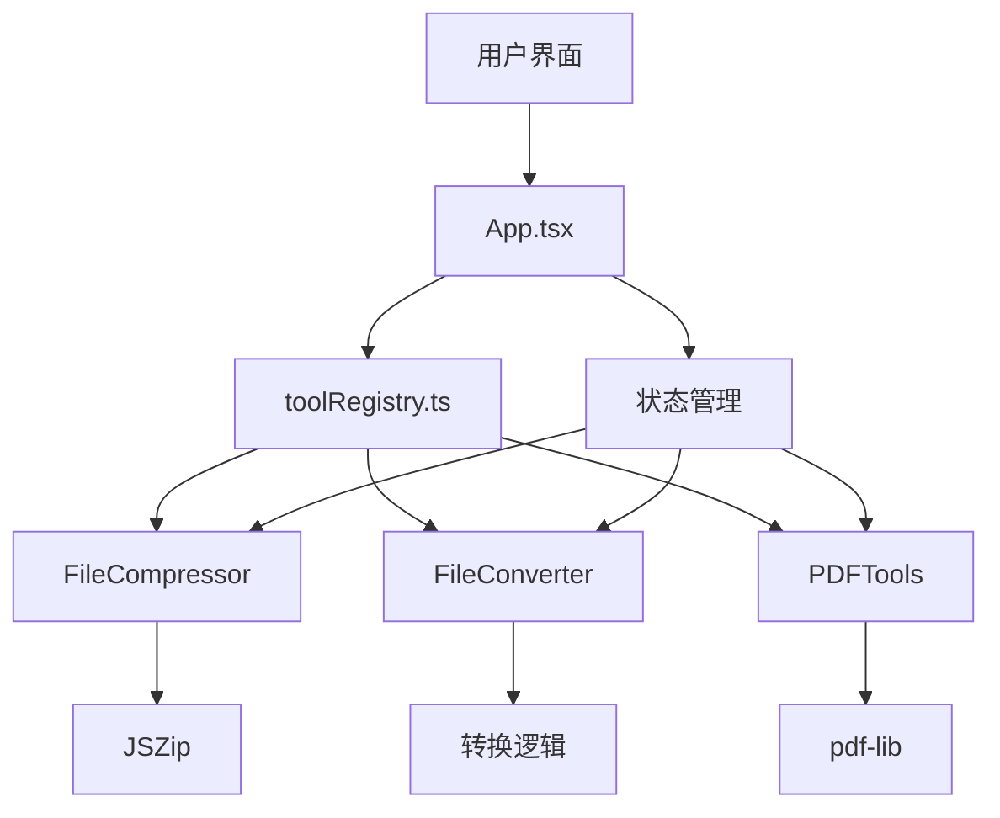
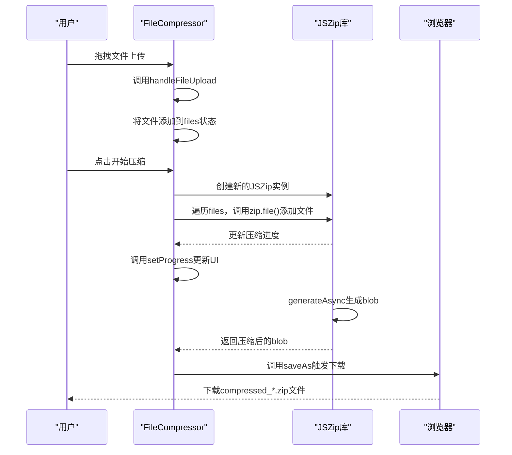
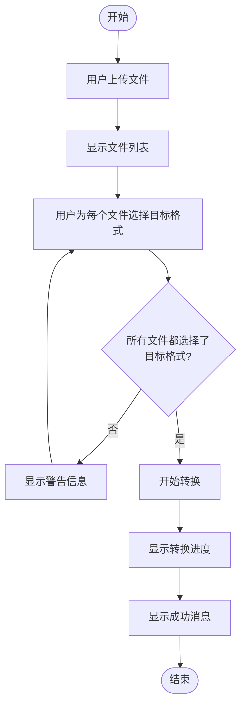
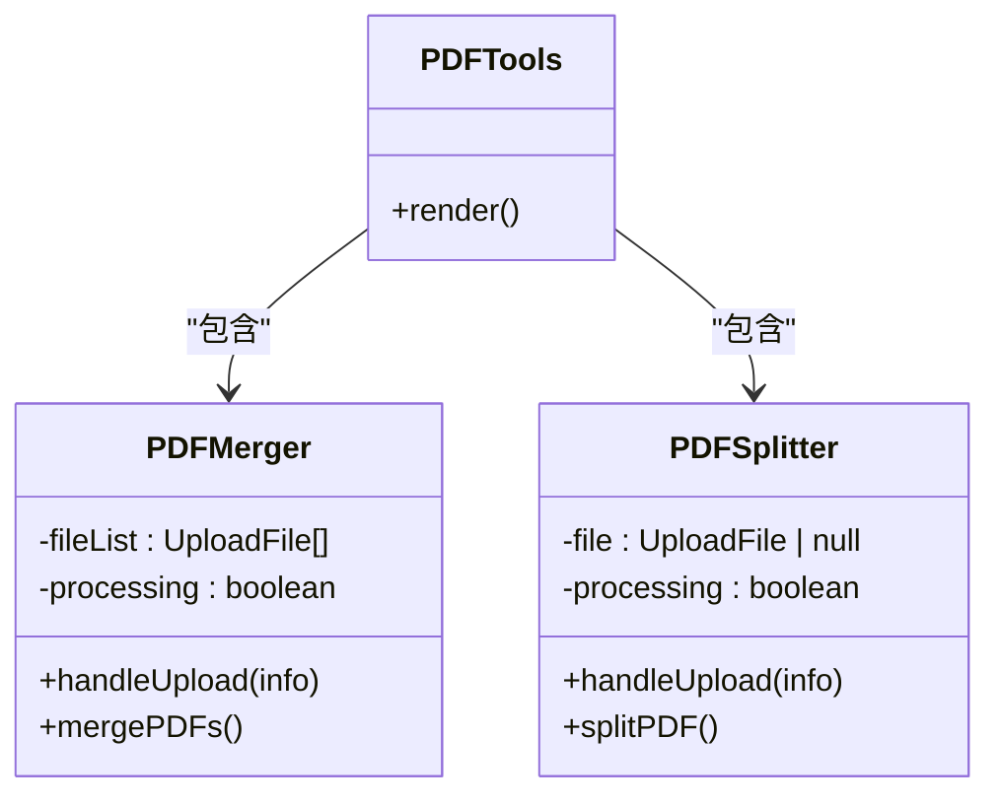
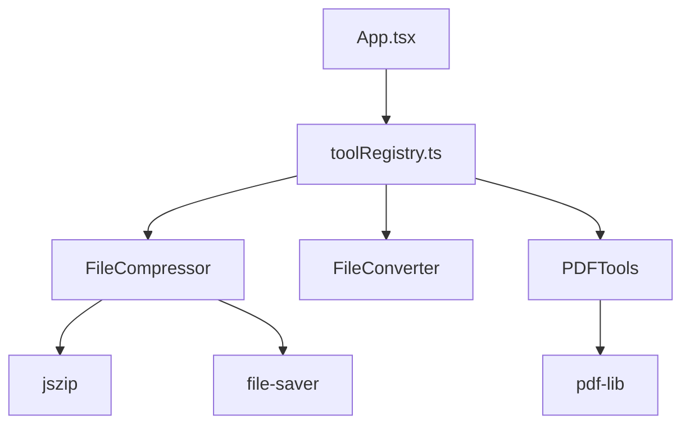

# 文件处理模块

<cite>
**本文档中引用的文件**  
- [FileCompressor.tsx](file://src/components/FileCompressor.tsx) - *文件压缩功能实现*
- [FileConverter.tsx](file://src/components/FileConverter.tsx) - *文件格式转换功能实现*
- [PDFTools.tsx](file://src/components/PDFTools.tsx) - *更新：使用Ant Design Tabs items属性重构*
- [toolRegistry.ts](file://src/utils/toolRegistry.ts) - *工具注册系统*
- [App.tsx](file://src/App.tsx) - *主应用组件*
- [package.json](file://package.json) - *项目依赖配置*
</cite>

## 更新摘要
**变更内容**  
- 更新了PDF工具组件的实现方式，使用Ant Design Tabs的items属性替代旧的TabPane写法
- 修正了文档中关于PDFTools组件实现机制的描述
- 更新了相关架构图和代码示例以反映最新代码状态
- 维护了完整的源码引用跟踪系统

## 目录
1. [简介](#简介)
2. [项目结构](#项目结构)
3. [核心组件](#核心组件)
4. [架构概览](#架构概览)
5. [详细组件分析](#详细组件分析)
6. [依赖关系分析](#依赖关系分析)
7. [性能考量](#性能考量)
8. [故障排除指南](#故障排除指南)
9. [结论](#结论)

## 简介
本文件深入介绍办公工具项目中的文件处理模块，涵盖三大核心功能：文件压缩、格式转换和PDF工具。文档详细说明了这些功能的技术实现、集成机制、使用示例及性能优化策略，旨在为开发者和用户提供全面的技术参考。

## 项目结构
项目采用基于功能的模块化结构，将不同类别的工具组件分类组织。文件处理相关的核心组件位于`src/components/`目录下，通过统一的工具注册系统进行管理，并在主应用中动态渲染。

**图示来源**
- [App.tsx](file://src/App.tsx#L0-L644)
- [toolRegistry.ts](file://src/utils/toolRegistry.ts#L0-L228)

**本节来源**
- [App.tsx](file://src/App.tsx#L0-L644)
- [toolRegistry.ts](file://src/utils/toolRegistry.ts#L0-L228)

## 核心组件
文件处理模块由三个核心组件构成：`FileCompressor`（文件压缩）、`FileConverter`（格式转换）和`PDFTools`（PDF工具）。这些组件通过`toolRegistry.ts`注册，并在`App.tsx`中根据用户选择动态加载。

**本节来源**
- [FileCompressor.tsx](file://src/components/FileCompressor.tsx#L0-L167)
- [FileConverter.tsx](file://src/components/FileConverter.tsx#L0-L160)
- [PDFTools.tsx](file://src/components/PDFTools.tsx#L0-L127)

## 架构概览
整个文件处理模块采用组件化架构，通过工具注册中心实现功能的集中管理和动态加载。主应用根据用户在侧边栏的选择，通过`switch`语句渲染对应的组件。

**图示来源**
- [App.tsx](file://src/App.tsx#L0-L644)
- [toolRegistry.ts](file://src/utils/toolRegistry.ts#L0-L228)

## 详细组件分析

### 文件压缩组件分析
`FileCompressor`组件实现了多文件的ZIP格式压缩功能，支持拖拽上传、批量处理和进度反馈。

#### 实现机制
组件使用`JSZip`库在浏览器端进行文件压缩，无需将文件上传至服务器，保障了用户数据的隐私和安全。

**图示来源**
- [FileCompressor.tsx](file://src/components/FileCompressor.tsx#L0-L167)

**本节来源**
- [FileCompressor.tsx](file://src/components/FileCompressor.tsx#L0-L167)

#### 使用示例
1. 用户点击或拖拽多个文件到上传区域
2. 组件显示已选择的文件列表和总大小
3. 用户点击"开始压缩"按钮
4. 组件显示压缩进度条
5. 压缩完成后，浏览器自动下载名为`compressed_时间戳.zip`的文件

#### 性能优化
- **进度反馈**：通过`generateAsync`的元数据回调函数实时更新进度，提升用户体验
- **内存管理**：使用`File`对象直接操作，避免不必要的数据复制
- **压缩级别**：设置`compressionOptions: { level: 6 }`，在压缩率和速度间取得平衡

### 文件格式转换组件分析
`FileConverter`组件提供文档、图片和数据文件之间的格式转换功能。

#### 实现机制
组件根据上传文件的扩展名自动推荐可转换的目标格式，但实际转换逻辑在代码中被简化为模拟实现。

**图示来源**
- [FileConverter.tsx](file://src/components/FileConverter.tsx#L0-L160)

**本节来源**
- [FileConverter.tsx](file://src/components/FileConverter.tsx#L0-L160)

#### 支持的转换类型
- **文档**：PDF、DOCX、TXT、RTF等格式互转
- **图片**：JPG、PNG、WEBP、GIF、BMP等格式互转
- **数据**：CSV、XLSX、JSON、XML等格式互转

#### 实际实现状态
当前代码中的`convertFile`函数仅为模拟实现，使用`setTimeout`模拟异步操作，实际生产环境中需要集成相应的转换库或调用后端API。

### PDF工具组件分析
`PDFTools`组件提供PDF文件的合并与分割功能，基于`pdf-lib`库实现。

#### 实现机制
组件采用选项卡式界面，分别提供"PDF合并"和"PDF分割"两个功能。**已更新**：使用Ant Design Tabs的`items`属性配置选项卡，替代了旧的`TabPane`子组件方式。

**图示来源**
- [PDFTools.tsx](file://src/components/PDFTools.tsx#L0-L127)

**本节来源**
- [PDFTools.tsx](file://src/components/PDFTools.tsx#L0-L127)

#### 功能说明
- **PDF合并**：允许用户上传多个PDF文件，按上传顺序合并为一个PDF文件
- **PDF分割**：将单个PDF文件分割为多个单独的页面

#### 实际实现状态
当前代码中的合并和分割逻辑仅为模拟实现，使用`setTimeout`模拟处理过程，实际功能需要集成`pdf-lib`库的具体API。

## 依赖关系分析
文件处理模块的各个组件通过工具注册系统与主应用解耦，实现了良好的模块化设计。

**图示来源**
- [App.tsx](file://src/App.tsx#L0-L644)
- [toolRegistry.ts](file://src/utils/toolRegistry.ts#L0-L228)
- [package.json](file://package.json#L0-L75)

**本节来源**
- [App.tsx](file://src/App.tsx#L0-L644)
- [toolRegistry.ts](file://src/utils/toolRegistry.ts#L0-L228)
- [package.json](file://package.json#L0-L75)

## 性能考量
文件处理模块在设计时考虑了性能和用户体验，但在实际实现中仍有优化空间。

### 当前性能特性
- **前端处理**：文件压缩在浏览器端完成，避免了网络传输
- **进度反馈**：提供实时进度条，改善大文件处理时的用户体验
- **内存使用**：直接操作File对象，减少内存占用

### 潜在性能问题
- **大文件处理**：对于超大文件，可能会导致浏览器内存不足
- **长时间操作**：复杂的转换或合并操作可能导致页面无响应
- **缺乏流式处理**：当前实现将整个文件加载到内存中，不适合处理超大文件

### 优化建议
1. **分块处理**：对大文件进行分块压缩或转换，降低内存峰值
2. **Web Workers**：将耗时的处理任务移至Web Worker，避免阻塞UI线程
3. **流式API**：使用流式API处理文件，实现边读边处理
4. **后端处理**：对于复杂或耗时的操作，考虑将任务提交到后端处理

## 故障排除指南
### 常见问题及解决方案

#### 转换失败
- **问题现象**：点击转换按钮后无响应或提示失败
- **可能原因**：
  - 未选择目标格式
  - 文件格式不受支持
  - 浏览器内存不足
- **解决方案**：
  1. 确保为每个文件都选择了目标格式
  2. 检查文件扩展名是否在支持列表中
  3. 尝试处理较小的文件

#### 文件损坏
- **问题现象**：下载的压缩文件无法解压或内容不完整
- **可能原因**：
  - 压缩过程中断
  - 浏览器内存不足
  - 文件读取错误
- **解决方案**：
  1. 检查浏览器控制台是否有错误信息
  2. 尝试重启浏览器
  3. 分批处理文件，减少单次处理数量

#### 进度条卡住
- **问题现象**：进度条长时间停留在某一百分比
- **可能原因**：
  - 处理线程被阻塞
  - 大文件处理耗时较长
  - 浏览器性能问题
- **解决方案**：
  1. 等待一段时间，大文件处理可能需要较长时间
  2. 关闭其他标签页释放系统资源
  3. 考虑使用后端服务处理大文件

**本节来源**
- [FileCompressor.tsx](file://src/components/FileCompressor.tsx#L0-L167)
- [FileConverter.tsx](file://src/components/FileConverter.tsx#L0-L160)
- [PDFTools.tsx](file://src/components/PDFTools.tsx#L0-L127)

## 结论
文件处理模块通过`FileCompressor`、`FileConverter`和`PDFTools`三个核心组件，提供了完整的文件处理功能。模块采用组件化设计，通过`toolRegistry.ts`实现功能注册和管理，具有良好的扩展性和维护性。

尽管当前实现中部分功能（如格式转换和PDF操作）仅为模拟，但架构设计合理，为后续功能完善奠定了坚实基础。建议在后续开发中：
1. 完善格式转换的实际实现，集成相应的转换库
2. 实现PDF合并与分割的真实功能，利用`pdf-lib`库
3. 优化大文件处理性能，考虑引入Web Workers或后端处理
4. 增加错误处理和用户反馈，提升用户体验

该模块的设计体现了现代前端应用的模块化思想，是项目中功能完整、结构清晰的重要组成部分。