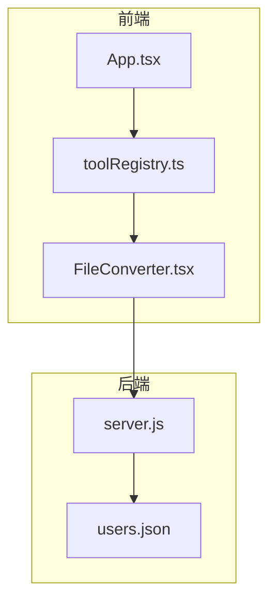
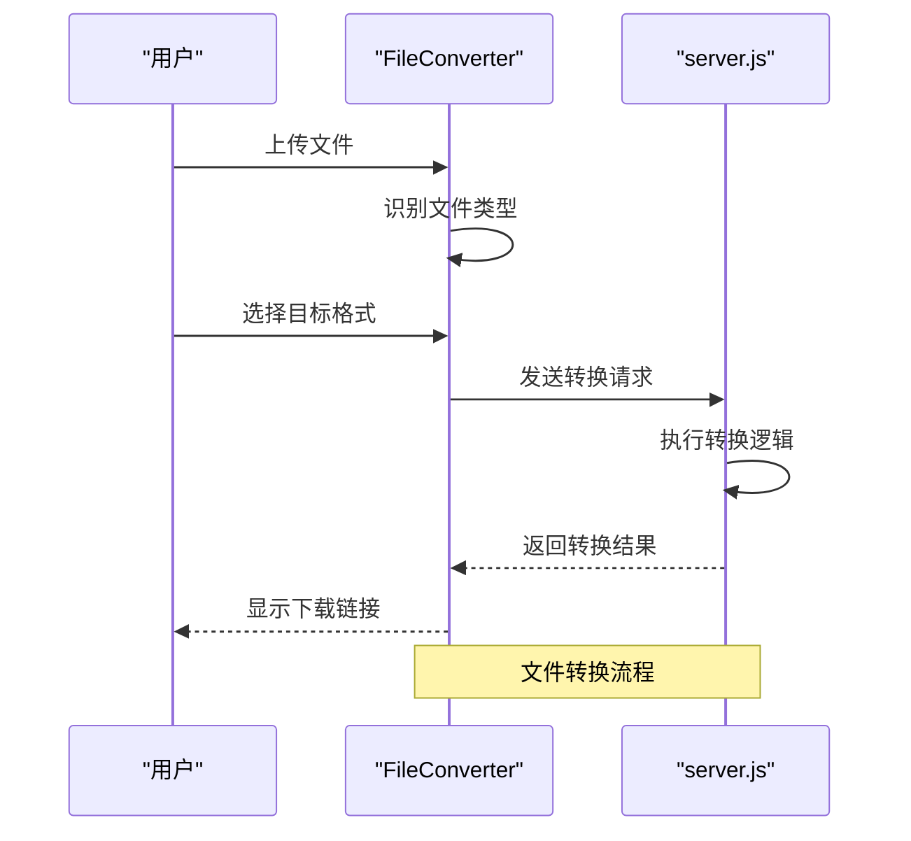
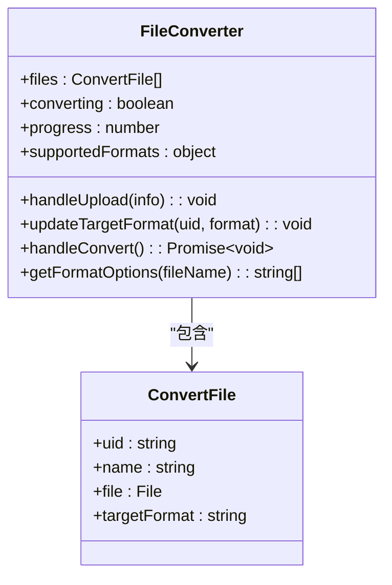
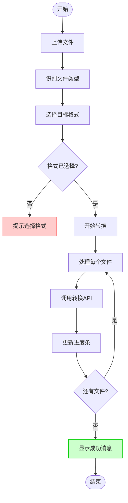
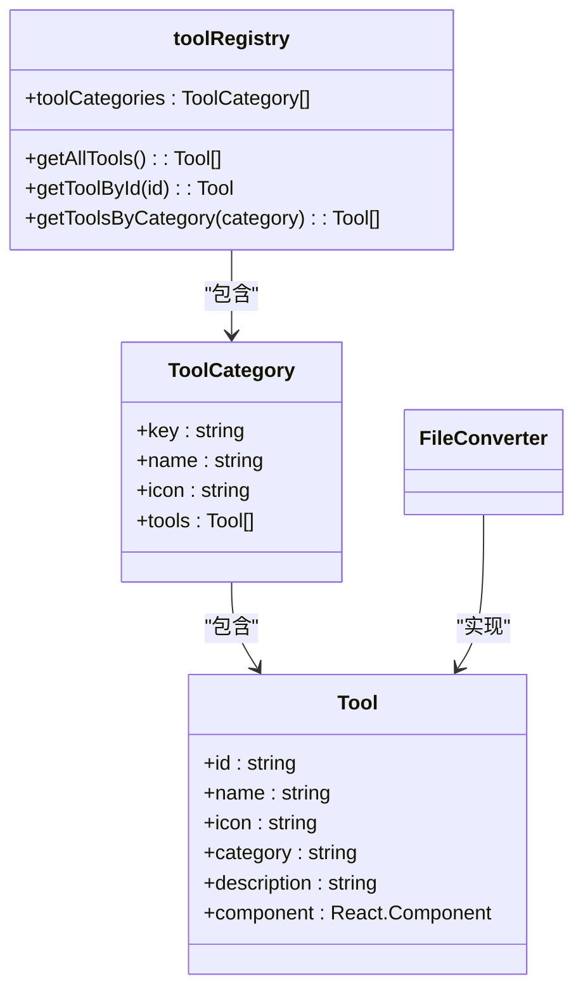
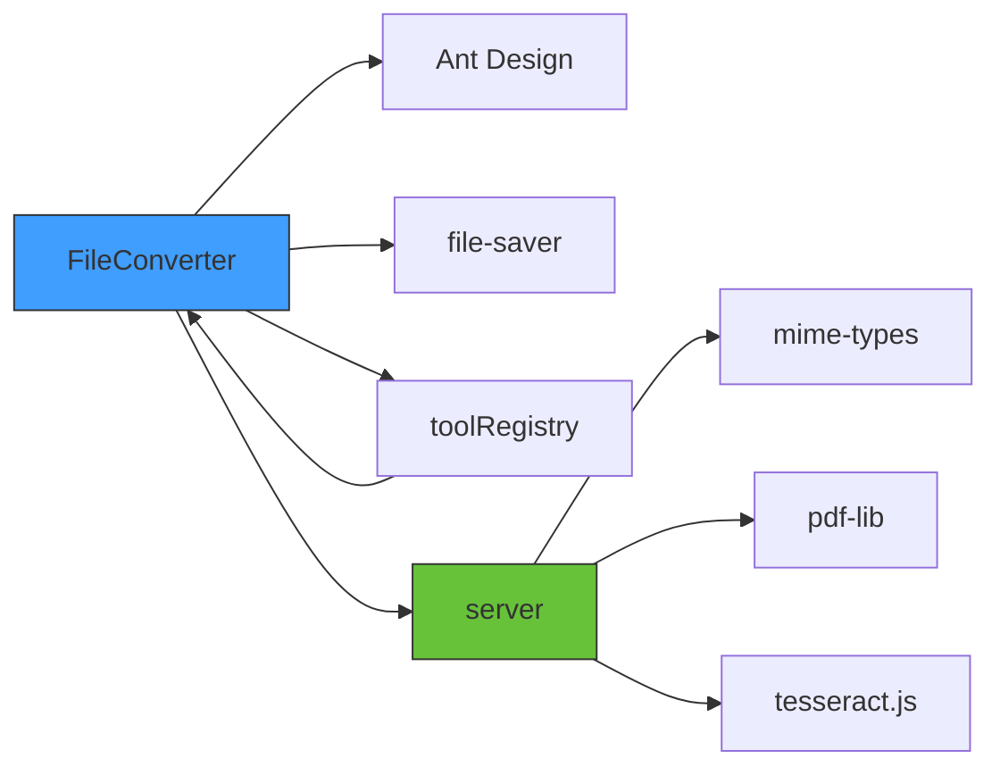
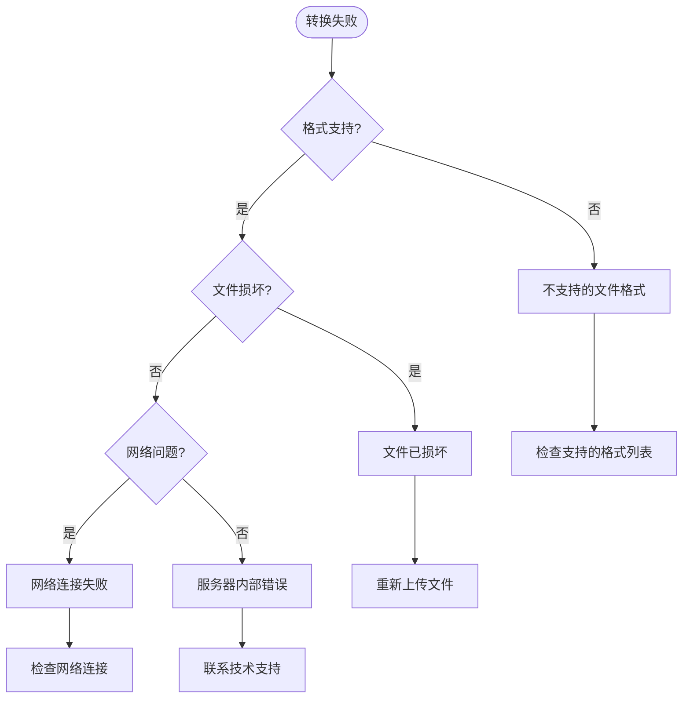

# 文件格式转换功能

<cite>
**本文档引用的文件**   
- [FileConverter.tsx](file://src/components/FileConverter.tsx#L0-L160)
- [toolRegistry.ts](file://src/utils/toolRegistry.ts#L0-L228)
- [ImageCompressor.tsx](file://src/components/ImageCompressor.tsx#L0-L212)
- [ImageOCR.tsx](file://src/components/ImageOCR.tsx#L0-L200)
- [package.json](file://package.json#L45-L75)
- [server.js](file://backend/server.js#L0-L200)
</cite>

## 目录
1. [项目结构](#项目结构)
2. [核心组件分析](#核心组件分析)
3. [架构概览](#架构概览)
4. [详细组件分析](#详细组件分析)
5. [依赖关系分析](#依赖关系分析)
6. [性能考虑](#性能考虑)
7. [故障排除指南](#故障排除指南)
8. [结论](#结论)

## 项目结构
该办公工具项目采用模块化前端架构，主要分为`backend`后端服务和`src`前端源码两大部分。前端组件集中存放在`src/components`目录下，通过`toolRegistry.ts`统一注册管理。文件转换功能由`FileConverter.tsx`实现，作为独立组件通过工具注册系统集成到主应用中。

**图示来源**
- [FileConverter.tsx](file://src/components/FileConverter.tsx#L0-L160)
- [toolRegistry.ts](file://src/utils/toolRegistry.ts#L0-L228)
- [server.js](file://backend/server.js#L0-L200)

**本节来源**
- [FileConverter.tsx](file://src/components/FileConverter.tsx#L0-L160)
- [toolRegistry.ts](file://src/utils/toolRegistry.ts#L0-L228)

## 核心组件分析
文件转换功能的核心是`FileConverter`组件，它实现了文件上传、格式选择、转换处理和进度显示等完整流程。该组件通过Ant Design UI库提供拖拽上传、下拉选择和进度条等交互元素。转换逻辑通过`convertFile`异步函数实现，支持文档、图像和数据文件三大类格式的相互转换。

**本节来源**
- [FileConverter.tsx](file://src/components/FileConverter.tsx#L0-L160)

## 架构概览
系统采用前后端分离架构，前端负责用户交互和文件预处理，后端处理实际的文件转换任务。`FileConverter`组件通过工具注册系统动态集成到主应用界面中，形成统一的工具集。文件转换请求通过API发送到后端服务器，由`server.js`处理并返回转换结果。

**图示来源**
- [FileConverter.tsx](file://src/components/FileConverter.tsx#L0-L160)
- [server.js](file://backend/server.js#L0-L200)

## 详细组件分析

### FileConverter组件分析
`FileConverter`组件实现了完整的文件格式转换功能，包括文件上传、目标格式选择和转换执行等核心功能。

#### 组件状态管理

**图示来源**
- [FileConverter.tsx](file://src/components/FileConverter.tsx#L0-L160)

#### 文件转换流程

**图示来源**
- [FileConverter.tsx](file://src/components/FileConverter.tsx#L0-L160)

**本节来源**
- [FileConverter.tsx](file://src/components/FileConverter.tsx#L0-L160)

### 集成机制分析
`FileConverter`组件通过工具注册系统与主应用集成，实现模块化和可扩展的架构设计。

#### 工具注册系统

**图示来源**
- [toolRegistry.ts](file://src/utils/toolRegistry.ts#L0-L228)

**本节来源**
- [toolRegistry.ts](file://src/utils/toolRegistry.ts#L0-L228)

## 依赖关系分析
项目依赖关系清晰，前端组件通过明确的接口与后端服务通信。`FileConverter`依赖Ant Design UI组件库和file-saver库实现用户界面和文件下载功能。

**图示来源**
- [package.json](file://package.json#L45-L75)
- [FileConverter.tsx](file://src/components/FileConverter.tsx#L0-L160)

**本节来源**
- [package.json](file://package.json#L45-L75)

## 性能考虑
虽然`FileConverter`组件目前使用模拟的转换逻辑，但实际生产环境中需要考虑以下性能优化建议：

1. **批量处理优化**：对多个文件的转换采用并行处理而非串行处理，充分利用多核CPU性能
2. **进度反馈**：保持进度条的实时更新，避免界面卡顿，提升用户体验
3. **内存管理**：大文件转换时注意内存使用，避免浏览器内存溢出
4. **错误重试机制**：对失败的转换任务提供重试功能，提高转换成功率
5. **文件大小限制**：设置合理的文件大小上限，防止过大的文件导致服务超时

**本节来源**
- [FileConverter.tsx](file://src/components/FileConverter.tsx#L0-L160)

## 故障排除指南
文件转换功能可能遇到的常见问题及解决方案：

### 转换失败原因分析

**图示来源**
- [FileConverter.tsx](file://src/components/FileConverter.tsx#L0-L160)

**本节来源**
- [FileConverter.tsx](file://src/components/FileConverter.tsx#L0-L160)

### 具体示例说明
**DOCX转PDF示例**：
1. 用户上传`document.docx`文件
2. 系统识别为文档类型，提供PDF、TXT、RTF等目标格式选择
3. 用户选择PDF格式并点击"开始转换"
4. 前端将文件发送到后端`/api/convert`接口
5. 后端使用`pdf-lib`库将DOCX转换为PDF
6. 转换完成后返回PDF文件供用户下载

**PNG转WEBP示例**：
1. 用户上传`image.png`文件
2. 系统识别为图像类型，提供JPG、WEBP、GIF等目标格式选择
3. 用户选择WEBP格式并点击"开始转换"
4. 前端调用浏览器Canvas API进行格式转换
5. 转换完成后通过`file-saver`库触发下载

## 结论
`FileConverter`组件实现了完整的文件格式转换功能，通过清晰的架构设计和模块化实现，为用户提供便捷的文件转换服务。组件通过工具注册系统无缝集成到主应用中，展现了良好的可扩展性和维护性。尽管当前实现使用模拟转换逻辑，但其架构为实际的文件转换功能提供了坚实的基础。建议后续完善后端转换服务，增加更多文件格式支持，并优化用户体验和性能表现。