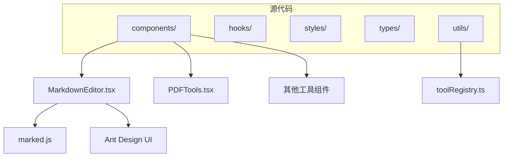
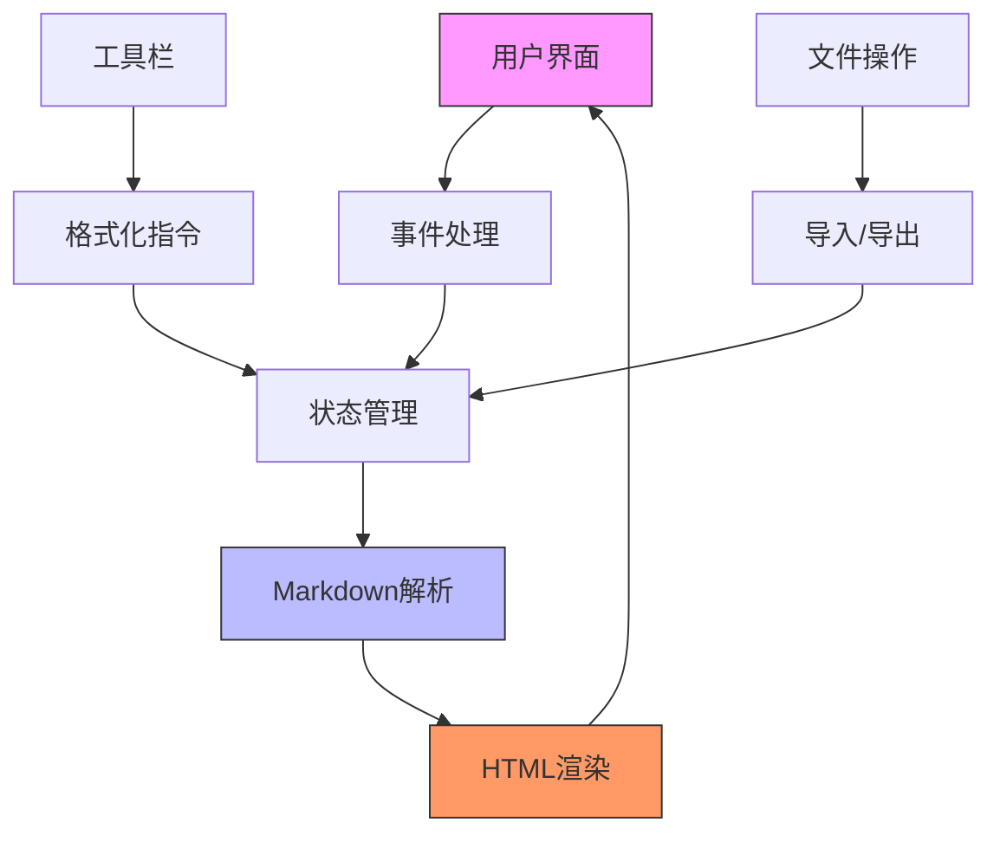
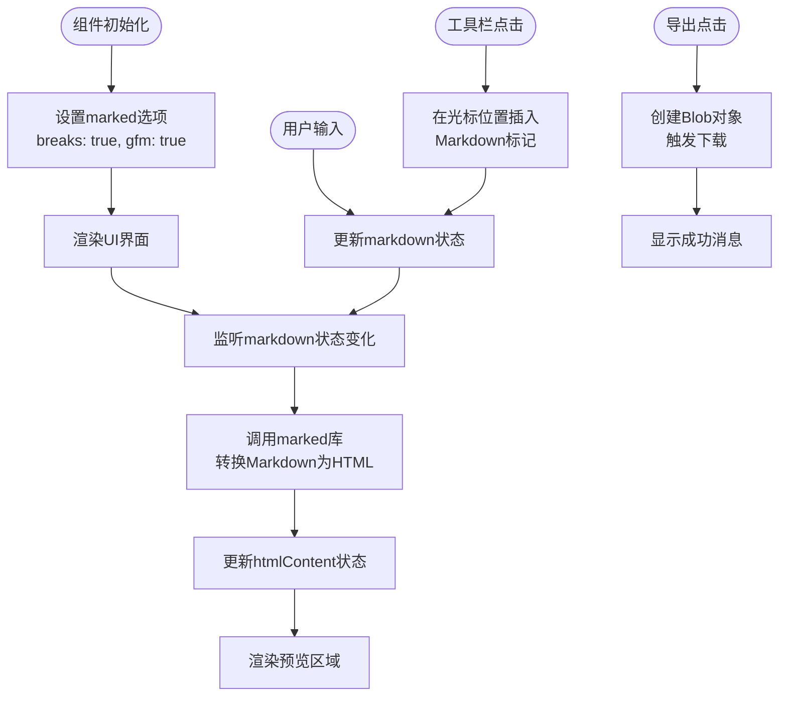
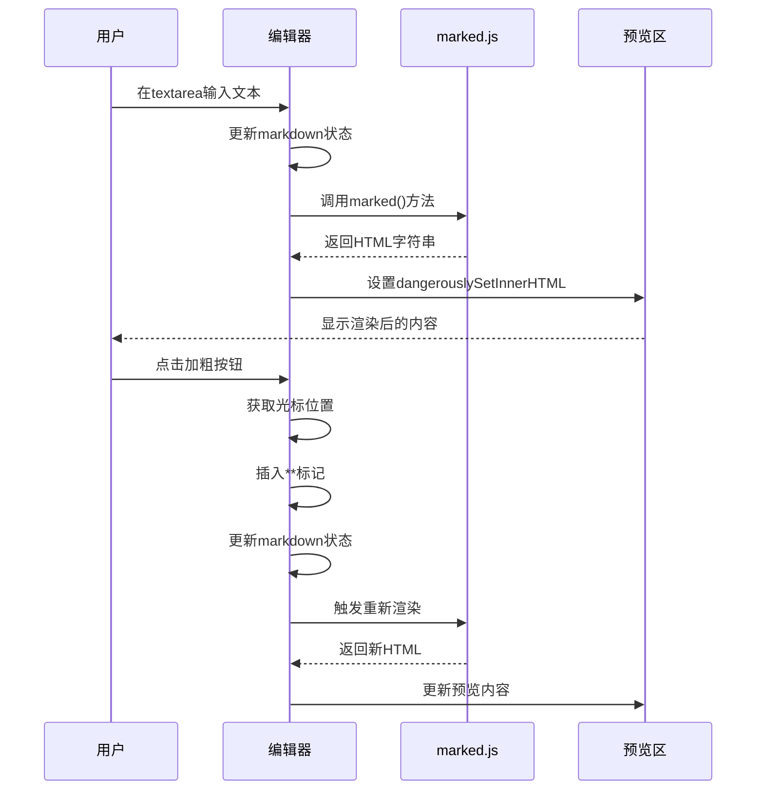

# Markdown编辑器

<cite>
**本文档引用的文件**   
- [MarkdownEditor.tsx](file://src/components/MarkdownEditor.tsx)
- [package.json](file://package.json)
- [PDFTools.tsx](file://src/components/PDFTools.tsx)
- [toolRegistry.ts](file://src/utils/toolRegistry.ts)
</cite>

## 目录
1. [简介](#简介)
2. [项目结构](#项目结构)
3. [核心组件](#核心组件)
4. [架构概述](#架构概述)
5. [详细组件分析](#详细组件分析)
6. [依赖分析](#依赖分析)
7. [性能考虑](#性能考虑)
8. [故障排除指南](#故障排除指南)
9. [结论](#结论)

## 简介
Markdown编辑器是一个功能丰富的文本编辑工具，集成在多功能办公工具集中。该编辑器采用受控组件模式，结合textarea与HTML预览区域实现双向同步，支持实时渲染Markdown语法为HTML内容。编辑器提供了完整的工具栏功能，包括格式化、插入链接、图片、代码块等操作，并支持文件导入导出功能。通过marked.js库进行Markdown解析，同时实现了基本的安全策略。该组件作为独立工具模块，与其他工具如PDF处理工具等并列存在于系统中。

## 项目结构
项目采用典型的React前端架构，Markdown编辑器作为组件之一位于src/components目录下。整个项目结构清晰，按功能划分模块，包括计算器、代码格式化、颜色转换、加密工具、文件压缩、图片处理、JSON格式化等多种办公工具。



**图示来源**
- [MarkdownEditor.tsx](file://src/components/MarkdownEditor.tsx)
- [toolRegistry.ts](file://src/utils/toolRegistry.ts)

**本节来源**
- [MarkdownEditor.tsx](file://src/components/MarkdownEditor.tsx)
- [project_structure](file://)

## 核心组件
Markdown编辑器的核心实现基于React函数组件，采用useState和useEffect等Hooks管理状态和副作用。组件主要包含三个核心状态：markdown（存储Markdown源文本）、htmlContent（存储渲染后的HTML内容）和viewMode（控制编辑、预览或分屏视图模式）。通过useEffect监听markdown状态变化，实时调用marked库进行转换，实现编辑与预览的同步更新。

**本节来源**
- [MarkdownEditor.tsx](file://src/components/MarkdownEditor.tsx#L1-L606)

## 架构概述
Markdown编辑器采用分层架构设计，上层为UI交互层，中层为逻辑处理层，底层为第三方库依赖层。UI层使用Ant Design组件库构建界面，包含工具栏、编辑区、预览区和状态栏。逻辑层处理用户交互、文本插入、文件导入导出等操作。底层依赖marked.js进行Markdown解析，并通过内联样式实现预览内容的样式控制。



**图示来源**
- [MarkdownEditor.tsx](file://src/components/MarkdownEditor.tsx#L1-L606)

## 详细组件分析
### Markdown编辑器分析
Markdown编辑器组件实现了完整的Markdown编辑体验，包含编辑、预览、分屏三种视图模式，以及丰富的格式化功能。

#### 功能实现流程


**图示来源**
- [MarkdownEditor.tsx](file://src/components/MarkdownEditor.tsx#L1-L606)

#### 双向同步机制


**图示来源**
- [MarkdownEditor.tsx](file://src/components/MarkdownEditor.tsx#L1-L606)

**本节来源**
- [MarkdownEditor.tsx](file://src/components/MarkdownEditor.tsx#L1-L606)

## 依赖分析
Markdown编辑器依赖多个第三方库和项目内部组件，形成了清晰的依赖关系网络。

```mermaid
graph LR
MarkdownEditor[MarkdownEditor.tsx] --> Marked[marked@16.1.1]
MarkdownEditor --> AntDesign[antd@5.12.0]
MarkdownEditor --> React[react@18.2.0]
MarkdownEditor --> FileSaver[file-saver@2.0.5]
Marked --> JS-Tokens[js-tokens]
AntDesign --> React
AntDesign --> RcComponents[rc-* components]
style MarkdownEditor fill:#f96,stroke:#333
style Marked fill:#69f,stroke:#333
style AntDesign fill:#6f9,stroke:#333
```

**图示来源**
- [package.json](file://package.json)
- [MarkdownEditor.tsx](file://src/components/MarkdownEditor.tsx)

**本节来源**
- [package.json](file://package.json)
- [MarkdownEditor.tsx](file://src/components/MarkdownEditor.tsx)

## 性能考虑
Markdown编辑器在性能方面表现良好，主要得益于React的虚拟DOM机制和高效的更新策略。通过useEffect仅在markdown状态变化时触发重新渲染，避免了不必要的计算。marked库的解析性能优秀，能够实时处理大多数文档的渲染需求。对于大型文档，建议使用分屏或预览模式以减少编辑区的渲染压力。导出功能采用Blob和URL.createObjectURL的原生浏览器API，效率较高。

## 故障排除指南
### 常见问题及解决方案
- **问题：预览区不更新**
  - 检查marked库是否正确导入
  - 确认useEffect依赖数组包含markdown状态
  - 检查控制台是否有JavaScript错误

- **问题：工具栏按钮无响应**
  - 确认textarea的ID为"markdown-textarea"
  - 检查insertText函数中的DOM元素获取是否成功
  - 验证事件绑定是否正确

- **问题：导出文件失败**
  - 检查浏览器是否阻止了自动下载
  - 确认Blob构造函数的MIME类型正确
  - 验证document.body的appendChild和removeChild调用

- **问题：样式显示异常**
  - 检查内联样式的CSS优先级
  - 确认预览区的className与样式规则匹配
  - 验证CSS变量是否在父组件中定义

**本节来源**
- [MarkdownEditor.tsx](file://src/components/MarkdownEditor.tsx#L1-L606)

## 结论
Markdown编辑器作为一个功能完整的独立组件，实现了Markdown文本的编辑、预览和管理功能。其采用受控组件模式确保了状态的一致性，通过marked.js库实现了高效的Markdown解析。组件设计考虑了用户体验，提供了直观的工具栏和多种视图模式。虽然当前版本已支持导出为Markdown和HTML格式，但尚未集成PDF导出功能，这为未来的功能扩展提供了方向。整体代码结构清晰，遵循React最佳实践，具有良好的可维护性和扩展性。