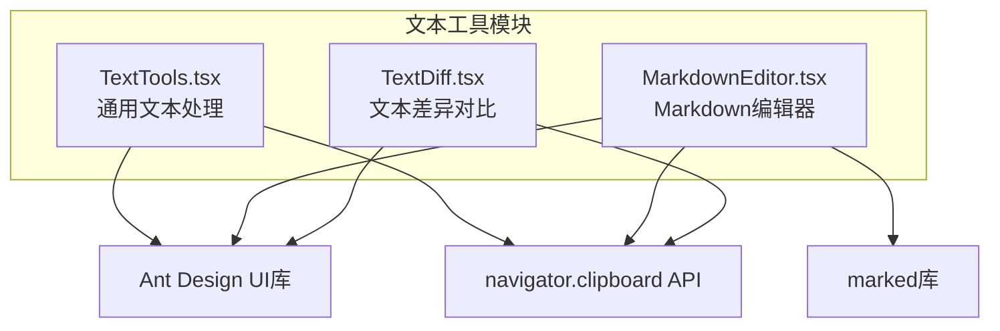
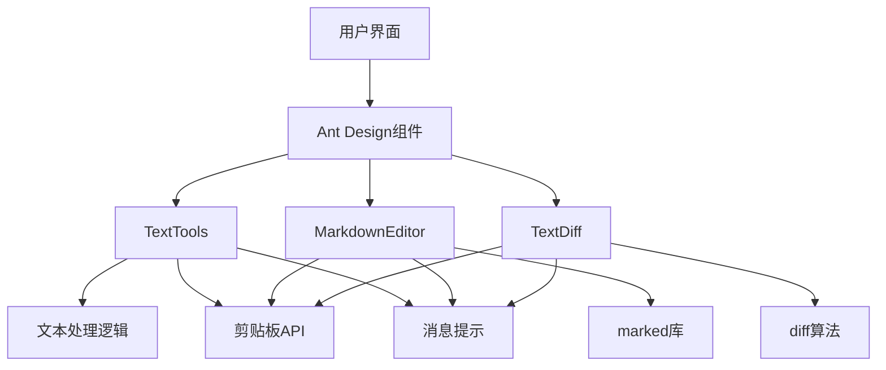
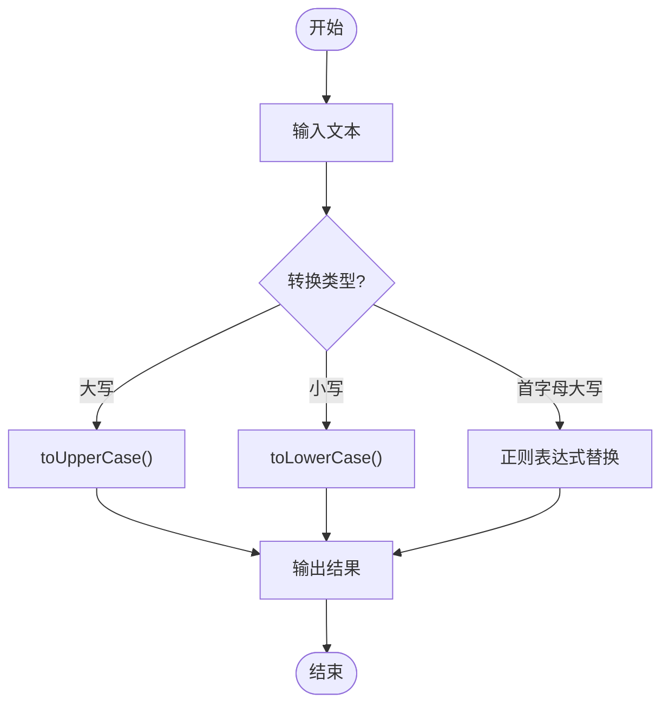
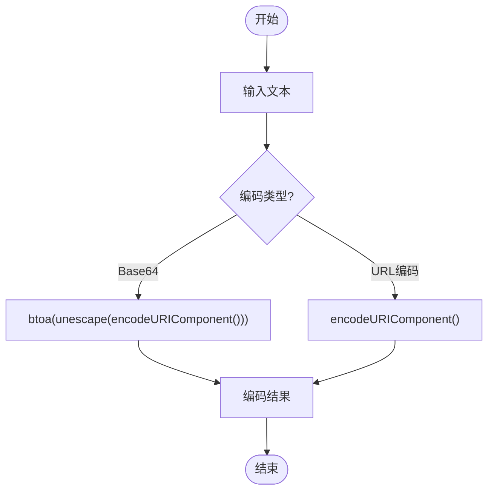
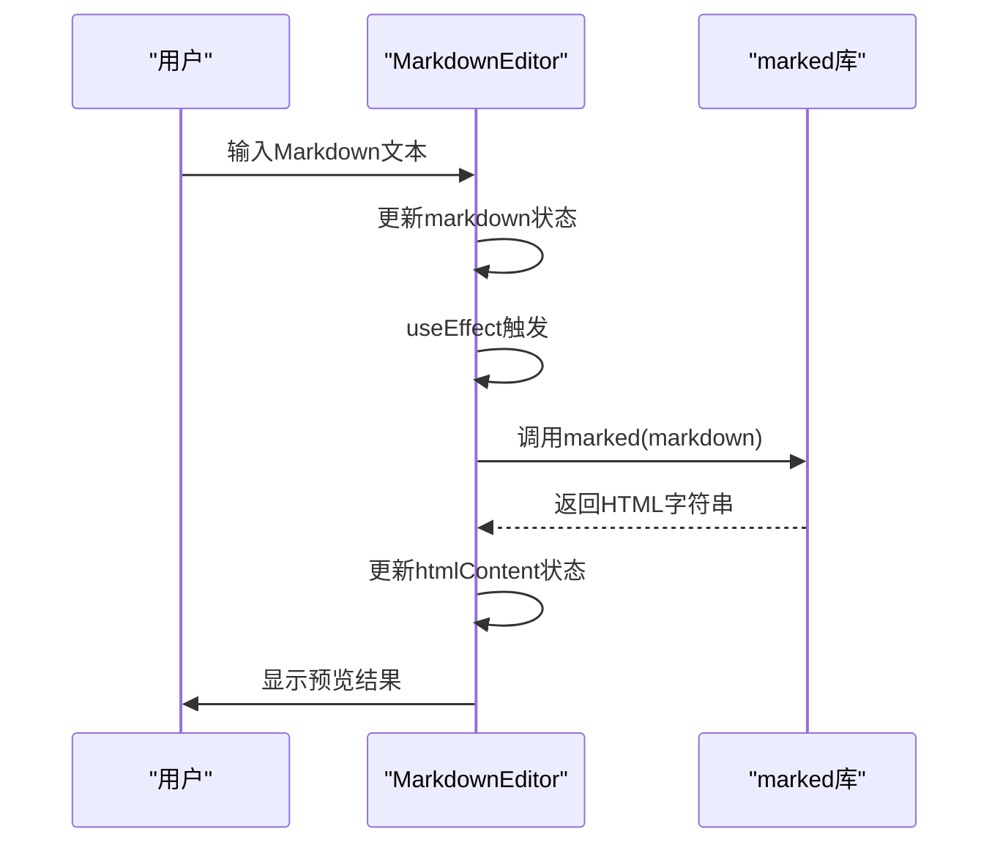
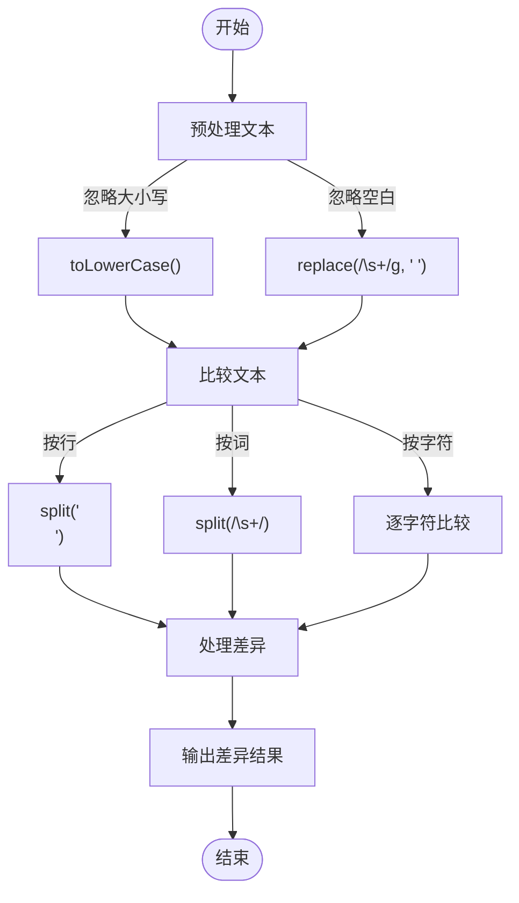
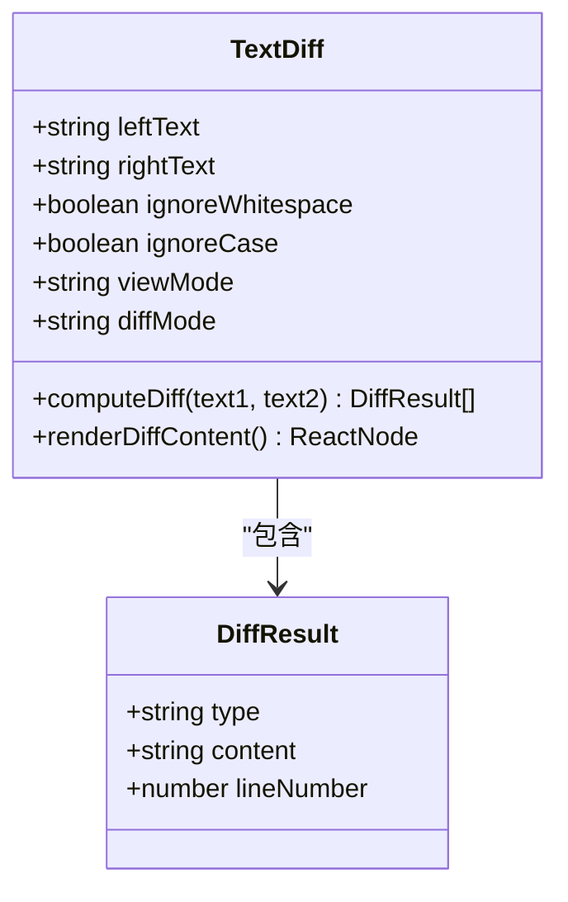
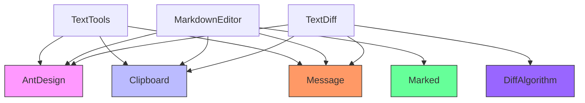
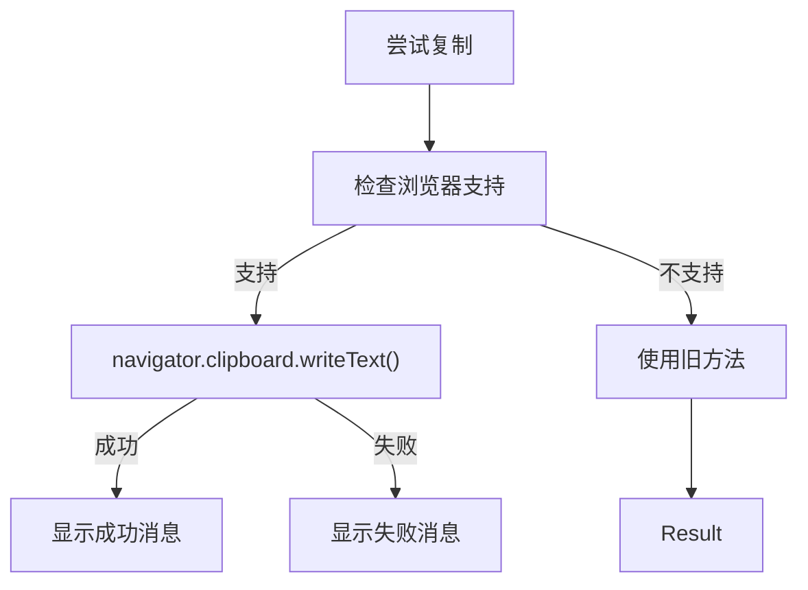

# 文本工具模块

<cite>
**本文档引用的文件**   
- [TextTools.tsx](file://src\components\TextTools.tsx)
- [MarkdownEditor.tsx](file://src\components\MarkdownEditor.tsx)
- [TextDiff.tsx](file://src\components\TextDiff.tsx)
</cite>

## 目录
1. [简介](#简介)
2. [项目结构](#项目结构)
3. [核心组件](#核心组件)
4. [架构概述](#架构概述)
5. [详细组件分析](#详细组件分析)
6. [依赖分析](#依赖分析)
7. [性能考虑](#性能考虑)
8. [故障排除指南](#故障排除指南)
9. [结论](#结论)

## 简介
本文档系统性地讲解了文本工具模块的功能实现，涵盖通用文本处理、Markdown编辑与文本差异对比。详细说明了TextTools.tsx提供的大小写转换、空格清理、编码转换等功能的实现逻辑。分析了MarkdownEditor.tsx基于内容可编辑（contenteditable）或受控组件实现的实时预览机制，支持的Markdown语法范围及扩展方式。深入TextDiff.tsx使用的diff算法来高亮显示两段文本之间的增删改变化。解释这些工具如何共享文本输入区域与操作按钮组件，实现一致的用户体验。提供使用示例，如清理复制的网页文本、撰写技术文档、比较配置文件版本差异。讨论富文本处理的安全性考虑，如XSS防护。

## 项目结构
文本工具模块是officeTools项目中的一个功能模块，位于`src/components/`目录下，与其他工具组件并列。该模块由三个核心组件构成：TextTools（通用文本处理）、MarkdownEditor（Markdown编辑器）和TextDiff（文本差异对比）。这些组件共享Ant Design UI库和一致的用户体验设计模式。



**图示来源**
- [TextTools.tsx](file://src\components\TextTools.tsx)
- [MarkdownEditor.tsx](file://src\components\MarkdownEditor.tsx)
- [TextDiff.tsx](file://src\components\TextDiff.tsx)

## 核心组件
文本工具模块包含三个核心功能组件：TextTools用于通用文本处理，提供格式转换、编码转换等功能；MarkdownEditor提供Markdown实时编辑与预览功能；TextDiff实现文本差异对比，支持多种对比模式。这三个组件均采用React函数式组件和Hooks模式，使用Ant Design作为UI框架，确保了界面风格和交互体验的一致性。

**组件来源**
- [TextTools.tsx](file://src\components\TextTools.tsx)
- [MarkdownEditor.tsx](file://src\components\MarkdownEditor.tsx)
- [TextDiff.tsx](file://src\components\TextDiff.tsx)

## 架构概述
文本工具模块采用组件化架构，三个主要组件独立实现各自功能，但共享相同的UI库和交互模式。所有组件都使用Ant Design的Card、Button、TextArea等组件构建界面，使用message组件提供用户反馈，使用navigator.clipboard API实现剪贴板操作。这种设计确保了用户在使用不同工具时能获得一致的操作体验。



**图示来源**
- [TextTools.tsx](file://src\components\TextTools.tsx)
- [MarkdownEditor.tsx](file://src\components\MarkdownEditor.tsx)
- [TextDiff.tsx](file://src\components\TextDiff.tsx)

## 详细组件分析
### TextTools组件分析
TextTools组件提供通用文本处理功能，包括字符统计、格式转换、编码转换和哈希计算。组件使用Tabs组件组织不同功能，每个功能由独立的子组件实现。

#### 格式转换功能
TextTools的格式转换功能通过简单的字符串方法实现大小写转换。`formatText`函数根据传入的类型参数调用相应的字符串方法。



**图示来源**
- [TextTools.tsx](file://src\components\TextTools.tsx#L100-L139)

#### 编码转换功能
编码转换功能支持Base64和URL编码，使用浏览器内置的btoa和encodeURIComponent函数实现。



**图示来源**
- [TextTools.tsx](file://src\components\TextTools.tsx#L180-L200)

### MarkdownEditor组件分析
MarkdownEditor组件提供Markdown实时编辑与预览功能，支持多种Markdown语法。

#### 实时预览机制
MarkdownEditor使用marked库将Markdown文本实时转换为HTML。通过useEffect Hook监听markdown状态的变化，每次变化时调用marked函数进行转换。



**图示来源**
- [MarkdownEditor.tsx](file://src\components\MarkdownEditor.tsx#L167-L222)

#### 支持的Markdown语法
MarkdownEditor支持以下语法：
- 标题（# 到 ###）
- 粗体（**文本**）和斜体（*文本*）
- 删除线（~~文本~~）
- 链接（[文本](url)）
- 图片（）
- 代码块（```language\n代码\n```）
- 有序和无序列表
- 表格
- 引用块（> 文本）
- 分隔线（---）

这些语法通过marked库的GFM（GitHub Flavored Markdown）选项支持。

**组件来源**
- [MarkdownEditor.tsx](file://src\components\MarkdownEditor.tsx)

### TextDiff组件分析
TextDiff组件实现文本差异对比功能，支持按行、按词、按字符三种对比模式。

#### Diff算法实现
TextDiff使用简单的逐行/逐词/逐字符比较算法来识别文本差异。算法首先对文本进行预处理（忽略大小写和空白），然后逐项比较。



**图示来源**
- [TextDiff.tsx](file://src\components\TextDiff.tsx#L34-L93)

#### 差异显示模式
TextDiff支持两种显示模式：并排显示和统一显示。并排显示模式将原文本和新文本分别显示在左右两侧，统一显示模式将差异混合显示。



**图示来源**
- [TextDiff.tsx](file://src\components\TextDiff.tsx#L0-L36)

## 依赖分析
文本工具模块的三个组件共享多个依赖，确保了功能和体验的一致性。



**图示来源**
- [TextTools.tsx](file://src\components\TextTools.tsx)
- [MarkdownEditor.tsx](file://src\components\MarkdownEditor.tsx)
- [TextDiff.tsx](file://src\components\TextDiff.tsx)

## 性能考虑
文本工具模块在性能方面有以下考虑：
- TextTools的编码转换使用浏览器内置函数，性能良好
- MarkdownEditor使用useMemo和useEffect优化渲染性能
- TextDiff的diff算法时间复杂度为O(n)，对于大文本可能需要优化
- 所有组件都使用受控组件模式，确保状态管理的可预测性

## 故障排除指南
### 剪贴板操作失败
当剪贴板操作失败时，组件会显示"复制失败"消息。这通常是由于浏览器权限限制或安全策略导致。



**组件来源**
- [TextTools.tsx](file://src\components\TextTools.tsx#L120-L139)
- [TextDiff.tsx](file://src\components\TextDiff.tsx#L250-L274)

### Markdown转换失败
Markdown转换失败时，会在控制台输出错误信息，但不会中断程序执行。

**组件来源**
- [MarkdownEditor.tsx](file://src\components\MarkdownEditor.tsx#L170-L175)

## 结论
文本工具模块通过三个组件提供了完整的文本处理解决方案。TextTools提供基础文本处理功能，MarkdownEditor提供富文本编辑能力，TextDiff提供文本比较功能。三个组件通过共享Ant Design UI库和一致的交互模式，为用户提供了统一的使用体验。模块设计简洁，代码可读性强，易于维护和扩展。