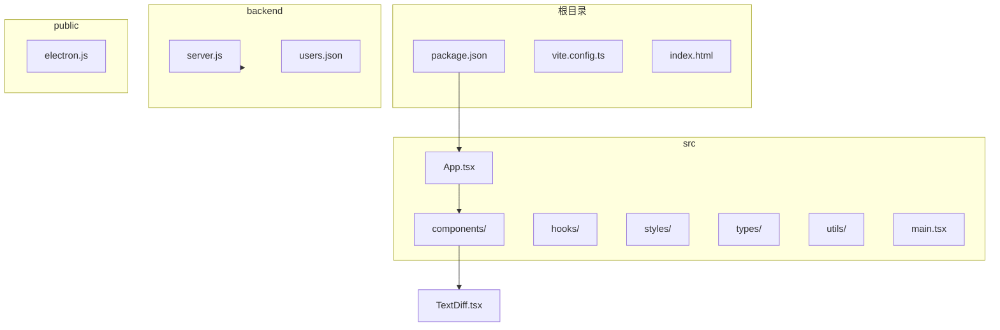
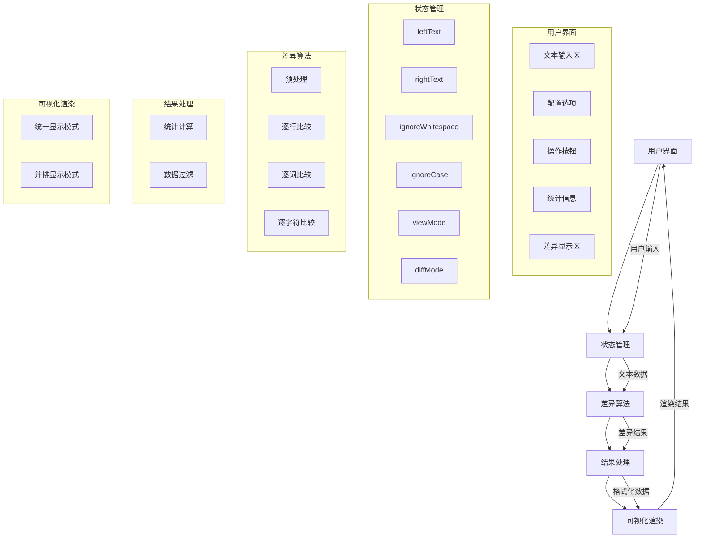
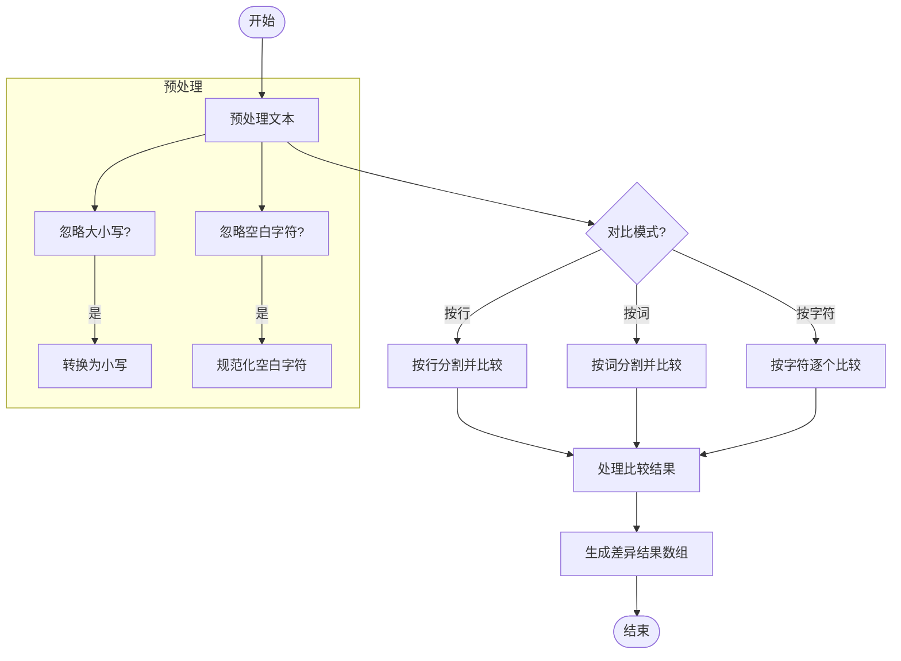
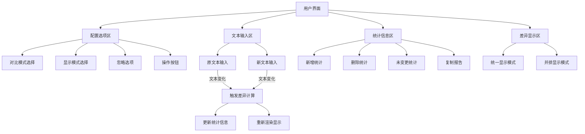
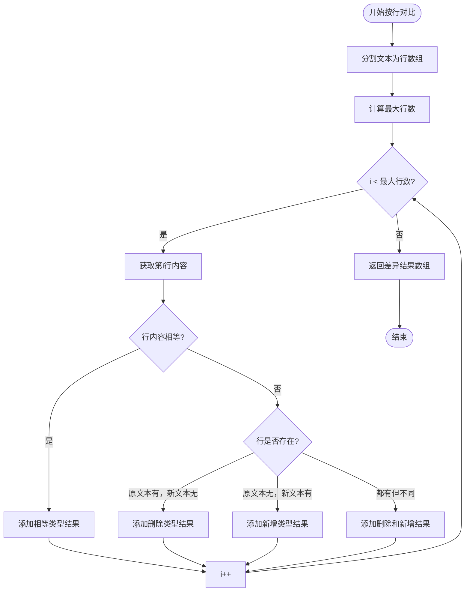
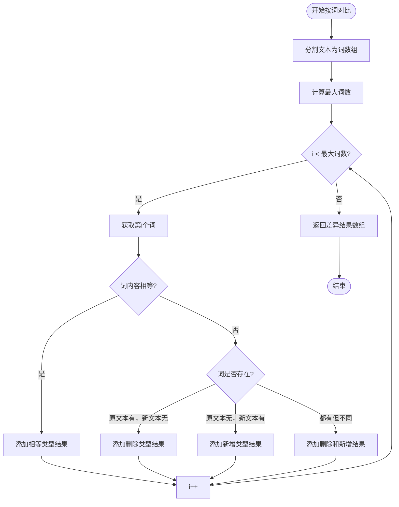
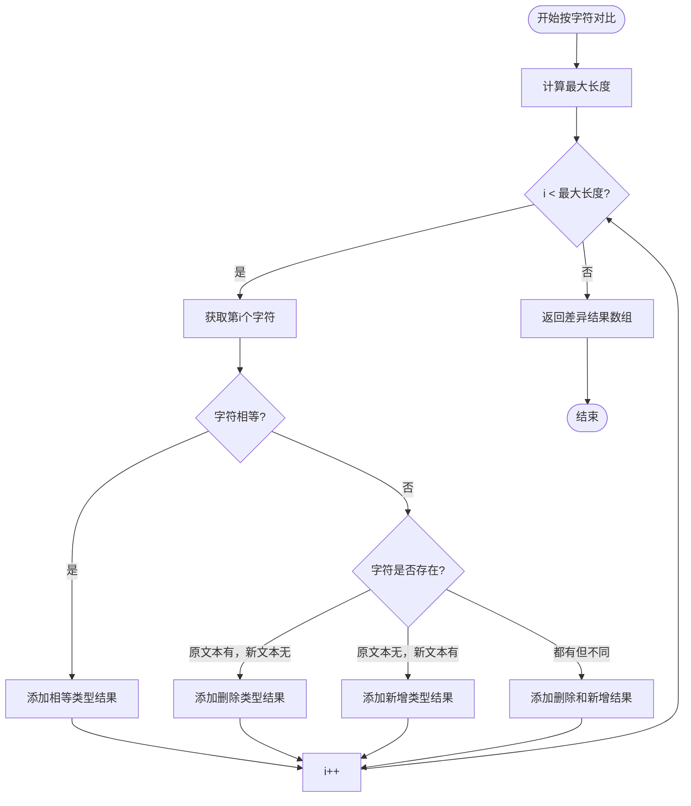
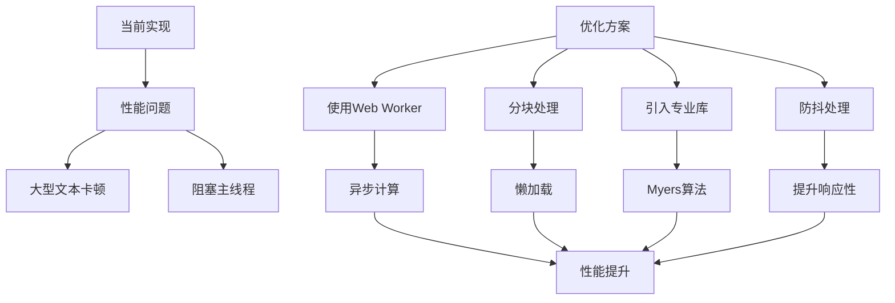

# 文本差异对比

<cite>
**本文档引用的文件**   
- [TextDiff.tsx](file://src/components/TextDiff.tsx)
- [package.json](file://package.json)
</cite>

## 目录
1. [简介](#简介)
2. [项目结构](#项目结构)
3. [核心组件](#核心组件)
4. [架构概述](#架构概述)
5. [详细组件分析](#详细组件分析)
6. [依赖分析](#依赖分析)
7. [性能考虑](#性能考虑)
8. [故障排除指南](#故障排除指南)
9. [结论](#结论)

## 简介
本文档系统性地解析了`TextDiff.tsx`组件的实现原理，重点介绍其文本差异对比功能。该工具允许用户比较两段文本内容，通过可视化方式高亮显示新增、删除和修改的部分。文档将深入分析其使用的差异算法、用户界面设计、配置选项以及实际应用场景。

## 项目结构
该项目是一个多功能办公工具集，采用React框架构建，结合Ant Design组件库提供现代化的用户界面。项目结构清晰，遵循功能模块化的设计原则。



**图示来源**
- [package.json](file://package.json)
- [App.tsx](file://src/App.tsx)

**本节来源**
- [package.json](file://package.json)
- [项目结构](file://)

## 核心组件

`TextDiff.tsx`是本项目的核心组件之一，实现了文本差异对比功能。该组件使用React函数式组件和Hooks（useState, useMemo）来管理状态和优化性能。它提供了三种对比模式（按行、按词、按字符），两种显示模式（并排显示、统一显示），以及忽略空白字符和大小写的选项。

组件的主要功能包括：
- 文本输入区域：支持左右两个文本框输入原文本和新文本
- 对比配置：提供对比模式、显示模式和忽略选项的配置
- 差异计算：实现文本差异算法，生成对比结果
- 结果可视化：以不同颜色高亮显示新增（绿色）、删除（红色）的内容
- 统计信息：显示新增、删除和未变更的统计数量
- 操作功能：支持交换文本、清空内容和复制差异报告

**本节来源**
- [TextDiff.tsx](file://src/components/TextDiff.tsx#L0-L432)

## 架构概述

`TextDiff`组件的架构设计遵循了清晰的分层模式，将数据处理逻辑与UI渲染分离。



**图示来源**
- [TextDiff.tsx](file://src/components/TextDiff.tsx#L0-L432)

## 详细组件分析

### 文本差异算法分析

`TextDiff`组件实现了一个简化的文本差异算法，支持三种对比粒度：按行、按词和按字符。算法首先对输入文本进行预处理，然后根据选择的模式进行比较。



**图示来源**
- [TextDiff.tsx](file://src/components/TextDiff.tsx#L34-L130)

**本节来源**
- [TextDiff.tsx](file://src/components/TextDiff.tsx#L34-L130)

### 用户界面与交互分析

组件的用户界面设计直观易用，采用了Ant Design的布局和组件系统。UI分为四个主要区域：配置选项、文本输入、统计信息和差异显示。



**图示来源**
- [TextDiff.tsx](file://src/components/TextDiff.tsx#L269-L432)

**本节来源**
- [TextDiff.tsx](file://src/components/TextDiff.tsx#L269-L432)

### 算法实现细节

`computeDiff`函数是差异算法的核心实现，它根据不同的对比模式采用相应的比较策略。

#### 按行对比算法


**图示来源**
- [TextDiff.tsx](file://src/components/TextDiff.tsx#L34-L64)

#### 按词对比算法


**图示来源**
- [TextDiff.tsx](file://src/components/TextDiff.tsx#L65-L92)

#### 按字符对比算法


**图示来源**
- [TextDiff.tsx](file://src/components/TextDiff.tsx#L93-L130)

## 依赖分析

通过对项目依赖的分析，可以了解`TextDiff`组件的技术栈和外部依赖情况。

```mermaid
graph LR
TextDiff[TextDiff.tsx] --> React[React]
TextDiff --> AntDesign[Ant Design]
React --> ReactDOM[react-dom]
AntDesign --> Icons[@ant-design/icons]
subgraph "项目依赖"
React
ReactDOM
AntDesign
Icons
end
subgraph "开发依赖"
TypeScript[TypeScript]
Vite[Vite]
Electron[Electron]
end
TextDiff --> TypeScript
TextDiff --> Vite
```

**图示来源**
- [package.json](file://package.json)
- [TextDiff.tsx](file://src/components/TextDiff.tsx)

**本节来源**
- [package.json](file://package.json#L0-L76)

## 性能考虑

### 当前性能特征
`TextDiff`组件的差异算法采用了简单的逐行/逐词/逐字符比较方法，其时间复杂度为O(n)，其中n是文本的长度（行数、词数或字符数）。这种实现方式简单直观，但对于大型文本文件可能会导致性能问题，因为比较操作是在主线程中同步执行的。

通过分析代码，可以确认以下性能特征：
- **无外部算法库**：项目没有引入`diff-match-patch`等专业的文本差异算法库，而是使用了自实现的简化算法
- **无Myers算法**：代码中没有实现或引用Myers差分算法，该算法是更高效的经典差分算法
- **无Web Worker**：差异计算在主线程中执行，没有使用Web Worker进行异步计算，可能导致界面卡顿
- **无分块处理**：算法对整个文本进行一次性处理，没有实现分块或懒加载机制

### 性能优化建议
针对大型文本处理的性能问题，可以考虑以下优化方案：



**图示来源**
- [TextDiff.tsx](file://src/components/TextDiff.tsx)
- [package.json](file://package.json)

**本节来源**
- [TextDiff.tsx](file://src/components/TextDiff.tsx)
- [package.json](file://package.json)

## 故障排除指南

### 常见问题及解决方案
1. **差异结果显示不准确**
   - 检查是否启用了"忽略空白字符"或"忽略大小写"选项
   - 确认对比模式（按行、按词、按字符）是否符合预期
   - 验证输入文本的格式是否正确

2. **界面卡顿或无响应**
   - 对于大型文本，建议使用按行对比模式而非按字符对比
   - 清空不必要的文本内容以减轻计算负担
   - 考虑将大型文件分割为较小的部分进行对比

3. **统计信息不正确**
   - 确保两个文本框都有输入内容
   - 检查算法是否正确识别了相等、新增和删除的部分
   - 验证预处理逻辑（大小写、空白字符处理）是否影响了结果

4. **复制功能失效**
   - 检查浏览器是否允许剪贴板访问
   - 确认浏览器支持`navigator.clipboard.writeText` API
   - 尝试在安全上下文（HTTPS）中使用该功能

**本节来源**
- [TextDiff.tsx](file://src/components/TextDiff.tsx#L269-L274)

## 结论
`TextDiff`组件实现了一个功能完整的文本差异对比工具，提供了直观的用户界面和多种对比选项。虽然其算法实现相对简单，没有采用Myers等高级差分算法，也没有使用`diff-match-patch`等专业库，但对于常规的文本对比需求已经足够。

该组件的主要优势在于：
- **用户友好**：清晰的界面设计和直观的操作流程
- **功能完整**：支持多种对比模式和显示方式
- **配置灵活**：提供忽略空白字符和大小写的选项
- **集成良好**：与Ant Design组件库无缝集成

对于未来优化，建议：
1. 引入专业的文本差异算法库以提高准确性和性能
2. 使用Web Worker将差异计算移至后台线程，避免阻塞UI
3. 实现分块处理机制，支持大型文件的渐进式加载和显示
4. 添加同步滚动功能，在并排显示模式下保持两个文本区域的滚动同步
5. 支持更多文件格式的直接导入和比较

总体而言，`TextDiff`组件是一个实用的文本对比工具，适合用于比较配置文件、代码片段、文档修订等场景，为用户提供清晰的变更可视化。