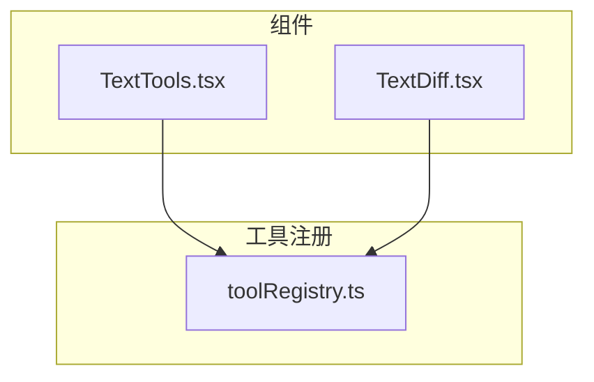
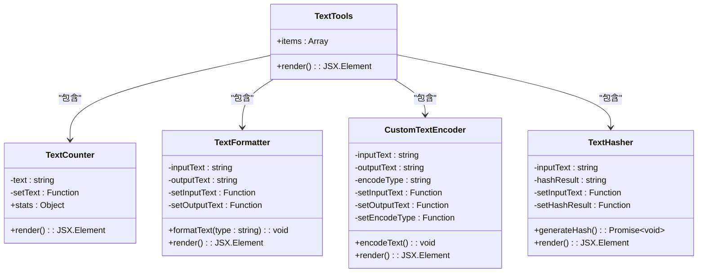
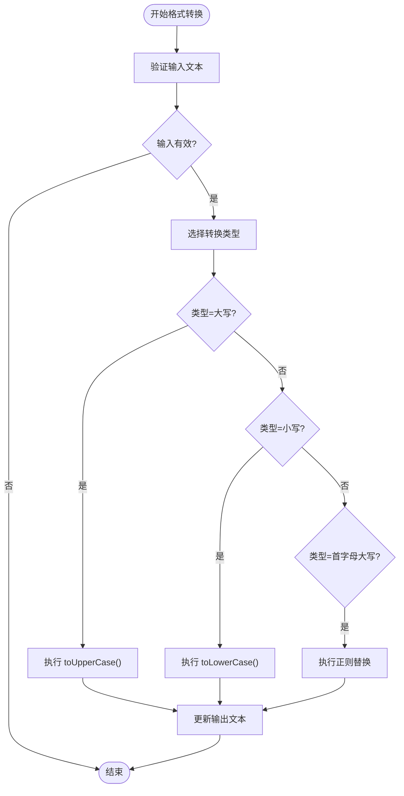
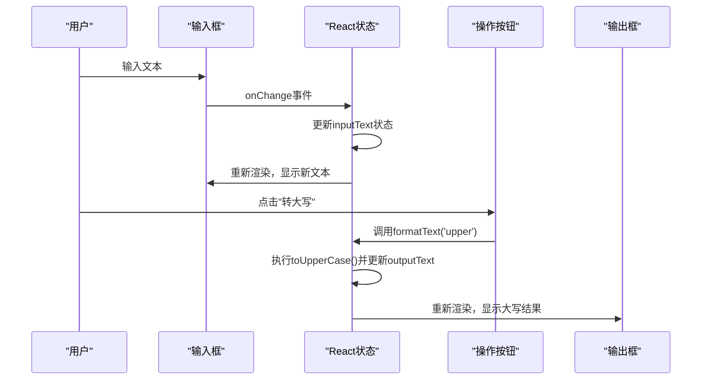

# 通用文本处理

<cite>
**本文档中引用的文件**   
- [TextTools.tsx](file://src/components/TextTools.tsx)
- [TextDiff.tsx](file://src/components/TextDiff.tsx)
- [toolRegistry.ts](file://src/utils/toolRegistry.ts)
</cite>

## 目录
1. [项目结构](#项目结构)
2. [核心功能分析](#核心功能分析)
3. [文本格式转换实现](#文本格式转换实现)
4. [状态管理与UI同步机制](#状态管理与ui同步机制)
5. [文本统计功能](#文本统计功能)
6. [编码与哈希功能](#编码与哈希功能)
7. [性能与边界情况考量](#性能与边界情况考量)
8. [实际应用场景](#实际应用场景)

## 项目结构

项目采用模块化组件设计，`TextTools.tsx`位于`src/components/`目录下，是文本处理功能的核心组件。该组件通过Ant Design的Tabs组件组织多个子功能模块，包括文本统计、格式转换、编码转换和哈希计算。`TextDiff.tsx`作为另一个独立的文本处理工具，实现了文本对比功能，两者在文本预处理逻辑上存在相似性。工具注册文件`toolRegistry.ts`将这些组件注册到应用的工具分类系统中，使其在"文本工具"类别下可见。



**图示来源**
- [TextTools.tsx](file://src/components/TextTools.tsx)
- [TextDiff.tsx](file://src/components/TextDiff.tsx)
- [toolRegistry.ts](file://src/utils/toolRegistry.ts)

**本节来源**
- [TextTools.tsx](file://src/components/TextTools.tsx)
- [TextDiff.tsx](file://src/components/TextDiff.tsx)
- [toolRegistry.ts](file://src/utils/toolRegistry.ts)

## 核心功能分析

`TextTools`组件通过React函数式组件和Hooks实现，采用`useState`进行状态管理。其核心功能被划分为四个独立的子组件：`TextCounter`（文本统计）、`TextFormatter`（格式转换）、`CustomTextEncoder`（编码转换）和`TextHasher`（哈希计算），通过Ant Design的Tabs组件进行导航。这种设计模式实现了功能的高内聚和低耦合，每个子组件负责单一的文本处理任务。

组件的入口点`TextTools`定义了Tabs的配置项，每个配置项的`children`属性引用一个子组件。这种组合模式使得功能扩展变得简单，只需添加新的子组件并将其注册到Tabs的`items`数组中即可。



**图示来源**
- [TextTools.tsx](file://src/components/TextTools.tsx)

**本节来源**
- [TextTools.tsx](file://src/components/TextTools.tsx)

## 文本格式转换实现

`TextFormatter`组件实现了三种核心的文本格式转换功能：转大写、转小写和首字母大写。其实现逻辑基于JavaScript的原生字符串方法和正则表达式。

### 大小写转换
- **转大写**: 调用`inputText.toUpperCase()`方法，该方法将字符串中的所有字符转换为大写形式。
- **转小写**: 调用`inputText.toLowerCase()`方法，将所有字符转换为小写形式。

### 首字母大写
该功能的实现更为复杂，使用了正则表达式和回调函数：
```javascript
inputText.replace(/\w\S*/g, (txt) => 
  txt.charAt(0).toUpperCase() + txt.substr(1).toLowerCase())
```
- **正则表达式** `/\\w\\S*/g`:
  - `\\w`: 匹配任何单词字符（字母、数字、下划线）。
  - `\\S*`: 匹配零个或多个非空白字符。
  - `g`: 全局标志，确保匹配字符串中的所有符合条件的子串。
- **回调函数**: 对每个匹配到的单词，将首字符（`charAt(0)`）转换为大写，其余部分（`substr(1)`）转换为小写。

这种实现方式能够正确处理由空格、标点符号等分隔的单词，确保每个单词的首字母都被大写化。



**图示来源**
- [TextTools.tsx](file://src/components/TextTools.tsx#L73-L129)

**本节来源**
- [TextTools.tsx](file://src/components/TextTools.tsx#L73-L129)

## 状态管理与UI同步机制

`TextTools`及其子组件使用React的`useState` Hook进行状态管理，实现了输入与输出的即时预览效果。

### 状态定义
每个子组件都定义了必要的状态变量：
- `TextFormatter`: `inputText`（输入文本）、`outputText`（输出文本）
- `CustomTextEncoder`: `inputText`、`outputText`、`encodeType`（编码类型）
- `TextCounter`: `text`（待统计文本）
- `TextHasher`: `inputText`、`hashResult`（哈希结果）

### UI同步逻辑
- **输入框同步**: `<TextArea>`组件的`value`属性绑定到对应的状态变量（如`inputText`），`onChange`事件处理器在用户输入时调用`setInputText`更新状态。这形成了一个受控组件，确保UI显示与React状态完全同步。
- **输出框更新**: 当用户点击操作按钮（如"转大写"）时，事件处理器（如`formatText`）会根据输入状态计算结果，并调用`setOutputText`等函数更新输出状态。由于状态更新会触发组件重新渲染，输出框的`value`属性随之更新，实现了即时预览。
- **防抖与性能**: 代码中未显式实现防抖（Debounce），这意味着每次输入都会触发状态更新和重新渲染。对于超大文本，这可能导致性能问题。理想情况下，应在`onChange`处理器中加入防抖逻辑，以减少不必要的计算和渲染。



**图示来源**
- [TextTools.tsx](file://src/components/TextTools.tsx)

**本节来源**
- [TextTools.tsx](file://src/components/TextTools.tsx)

## 文本统计功能

`TextCounter`组件提供了基础的文本统计功能，通过计算`text`状态变量的属性来实现。

### 统计指标
- **字符数**: `text.length`，直接获取字符串的长度。
- **字符数(无空格)**: `text.replace(/\\s/g, '').length`，使用正则表达式`/\\s/g`全局匹配所有空白字符（包括空格、制表符、换行符等），并将其替换为空字符串，然后计算新字符串的长度。
- **单词数**: 实现逻辑为`text.trim() ? text.trim().split(/\\s+/).length : 0`。
  - `trim()`: 移除字符串首尾的空白字符，防止因空行或多余空格导致统计错误。
  - `split(/\\s+/)`: 使用正则表达式`/\\s+/`按一个或多个连续的空白字符分割字符串，生成单词数组。
  - `.length`: 获取数组长度，即单词数量。
- **行数**: `text.split('\\n').length`，直接按换行符`\\n`分割字符串并计算数组长度。

此实现简洁高效，但未考虑不同操作系统的换行符差异（如Windows的`\\r\\n`），在处理跨平台文本时可能产生偏差。

**本节来源**
- [TextTools.tsx](file://src/components/TextTools.tsx#L34-L71)

## 编码与哈希功能

### 编码转换
`CustomTextEncoder`组件支持Base64和URL编码。
- **Base64编码**: 使用`btoa(unescape(encodeURIComponent(inputText)))`。
  - `encodeURIComponent`: 将文本转换为UTF-8编码的百分号编码字符串。
  - `unescape`: 将百分号编码字符串转换为原始字节序列（在现代JavaScript中，应使用`atob`和`TextEncoder`的组合来替代，因为`unescape`已废弃）。
  - `btoa`: 将二进制数据编码为Base64字符串。
- **URL编码**: 直接使用`encodeURIComponent(inputText)`。

### 哈希计算
`TextHasher`组件使用Web Crypto API计算SHA-256哈希值。
1. 创建`TextEncoder`实例，将输入文本编码为UTF-8字节流。
2. 调用`crypto.subtle.digest('SHA-256', data)`异步计算哈希值，返回一个`ArrayBuffer`。
3. 将`ArrayBuffer`转换为`Uint8Array`，再转换为普通数组。
4. 将每个字节映射为两位十六进制字符串（`b.toString(16).padStart(2, '0')`），并连接成最终的哈希字符串。

此实现利用了浏览器内置的安全API，确保了哈希计算的准确性和安全性。

**本节来源**
- [TextTools.tsx](file://src/components/TextTools.tsx#L131-L236)

## 性能与边界情况考量

### 性能优化
- **即时预览**: 当前实现对每次输入都进行状态更新，对于大文本可能导致界面卡顿。建议引入防抖机制，例如在`onChange`事件后延迟300ms再更新状态，以平衡响应速度和性能。
- **计算开销**: 哈希计算和Base64编码对于超大文本可能耗时较长，应考虑在Web Worker中执行，避免阻塞主线程。

### 边界情况
- **空输入处理**: `TextHasher`组件在输入为空时会显示警告，而其他组件则允许空输入，处理方式合理。
- **异常捕获**: `CustomTextEncoder`和`TextHasher`组件都使用了`try-catch`来捕获编码和哈希计算中的错误，并通过`message.error`向用户反馈，提升了用户体验。
- **内存使用**: 对于超大文本（如数百MB的日志文件），将整个文本加载到内存中进行处理可能导致内存溢出。更优的方案是采用流式处理或分块处理，但这在当前的UI设计中难以实现。

**本节来源**
- [TextTools.tsx](file://src/components/TextTools.tsx)

## 实际应用场景

### 清理网页复制文本
用户从网页复制的文本常包含多余的空格、换行和制表符。使用`TextFormatter`的"转小写"或"首字母大写"功能前，可先通过`TextCounter`的"字符数(无空格)"统计来确认清理效果，或结合`TextDiff`工具对比清理前后的差异。

### 格式化日志内容
服务器日志通常为纯文本，需要进行格式化以便阅读。可使用`TextFormatter`将日志中的关键信息（如错误级别`ERROR`）统一转换为大写，或将整个日志转换为小写以进行统一搜索。

### 数据编码与验证
在开发API时，常需对参数进行URL编码。`CustomTextEncoder`可快速完成此任务。`TextHasher`可用于生成文本的唯一指纹，验证数据完整性。

**本节来源**
- [TextTools.tsx](file://src/components/TextTools.tsx)
- [TextDiff.tsx](file://src/components/TextDiff.tsx)