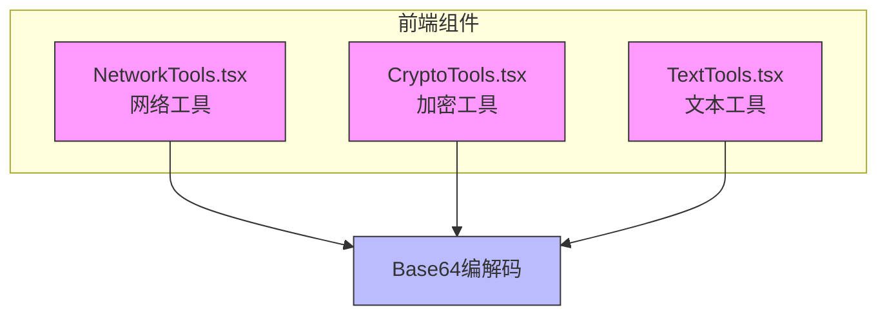
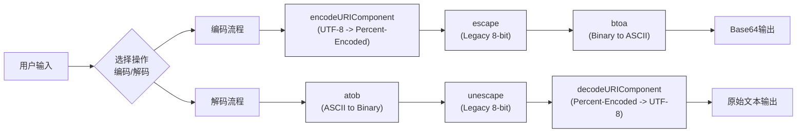
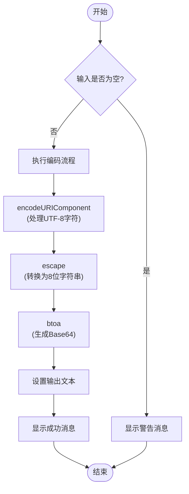
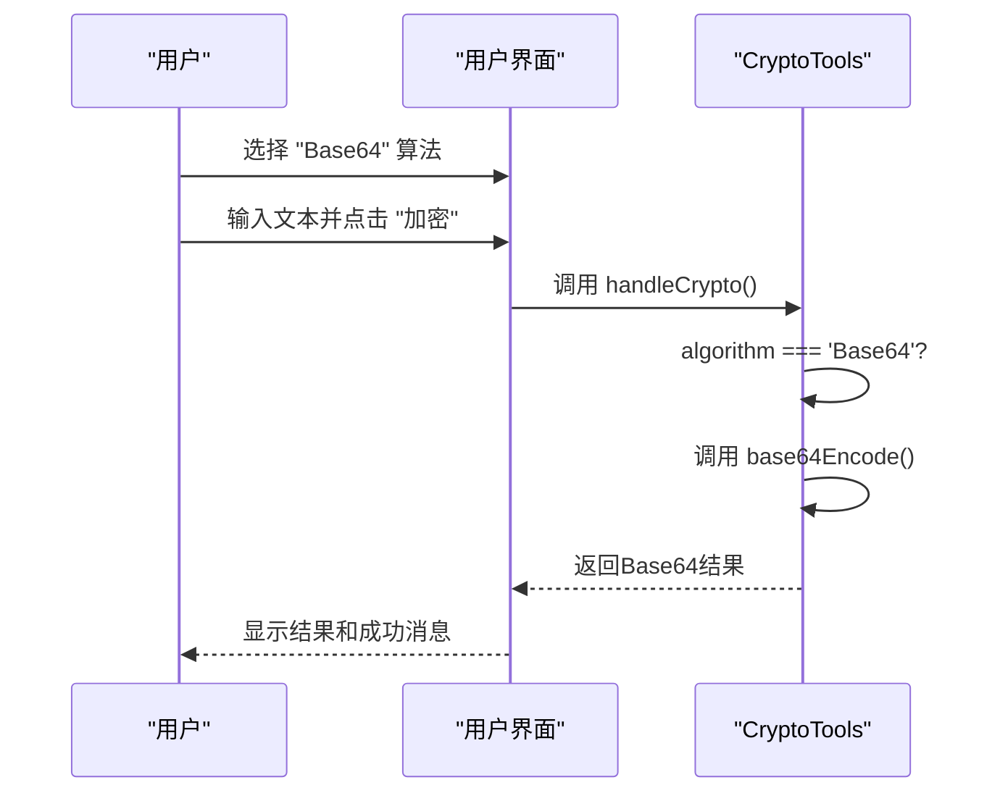

# Base64编解码

<cite>
**本文档中引用的文件**   
- [NetworkTools.tsx](file://src/components/NetworkTools.tsx#L56-L106)
- [CryptoTools.tsx](file://src/components/CryptoTools.tsx#L74-L122)
- [TextTools.tsx](file://src/components/TextTools.tsx#L135-L186)
</cite>

## 目录
1. [简介](#简介)
2. [项目结构](#项目结构)
3. [核心组件](#核心组件)
4. [架构概述](#架构概述)
5. [详细组件分析](#详细组件分析)
6. [依赖分析](#依赖分析)
7. [性能考虑](#性能考虑)
8. [故障排除指南](#故障排除指南)
9. [结论](#结论)

## 简介
本文档深入解析了 `NetworkTools.tsx`、`CryptoTools.tsx` 和 `TextTools.tsx` 文件中实现的 Base64 编解码功能。重点阐述了如何利用 JavaScript 的全局函数 `atob` 和 `btoa` 实现字符串与 Base64 编码之间的相互转换。文档还探讨了该功能在数据嵌入、JWT 令牌处理和 API 认证中的典型用途，分析了处理非 ASCII 字符的兼容性解决方案，并讨论了相关的安全注意事项。

## 项目结构
该项目是一个基于 React 和 TypeScript 的前端工具集合，包含多种实用工具组件。Base64 编解码功能分散在多个组件中，主要位于 `src/components` 目录下。



**图示来源**
- [NetworkTools.tsx](file://src/components/NetworkTools.tsx)
- [CryptoTools.tsx](file://src/components/CryptoTools.tsx)
- [TextTools.tsx](file://src/components/TextTools.tsx)

**节来源**
- [NetworkTools.tsx](file://src/components/NetworkTools.tsx)
- [CryptoTools.tsx](file://src/components/CryptoTools.tsx)
- [TextTools.tsx](file://src/components/TextTools.tsx)

## 核心组件
Base64 编解码功能的核心实现依赖于 JavaScript 的内置函数 `btoa`（二进制转 ASCII）和 `atob`（ASCII 转二进制）。为了正确处理 UTF-8 字符，代码中结合使用了 `encodeURIComponent`/`decodeURIComponent` 和 `escape`/`unescape` 函数。

在 `NetworkTools.tsx` 中，`encodeBase64` 函数通过 `btoa(unescape(encodeURIComponent(text)))` 将输入的 UTF-8 文本编码为 Base64。`decodeBase64` 函数则通过 `decodeURIComponent(escape(atob(text)))` 将 Base64 字符串解码回原始文本。这种模式在 `CryptoTools.tsx` 和 `TextTools.tsx` 中也被复用。

**节来源**
- [NetworkTools.tsx](file://src/components/NetworkTools.tsx#L56-L106)
- [CryptoTools.tsx](file://src/components/CryptoTools.tsx#L74-L122)
- [TextTools.tsx](file://src/components/TextTools.tsx#L135-L186)

## 架构概述
Base64 编解码功能作为独立的工具模块，被集成到多个用户界面组件中。其架构简单直接，不依赖外部库，利用浏览器原生 API 完成所有操作。



**图示来源**
- [NetworkTools.tsx](file://src/components/NetworkTools.tsx#L56-L106)
- [CryptoTools.tsx](file://src/components/CryptoTools.tsx#L74-L122)

## 详细组件分析
### NetworkTools.tsx 分析
`NetworkTools.tsx` 组件提供了一个专门的标签页用于 Base64 编解码。它包含两个文本区域，分别用于输入原始文本和显示编码/解码结果。



**图示来源**
- [NetworkTools.tsx](file://src/components/NetworkTools.tsx#L56-L106)

**节来源**
- [NetworkTools.tsx](file://src/components/NetworkTools.tsx#L56-L106)

### CryptoTools.tsx 分析
在 `CryptoTools.tsx` 中，Base64 被作为一种“加密”算法提供，尽管它实际上并不提供任何安全性。当用户选择 "Base64" 算法时，`handleCrypto` 函数会调用 `base64Encode` 或 `base64Decode` 函数。



**图示来源**
- [CryptoTools.tsx](file://src/components/CryptoTools.tsx#L74-L122)

**节来源**
- [CryptoTools.tsx](file://src/components/CryptoTools.tsx#L74-L122)

## 依赖分析
Base64 编解码功能完全依赖于浏览器的原生 JavaScript API，没有引入任何外部依赖。其核心依赖关系如下：

```mermaid
classDiagram
class Base64Encoder {
+encode(text : string) : string
-btoa()
-encodeURIComponent()
-escape()
}
class Base64Decoder {
+decode(text : string) : string
-atob()
-unescape()
-decodeURIComponent()
}
class UIComponent {
+NetworkTools
+CryptoTools
+TextTools
}
UIComponent --> Base64Encoder : "使用"
UIComponent --> Base64Decoder : "使用"
Base64Encoder ..> "btoa" : "调用"
Base64Encoder ..> "encodeURIComponent" : "调用"
Base64Encoder ..> "escape" : "调用"
Base64Decoder ..> "atob" : "调用"
Base64Decoder ..> "unescape" : "调用"
Base64Decoder ..> "decodeURIComponent" : "调用"
```

**图示来源**
- [NetworkTools.tsx](file://src/components/NetworkTools.tsx#L56-L106)
- [CryptoTools.tsx](file://src/components/CryptoTools.tsx#L74-L122)
- [TextTools.tsx](file://src/components/TextTools.tsx#L135-L186)

**节来源**
- [NetworkTools.tsx](file://src/components/NetworkTools.tsx#L56-L106)
- [CryptoTools.tsx](file://src/components/CryptoTools.tsx#L74-L122)
- [TextTools.tsx](file://src/components/TextTools.tsx#L135-L186)

## 性能考虑
由于 Base64 编解码操作直接调用浏览器的原生函数，其性能表现非常优秀，对于常规文本处理几乎没有可感知的延迟。`btoa` 和 `atob` 是高度优化的底层函数。然而，需要注意的是，Base64 编码会使数据体积增加约 33%，这在处理大文件时可能会影响网络传输效率和内存占用。

## 故障排除指南
当 Base64 操作失败时，系统会捕获异常并显示用户友好的错误消息。

**常见问题及解决方案：**
- **问题：** "Base64编码失败" 或 "Base64解码失败"
  - **原因：** 输入包含无法被 `atob`/`btoa` 处理的非法字符，或解码时输入的 Base64 字符串格式不正确（如缺少填充字符 `=`）。
  - **解决方案：** 确保输入是有效的文本或标准 Base64 字符串。检查是否有不可见的特殊字符。

- **问题：** 解码后出现乱码
  - **原因：** `escape`/`unescape` 函数是遗留的，对某些字符集的处理可能不完美。
  - **解决方案：** 对于现代应用，建议使用 `TextEncoder` 和 `TextDecoder` API 来替代 `escape`/`unescape`，以获得更好的 UTF-8 兼容性。

**节来源**
- [CryptoTools.tsx](file://src/components/CryptoTools.tsx#L74-L122)

## 结论
`officeTools` 项目中的 Base64 编解码功能实现简洁有效，通过组合使用 `btoa`/`atob` 与 `encodeURIComponent`/`decodeURIComponent` 及 `escape`/`unescape`，成功解决了 UTF-8 字符的兼容性问题。该功能被合理地集成到 `NetworkTools`、`CryptoTools` 和 `TextTools` 等多个组件中，满足了不同的使用场景。虽然当前实现依赖于已废弃的 `escape`/`unescape` 函数，但整体功能稳定。未来可考虑升级到 `TextEncoder`/`TextDecoder` 以获得更现代和标准的实现方式。同时，文档强调了 Base64 并非加密手段，建议在传输敏感信息时结合 HTTPS 使用。