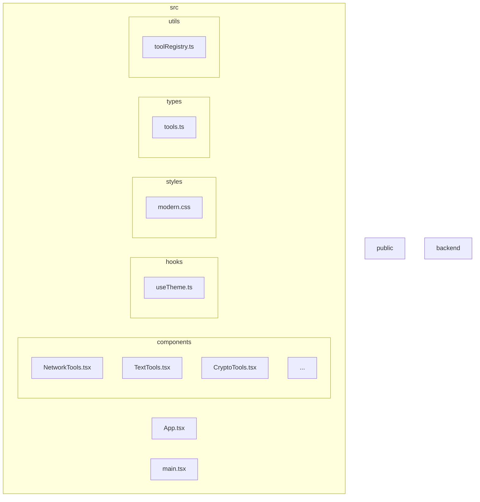
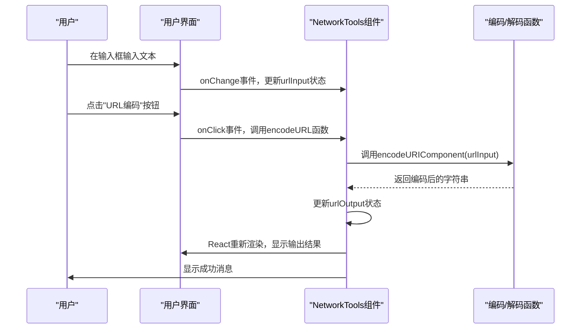
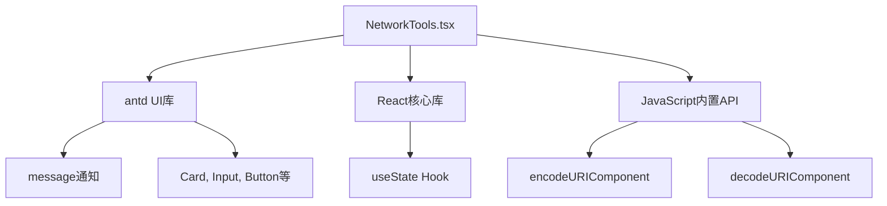

# URL编码与解码

<cite>
**本文档引用文件**   
- [NetworkTools.tsx](file://src/components/NetworkTools.tsx)
- [TextTools.tsx](file://src/components/TextTools.tsx)
- [CryptoTools.tsx](file://src/components/CryptoTools.tsx)
</cite>

## 目录
1. [简介](#简介)
2. [项目结构](#项目结构)
3. [核心组件](#核心组件)
4. [架构概述](#架构概述)
5. [详细组件分析](#详细组件分析)
6. [依赖分析](#依赖分析)
7. [性能考虑](#性能考虑)
8. [故障排除指南](#故障排除指南)
9. [结论](#结论)

## 简介
本文档详细说明了`NetworkTools.tsx`中URL编码与解码功能的实现机制。该功能利用JavaScript原生的`encodeURIComponent`和`decodeURIComponent`函数，安全地处理特殊字符、空格及Unicode字符。文档将深入探讨该功能在构建查询参数、解析URL片段和防止XSS攻击中的实际应用场景，并通过代码示例展示对复杂字符串（如包含中文或符号）的编码解码过程。同时，文档将讨论与`encodeURI`的区别，指出常见错误（如重复编码、未处理null/undefined值），并提供防御性编程建议。最后，结合项目上下文，说明该组件如何通过状态管理实时响应用户输入并格式化输出。

## 项目结构
该项目是一个基于React的办公工具集，采用TypeScript和Ant Design组件库构建。项目结构清晰，按功能模块组织代码。`src/components`目录下包含了多个独立的工具组件，每个组件负责特定的功能，如计算器、代码格式化、颜色转换、网络工具等。`NetworkTools`组件是其中之一，专注于提供网络相关的实用功能，包括URL编码/解码、Base64编码/解码、IP查询、端口检测和Hash计算。



**图源**
- [NetworkTools.tsx](file://src/components/NetworkTools.tsx)
- [TextTools.tsx](file://src/components/TextTools.tsx)
- [CryptoTools.tsx](file://src/components/CryptoTools.tsx)

**本节来源**
- [NetworkTools.tsx](file://src/components/NetworkTools.tsx)
- [TextTools.tsx](file://src/components/TextTools.tsx)
- [CryptoTools.tsx](file://src/components/CryptoTools.tsx)

## 核心组件
`NetworkTools`组件是本分析的核心。它使用React的函数式组件和Hooks（如`useState`）来管理内部状态。组件通过`Tabs`组件提供了一个多标签页的界面，其中“URL编码/解码”标签页实现了核心的编码解码功能。该功能由两个主要函数`encodeURL`和`decodeURL`驱动，它们分别调用`encodeURIComponent`和`decodeURIComponent`来处理用户输入。

**本节来源**
- [NetworkTools.tsx](file://src/components/NetworkTools.tsx#L56-L106)

## 架构概述
`NetworkTools`组件的架构遵循了React的声明式UI和状态驱动视图的原则。用户界面（UI）由`Input`和`TextArea`等表单元素构成，用于接收用户输入。这些输入通过`onChange`事件处理器与React状态（`urlInput`）绑定。当用户点击“URL编码”或“URL解码”按钮时，会触发相应的事件处理函数（`encodeURL`或`decodeURL`）。这些函数执行核心的编码/解码逻辑，并将结果更新到另一个状态（`urlOutput`）中。由于React的响应式特性，`urlOutput`状态的更新会自动触发UI的重新渲染，从而在输出文本框中显示结果。



**图源**
- [NetworkTools.tsx](file://src/components/NetworkTools.tsx#L56-L106)
- [NetworkTools.tsx](file://src/components/NetworkTools.tsx#L293-L334)

## 详细组件分析
### URL编码与解码功能分析
`NetworkTools`组件中的URL编码与解码功能是其实现的核心部分。该功能旨在为用户提供一个简单易用的界面，来安全地处理URL中的特殊字符。

#### 实现机制
该功能的实现依赖于JavaScript的两个内置函数：`encodeURIComponent`和`decodeURIComponent`。

- **`encodeURIComponent`**: 此函数会编码URI的组件部分。它会将除了字母、数字、以及`- _ . ! ~ * ' ( )`之外的所有字符转换为一个或多个UTF-8编码的字节序列，并对每个字节进行百分号编码（例如，空格变为`%20`，中文“你好”变为`%E4%BD%A0%E5%A5%BD`）。这确保了编码后的字符串可以安全地用作URL的查询参数或路径的一部分。
- **`decodeURIComponent`**: 此函数是`encodeURIComponent`的逆操作。它会解码一个由`encodeURIComponent`编码的字符串，将百分号编码的序列转换回原始字符。

在`NetworkTools.tsx`中，这两个函数被封装在`encodeURL`和`decodeURL`函数中：
```typescript
// URL编码
const encodeURL = () => {
  if (!urlInput.trim()) {
    message.warning('请输入要编码的URL');
    return;
  }
  try {
    const encoded = encodeURIComponent(urlInput);
    setUrlOutput(encoded);
    message.success('URL编码成功');
  } catch (error) {
    message.error('编码失败');
  }
};

// URL编码
const decodeURL = () => {
  if (!urlInput.trim()) {
    message.warning('请输入要解码的URL');
    return;
  }
  try {
    const decoded = decodeURIComponent(urlInput);
    setUrlOutput(decoded);
    message.success('URL解码成功');
  } catch (error) {
    message.error('解码失败，请检查输入格式');
  }
};
```

#### 与`encodeURI`的区别
`encodeURI`和`encodeURIComponent`是两个容易混淆的函数。它们的主要区别在于编码的范围：
- `encodeURI`：用于编码整个URI。它不会编码URI中具有特殊含义的保留字符，如`:`、`/`、`;`、`?`、`#`等。因此，`encodeURI`适用于编码一个完整的URL，以确保其格式正确，但不会破坏其结构。
- `encodeURIComponent`：用于编码URI的“组件”，如查询参数的值。它会编码几乎所有特殊字符，包括`&`、`=`等，这些字符在查询字符串中具有分隔作用。因此，当需要将用户输入作为查询参数的值传递时，必须使用`encodeURIComponent`。

例如，对于字符串`"https://example.com/search?q=hello world"`：
- `encodeURI`的结果是：`https://example.com/search?q=hello%20world`（只编码了空格）
- `encodeURIComponent`的结果是：`https%3A%2F%2Fexample.com%2Fsearch%3Fq%3Dhello%20world`（编码了所有特殊字符）

在`NetworkTools`中，使用`encodeURIComponent`是正确的选择，因为它允许用户编码任意文本片段，这些片段很可能会被用作URL的组件。

#### 实际应用场景
1. **构建查询参数**：当通过JavaScript动态构建URL时，用户输入的搜索词可能包含空格或特殊符号。直接拼接会导致URL错误。使用`encodeURIComponent`可以安全地将这些值编码后附加到URL上。
2. **解析URL片段**：从URL的`hash`或`search`部分获取的值通常是经过编码的。使用`decodeURIComponent`可以将其还原为用户可读的文本。
3. **防止XSS攻击**：虽然URL编码本身不是主要的XSS防护手段，但它可以作为纵深防御的一部分。对用户输入进行编码，可以防止恶意脚本通过URL参数注入。例如，将`<script>alert(1)</script>`编码为`%3Cscript%3Ealert%281%29%3C%2Fscript%3E`，使其在作为URL参数传递时不会被执行。

#### 代码示例
以下示例展示了对包含中文和符号的复杂字符串的处理：
```javascript
// 编码示例
const input = "搜索: 你好 & world!";
const encoded = encodeURIComponent(input);
console.log(encoded); // 输出: %E6%90%9C%E7%B4%A2%3A%20%E4%BD%A0%E5%A5%BD%20%26%20world%21

// 解码示例
const decoded = decodeURIComponent(encoded);
console.log(decoded); // 输出: 搜索: 你好 & world!
```

#### 常见错误与防御性编程
1. **重复编码**：对已经编码过的字符串再次调用`encodeURIComponent`会导致错误。例如，`%20`会被编码为`%2520`，这在解码时会产生`%20`而不是空格。**建议**：在编码前检查输入是否已经是百分号编码的格式，或在应用层面确保只编码一次。
2. **未处理null/undefined值**：如果`urlInput`为`null`或`undefined`，直接调用`encodeURIComponent`会将其转换为字符串`"null"`或`"undefined"`，这可能不是期望的行为。**建议**：在`NetworkTools`中，通过`if (!urlInput.trim())`进行了空值检查，这是一种良好的防御性编程实践。更严格的检查可以是`if (urlInput == null || urlInput.trim() === '')`。
3. **异常处理**：`decodeURIComponent`在遇到格式错误的编码序列时会抛出异常。**建议**：`NetworkTools`组件使用了`try...catch`块来捕获此类错误，并向用户显示友好的错误信息，这极大地提升了用户体验。

**本节来源**
- [NetworkTools.tsx](file://src/components/NetworkTools.tsx#L56-L106)
- [TextTools.tsx](file://src/components/TextTools.tsx#L135-L186)
- [CryptoTools.tsx](file://src/components/CryptoTools.tsx#L28-L78)

### 状态管理与实时响应
`NetworkTools`组件通过React的`useState` Hook实现了高效的状态管理。组件定义了多个状态变量，如`urlInput`、`urlOutput`、`base64Input`等，每个变量都配有一个更新函数（如`setUrlInput`）。

- **实时响应**：`TextArea`组件的`value`属性绑定到`urlInput`状态，其`onChange`事件处理器会调用`setUrlInput(e.target.value)`。每当用户输入时，`urlInput`状态立即更新，但由于输出结果依赖于显式的“编码”或“解码”按钮点击，因此输出不会实时变化，这符合用户预期。
- **格式化输出**：输出结果通过另一个`TextArea`的`value`属性绑定到`urlOutput`状态。当`setUrlOutput`被调用时，React会自动更新UI，实现输出的格式化显示。`readOnly`属性确保了输出结果不可编辑。

这种基于状态的管理方式使得组件的逻辑清晰、可预测，并且易于维护。

**本节来源**
- [NetworkTools.tsx](file://src/components/NetworkTools.tsx#L293-L334)

## 依赖分析
`NetworkTools`组件主要依赖于以下几个外部库和内置API：
- **Ant Design (antd)**：提供了`Card`、`Input`、`Button`、`Tabs`等UI组件，以及`message`用于显示通知。
- **React**：提供了核心的函数式组件和`useState` Hook。
- **JavaScript 内置函数**：`encodeURIComponent`和`decodeURIComponent`是浏览器的全局函数，无需额外引入。



**图源**
- [NetworkTools.tsx](file://src/components/NetworkTools.tsx#L0-L58)

**本节来源**
- [NetworkTools.tsx](file://src/components/NetworkTools.tsx)

## 性能考虑
该功能的性能开销极低。`encodeURIComponent`和`decodeURIComponent`是JavaScript引擎的原生实现，执行速度非常快。对于普通长度的文本，编码或解码操作几乎是瞬时的。组件的UI更新也得益于React的高效虚拟DOM机制，只有`urlOutput`状态改变时才会触发相关部分的重新渲染，不会影响整个页面的性能。

## 故障排除指南
- **问题：点击“URL编码”无反应**
  - **检查**：输入框是否为空。代码中有空值检查，会弹出警告。
  - **解决**：确保输入了要编码的文本。
- **问题：解码失败**
  - **检查**：输入的字符串是否是有效的百分号编码格式。例如，`%GG`是一个无效的编码。
  - **解决**：确认输入的是由`encodeURIComponent`或其他标准编码器生成的字符串。
- **问题：编码结果与预期不符**
  - **检查**：是否对同一字符串进行了多次编码。检查输入内容是否已经包含`%`符号。
  - **解决**：确保只进行一次编码操作。

**本节来源**
- [NetworkTools.tsx](file://src/components/NetworkTools.tsx#L56-L106)

## 结论
`NetworkTools`组件中的URL编码与解码功能实现简洁、安全且用户友好。它正确地利用了JavaScript的`encodeURIComponent`和`decodeURIComponent`函数来处理各种字符，包括Unicode和特殊符号。通过`try...catch`异常处理和输入验证，该功能具备了良好的健壮性。组件通过React的状态管理机制，实现了清晰的数据流和响应式UI。此功能在构建安全的Web应用、处理用户输入和防止安全漏洞方面具有重要的实际价值。建议在其他需要处理URL组件的场景中复用此模式，并始终注意避免重复编码和妥善处理边界情况。