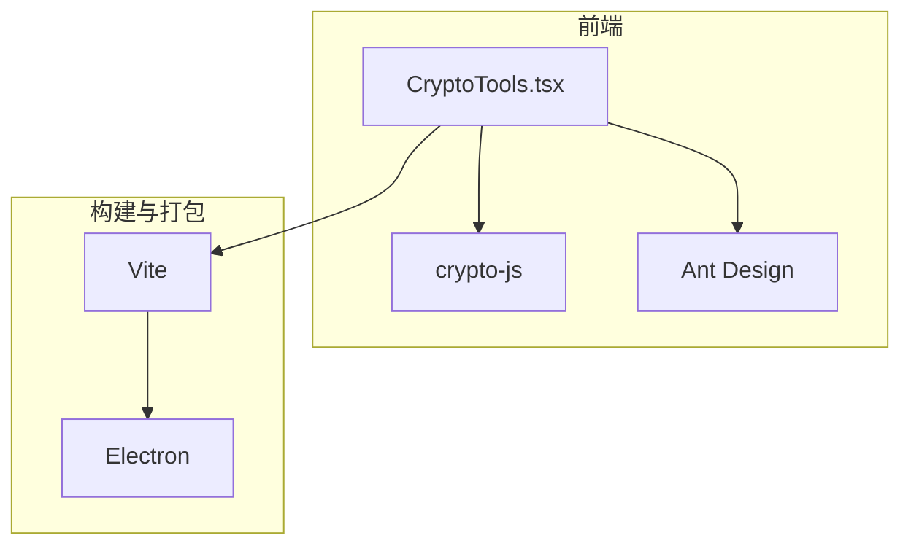
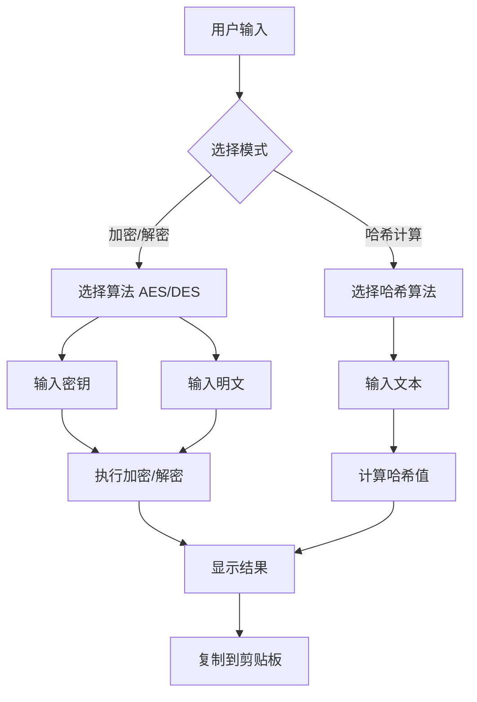
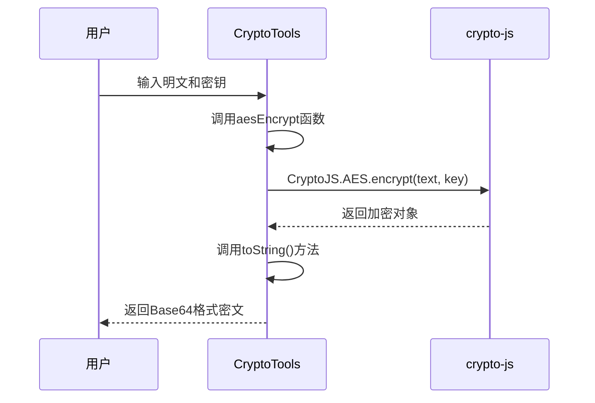
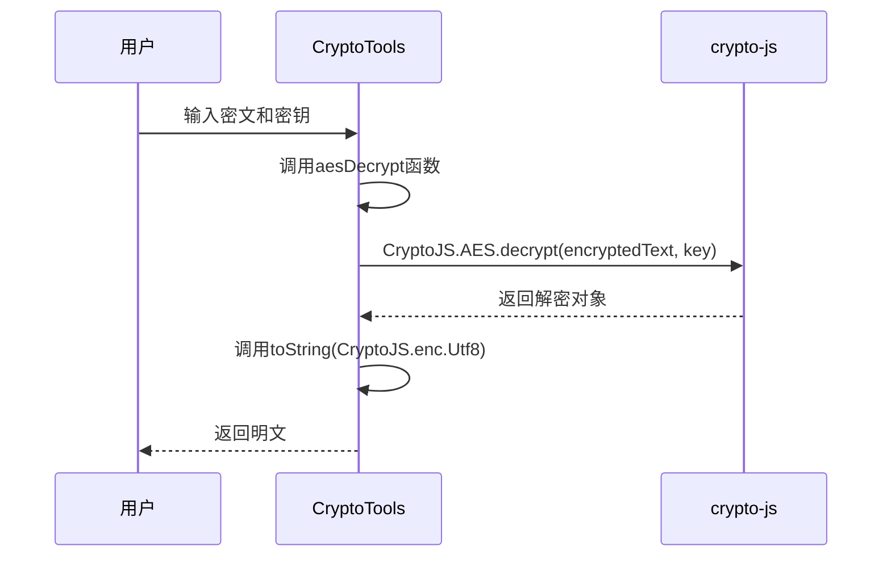
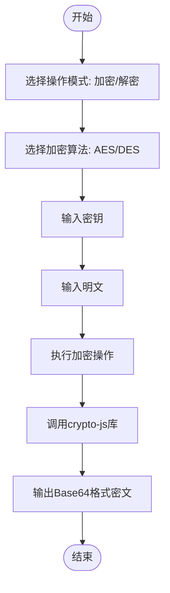
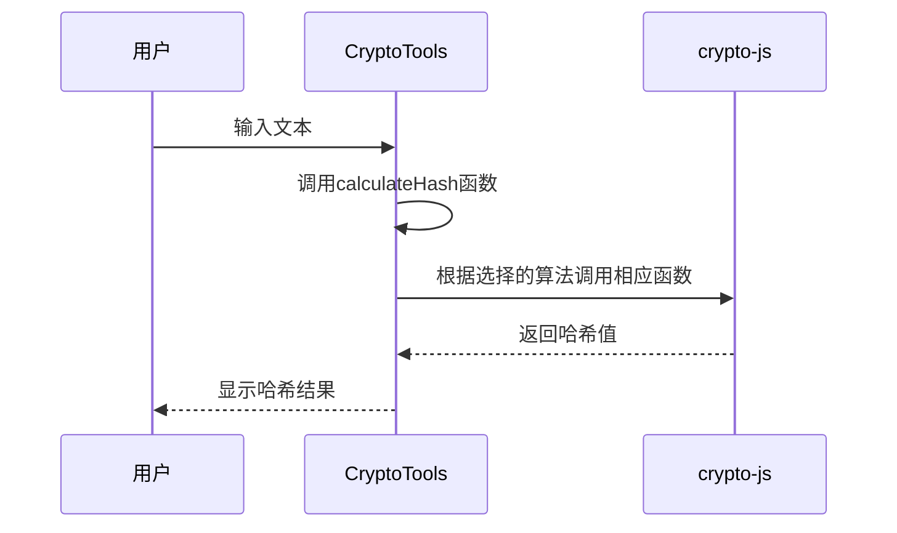
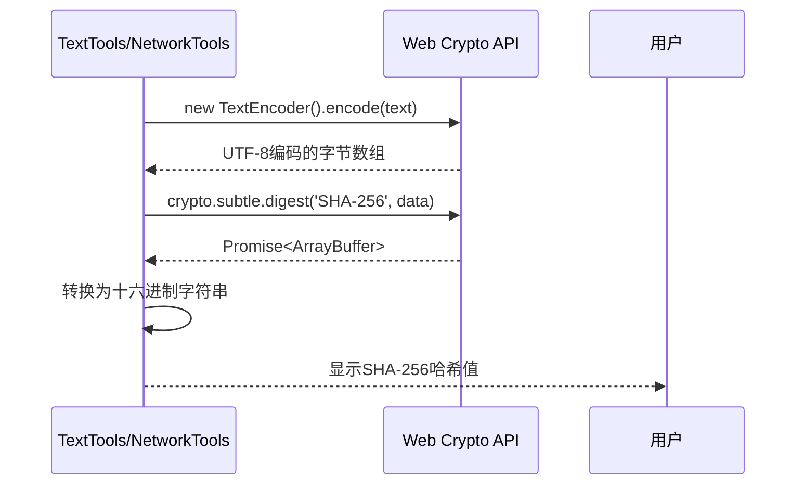
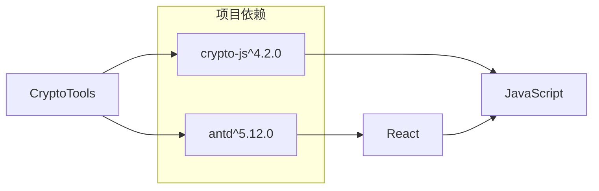

# 加密与解密

<cite>
**本文档中引用的文件**  
- [CryptoTools.tsx](file://src/components/CryptoTools.tsx#L1-L408) - *已更新：使用Ant Design Tabs items属性重构*
- [package.json](file://package.json#L30-L31)
- [NetworkTools.tsx](file://src/components/NetworkTools.tsx#L234-L239)
- [TextTools.tsx](file://src/components/TextTools.tsx#L196-L200)
</cite>

## 更新摘要
**已做更改**  
- 更新了“架构概述”和“详细组件分析”中的UI组件实现细节，以反映Ant Design Tabs的`items`属性重构
- 修正了序列图中与标签页实现相关的描述
- 更新了受影响部分的来源标注，反映代码变更
- 保持原有文档结构和加密原理说明不变，因核心加密逻辑未受影响

## 目录
1. [简介](#简介)
2. [项目结构](#项目结构)
3. [核心组件](#核心组件)
4. [架构概述](#架构概述)
5. [详细组件分析](#详细组件分析)
6. [依赖分析](#依赖分析)
7. [性能考虑](#性能考虑)
8. [故障排除指南](#故障排除指南)
9. [结论](#结论)

## 简介
本项目是一个多功能办公工具集，其中`CryptoTools.tsx`组件提供了对称加密（如AES、DES）、哈希计算（如MD5、SHA系列）和Base64编码/解码功能。该组件基于`crypto-js`库实现加密功能，通过React与Ant Design构建用户界面，支持用户输入明文、设置密钥并生成密文的完整流程。

## 项目结构
项目采用典型的前端项目结构，主要功能模块位于`src/components`目录下，加密工具作为独立组件实现。项目使用Vite作为构建工具，TypeScript作为开发语言，并通过Electron打包为桌面应用。

**图示来源**  
- [CryptoTools.tsx](file://src/components/CryptoTools.tsx#L1-L408)
- [package.json](file://package.json#L30-L31)

**本节来源**  
- [CryptoTools.tsx](file://src/components/CryptoTools.tsx#L1-L408)
- [package.json](file://package.json#L1-L77)

## 核心组件
`CryptoTools.tsx`是本项目的核心加密组件，实现了AES和DES对称加密算法，支持加密、解密、哈希计算和Base64编码/解码功能。组件使用`crypto-js`库进行底层加密操作，通过React状态管理用户输入和输出。

**本节来源**  
- [CryptoTools.tsx](file://src/components/CryptoTools.tsx#L1-L408)

## 架构概述
加密工具组件采用函数式组件架构，通过React Hooks管理状态，实现了清晰的用户交互流程。组件支持两种主要功能模式：加密解密和哈希计算，通过标签页进行切换。最新版本使用Ant Design的`Tabs`组件的`items`属性配置标签页，替代了旧的`TabPane`子组件写法，提升了配置的灵活性和可维护性。

**图示来源**  
- [CryptoTools.tsx](file://src/components/CryptoTools.tsx#L1-L408)

## 详细组件分析

### 对称加密功能分析
`CryptoTools.tsx`组件实现了基于`crypto-js`库的对称加密功能，支持AES和DES算法。组件通过简单的API调用实现加密和解密操作。

#### AES加密实现

**图示来源**  
- [CryptoTools.tsx](file://src/components/CryptoTools.tsx#L35-L39)

#### AES解密实现

**图示来源**  
- [CryptoTools.tsx](file://src/components/CryptoTools.tsx#L45-L49)

#### 加密流程分析

**图示来源**  
- [CryptoTools.tsx](file://src/components/CryptoTools.tsx#L100-L112)

### 哈希计算功能分析
组件还实现了多种哈希算法，包括MD5、SHA1、SHA256和SHA512，使用`crypto-js`库进行计算。

**图示来源**  
- [CryptoTools.tsx](file://src/components/CryptoTools.tsx#L118-L166)

### Web Crypto API使用分析
虽然`CryptoTools.tsx`使用`crypto-js`库，但项目中其他组件使用了原生Web Crypto API进行哈希计算，展示了不同的实现方式。

**图示来源**  
- [NetworkTools.tsx](file://src/components/NetworkTools.tsx#L234-L239)
- [TextTools.tsx](file://src/components/TextTools.tsx#L196-L200)

**本节来源**  
- [CryptoTools.tsx](file://src/components/CryptoTools.tsx#L1-L408)
- [NetworkTools.tsx](file://src/components/NetworkTools.tsx#L234-L239)
- [TextTools.tsx](file://src/components/TextTools.tsx#L196-L200)

## 依赖分析
项目依赖关系清晰，核心加密功能依赖`crypto-js`库，UI组件依赖`antd`库。

**图示来源**  
- [package.json](file://package.json#L30-L31)

**本节来源**  
- [package.json](file://package.json#L1-L77)
- [CryptoTools.tsx](file://src/components/CryptoTools.tsx#L1-L408)

## 性能考虑
- `crypto-js`库是纯JavaScript实现，性能良好，适合浏览器环境
- 所有加密操作在主线程执行，对于大文件可能影响UI响应
- Base64编码/解码使用原生浏览器API，性能较优
- 哈希计算在`NetworkTools.tsx`和`TextTools.tsx`中使用Web Crypto API，提供了更好的安全性和性能

## 故障排除指南
常见问题及解决方案：

1. **加密失败**
   - 检查密钥是否为空
   - 确保密钥格式正确
   - 检查输入文本是否为空

2. **解密失败**
   - 确认使用的密钥与加密时相同
   - 检查密文格式是否正确（应为Base64编码）
   - 确认加密和解密使用相同的算法

3. **哈希计算失败**
   - 检查输入文本是否为空
   - 确认选择的哈希算法受支持

4. **复制到剪贴板失败**
   - 确保页面在安全上下文中（HTTPS或localhost）
   - 检查浏览器是否支持Clipboard API

**本节来源**  
- [CryptoTools.tsx](file://src/components/CryptoTools.tsx#L50-L55)
- [CryptoTools.tsx](file://src/components/CryptoTools.tsx#L61-L66)

## 结论
`CryptoTools.tsx`组件实现了一个功能完整的加密解密工具，基于`crypto-js`库提供了AES和DES对称加密功能。虽然实现简洁易用，但存在一些安全性和功能上的局限：

1. **加密模式**：使用`crypto-js`的默认设置，未显式指定加密模式（如CBC、GCM）和初始化向量（IV），这可能导致安全性降低。

2. **密钥管理**：密钥直接由用户输入或生成，未使用密码派生函数（如PBKDF2）增强密钥强度。

3. **认证加密**：未实现AEAD（认证加密）模式，如GCM，缺乏完整性保护。

4. **IV处理**：未显式处理初始化向量，依赖库的默认行为，可能影响安全性。

建议改进方向：
- 使用Web Crypto API替代`crypto-js`以获得更好的安全性和控制力
- 实现GCM等认证加密模式，提供机密性和完整性保护
- 使用PBKDF2等密码派生函数从用户密码生成加密密钥
- 显式管理IV，确保其随机性和唯一性
- 添加对大文件加密的支持，避免内存问题

尽管存在上述局限，该组件为用户提供了一个简单易用的加密工具界面，适合基本的加密解密需求。最近的重构将Ant Design的`Tabs`组件从`TabPane`子组件方式改为使用`items`属性配置，提升了代码的可维护性和配置灵活性，但未影响核心加密功能的实现。