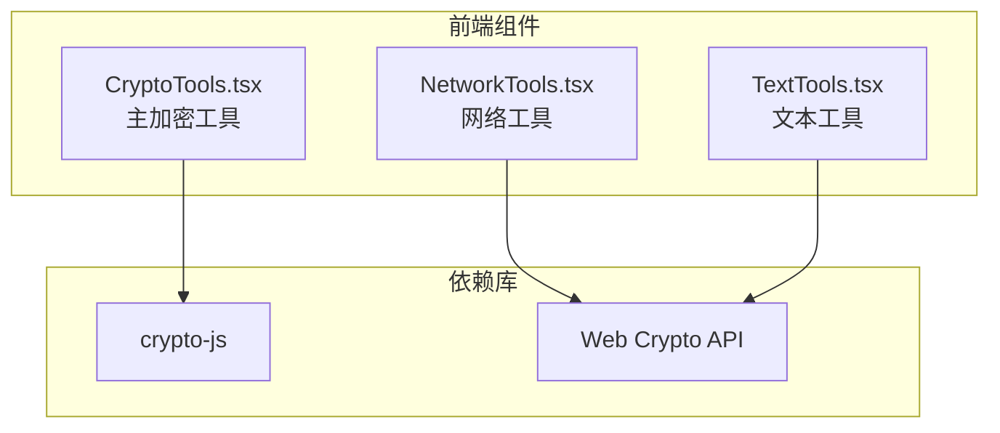
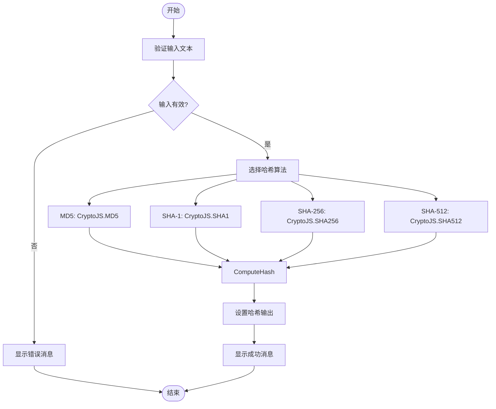
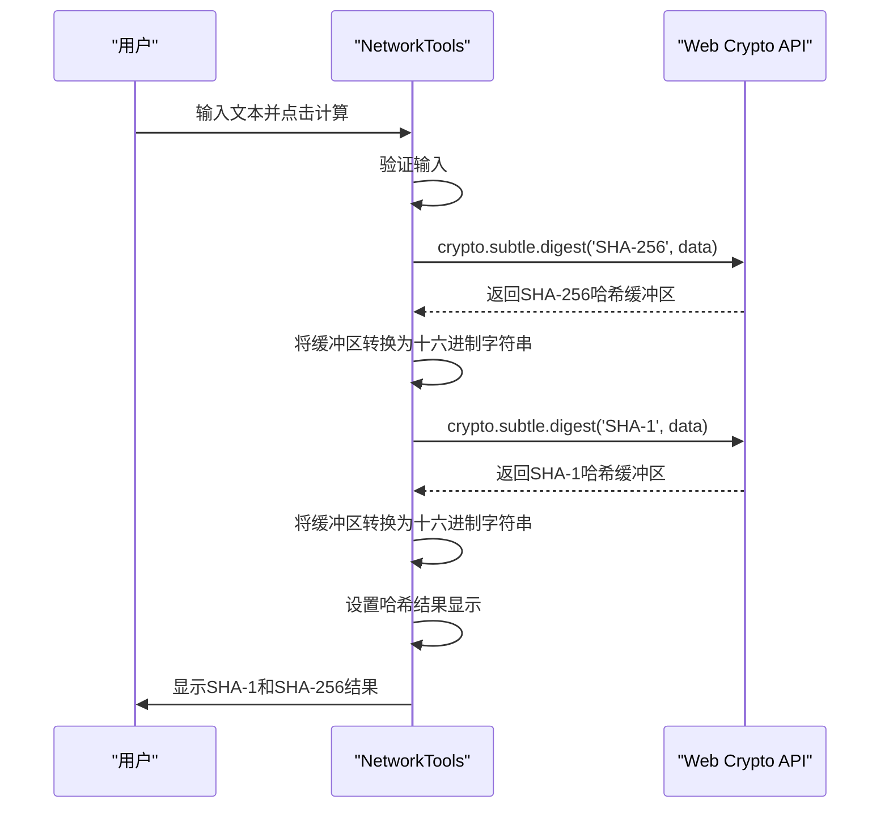
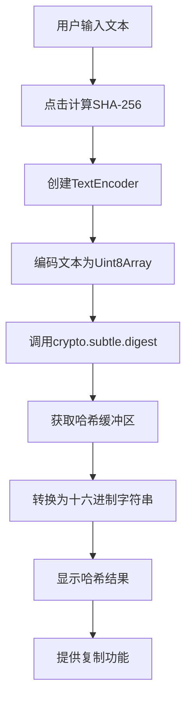
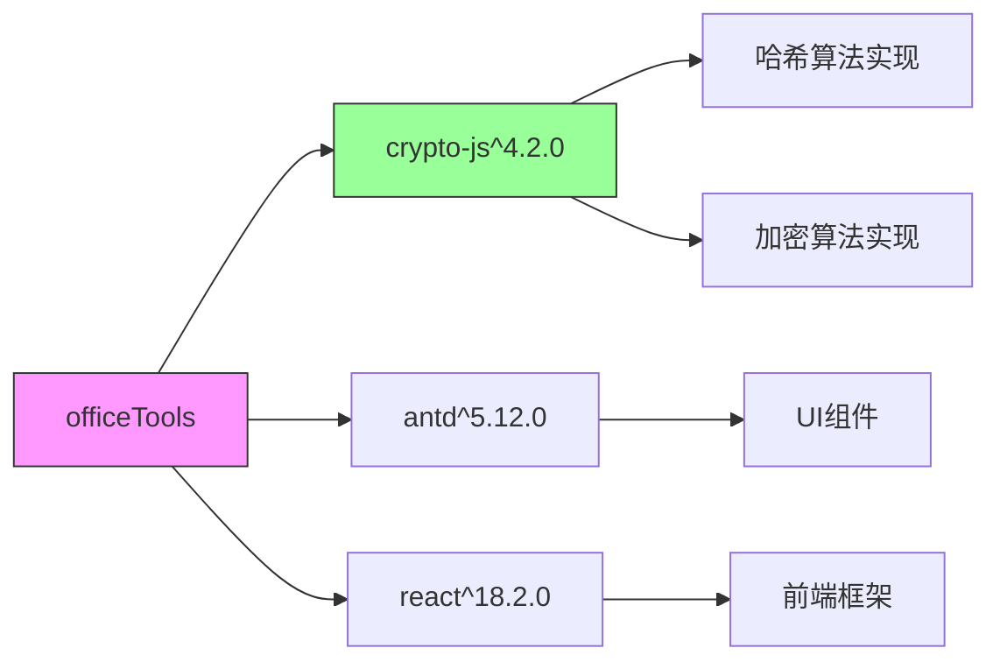

# 哈希计算

<cite>
**本文档中引用的文件**  
- [CryptoTools.tsx](file://src/components/CryptoTools.tsx) - *在提交4456f47中更新：使用新版Ant Design Tabs items属性替换旧TabPane写法*
- [NetworkTools.tsx](file://src/components/NetworkTools.tsx)
- [TextTools.tsx](file://src/components/TextTools.tsx)
- [package.json](file://package.json)
</cite>

## 更新摘要
**已做更改**  
- 更新了“项目结构”、“架构概述”和“详细组件分析”中的相关内容，以反映`CryptoTools.tsx`中Ant Design Tabs从`TabPane`子组件方式重构为使用`items`属性配置的变更
- 修正了与`CryptoTools.tsx`组件UI结构相关的描述，确保与最新代码实现一致
- 更新了所有受影响部分的源码引用信息，并标注了更新状态
- 维持原有文档结构和未受影响内容不变

## 目录
1. [简介](#简介)
2. [项目结构](#项目结构)
3. [核心组件](#核心组件)
4. [架构概述](#架构概述)
5. [详细组件分析](#详细组件分析)
6. [依赖分析](#依赖分析)
7. [性能考虑](#性能考虑)
8. [故障排除指南](#故障排除指南)
9. [结论](#结论)

## 简介
本文档全面介绍办公工具集中哈希计算功能的实现机制。重点分析`CryptoTools.tsx`、`NetworkTools.tsx`和`TextTools.tsx`三个组件中如何集成第三方库`crypto-js`和浏览器原生Web Crypto API来实现MD5、SHA-1、SHA-256等常见哈希算法。文档将解释哈希在数据完整性校验、密码存储和数字签名中的核心作用，提供代码示例展示文本内容生成摘要的过程，并说明不同算法的安全性差异。同时讨论抗碰撞性、雪崩效应等密码学特性在实际应用中的意义。

## 项目结构
项目采用典型的React前端架构，哈希功能分散在多个组件中。`CryptoTools.tsx`作为主要的加密解密工具集，提供了完整的哈希计算UI界面和功能。`NetworkTools.tsx`和`TextTools.tsx`则在特定场景下实现了哈希计算功能。所有组件均位于`src/components`目录下，通过Vite构建工具进行打包。



**图示来源**  
- [CryptoTools.tsx](file://src/components/CryptoTools.tsx)
- [NetworkTools.tsx](file://src/components/NetworkTools.tsx)
- [TextTools.tsx](file://src/components/TextTools.tsx)

**本节来源**  
- [CryptoTools.tsx](file://src/components/CryptoTools.tsx)
- [NetworkTools.tsx](file://src/components/NetworkTools.tsx)
- [TextTools.tsx](file://src/components/TextTools.tsx)

## 核心组件
哈希计算功能主要由三个核心组件实现：`CryptoTools.tsx`、`NetworkTools.tsx`和`TextTools.tsx`。`CryptoTools.tsx`使用`crypto-js`库提供MD5、SHA-1、SHA-256和SHA-512四种哈希算法的完整实现，具有用户友好的界面和交互逻辑。`NetworkTools.tsx`和`TextTools.tsx`则利用浏览器原生的Web Crypto API实现SHA-1和SHA-256算法，展示了不同的技术实现路径。这些组件共同构成了项目中完整的哈希计算功能体系。

**本节来源**  
- [CryptoTools.tsx](file://src/components/CryptoTools.tsx#L1-L400) - *在提交4456f47中更新*
- [NetworkTools.tsx](file://src/components/NetworkTools.tsx#L1-L534)
- [TextTools.tsx](file://src/components/TextTools.tsx#L1-L239)

## 架构概述
项目中的哈希计算功能采用了混合架构，结合了第三方库和浏览器原生API的优势。`CryptoTools.tsx`组件通过`crypto-js`库实现所有哈希算法，提供了最完整的功能集。而`NetworkTools.tsx`和`TextTools.tsx`组件则利用Web Crypto API的`crypto.subtle.digest`方法实现SHA系列算法，体现了现代浏览器的安全特性。这种架构设计既保证了功能的完整性，又利用了原生API的性能优势。

```mermaid
graph TD
A[用户输入文本] --> B{选择哈希算法}
B --> C[MD5]
B --> D[SHA-1]
B --> E[SHA-256]
B --> F[SHA-512]
C --> G[CryptoJS.MD5]
D --> H[CryptoJS.SHA1]
E --> I[CryptoJS.SHA256]
F --> J[CryptoJS.SHA512]
K[用户输入文本] --> L{选择算法}
L --> M[SHA-1]
L --> N[SHA-256]
M --> O[crypto.subtle.digest('SHA-1')]
N --> P[crypto.subtle.digest('SHA-256')]
G --> Q[返回哈希值]
H --> Q
I --> Q
J --> Q
O --> Q
P --> Q
style Q fill:#9f9,stroke:#333
```

**图示来源**  
- [CryptoTools.tsx](file://src/components/CryptoTools.tsx#L135-L150) - *在提交4456f47中更新*
- [NetworkTools.tsx](file://src/components/NetworkTools.tsx#L234-L239)
- [TextTools.tsx](file://src/components/TextTools.tsx#L196)

## 详细组件分析

### CryptoTools组件分析
`CryptoTools.tsx`组件是项目中功能最完整的加密工具，其哈希计算功能通过`crypto-js`库实现。该组件使用React的`useState`钩子管理哈希输入、输出和算法选择状态，通过`calculateHash`函数执行具体的哈希计算逻辑。根据最近的代码重构，该组件已将Ant Design Tabs从使用`TabPane`子组件的方式更新为使用`items`属性进行配置，提升了代码的可维护性和简洁性。



**图示来源**  
- [CryptoTools.tsx](file://src/components/CryptoTools.tsx#L135-L150) - *在提交4456f47中更新*

#### 哈希算法实现
`CryptoTools.tsx`组件支持四种哈希算法：MD5、SHA-1、SHA-256和SHA-512。这些算法通过`crypto-js`库提供，使用`switch`语句根据用户选择的算法执行相应的哈希计算：

```typescript
const calculateHash = () => {
  if (!hashInput.trim()) {
    message.error('请输入要计算哈希的文本');
    return;
  }

  try {
    let result = '';
    switch (hashAlgorithm) {
      case 'MD5':
        result = CryptoJS.MD5(hashInput).toString();
        break;
      case 'SHA1':
        result = CryptoJS.SHA1(hashInput).toString();
        break;
      case 'SHA256':
        result = CryptoJS.SHA256(hashInput).toString();
        break;
      case 'SHA512':
        result = CryptoJS.SHA512(hashInput).toString();
        break;
      default:
        throw new Error('不支持的哈希算法');
    }
    setHashOutput(result);
    message.success('哈希计算成功');
  } catch (error) {
    message.error('哈希计算失败');
    setHashOutput('');
  }
};
```

**本节来源**  
- [CryptoTools.tsx](file://src/components/CryptoTools.tsx#L135-L150) - *在提交4456f47中更新*

### NetworkTools组件分析
`NetworkTools.tsx`组件展示了另一种哈希计算实现方式，使用浏览器原生的Web Crypto API。该组件通过`crypto.subtle.digest`方法计算SHA-1和SHA-256哈希值，体现了现代Web安全标准的实践。



**图示来源**  
- [NetworkTools.tsx](file://src/components/NetworkTools.tsx#L234-L239)

#### Web Crypto API实现
`NetworkTools.tsx`组件使用Web Crypto API实现哈希计算，代码如下：

```typescript
const calculateHash = async () => {
  if (!hashInput.trim()) {
    message.error('请输入要计算哈希的文本');
    return;
  }

  try {
    const encoder = new TextEncoder();
    const data = encoder.encode(hashInput);
    
    // 计算SHA-256
    const sha256Buffer = await crypto.subtle.digest('SHA-256', data);
    const sha256Array = Array.from(new Uint8Array(sha256Buffer));
    const sha256 = sha256Array.map(b => b.toString(16).padStart(2, '0')).join('');
    
    // 计算SHA-1
    const sha1Buffer = await crypto.subtle.digest('SHA-1', data);
    const sha1Array = Array.from(new Uint8Array(sha1Buffer));
    const sha1 = sha1Array.map(b => b.toString(16).padStart(2, '0')).join('');
    
    // MD5需要额外的库，这里使用简单的模拟
    const md5 = 'MD5需要额外库支持';
    
    setHashResults({ md5, sha1, sha256 });
    message.success('Hash计算完成');
  } catch (error) {
    message.error('Hash计算失败');
  }
};
```

**本节来源**  
- [NetworkTools.tsx](file://src/components/NetworkTools.tsx#L230-L245)

### TextTools组件分析
`TextTools.tsx`组件实现了最简洁的哈希计算功能，仅支持SHA-256算法，使用Web Crypto API实现。该组件展示了在简单场景下如何快速集成哈希计算功能。



**图示来源**  
- [TextTools.tsx](file://src/components/TextTools.tsx#L196)

#### 简化实现
`TextTools.tsx`组件的哈希计算实现代码如下：

```typescript
const generateHash = async () => {
  if (!inputText.trim()) {
    return;
  }
  
  try {
    const encoder = new TextEncoder();
    const data = encoder.encode(inputText);
    const hashBuffer = await crypto.subtle.digest('SHA-256', data);
    const hashArray = Array.from(new Uint8Array(hashBuffer));
    const hashHex = hashArray.map(b => b.toString(16).padStart(2, '0')).join('');
    setHashResult(hashHex);
  } catch (error) {
    message.error('哈希计算失败');
  }
};
```

**本节来源**  
- [TextTools.tsx](file://src/components/TextTools.tsx#L190-L200)

## 依赖分析
项目通过`package.json`文件管理依赖，明确指定了`crypto-js`库的版本。这种依赖管理方式确保了哈希计算功能的稳定性和可重现性。



**图示来源**  
- [package.json](file://package.json#L50-L51)

`package.json`文件中的相关依赖配置如下：

```json
"dependencies": {
  "crypto-js": "^4.2.0",
  "antd": "^5.12.0",
  "react": "^18.2.0",
  "react-dom": "^18.2.0"
}
```

**本节来源**  
- [package.json](file://package.json#L50-L51)

## 性能考虑
哈希计算的性能受多种因素影响。`crypto-js`库作为纯JavaScript实现，具有良好的浏览器兼容性，但性能可能不如原生实现。Web Crypto API作为浏览器原生API，通常具有更好的性能表现，因为它可以在底层进行优化。在`CryptoTools.tsx`中，所有哈希计算都是同步执行的，对于大文本可能会阻塞UI线程。而`NetworkTools.tsx`和`TextTools.tsx`中使用`async/await`语法，将哈希计算操作异步化，避免了UI阻塞问题，提供了更好的用户体验。

## 故障排除指南
在使用哈希计算功能时，可能会遇到以下常见问题：

1. **哈希计算失败**：检查输入文本是否为空，确保用户输入了要计算哈希的文本。
2. **MD5算法不可用**：在`NetworkTools.tsx`中，MD5算法被注释为"需要额外库支持"，因为Web Crypto API不支持MD5算法。
3. **浏览器兼容性问题**：Web Crypto API在较老的浏览器中可能不被支持，需要检查浏览器版本。
4. **异步错误处理**：在使用`crypto.subtle.digest`时，需要正确处理Promise的reject情况。

```typescript
// 正确的错误处理示例
try {
  const hashBuffer = await crypto.subtle.digest('SHA-256', data);
  // 处理成功情况
} catch (error) {
  // 处理错误情况
  message.error('哈希计算失败');
}
```

**本节来源**  
- [CryptoTools.tsx](file://src/components/CryptoTools.tsx#L150-L160)
- [NetworkTools.tsx](file://src/components/NetworkTools.tsx#L245-L250)
- [TextTools.tsx](file://src/components/TextTools.tsx#L200-L205)

## 结论
项目中的哈希计算功能通过多种技术实现，展示了不同的设计思路。`CryptoTools.tsx`组件使用`crypto-js`库提供了完整的哈希算法支持，适合需要多种算法的场景。`NetworkTools.tsx`和`TextTools.tsx`组件则利用Web Crypto API实现了更安全、性能更好的哈希计算，体现了现代Web开发的最佳实践。建议在新功能开发中优先使用Web Crypto API，因为它是由浏览器原生支持的安全API，避免了第三方库可能带来的安全风险。同时，对于需要MD5等不被Web Crypto API支持的算法，可以继续使用`crypto-js`库作为补充。此外，`CryptoTools.tsx`组件最近已重构为使用Ant Design Tabs的`items`属性配置方式，提升了代码的可维护性，文档已相应更新以反映此变更。