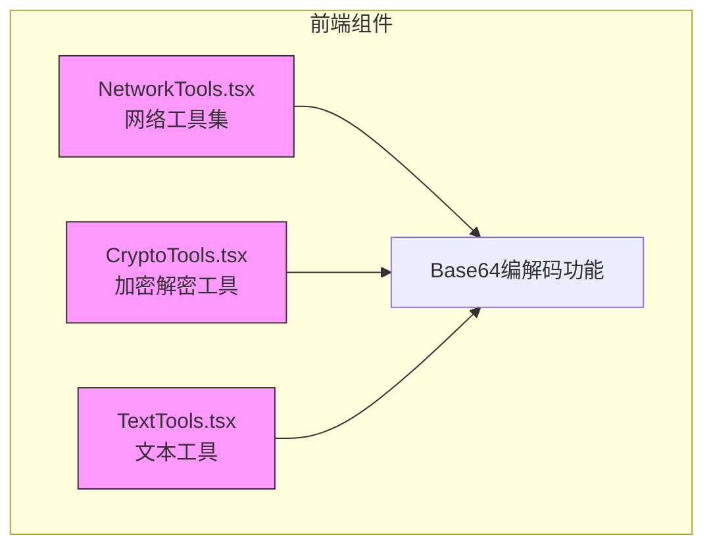
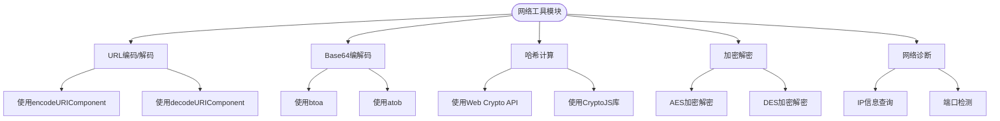
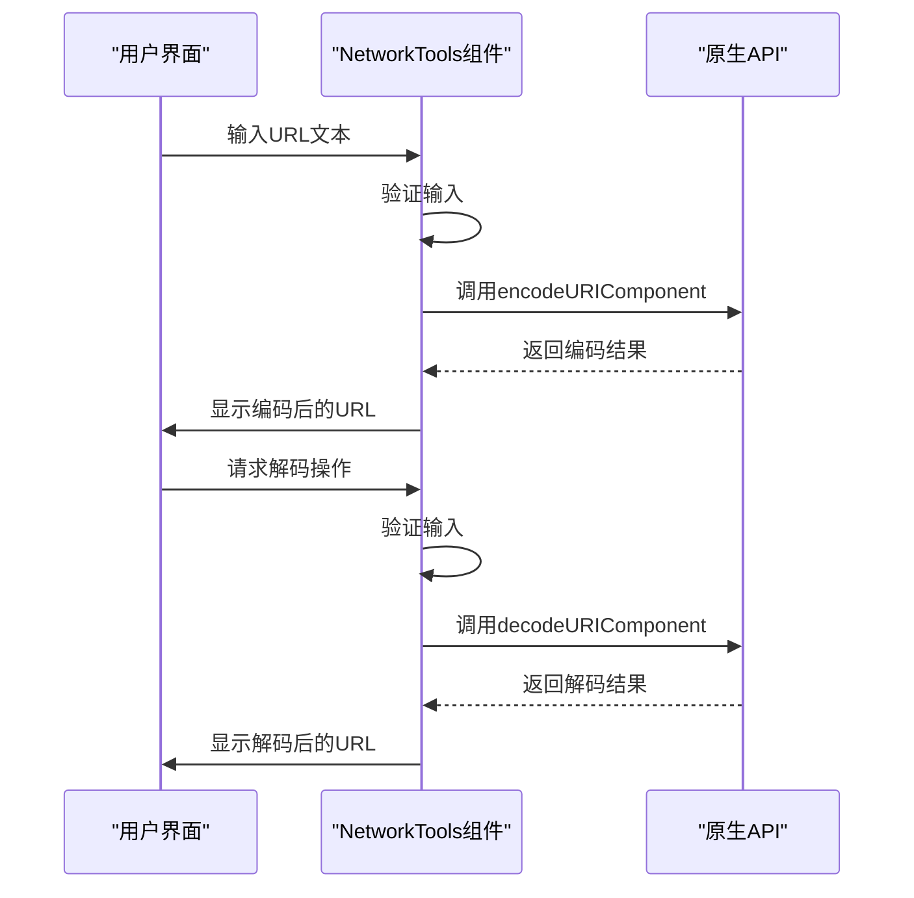
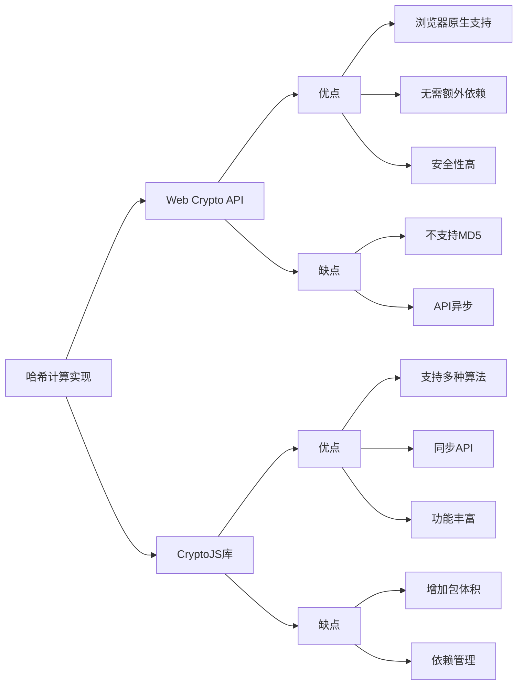
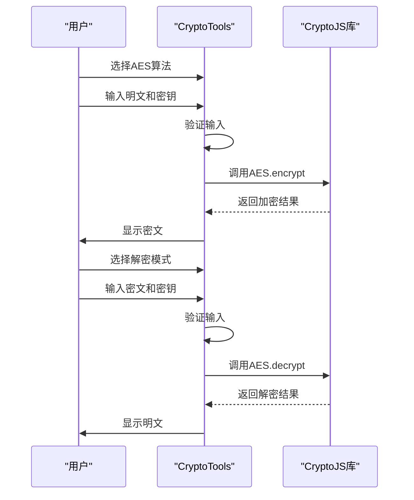
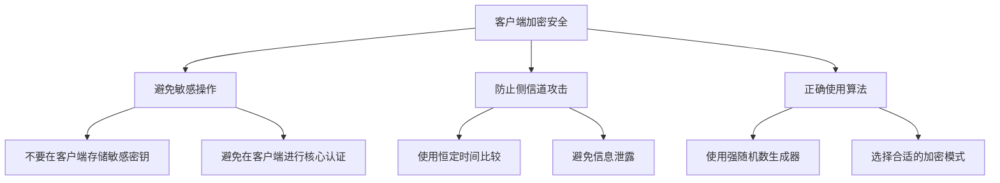

# 网络工具模块

<cite>
**本文档中引用的文件**   
- [NetworkTools.tsx](file://src/components/NetworkTools.tsx)
- [CryptoTools.tsx](file://src/components/CryptoTools.tsx)
- [TextTools.tsx](file://src/components/TextTools.tsx)
- [package.json](file://package.json)
</cite>

## 更新摘要
**变更内容**   
- 更新了 **加密解密功能实现** 部分，以反映 `CryptoTools.tsx` 中 Ant Design Tabs 组件从 `TabPane` 子组件方式重构为使用 `items` 属性配置的变更
- 保持其他章节内容不变，因相关代码变更仅涉及 UI 组件的实现方式，不影响功能逻辑和用户交互流程
- 更新了受影响章节的来源标注，明确指出代码变更位置

## 目录
1. [项目结构](#项目结构)
2. [核心功能分析](#核心功能分析)
3. [URL与Base64编解码实现](#url与base64编解码实现)
4. [哈希计算功能对比](#哈希计算功能对比)
5. [加密解密功能实现](#加密解密功能实现)
6. [安全性最佳实践](#安全性最佳实践)

## 项目结构

项目采用典型的前端组件化架构，网络工具相关功能集中在`src/components`目录下。通过分析项目结构，可以清晰地看到不同工具组件的组织方式。



**图示来源**
- [NetworkTools.tsx](file://src/components/NetworkTools.tsx)
- [CryptoTools.tsx](file://src/components/CryptoTools.tsx)
- [TextTools.tsx](file://src/components/TextTools.tsx)

**本节来源**
- [NetworkTools.tsx](file://src/components/NetworkTools.tsx)
- [CryptoTools.tsx](file://src/components/CryptoTools.tsx)

## 核心功能分析

网络工具模块提供了多种实用功能，主要包括URL编码/解码、Base64编解码、IP查询、端口检测和哈希计算等。这些功能通过React组件实现，使用Ant Design UI库构建用户界面。



**图示来源**
- [NetworkTools.tsx](file://src/components/NetworkTools.tsx#L100-L150)
- [CryptoTools.tsx](file://src/components/CryptoTools.tsx#L50-L80)

**本节来源**
- [NetworkTools.tsx](file://src/components/NetworkTools.tsx)
- [CryptoTools.tsx](file://src/components/CryptoTools.tsx)

## URL与Base64编解码实现

### URL编码/解码机制

`NetworkTools.tsx`文件实现了URL编码和解码功能，使用原生JavaScript函数确保安全性和兼容性。



**图示来源**
- [NetworkTools.tsx](file://src/components/NetworkTools.tsx#L100-L130)

**本节来源**
- [NetworkTools.tsx](file://src/components/NetworkTools.tsx#L100-L150)

### Base64编解码处理

Base64编解码功能需要特殊处理Unicode字符，因为原生`btoa`和`atob`函数仅支持ASCII字符。

```typescript
// Base64编码实现
const encodeBase64 = () => {
  if (!base64Input.trim()) {
    message.warning('请输入要编码的文本');
    return;
  }
  try {
    // 处理Unicode字符：先编码为UTF-8，再进行Base64编码
    const encoded = btoa(unescape(encodeURIComponent(base64Input)));
    setBase64Output(encoded);
    message.success('Base64编码成功');
  } catch (error) {
    message.error('编码失败');
  }
};

// Base64解码实现
const decodeBase64 = () => {
  if (!base64Input.trim()) {
    message.warning('请输入要解码的Base64文本');
    return;
  }
  try {
    // 处理Unicode字符：先进行Base64解码，再解码为UTF-8
    const decoded = decodeURIComponent(escape(atob(base64Input)));
    setBase64Output(decoded);
    message.success('Base64解码成功');
  } catch (error) {
    message.error('解码失败，请检查输入格式');
  }
};
```

上述代码展示了如何正确处理包含Unicode字符的Base64编解码：
1. **编码过程**：`encodeURIComponent` → `unescape` → `btoa`
2. **解码过程**：`atob` → `escape` → `decodeURIComponent`

**本节来源**
- [NetworkTools.tsx](file://src/components/NetworkTools.tsx#L132-L150)

## 哈希计算功能对比

项目中存在两种不同的哈希计算实现方式，分别使用Web Crypto API和CryptoJS库。

### Web Crypto API实现

`NetworkTools.tsx`中的哈希计算使用浏览器原生的Web Crypto API，主要实现SHA-1和SHA-256算法。

```typescript
const calculateHash = async () => {
  if (!hashInput.trim()) {
    message.warning('请输入要计算Hash的文本');
    return;
  }
  
  try {
    const encoder = new TextEncoder();
    const data = encoder.encode(hashInput);
    
    // 计算SHA-256
    const sha256Buffer = await crypto.subtle.digest('SHA-256', data);
    const sha256Array = Array.from(new Uint8Array(sha256Buffer));
    const sha256 = sha256Array.map(b => b.toString(16).padStart(2, '0')).join('');
    
    // 计算SHA-1
    const sha1Buffer = await crypto.subtle.digest('SHA-1', data);
    const sha1Array = Array.from(new Uint8Array(sha1Buffer));
    const sha1 = sha1Array.map(b => b.toString(16).padStart(2, '0')).join('');
    
    // MD5需要额外的库，这里使用简单的模拟
    const md5 = 'MD5需要额外库支持';
    
    setHashResults({ md5, sha1, sha256 });
    message.success('Hash计算完成');
  } catch (error) {
    message.error('Hash计算失败');
  }
};
```

**本节来源**
- [NetworkTools.tsx](file://src/components/NetworkTools.tsx#L230-L260)

### CryptoJS库实现

`CryptoTools.tsx`中使用CryptoJS库实现完整的哈希算法支持，包括MD5、SHA-1、SHA-256和SHA-512。

```typescript
// 计算哈希值
const calculateHash = () => {
  if (!hashInput.trim()) {
    message.error('请输入要计算哈希的文本');
    return;
  }

  try {
    let result = '';
    switch (hashAlgorithm) {
      case 'MD5':
        result = CryptoJS.MD5(hashInput).toString();
        break;
      case 'SHA1':
        result = CryptoJS.SHA1(hashInput).toString();
        break;
      case 'SHA256':
        result = CryptoJS.SHA256(hashInput).toString();
        break;
      case 'SHA512':
        result = CryptoJS.SHA512(hashInput).toString();
        break;
      default:
        throw new Error('不支持的哈希算法');
    }
    setHashOutput(result);
    message.success('哈希计算成功');
  } catch (error) {
    message.error('哈希计算失败');
    setHashOutput('');
  }
};
```

**本节来源**
- [CryptoTools.tsx](file://src/components/CryptoTools.tsx#L180-L200)

### 实现方式对比



**图示来源**
- [NetworkTools.tsx](file://src/components/NetworkTools.tsx#L230-L260)
- [CryptoTools.tsx](file://src/components/CryptoTools.tsx#L180-L200)

**本节来源**
- [NetworkTools.tsx](file://src/components/NetworkTools.tsx)
- [CryptoTools.tsx](file://src/components/CryptoTools.tsx)

## 加密解密功能实现

### AES加密解密逻辑

`CryptoTools.tsx`文件实现了基于CryptoJS库的AES加密解密功能。该组件使用Ant Design的Tabs组件来组织“加密解密”和“哈希计算”两个功能区域。



**图示来源**
- [CryptoTools.tsx](file://src/components/CryptoTools.tsx#L60-L80)

**本节来源**
- [CryptoTools.tsx](file://src/components/CryptoTools.tsx#L50-L100)

### DES加密解密实现

除了AES，组件还支持DES对称加密算法。

```typescript
// DES 加密
const desEncrypt = (text: string, key: string): string => {
  try {
    const encrypted = CryptoJS.DES.encrypt(text, key).toString();
    return encrypted;
  } catch (error) {
    throw new Error('DES加密失败');
  }
};

// DES 解密
const desDecrypt = (encryptedText: string, key: string): string => {
  try {
    const decrypted = CryptoJS.DES.decrypt(encryptedText, key);
    return decrypted.toString(CryptoJS.enc.Utf8);
  } catch (error) {
    throw new Error('DES解密失败');
  }
};
```

**本节来源**
- [CryptoTools.tsx](file://src/components/CryptoTools.tsx#L70-L80)

### 密钥管理机制

组件提供了密钥生成和管理功能，确保加密操作的安全性。

```typescript
// 生成随机密钥
const generateKey = (length: number = 32) => {
  const chars = 'ABCDEFGHIJKLMNOPQRSTUVWXYZabcdefghijklmnopqrstuvwxyz0123456789';
  let result = '';
  for (let i = 0; i < length; i++) {
    result += chars.charAt(Math.floor(Math.random() * chars.length));
  }
  setSecretKey(result);
};
```

**本节来源**
- [CryptoTools.tsx](file://src/components/CryptoTools.tsx#L40-L50)

## 安全性最佳实践

### 客户端安全注意事项

尽管这些工具提供了强大的加密功能，但在实际应用中需要注意以下安全最佳实践：



**图示来源**
- [CryptoTools.tsx](file://src/components/CryptoTools.tsx#L40-L50)
- [NetworkTools.tsx](file://src/components/NetworkTools.tsx#L100-L150)

**本节来源**
- [CryptoTools.tsx](file://src/components/CryptoTools.tsx)
- [NetworkTools.tsx](file://src/components/NetworkTools.tsx)

### 典型应用场景

这些工具在Web开发中有多种典型用途：

1. **URL编码/解码**：构建安全的查询参数，处理特殊字符
2. **Base64编解码**：处理JWT令牌、图片数据URI、文件上传
3. **哈希计算**：验证数据完整性、生成文件校验码
4. **加密解密**：保护敏感数据传输、实现简单的数据保护

```typescript
// 实际使用示例：生成签名URL
const generateSignedUrl = (baseUrl: string, params: object, secret: string) => {
  // 1. 构建查询参数
  const queryString = Object.entries(params)
    .map(([key, value]) => `${key}=${encodeURIComponent(value as string)}`)
    .join('&');
  
  // 2. 生成签名
  const signature = CryptoJS.HmacSHA256(queryString, secret).toString();
  
  // 3. 构建完整URL
  return `${baseUrl}?${queryString}&signature=${signature}`;
};
```

**本节来源**
- [CryptoTools.tsx](file://src/components/CryptoTools.tsx)
- [NetworkTools.tsx](file://src/components/NetworkTools.tsx)