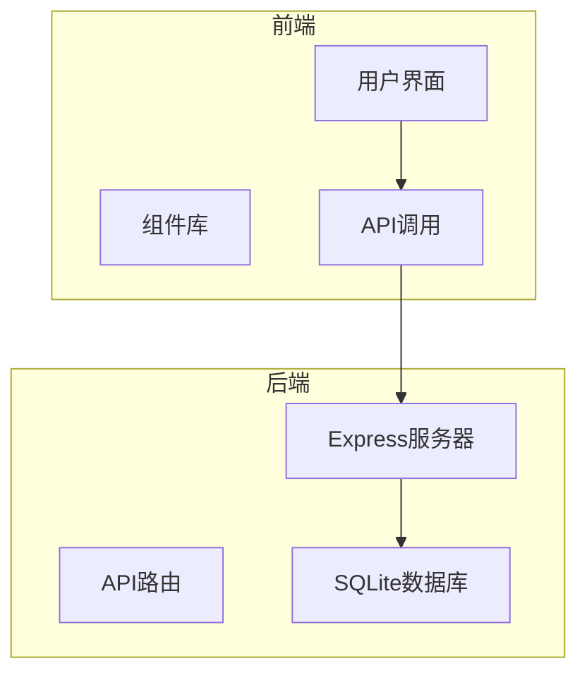
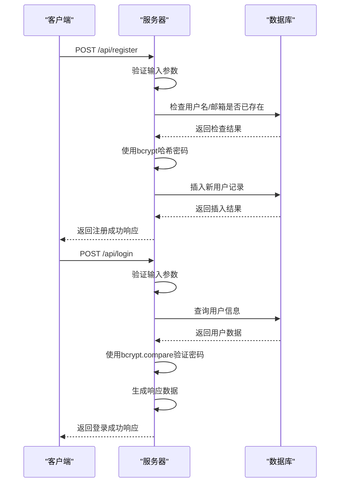
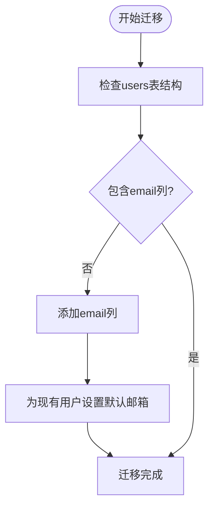
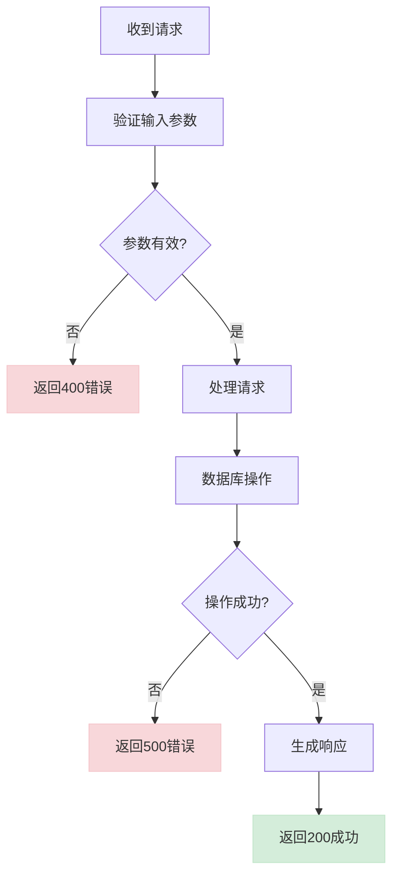
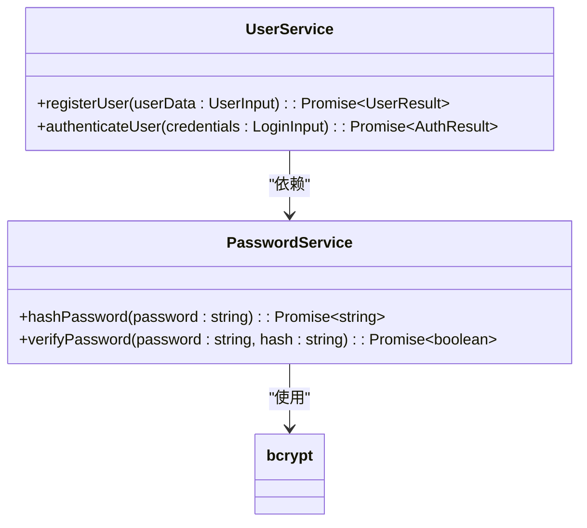

# API端点

<cite>
**本文档中引用的文件**   
- [server.js](file://backend/server.js#L0-L160)
- [migrate.js](file://backend/migrate.js#L0-L94)
- [users.json](file://backend/users.json#L0-L7)
- [Settings.tsx](file://src/components/Settings.tsx#L0-L401)
</cite>

## 目录
1. [项目结构分析](#项目结构分析)
2. [核心API端点分析](#核心api端点分析)
3. [用户认证流程](#用户认证流程)
4. [数据库设计与迁移](#数据库设计与迁移)
5. [请求验证与错误处理](#请求验证与错误处理)
6. [密码安全与哈希处理](#密码安全与哈希处理)
7. [API调用示例与客户端交互](#api调用示例与客户端交互)

## 项目结构分析

项目采用前后端分离架构，后端位于`backend`目录，前端位于`src`目录。后端使用Node.js + Express构建RESTful API，前端使用React + TypeScript开发用户界面。



**图示来源**
- [server.js](file://backend/server.js#L0-L160)
- [Settings.tsx](file://src/components/Settings.tsx#L0-L401)

**本节来源**
- [server.js](file://backend/server.js#L0-L160)
- [Settings.tsx](file://src/components/Settings.tsx#L0-L401)

## 核心API端点分析

系统提供了三个核心API端点，分别用于用户注册、登录和获取用户列表。

### 注册接口 (/api/register)
- **HTTP方法**: POST
- **请求头**: Content-Type: application/json
- **请求体**: 
```json
{
  "username": "string",
  "email": "string",
  "password": "string"
}
```
- **成功响应 (200)**:
```json
{
  "success": true,
  "message": "注册成功",
  "user": {
    "id": 1,
    "username": "testuser",
    "email": "test@example.com"
  }
}
```
- **错误响应**:
  - 400 Bad Request: 缺少必要字段或用户已存在
  - 500 Internal Server Error: 服务器或数据库错误

### 登录接口 (/api/login)
- **HTTP方法**: POST
- **请求头**: Content-Type: application/json
- **请求体**: 
```json
{
  "username": "string",
  "password": "string"
}
```
- **成功响应 (200)**:
```json
{
  "success": true,
  "message": "登录成功",
  "user": {
    "id": 1,
    "username": "testuser",
    "email": "test@example.com"
  }
}
```
- **错误响应**:
  - 400 Bad Request: 缺少用户名或密码
  - 401 Unauthorized: 用户名或密码错误
  - 500 Internal Server Error: 服务器或数据库错误

### 用户列表接口 (/api/users)
- **HTTP方法**: GET
- **成功响应 (200)**:
```json
{
  "success": true,
  "users": [
    {
      "id": 1,
      "username": "testuser",
      "email": "test@example.com",
      "created_at": "2025-07-08T09:48:45.808Z"
    }
  ]
}
```
- **错误响应**:
  - 500 Internal Server Error: 查询失败

**本节来源**
- [server.js](file://backend/server.js#L38-L160)

## 用户认证流程

用户认证流程包括注册和登录两个主要过程，通过bcrypt进行密码哈希处理，确保用户信息安全。



**图示来源**
- [server.js](file://backend/server.js#L38-L130)

**本节来源**
- [server.js](file://backend/server.js#L38-L130)
- [Settings.tsx](file://src/components/Settings.tsx#L0-L401)

## 数据库设计与迁移

系统使用SQLite数据库存储用户信息，通过better-sqlite3库进行数据库操作。

### 用户表结构
```sql
CREATE TABLE IF NOT EXISTS users (
  id INTEGER PRIMARY KEY AUTOINCREMENT,
  username TEXT UNIQUE NOT NULL,
  email TEXT UNIQUE NOT NULL,
  password TEXT NOT NULL,
  created_at DATETIME DEFAULT CURRENT_TIMESTAMP
)
```

### 数据库迁移流程
1. 检查现有表结构
2. 如果不存在email列，则添加该列
3. 为现有用户设置默认邮箱地址
4. 从users.json迁移历史数据



**图示来源**
- [migrate.js](file://backend/migrate.js#L0-L94)

**本节来源**
- [migrate.js](file://backend/migrate.js#L0-L94)
- [server.js](file://backend/server.js#L0-L52)
- [users.json](file://backend/users.json#L0-L7)

## 请求验证与错误处理

系统实现了多层次的请求验证和错误处理机制，确保API的健壮性和安全性。

### 输入验证规则
- **注册接口**: 验证用户名、邮箱、密码是否为空
- **登录接口**: 验证用户名、密码是否为空
- **唯一性检查**: 用户名和邮箱必须唯一

### 错误处理机制
- **客户端验证**: 前端表单验证（如密码确认）
- **服务端验证**: 必填字段检查、唯一性约束
- **数据库异常处理**: 捕获并处理数据库操作错误
- **全局异常处理**: 捕获未预期的服务器错误



**图示来源**
- [server.js](file://backend/server.js#L38-L130)

**本节来源**
- [server.js](file://backend/server.js#L38-L130)
- [Settings.tsx](file://src/components/Settings.tsx#L0-L401)

## 密码安全与哈希处理

系统使用bcrypt库对用户密码进行安全哈希处理，防止密码明文存储。

### bcrypt配置
- **盐值轮数**: 10轮
- **哈希算法**: bcrypt
- **存储格式**: $2b$10$... (包含算法标识、成本因子和盐值)

### 密码处理流程
1. 用户注册时，使用bcrypt.hash对密码进行哈希
2. 用户登录时，使用bcrypt.compare验证密码
3. 哈希后的密码存储在数据库中



**图示来源**
- [server.js](file://backend/server.js#L46-L89)
- [server.js](file://backend/server.js#L95-L129)

**本节来源**
- [server.js](file://backend/server.js#L46-L129)
- [backend/package-lock.json](file://backend/package-lock.json#L42-L81)

## API调用示例与客户端交互

前端通过fetch API调用后端服务，实现用户界面交互。

### 注册调用示例
```javascript
const response = await fetch(`${API_BASE_URL}/api/register`, {
  method: 'POST',
  headers: {
    'Content-Type': 'application/json',
  },
  body: JSON.stringify({
    username: values.username,
    email: values.email,
    password: values.password,
  }),
});
```

### 登录调用示例
```javascript
const response = await fetch(`${API_BASE_URL}/api/login`, {
  method: 'POST',
  headers: {
    'Content-Type': 'application/json',
  },
  body: JSON.stringify(values),
});
```

### 响应处理
- **成功**: 显示成功消息，更新用户状态
- **失败**: 显示错误消息，保持表单状态
- **网络错误**: 提示检查后端服务

**本节来源**
- [Settings.tsx](file://src/components/Settings.tsx#L0-L401)
- [server.js](file://backend/server.js#L38-L130)