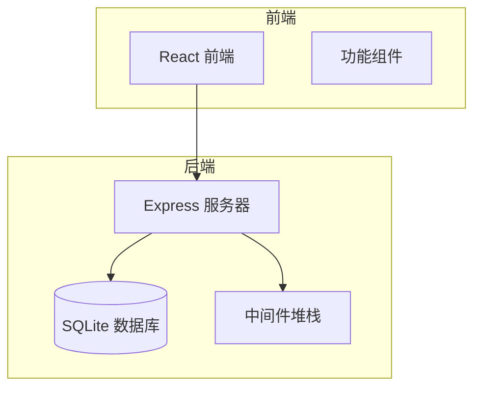
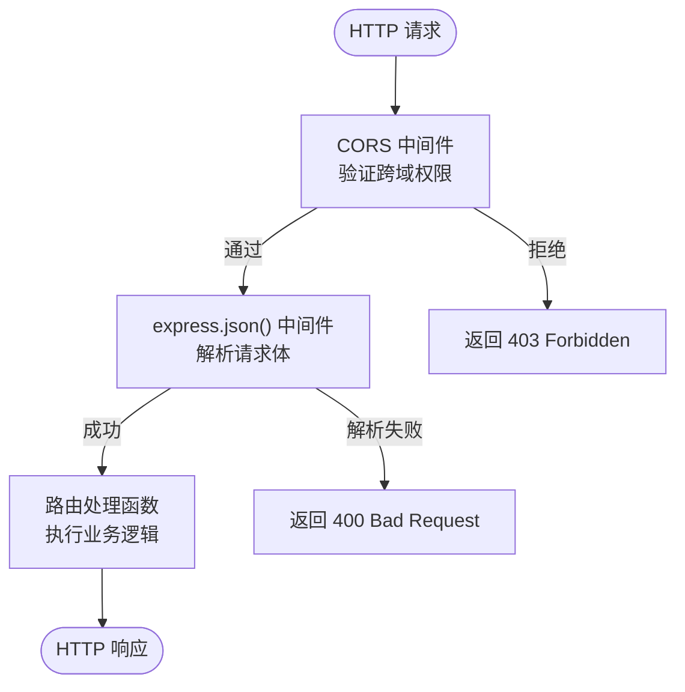

# 中间件与安全策略

<cite>
**本文档引用的文件**  
- [server.js](file://backend/server.js#L1-L160)
- [package.json](file://backend/package.json#L1-L19)
- [package-lock.json](file://backend/package-lock.json#L0-L1293)
</cite>

## 目录
1. [项目结构](#项目结构)  
2. [中间件架构分析](#中间件架构分析)  
3. [CORS策略配置](#cors策略配置)  
4. [请求体解析机制](#请求体解析机制)  
5. [全局错误处理机制](#全局错误处理机制)  
6. [安全防护体系](#安全防护体系)  
7. [性能与安全性权衡建议](#性能与安全性权衡建议)

## 项目结构

`officeTools` 是一个前后端分离的应用，后端位于 `backend` 目录，前端使用 React + TypeScript 构建。后端核心文件 `server.js` 使用 Express 框架提供 REST API 服务，主要功能包括用户注册、登录和用户列表查询。



**图示来源**  
- [server.js](file://backend/server.js#L1-L160)
- [package.json](file://backend/package.json#L1-L19)

**本节来源**  
- [server.js](file://backend/server.js#L1-L160)
- [project_structure](file://#L1-L50)

## 中间件架构分析

`server.js` 文件中定义了一个典型的 Express 中间件堆栈，用于处理 HTTP 请求的生命周期。中间件按顺序执行，每个中间件负责特定的任务。

### 中间件执行顺序

1.  **CORS 中间件**: 处理跨域资源共享请求。
2.  **JSON 解析中间件**: 解析请求体中的 JSON 数据。
3.  **路由处理**: 根据 URL 路径和 HTTP 方法调用相应的处理函数。

这种顺序确保了在路由处理函数执行前，请求的跨域权限已被验证，且请求体数据已被正确解析。



**图示来源**  
- [server.js](file://backend/server.js#L13-L17)

**本节来源**  
- [server.js](file://backend/server.js#L13-L17)

## CORS策略配置

CORS（跨域资源共享）中间件用于控制哪些外部源可以访问本服务器的 API。在 `server.js` 中，`cors` 中间件被配置为一个对象，以精细化控制策略。

### 配置参数详解

-   **`origin`**: 一个字符串数组，明确指定了允许访问的源。
    -   `http://officetools.guluwater.com`: 生产环境的前端域名。
    -   `http://localhost:5173`: 开发环境的前端地址（Vite 默认端口）。
    -   **作用**: 只有来自这两个源的请求才会被允许，其他任何源的请求都将被浏览器阻止。
-   **`credentials`**: 设置为 `true`。
    -   **作用**: 允许客户端在跨域请求中携带凭据（如 cookies、HTTP 认证信息）。这对于需要会话认证的应用至关重要。

```javascript
app.use(cors({
  origin: ['http://officetools.guluwater.com', 'http://localhost:5173'],
  credentials: true
}));
```

此配置是一种安全的白名单策略，避免了使用通配符 `*` 导致的安全风险，同时支持了开发和生产两种环境。

**本节来源**  
- [server.js](file://backend/server.js#L13-L15)

## 请求体解析机制

`express.json()` 中间件是 Express 内置的，用于解析传入请求的 JSON 格式请求体（`req.body`）。

### 配置与作用

-   **作用范围**: 该中间件被全局应用（`app.use()`），意味着所有路由的 POST、PUT 等请求，只要其 `Content-Type` 为 `application/json`，其请求体都将被自动解析为 JavaScript 对象。
-   **默认配置**: 代码中未传递任何参数给 `express.json()`，因此使用了其默认配置。
    -   **`limit`**: 默认为 `100kb`，限制了可解析的请求体大小。
    -   **`type`**: 默认为 `application/json`，只解析此类型的请求。
-   **在代码中的体现**: 在 `/api/register` 和 `/api/login` 接口中，`req.body` 被直接解构为 `{ username, email, password }`，这正是 `express.json()` 中间件工作的结果。

```javascript
app.use(express.json()); // 解析 application/json 请求体

app.post('/api/register', (req, res) => {
  const { username, email, password } = req.body; // req.body 已被解析为对象
  // ... 业务逻辑
});
```

**本节来源**  
- [server.js](file://backend/server.js#L17)

## 全局错误处理机制

该应用**没有实现**一个集中式的全局错误处理中间件。相反，它采用了**嵌套的 try-catch 模式**来处理错误。

### 错误处理模式分析

1.  **外层 try-catch**: 捕获路由处理函数内部可能发生的**同步错误**和**未被处理的异步错误**（如代码逻辑错误）。
2.  **内层 try-catch**: 专门用于捕获**数据库操作**中可能抛出的错误。

```javascript
app.post('/api/register', async (req, res) => {
  try { // 外层：捕获所有未处理的错误
    // ... 业务逻辑

    const db = new Database(DB_FILE);
    try { // 内层：专门捕获数据库错误
      const existingUser = db.prepare('SELECT * FROM users WHERE username = ? OR email = ?').get(username, email);
      // ... 数据库操作
    } catch (dbError) { // 处理数据库错误
      db.close();
      console.error('数据库操作错误:', dbError);
      return res.status(500).json({ success: false, message: '注册失败' });
    }
    db.close();
  } catch (error) { // 处理其他所有错误
    console.error('注册错误:', error);
    res.status(500).json({ success: false, message: '服务器错误' });
  }
});
```

#### 优点
-   **针对性强**: 可以根据不同的错误类型（如数据库错误）返回更具体的错误信息或执行特定的清理操作（如关闭数据库连接）。

#### 缺点
-   **代码冗余**: 每个路由处理函数都需要重复编写相似的 try-catch 结构，违反了 DRY（Don't Repeat Yourself）原则。
-   **维护困难**: 如果需要修改错误响应的格式，必须修改所有路由函数。
-   **不够优雅**: 未能利用 Express 的错误处理中间件机制。

**优化建议**: 应定义一个全局错误处理中间件，将错误统一处理，返回标准化的 JSON 响应。

```javascript
// 示例：全局错误处理中间件
app.use((error, req, res, next) => {
  console.error('全局错误:', error);
  res.status(500).json({ success: false, message: '服务器内部错误' });
});
```

**本节来源**  
- [server.js](file://backend/server.js#L28-L32, L77-L81, L120-L124)

## 安全防护体系

该应用的安全防护体系主要由以下几个方面构成：

### 1. 认证与密码安全
-   **bcrypt 库**: 用于对用户密码进行哈希加密。在注册时，密码通过 `bcrypt.hash(password, 10)` 进行加密，其中 `10` 是加密的轮数（cost factor），这是一个合理的默认值，能在安全性和性能之间取得平衡。
-   **密码验证**: 登录时，使用 `bcrypt.compare(password, user.password)` 来验证用户输入的明文密码与数据库中存储的哈希值是否匹配。此过程是安全的，不会暴露原始密码。

### 2. 输入验证
-   **基础验证**: 在注册和登录接口中，代码检查了 `username`, `email`, `password` 等字段是否为空，对无效请求返回 `400 Bad Request` 状态码。这是一种基本的输入验证。

### 3. 数据库安全
-   **参数化查询**: 使用 `better-sqlite3` 库的 `prepare().run()` 方法执行 SQL 语句，有效防止了 SQL 注入攻击。例如：`db.prepare('SELECT * FROM users WHERE username = ? OR email = ?').get(username, email);`。

### 4. 安全性不足之处
-   **缺乏速率限制**: 代码中没有使用如 `express-rate-limit` 之类的中间件，存在暴力破解密码或 DDoS 攻击的风险。
-   **缺乏输入净化**: 对 `username` 和 `email` 的验证仅限于非空，没有进行格式校验（如邮箱正则验证）或长度限制。
-   **敏感信息暴露**: 在错误响应中，有时会直接将数据库错误信息返回给客户端（如 `查询失败: ' + dbError.message`），这可能会泄露数据库结构等敏感信息。

**本节来源**  
- [server.js](file://backend/server.js#L47, L101, L143)
- [package.json](file://backend/package.json#L14)

## 性能与安全性权衡建议

1.  **实现全局错误处理中间件**: 如上文所述，这能极大减少代码冗余，提高可维护性，并确保错误响应的一致性。
2.  **引入速率限制**: 在 `/api/login` 和 `/api/register` 路由前添加速率限制中间件，例如限制同一 IP 地址每分钟的请求次数，以防御暴力破解和 DDoS 攻击。
3.  **加强输入验证**: 使用如 `joi` 或 `express-validator` 等库，对请求体进行更严格的验证，包括数据类型、格式（邮箱、密码强度）、长度等。
4.  **优化 CORS 配置**: 如果前端部署地址固定，可以考虑将 `origin` 配置为一个函数，进行更动态的源验证。
5.  **使用环境变量**: 将 `PORT` 和数据库文件路径等配置项移至环境变量中，避免硬编码，提高部署灵活性和安全性。