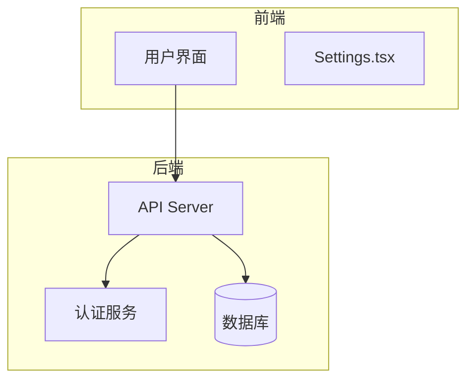
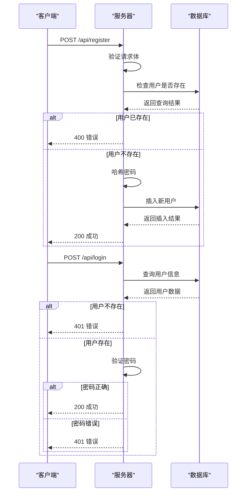
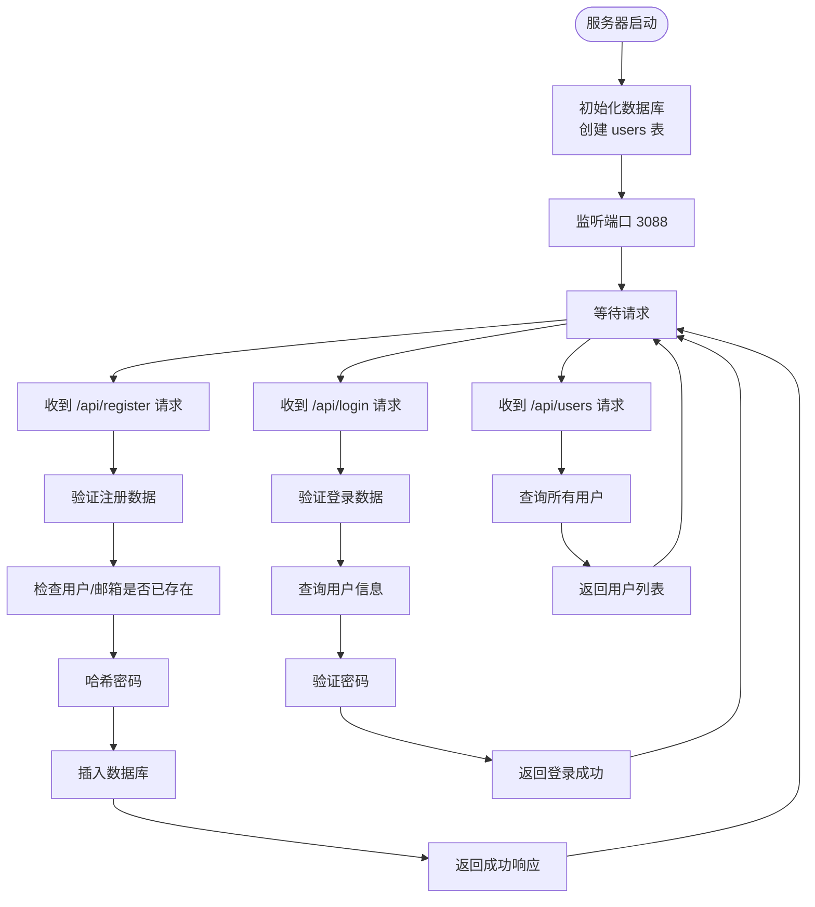
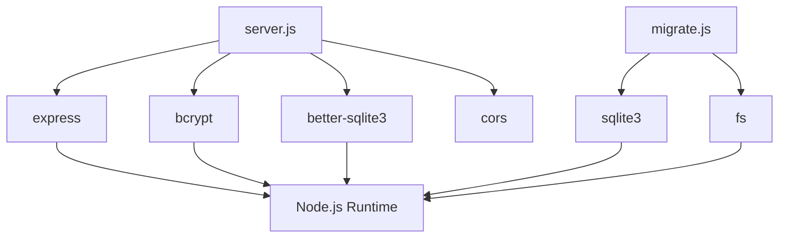

# 后端架构

<cite>
**本文档中引用的文件**   
- [server.js](file://backend\server.js)
- [migrate.js](file://backend\migrate.js)
- [users.json](file://backend\users.json)
- [package.json](file://backend\package.json)
</cite>

## 目录
1. [项目结构](#项目结构)
2. [核心组件](#核心组件)
3. [架构概述](#架构概述)
4. [详细组件分析](#详细组件分析)
5. [依赖分析](#依赖分析)
6. [性能考虑](#性能考虑)
7. [故障排除指南](#故障排除指南)
8. [结论](#结论)

## 项目结构

`officeTools` 项目采用前后端分离的架构设计，后端服务位于 `backend` 目录下，主要由 Express.js 构建 RESTful API。后端核心文件包括 `server.js`（主服务入口）、`migrate.js`（数据库迁移脚本）、`users.json`（用户数据源）和 `package.json`（依赖管理）。前端位于 `src` 目录，使用 React 和 TypeScript 构建用户界面。`server.js` 文件定义了 API 路由、中间件和数据库连接，`migrate.js` 负责初始化和迁移 SQLite 数据库，`users.json` 存储初始用户数据，这些文件共同构成了后端服务的基础。

**图表来源**
- [server.js](file://backend\server.js)
- [migrate.js](file://backend\migrate.js)

**章节来源**
- [server.js](file://backend\server.js)
- [migrate.js](file://backend\migrate.js)

## 核心组件

后端核心组件包括 Express.js 服务器、better-sqlite3 数据库驱动、bcrypt 密码加密库和 CORS 中间件。`server.js` 是应用的主入口，负责启动 HTTP 服务器、配置中间件、定义 API 路由和初始化数据库。`migrate.js` 脚本用于数据库的初始化和模式迁移，确保数据库表结构的正确性。`users.json` 文件作为用户数据的静态存储，用于数据迁移的源。`package.json` 定义了项目依赖，包括 Express.js 用于构建 Web 服务，bcrypt 用于安全地哈希用户密码，cors 用于处理跨域请求，better-sqlite3 用于高效地操作 SQLite 数据库。

**章节来源**
- [server.js](file://backend\server.js)
- [migrate.js](file://backend\migrate.js)
- [users.json](file://backend\users.json)
- [package.json](file://backend\package.json)

## 架构概述

该后端服务采用基于 Express.js 的 RESTful 架构。客户端（前端）通过 HTTP 请求与后端 API 交互。服务器启动时，首先执行 `initDatabase` 函数创建用户表，然后监听指定端口。CORS 中间件配置允许来自特定源（如 `http://officetools.guluwater.com` 和 `http://localhost:5173`）的跨域请求。API 路由处理用户注册、登录和获取用户列表等操作。所有请求体通过 `express.json()` 中间件解析为 JSON 格式。数据库操作使用 `better-sqlite3` 库，每个请求处理完毕后立即关闭数据库连接，以避免连接泄漏。错误处理通过 try-catch 块实现，捕获同步和异步错误，并返回适当的 HTTP 状态码和 JSON 错误信息。

**图表来源**
- [server.js](file://backend\server.js#L30-L160)

**章节来源**
- [server.js](file://backend\server.js#L30-L160)

## 详细组件分析

### 服务器与路由分析

`server.js` 文件是整个后端服务的核心。它使用 `express()` 创建一个应用实例，并通过 `app.use()` 配置中间件。`cors` 中间件确保了前端应用可以安全地访问后端 API。`express.json()` 中间件解析传入的 JSON 请求体。`initDatabase()` 函数在服务器启动时调用，使用 `better-sqlite3` 创建一个名为 `users.db` 的 SQLite 数据库文件，并执行 SQL 语句创建 `users` 表，该表包含 `id`、`username`、`email`、`password` 和 `created_at` 字段，其中 `username` 和 `email` 具有唯一性约束。

API 路由定义了三个端点：
- `POST /api/register`: 处理用户注册。首先验证 `username`、`email` 和 `password` 是否为空。然后查询数据库检查用户名或邮箱是否已存在。如果不存在，则使用 `bcrypt.hash()` 对密码进行哈希处理（使用 10 轮盐值），并将用户信息插入数据库。成功后返回包含用户信息的成功响应。
- `POST /api/login`: 处理用户登录。验证 `username` 和 `password` 后，查询数据库（支持通过用户名或邮箱登录）。如果找到用户，则使用 `bcrypt.compare()` 验证提供的密码与数据库中存储的哈希密码是否匹配。匹配则返回成功响应，否则返回 401 错误。
- `GET /api/users`: 返回所有用户的列表（不包含密码），主要用于调试。

**图表来源**
- [server.js](file://backend\server.js#L30-L160)

**章节来源**
- [server.js](file://backend\server.js#L30-L160)

### 数据库迁移分析

`migrate.js` 脚本的作用是确保数据库处于正确的状态。它包含两个主要功能：`migrateDatabase` 和 `migrateData`。`migrateDatabase` 函数使用 `sqlite3` 库连接到数据库，并执行 `PRAGMA table_info(users)` 查询来检查 `users` 表的结构。如果发现表中缺少 `email` 列，则执行 `ALTER TABLE` 语句添加该列，并为现有用户设置默认邮箱（`username@example.com`）。这保证了数据库模式的向后兼容性。

`migrateData` 函数负责从 `users.json` 文件向数据库导入初始数据。它首先读取 JSON 文件，然后连接到数据库并创建 `users` 表（如果不存在）。接着，它准备一个 `INSERT OR REPLACE` 语句，遍历 JSON 数组中的每个用户对象，并将其 `username`、`password`（已哈希）和 `createdAt` 字段插入数据库。此脚本通常在首次部署或需要重置数据时手动运行。

**章节来源**
- [migrate.js](file://backend\migrate.js#L0-L94)
- [users.json](file://backend\users.json#L0-L7)

## 依赖分析

后端项目的依赖关系清晰。`package.json` 明确列出了四个核心依赖：
- `express`: 作为 Web 服务器框架，是整个应用的基础。
- `cors`: 作为 Express 中间件，处理跨域资源共享策略。
- `bcrypt`: 用于密码的哈希和验证，是安全性的关键。
- `better-sqlite3`: 作为 SQLite 数据库的 Node.js 驱动，提供同步、高性能的数据库操作。

这些依赖通过 `require()` 在 `server.js` 和 `migrate.js` 中被导入和使用。例如，`server.js` 依赖 `express` 来创建应用，依赖 `bcrypt` 来保护用户密码，依赖 `better-sqlite3` 来持久化数据。`migrate.js` 依赖 `sqlite3`（`better-sqlite3` 的底层库）和 `fs` 来读取文件和操作数据库。这种依赖关系使得代码职责分明，易于维护。

**图表来源**
- [package.json](file://backend\package.json#L10-L18)

**章节来源**
- [package.json](file://backend\package.json#L10-L18)

## 性能考虑

该架构在性能方面有其特点。`better-sqlite3` 库因其同步 API 和直接绑定到 SQLite C 库而具有高性能，避免了异步 I/O 的开销。然而，当前的实现方式在每个请求中都创建和关闭数据库连接，这在高并发场景下可能成为瓶颈，因为连接的建立和销毁是有成本的。更优的做法是使用数据库连接池或在整个应用生命周期内保持一个长连接。

密码哈希使用 `bcrypt` 的 10 轮盐值，这是一个在安全性和性能之间取得平衡的合理选择。更高的轮数会增加安全性但也会增加计算时间。API 响应格式简单，仅返回必要的 JSON 数据，减少了网络传输开销。日志记录（`console.log`）有助于监控，但在生产环境中应考虑使用更专业的日志库。

## 故障排除指南

常见问题及解决方案：
- **服务器无法启动**: 检查端口 3088 是否被占用，或 `backend` 目录下的 `package.json` 中的 `start` 脚本是否正确。
- **数据库操作错误**: 确保 `backend` 目录有写权限，以便创建 `users.db` 文件。检查 `server.js` 中的 `DB_FILE` 路径是否正确。
- **注册/登录失败**: 检查请求体是否包含必需的字段（`username`, `email`, `password` for register; `username`, `password` for login）。确保密码哈希过程正常工作。
- **CORS 错误**: 确认前端应用的域名（如 `http://localhost:5173`）已在 `server.js` 的 `cors` 配置中列出。
- **数据未持久化**: 确认 `initDatabase()` 函数已成功执行，并且 `users.db` 文件已创建。检查 `migrate.js` 脚本是否已正确运行以导入初始数据。

**章节来源**
- [server.js](file://backend\server.js)
- [migrate.js](file://backend\migrate.js)

## 结论

`officeTools` 的后端架构是一个典型的、基于 Express.js 的轻量级 RESTful 服务。它有效地利用了 `better-sqlite3` 和 `bcrypt` 等库来处理数据存储和安全性。代码结构清晰，关注点分离。主要优势在于简单易懂，适合小型应用。主要改进点在于数据库连接管理，建议引入连接池以提升高并发下的性能。整体而言，该架构为前端应用提供了稳定、安全的用户认证和数据管理 API。