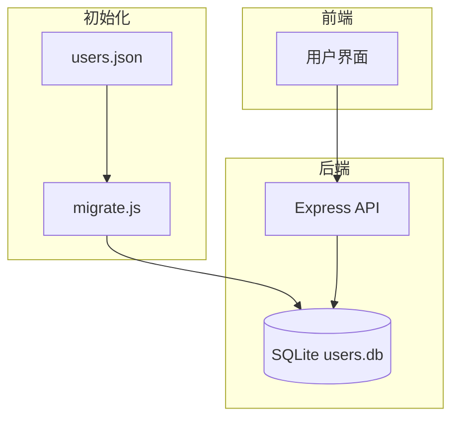
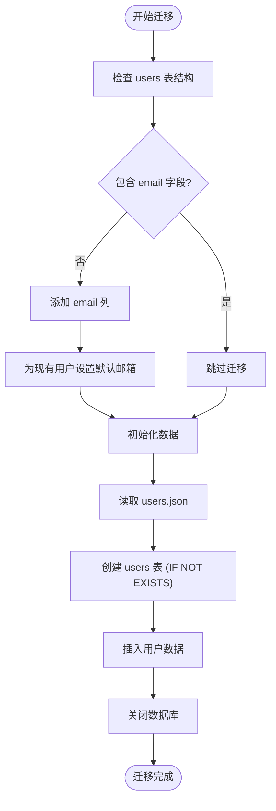
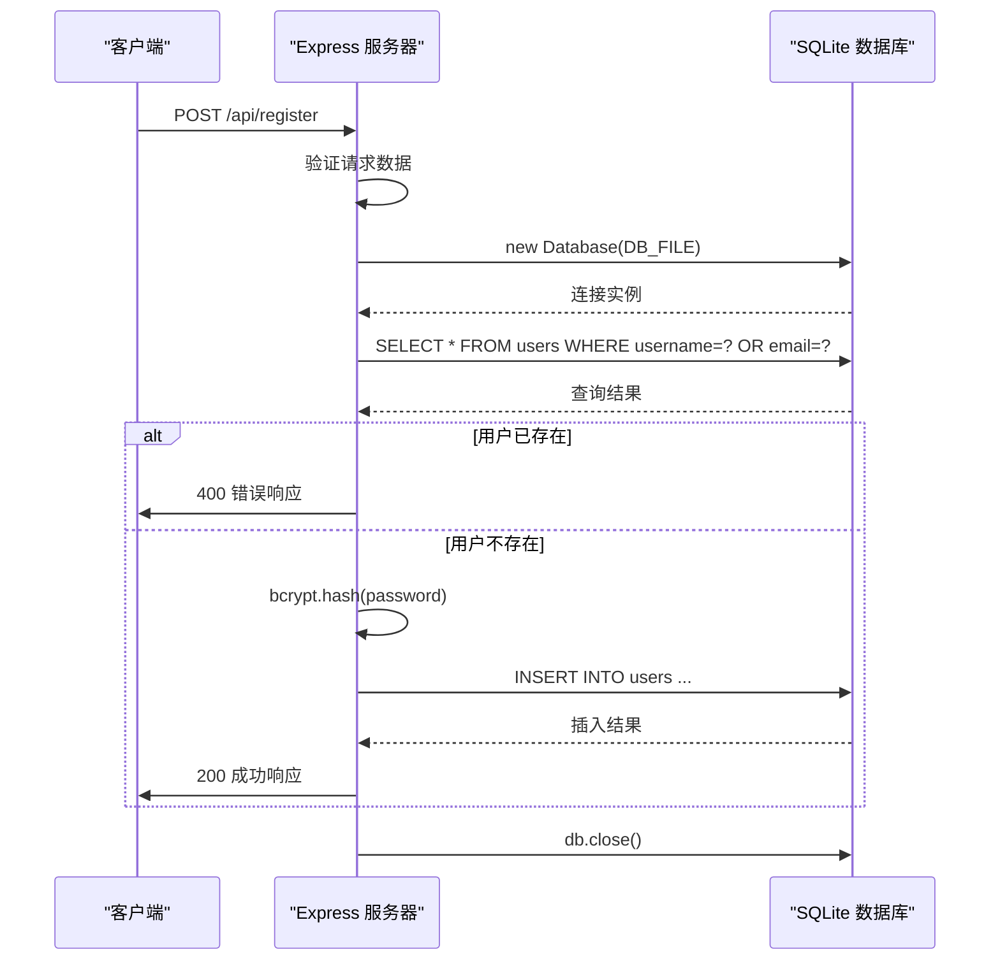

# 数据库设计

<cite>
**本文档引用的文件**  
- [migrate.js](file://backend/migrate.js)
- [server.js](file://backend/server.js)
- [users.json](file://backend/users.json)
- [package.json](file://backend/package.json)
</cite>

## 目录
1. [项目结构](#项目结构)  
2. [核心组件](#核心组件)  
3. [数据库架构概述](#数据库架构概述)  
4. [详细组件分析](#详细组件分析)  
5. [数据模式演进策略](#数据模式演进策略)  
6. [数据持久化流程](#数据持久化流程)  
7. [数据库连接与事务管理](#数据库连接与事务管理)  
8. [错误处理与恢复机制](#错误处理与恢复机制)

## 项目结构

`officeTools` 项目的后端部分位于 `backend` 目录下，主要包含以下文件：

- **migrate.js**：负责数据库迁移和数据初始化
- **server.js**：Express 服务器主文件，处理 API 请求并操作数据库
- **users.json**：用户数据的初始 JSON 文件，用于数据迁移
- **package.json**：定义了项目依赖，包括 `better-sqlite3` 作为数据库驱动

数据库文件 `users.db` 在运行时生成，存储用户信息。

**Section sources**  
- [migrate.js](file://backend/migrate.js#L1-L94)  
- [server.js](file://backend/server.js#L1-L160)  
- [users.json](file://backend/users.json#L1-L8)

## 核心组件

后端系统围绕 SQLite 数据库构建，使用 `better-sqlite3` 模块进行高效同步操作。核心功能包括：

- 用户注册与登录（通过密码哈希）
- 用户数据的增删改查（CRUD）
- 数据库初始化与模式迁移
- 基于 JSON 文件的数据初始化

所有数据库操作均通过预编译 SQL 语句执行，确保性能和安全性。

**Section sources**  
- [server.js](file://backend/server.js#L1-L160)  
- [migrate.js](file://backend/migrate.js#L1-L94)

## 数据库架构概述



**Diagram sources**  
- [server.js](file://backend/server.js#L1-L160)  
- [migrate.js](file://backend/migrate.js#L1-L94)  
- [users.json](file://backend/users.json#L1-L8)

## 详细组件分析

### 数据库连接管理

系统使用 `better-sqlite3` 模块创建数据库连接。每次 API 请求都会创建一个新的连接，并在操作完成后立即关闭，确保线程安全。

```javascript
const Database = require('better-sqlite3');
const db = new Database(DB_FILE);
```

该模式虽未使用连接池，但由于 SQLite 的轻量级特性，在低并发场景下表现良好。

**Section sources**  
- [server.js](file://backend/server.js#L3-L160)  
- [migrate.js](file://backend/migrate.js#L2-L94)

### users 表 Schema 设计

#### 字段定义

| 字段名 | 类型 | 约束 | 说明 |
|--------|------|------|------|
| id | INTEGER | PRIMARY KEY AUTOINCREMENT | 用户唯一标识 |
| username | TEXT | UNIQUE NOT NULL | 用户名，唯一 |
| email | TEXT | UNIQUE NOT NULL | 邮箱，唯一 |
| password | TEXT | NOT NULL | 加密后的密码 |
| created_at | DATETIME | DEFAULT CURRENT_TIMESTAMP | 创建时间 |

#### 索引策略

- `username` 和 `email` 字段均建立唯一索引，确保用户标识的唯一性
- `id` 为主键索引，自动创建

#### 创建语句

```sql
CREATE TABLE IF NOT EXISTS users (
  id INTEGER PRIMARY KEY AUTOINCREMENT,
  username TEXT UNIQUE NOT NULL,
  email TEXT UNIQUE NOT NULL,
  password TEXT NOT NULL,
  created_at DATETIME DEFAULT CURRENT_TIMESTAMP
);
```

**Section sources**  
- [server.js](file://backend/server.js#L21-L28)  
- [migrate.js](file://backend/migrate.js#L59-L67)

### SQL 查询组织模式

所有 SQL 查询均使用预编译语句（Prepared Statements），防止 SQL 注入：

```javascript
const stmt = db.prepare('SELECT * FROM users WHERE username = ? OR email = ?');
const user = stmt.get(username, email);
```

常见操作模式：

- **查询**：使用 `.get()` 或 `.all()`
- **插入/更新**：使用 `.run()`
- **批量操作**：使用 `prepare()` + `run()` 循环

**Section sources**  
- [server.js](file://backend/server.js#L53-L142)

## 数据模式演进策略

系统通过 `migrate.js` 实现数据库模式的版本化迁移和数据初始化。

### 模式迁移逻辑

1. **检查现有结构**：使用 `PRAGMA table_info(users)` 获取当前表字段
2. **增量更新**：若缺少 `email` 字段，则执行 `ALTER TABLE` 添加
3. **数据填充**：为现有用户生成默认邮箱（`username@example.com`）

```javascript
db.all("PRAGMA table_info(users)", [], (err, columns) => {
  const hasEmailColumn = columns.some(col => col.name === 'email');
  if (!hasEmailColumn) {
    db.run('ALTER TABLE users ADD COLUMN email TEXT');
    db.run('UPDATE users SET email = username || "@example.com" WHERE email IS NULL');
  }
});
```

### 数据初始化流程

1. 读取 `users.json` 文件
2. 创建 `users` 表（如不存在）
3. 使用 `INSERT OR REPLACE` 批量导入用户数据



**Diagram sources**  
- [migrate.js](file://backend/migrate.js#L6-L94)

**Section sources**  
- [migrate.js](file://backend/migrate.js#L6-L94)  
- [users.json](file://backend/users.json#L1-L8)

## 数据持久化流程

从 API 请求到数据库操作的完整链路如下：



**Diagram sources**  
- [server.js](file://backend/server.js#L45-L88)

**Section sources**  
- [server.js](file://backend/server.js#L45-L88)

## 数据库连接与事务管理

### 连接配置

- **驱动**：`better-sqlite3`
- **文件路径**：`backend/users.db`
- **连接方式**：每次请求创建新连接，操作后立即关闭
- **初始化**：服务器启动时调用 `initDatabase()` 确保表存在

### 事务处理

尽管代码中未显式使用事务，但 `better-sqlite3` 的单语句操作具有原子性。对于多语句操作（如迁移），应使用事务确保一致性。

建议改进：

```javascript
const transaction = db.transaction(() => {
  db.prepare('UPDATE users ...').run();
  db.prepare('INSERT INTO logs ...').run();
});
transaction();
```

**Section sources**  
- [server.js](file://backend/server.js#L19-L30)  
- [migrate.js](file://backend/migrate.js#L8-L94)

## 错误处理与恢复机制

系统实现了多层错误处理：

1. **数据库连接错误**：捕获并记录
2. **SQL 执行错误**：捕获、关闭连接、返回 500 响应
3. **数据验证错误**：返回 400 响应
4. **密码验证错误**：返回 401 响应

所有错误均通过 `console.error` 记录，便于调试。

```javascript
try {
  const db = new Database(DB_FILE);
  // 操作...
} catch (dbError) {
  db.close();
  console.error('数据库操作错误:', dbError);
  return res.status(500).json({ success: false, message: '数据库错误' });
}
```

**Section sources**  
- [server.js](file://backend/server.js#L50-L52)  
- [server.js](file://backend/server.js#L101-L103)