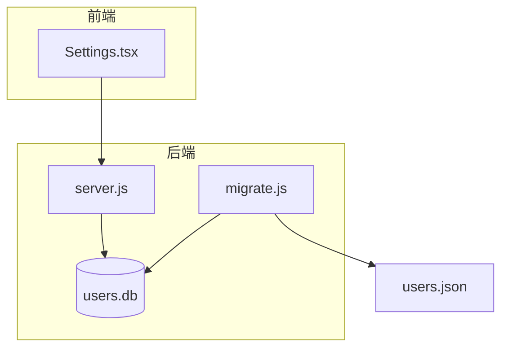
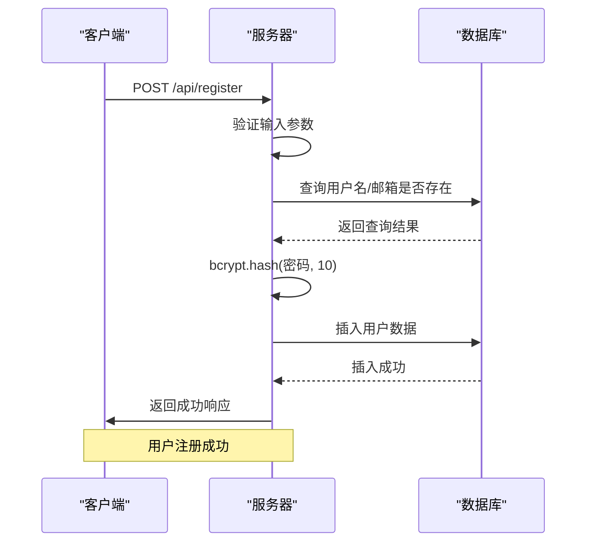
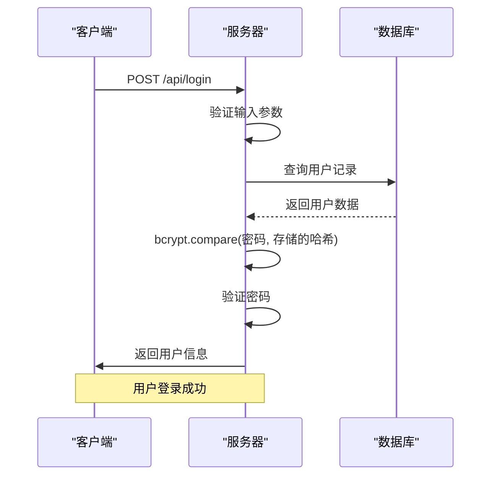
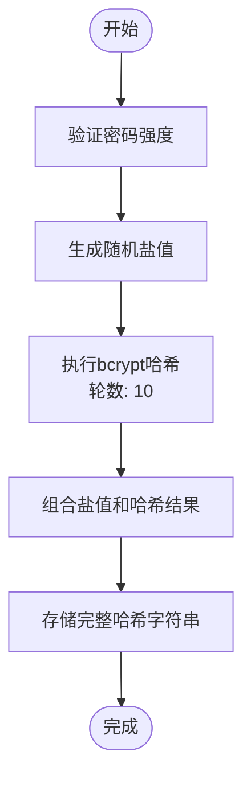
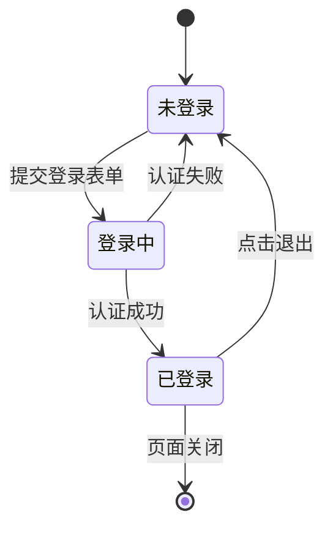

# 用户认证机制

<cite>
**本文档引用的文件**   
- [server.js](file://backend/server.js#L0-L161)
- [users.json](file://backend/users.json#L0-L7)
- [migrate.js](file://backend/migrate.js#L0-L94)
- [Settings.tsx](file://src/components/Settings.tsx#L0-L305)
</cite>

## 目录
1. [项目结构分析](#项目结构分析)
2. [用户认证流程](#用户认证流程)
3. [密码安全存储机制](#密码安全存储机制)
4. [用户凭证存储设计](#用户凭证存储设计)
5. [登录状态维护](#登录状态维护)
6. [安全防护措施](#安全防护措施)

## 项目结构分析

根据项目结构，用户认证系统的核心实现位于 `backend` 目录下。主要文件包括：
- `server.js`：后端服务器主文件，包含用户注册、登录等API接口
- `users.json`：用户数据的JSON格式存储文件
- `migrate.js`：数据库迁移脚本，负责将JSON数据迁移到SQLite数据库
- `package.json`：项目依赖配置，包含bcrypt等安全相关库

前端认证界面由 `src/components/Settings.tsx` 实现，提供用户注册和登录的UI交互。



**图示来源**
- [server.js](file://backend/server.js#L0-L161)
- [users.json](file://backend/users.json#L0-L7)
- [migrate.js](file://backend/migrate.js#L0-L94)
- [Settings.tsx](file://src/components/Settings.tsx#L0-L305)

## 用户认证流程

本系统的用户认证采用基于会话的认证机制，而非JWT令牌认证。认证流程包括用户注册和登录两个主要过程。

### 注册流程

用户注册流程如下：
1. 客户端发送包含用户名、邮箱和密码的注册请求
2. 服务器验证输入参数的完整性
3. 检查用户名或邮箱是否已存在
4. 使用bcrypt对密码进行哈希处理
5. 将用户信息存储到SQLite数据库
6. 返回注册成功响应



**图示来源**
- [server.js](file://backend/server.js#L46-L89)

### 登录流程

用户登录流程如下：
1. 客户端发送包含用户名（或邮箱）和密码的登录请求
2. 服务器验证输入参数
3. 在数据库中查找用户记录（支持用户名或邮箱登录）
4. 使用bcrypt.compare验证密码哈希
5. 验证成功后返回用户信息
6. 前端保存登录状态



**图示来源**
- [server.js](file://backend/server.js#L85-L129)

## 密码安全存储机制

系统采用bcrypt算法对用户密码进行安全哈希存储，确保即使数据库泄露，攻击者也无法轻易获取原始密码。

### Bcrypt哈希实现

在`server.js`文件中，密码哈希的实现如下：

```javascript
// 加密密码并插入用户
const hashedPassword = await bcrypt.hash(password, 10);

const result = db.prepare('INSERT INTO users (username, email, password) VALUES (?, ?, ?)').run(username, email, hashedPassword);
```

**关键参数分析：**
- **盐值轮数（Salt Rounds）**：配置为10轮，提供了良好的安全性和性能平衡
- **哈希算法**：使用bcrypt，内置盐值生成和密码验证机制
- **异步处理**：使用async/await确保非阻塞操作

bcrypt的盐值生成策略是自动的，每次哈希都会生成唯一的随机盐值，这确保了即使相同密码也会产生不同的哈希值，有效防止彩虹表攻击。



**图示来源**
- [server.js](file://backend/server.js#L62)

## 用户凭证存储设计

系统使用SQLite数据库存储用户凭证，同时保留了JSON格式的迁移文件。

### 数据库表结构

`server.js`中的数据库初始化代码定义了用户表结构：

```javascript
db.exec(`
  CREATE TABLE IF NOT EXISTS users (
    id INTEGER PRIMARY KEY AUTOINCREMENT,
    username TEXT UNIQUE NOT NULL,
    email TEXT UNIQUE NOT NULL,
    password TEXT NOT NULL,
    created_at DATETIME DEFAULT CURRENT_TIMESTAMP
  )
`);
```

**字段含义：**
- **id**：用户唯一标识符，自增主键
- **username**：用户名，唯一约束
- **email**：邮箱地址，唯一约束
- **password**：密码哈希值，存储bcrypt生成的完整字符串
- **created_at**：账户创建时间，默认为当前时间戳

### JSON文件结构

`users.json`文件作为数据迁移的源文件，其结构如下：

```json
[
  {
    "id": "1751968125808",
    "username": "alvisliu",
    "password": "$2b$10$hr9ekGEU93aup8uOytOAruO6m9vzcwSyvkosnVH9Z3lRRR/j7vGXO",
    "createdAt": "2025-07-08T09:48:45.808Z"
  }
]
```

**字段说明：**
- **id**：用户标识符
- **username**：用户名
- **password**：bcrypt哈希密码
- **createdAt**：账户创建时间

### 数据迁移机制

`migrate.js`文件实现了从JSON到SQLite的迁移：

```javascript
async function migrateData() {
  try {
    // 读取JSON数据
    const jsonData = JSON.parse(fs.readFileSync(JSON_FILE, 'utf8'));
    
    // 连接数据库
    const db = new sqlite3.Database(DB_FILE);
    
    // 创建表（如果不存在）
    db.run(`
      CREATE TABLE IF NOT EXISTS users (
        id INTEGER PRIMARY KEY AUTOINCREMENT,
        username TEXT UNIQUE NOT NULL,
        password TEXT NOT NULL,
        created_at DATETIME DEFAULT CURRENT_TIMESTAMP
      )
    `);
    
    // 插入数据
    const stmt = db.prepare('INSERT OR REPLACE INTO users (username, password, created_at) VALUES (?, ?, ?)');
    
    jsonData.forEach(user => {
      stmt.run(user.username, user.password, user.createdAt);
    });
    
    stmt.finalize();
  } catch (error) {
    console.error('迁移失败:', error);
  }
}
```

**图示来源**
- [server.js](file://backend/server.js#L10-L20)
- [users.json](file://backend/users.json#L0-L7)
- [migrate.js](file://backend/migrate.js#L36-L94)

## 登录状态维护

系统采用前端状态管理的方式维护用户登录状态，而非传统的会话令牌机制。

### 前端状态管理

在`Settings.tsx`中，使用React状态来管理登录状态：

```typescript
const [isLoggedIn, setIsLoggedIn] = useState(false);
const [currentUser, setCurrentUser] = useState<any>(null);

const handleLogin = async (values: LoginForm) => {
  setLoading(true);
  try {
    const response = await fetch(`${API_BASE_URL}/api/login`, {
      method: 'POST',
      headers: {
        'Content-Type': 'application/json',
      },
      body: JSON.stringify(values),
    });
    
    const data = await response.json();
    
    if (response.ok) {
      message.success(data.message);
      setIsLoggedIn(true);
      setCurrentUser(data.user);
      loginForm.resetFields();
    } else {
      message.error(data.error);
    }
  } catch (error) {
    message.error('网络错误，请检查后端服务是否启动');
  } finally {
    setLoading(false);
  }
};

const handleLogout = () => {
  setIsLoggedIn(false);
  setCurrentUser(null);
  message.success('已退出登录');
};
```

### 认证状态流程



**图示来源**
- [Settings.tsx](file://src/components/Settings.tsx#L41-L93)

## 安全防护措施

系统实现了多项安全防护措施，确保用户认证过程的安全性。

### 输入验证

系统对用户输入进行严格验证：

```javascript
// 注册接口输入验证
if (!username || !email || !password) {
  return res.status(400).json({ 
    success: false, 
    message: '用户名、邮箱和密码不能为空' 
  });
}

// 登录接口输入验证
if (!username || !password) {
  return res.status(400).json({ 
    success: false, 
    message: '用户名和密码不能为空' 
  });
}
```

### 错误处理

系统采用一致的错误处理策略，避免泄露敏感信息：

```javascript
// 统一的错误响应
return res.status(401).json({ success: false, message: '用户名或密码错误' });
```

### CORS配置

服务器配置了CORS策略，限制跨域请求：

```javascript
app.use(cors({
  origin: ['http://officetools.guluwater.com', 'http://localhost:5173'],
  credentials: true
}));
```

### 数据库安全

- 使用参数化查询防止SQL注入
- 对用户名和邮箱字段设置唯一约束
- 密码字段存储哈希值而非明文

### 潜在安全改进建议

1. **添加速率限制**：防止暴力破解攻击
2. **实现CSRF防护**：增强表单提交安全性
3. **添加密码强度要求**：在注册时验证密码复杂度
4. **实现会话过期机制**：增加长时间不活动的自动登出功能
5. **添加双因素认证**：提供更高级别的安全保护

**图示来源**
- [server.js](file://backend/server.js#L0-L161)
- [Settings.tsx](file://src/components/Settings.tsx#L0-L305)