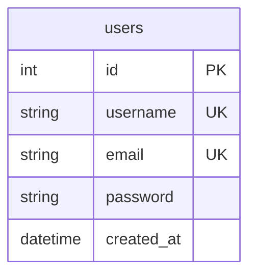

# 数据模型

<cite>
**本文档中引用的文件**   
- [users.json](file://backend/users.json)
- [server.js](file://backend/server.js)
- [migrate.js](file://backend/migrate.js)
- [tools.ts](file://src/types/tools.ts)
- [toolRegistry.ts](file://src/utils/toolRegistry.ts)
</cite>

## 目录
1. [用户数据模型](#用户数据模型)  
2. [前端工具配置模型](#前端工具配置模型)  
3. [实体关系图（ERD）](#实体关系图erd)  
4. [数据访问模式与扩展方向](#数据访问模式与扩展方向)

## 用户数据模型

根据项目中的 `users.json`、`server.js` 和 `migrate.js` 文件分析，用户数据模型经历了从静态 JSON 文件到 SQLite 数据库的迁移过程。当前系统使用 SQLite 数据库存储用户信息，`users.json` 仅作为初始数据迁移的来源。

### 字段定义与约束

用户表（`users`）的结构在 `server.js` 的 `initDatabase()` 函数中定义，具体字段如下：

- **id**：整数类型，主键，自增（`INTEGER PRIMARY KEY AUTOINCREMENT`）
- **username**：文本类型，唯一且非空（`TEXT UNIQUE NOT NULL`）
- **email**：文本类型，唯一且非空（`TEXT UNIQUE NOT NULL`）
- **password**：文本类型，非空（`TEXT NOT NULL`）
- **created_at**：日期时间类型，默认值为当前时间戳（`DATETIME DEFAULT CURRENT_TIMESTAMP`）

**示例数据记录**：
```json
{
  "id": 1,
  "username": "alvisliu",
  "email": "alvisliu@example.com",
  "password": "$2b$10$hr9ekGEU93aup8uOytOAruO6m9vzcwSyvkosnVH9Z3lRRR/j7vGXO",
  "created_at": "2025-07-08T09:48:45.808Z"
}
```

### 密码存储机制

系统使用 `bcrypt` 库对用户密码进行哈希处理，确保密码安全。在用户注册时，密码通过 `bcrypt.hash(password, 10)` 进行加密，其中 `10` 是哈希的盐值成本（cost factor），用于控制加密的计算强度。

**为何使用 bcrypt**：
- **抗暴力破解**：bcrypt 是一种自适应哈希函数，随着计算能力的提升，可以通过增加成本因子来增强安全性。
- **内置盐值**：bcrypt 在哈希过程中自动生成盐值，防止彩虹表攻击。
- **广泛认可**：bcrypt 是行业标准的密码哈希算法，被广泛应用于各种安全系统中。

在登录时，系统使用 `bcrypt.compare(password, user.password)` 验证用户输入的密码与数据库中存储的哈希值是否匹配。

**Section sources**
- [server.js](file://backend/server.js#L46-L89)
- [server.js](file://backend/server.js#L85-L129)
- [migrate.js](file://backend/migrate.js#L36-L94)

## 前端工具配置模型

前端工具的配置模型基于 `tools.ts` 文件中定义的 `ToolConfig` 和 `ToolCategory` 接口，并在 `toolRegistry.ts` 中实现具体配置。

### ToolConfig 接口

`ToolConfig` 定义了单个工具的配置属性：

- **id**：字符串，工具的唯一标识符
- **name**：字符串，工具的显示名称
- **icon**：字符串，工具的图标标识
- **category**：字符串字面量，工具的分类（如 'document', 'image', 'text' 等）
- **description**：字符串，工具的功能描述
- **component**：React 组件类型，对应的功能组件
- **keywords**：可选字符串数组，用于搜索和标签

### ToolCategory 接口

`ToolCategory` 定义了工具分类的结构：

- **key**：字符串，分类的唯一键
- **name**：字符串，分类的显示名称
- **icon**：字符串，分类的图标
- **tools**：`ToolConfig` 数组，包含该分类下的所有工具

### 工具配置示例

在 `toolRegistry.ts` 中，工具被组织为多个分类，例如：

```typescript
export const toolCategories: ToolCategory[] = [
  {
    key: 'file',
    name: '文件处理',
    icon: 'FileOutlined',
    tools: [
      {
        id: 'compress',
        name: '文件压缩',
        icon: 'FileZipOutlined',
        category: 'document',
        description: '批量压缩文件为ZIP格式',
        component: FileCompressor
      }
    ]
  },
  {
    key: 'image',
    name: '图片工具',
    icon: 'PictureOutlined',
    tools: [
      {
        id: 'ocr',
        name: '图片识字',
        icon: 'FileImageOutlined',
        category: 'image',
        description: '提取图片中的文字内容',
        component: ImageOCR
      }
    ]
  }
];
```

此外，`toolRegistry.ts` 还提供了辅助函数，如 `getAllTools()`、`getToolById(id)` 和 `getToolsByCategory(category)`，用于工具的查找和管理。

**Section sources**
- [tools.ts](file://src/types/tools.ts#L2-L17)
- [toolRegistry.ts](file://src/utils/toolRegistry.ts#L0-L228)

## 实体关系图（ERD）

以下为用户表的实体关系图，展示了 `users` 表的字段、主键、外键和数据类型。



**Diagram sources**
- [server.js](file://backend/server.js#L46-L52)
- [migrate.js](file://backend/migrate.js#L36-L42)

## 数据访问模式与扩展方向

### 数据访问模式

- **注册**：客户端发送用户名、邮箱和密码，后端验证唯一性后使用 `bcrypt` 哈希密码并插入数据库。
- **登录**：客户端发送用户名/邮箱和密码，后端查询用户并使用 `bcrypt.compare` 验证密码。
- **获取用户列表**：通过 `/api/users` 接口返回所有用户的公开信息（不含密码）。

### 潜在扩展方向

1. **用户角色与权限**：可扩展 `users` 表，添加 `role` 字段（如 'admin', 'user'），实现权限控制。
2. **多因素认证（MFA）**：增加 `mfa_enabled` 和 `mfa_secret` 字段，支持 TOTP 等认证方式。
3. **用户配置**：添加 `user_preferences` 表，存储用户的个性化设置。
4. **社交登录**：扩展 `users` 表，支持 `google_id`、`github_id` 等字段，实现第三方登录。
5. **审计日志**：增加 `user_logs` 表，记录用户登录、操作等行为，用于安全审计。

**Section sources**
- [server.js](file://backend/server.js#L125-L160)
- [migrate.js](file://backend/migrate.js#L0-L42)