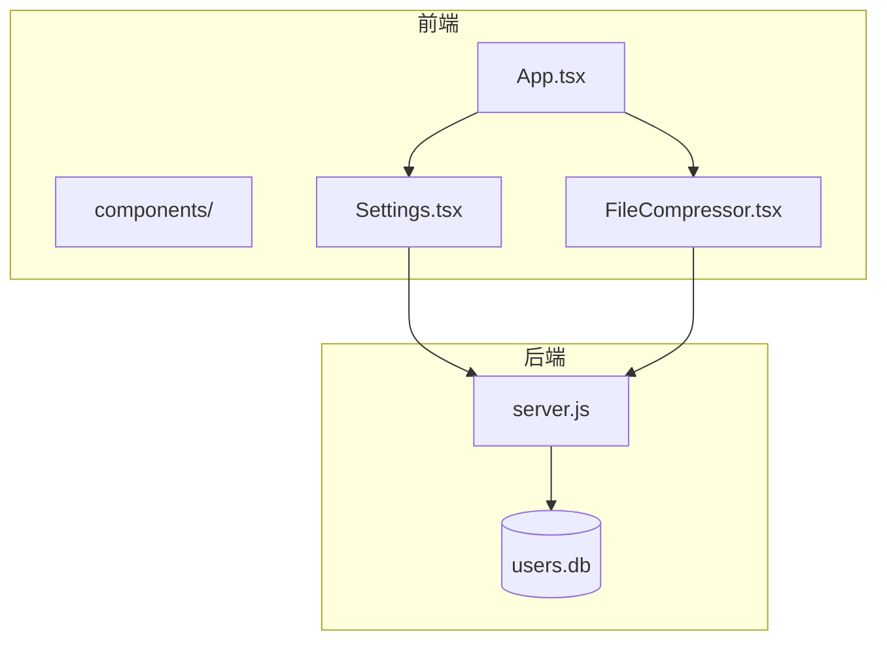
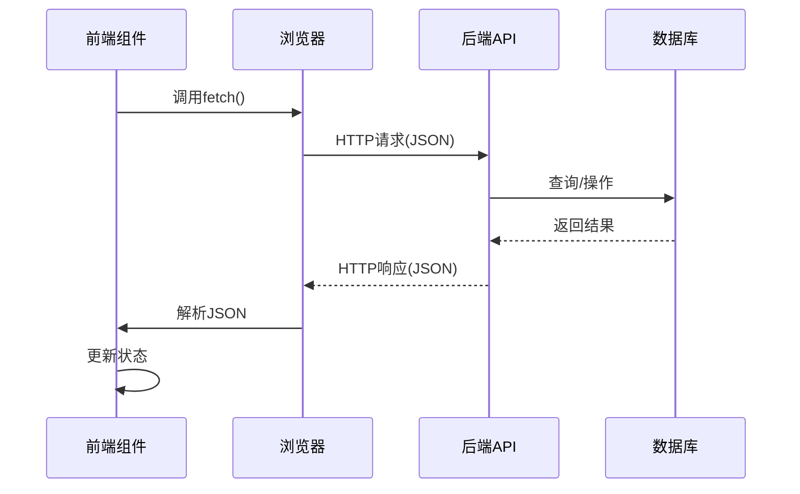
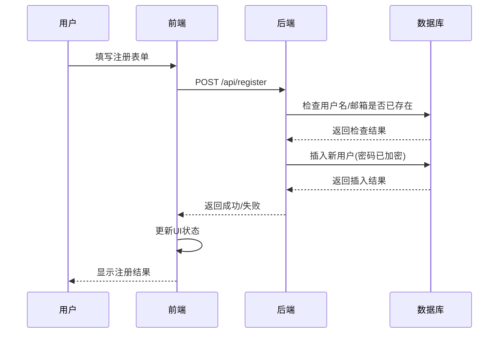
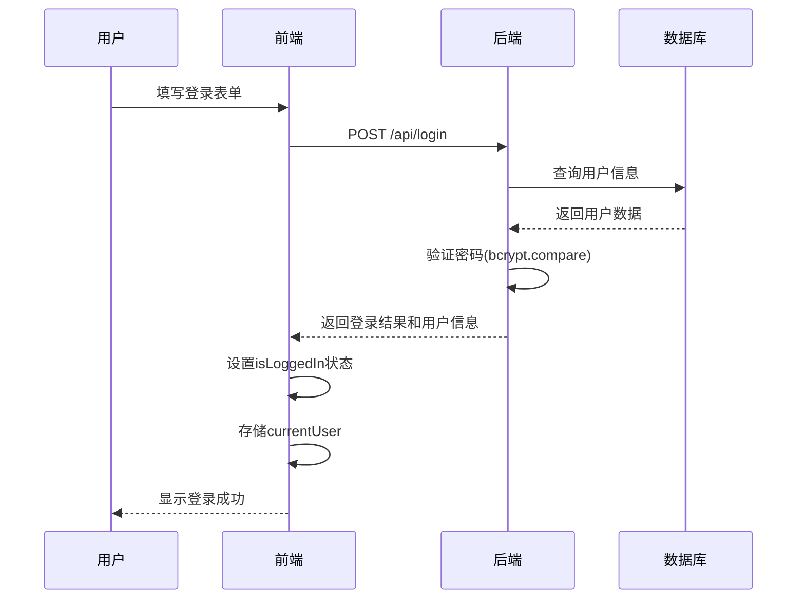
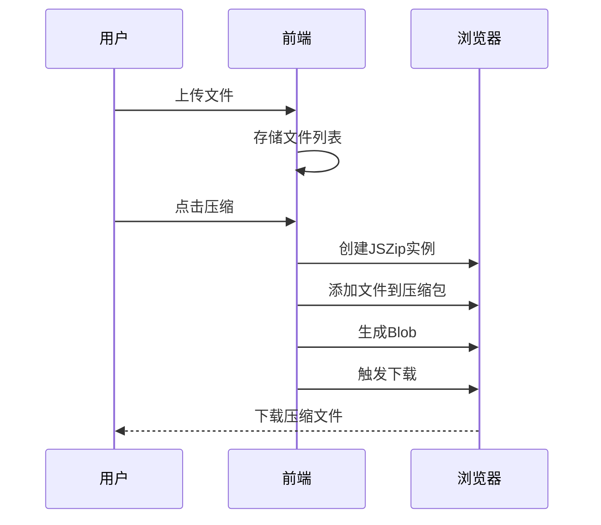
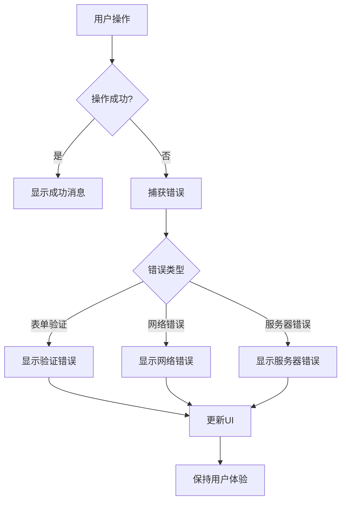

# 数据流与通信

<cite>
**本文档引用的文件**  
- [server.js](file://backend/server.js#L1-L160)
- [App.tsx](file://src/App.tsx#L1-L785)
- [Settings.tsx](file://src/components/Settings.tsx#L1-L402)
- [FileCompressor.tsx](file://src/components/FileCompressor.tsx#L1-L168)
- [vite-env.d.ts](file://src/vite-env.d.ts#L1-L9)
</cite>

## 目录
1. [项目结构](#项目结构)
2. [核心组件](#核心组件)
3. [前后端通信机制](#前后端通信机制)
4. [用户认证流程分析](#用户认证流程分析)
5. [文件上传处理流程](#文件上传处理流程)
6. [数据格式与序列化](#数据格式与序列化)
7. [错误处理与反馈机制](#错误处理与反馈机制)

## 项目结构

项目采用前后端分离架构，前端基于React + TypeScript + Vite构建，后端使用Node.js + Express框架。



**图示来源**  
- [App.tsx](file://src/App.tsx#L1-L785)
- [server.js](file://backend/server.js#L1-L160)

**本节来源**  
- [App.tsx](file://src/App.tsx#L1-L785)
- [server.js](file://backend/server.js#L1-L160)

## 核心组件

项目核心组件包括用户认证系统、文件处理工具和主题管理系统。用户通过`Settings.tsx`组件进行登录注册，文件处理功能由`FileCompressor.tsx`等组件实现，主题切换通过`useTheme.ts`和`ThemeToggle.tsx`完成。

**本节来源**  
- [App.tsx](file://src/App.tsx#L1-L785)
- [Settings.tsx](file://src/components/Settings.tsx#L1-L402)
- [FileCompressor.tsx](file://src/components/FileCompressor.tsx#L1-L168)

## 前后端通信机制

项目通过`fetch` API实现前后端通信，采用JSON格式进行数据交换。前端通过环境变量配置API基础URL，实现开发与生产环境的无缝切换。

### API基础URL配置

前端通过`import.meta.env.VITE_API_BASE_URL`读取环境变量，若未配置则默认使用`http://localhost:3088`：

```typescript
const API_BASE_URL = import.meta.env.VITE_API_BASE_URL || 'http://localhost:3088';
```

该配置在`vite-env.d.ts`中定义类型：

```typescript
interface ImportMetaEnv {
  readonly VITE_API_BASE_URL?: string
}
```

### 通信流程

1. 前端组件发起`fetch`请求
2. 设置`Content-Type: application/json`头部
3. 请求体序列化为JSON格式
4. 后端Express中间件`app.use(express.json())`解析请求体
5. 响应数据以JSON格式返回
6. 前端解析响应并更新状态



**图示来源**  
- [Settings.tsx](file://src/components/Settings.tsx#L1-L402)
- [server.js](file://backend/server.js#L1-L160)

**本节来源**  
- [Settings.tsx](file://src/components/Settings.tsx#L1-L402)
- [vite-env.d.ts](file://src/vite-env.d.ts#L1-L9)
- [server.js](file://backend/server.js#L1-L160)

## 用户认证流程分析

项目实现了完整的用户注册、登录和会话管理功能，但未使用JWT，而是通过前端状态管理实现会话控制。

### 注册流程



**图示来源**  
- [Settings.tsx](file://src/components/Settings.tsx#L1-L402)
- [server.js](file://backend/server.js#L46-L89)

### 登录流程



**图示来源**  
- [Settings.tsx](file://src/components/Settings.tsx#L1-L402)
- [server.js](file://backend/server.js#L85-L129)

### 认证实现细节

后端`server.js`中的登录接口实现：

```javascript
app.post('/api/login', async (req, res) => {
  const { username, password } = req.body;
  
  // 从数据库查询用户（支持用户名或邮箱登录）
  const user = db.prepare('SELECT * FROM users WHERE username = ? OR email = ?').get(username, username);
  
  // 验证密码
  const isValidPassword = await bcrypt.compare(password, user.password);
  
  // 返回用户基本信息
  res.json({ 
    success: true, 
    message: '登录成功',
    user: { id: user.id, username: user.username, email: user.email }
  });
});
```

前端`Settings.tsx`中的状态管理：

```typescript
const [isLoggedIn, setIsLoggedIn] = useState(false);
const [currentUser, setCurrentUser] = useState<any>(null);

// 登录成功后更新状态
if (response.ok) {
  setIsLoggedIn(true);
  setCurrentUser(data.user);
}
```

**本节来源**  
- [Settings.tsx](file://src/components/Settings.tsx#L1-L402)
- [server.js](file://backend/server.js#L85-L129)

## 文件上传处理流程

以文件压缩功能为例，分析文件上传和处理的完整流程。

### 文件压缩组件分析

`FileCompressor.tsx`组件实现了客户端文件压缩功能，无需后端参与：

```typescript
const handleCompress = async () => {
  const zip = new JSZip();
  
  // 添加文件到压缩包
  files.forEach((fileItem) => {
    zip.file(fileItem.name, fileItem.file);
  });

  // 生成压缩包
  const content = await zip.generateAsync({
    type: 'blob',
    compression: 'DEFLATE'
  });

  // 下载文件
  saveAs(content, `compressed_${timestamp}.zip`);
};
```

### 处理流程时序图



**图示来源**  
- [FileCompressor.tsx](file://src/components/FileCompressor.tsx#L1-L168)

**本节来源**  
- [FileCompressor.tsx](file://src/components/FileCompressor.tsx#L1-L168)

## 数据格式与序列化

项目前后端通信采用JSON格式，遵循统一的数据结构约定。

### 请求/响应格式

**请求格式：**
- Content-Type: application/json
- 请求体：JSON对象
- 示例：`{ "username": "test", "password": "123456" }`

**响应格式：**
```json
{
  "success": true,
  "message": "操作成功",
  "user": {
    "id": 1,
    "username": "test",
    "email": "test@example.com"
  }
}
```

### 数据类型定义

前端使用TypeScript定义数据类型：

```typescript
interface LoginForm {
  username: string;
  password: string;
}

interface RegisterForm {
  username: string;
  email: string;
  password: string;
  confirmPassword: string;
}
```

后端数据库表结构：

```sql
CREATE TABLE users (
  id INTEGER PRIMARY KEY AUTOINCREMENT,
  username TEXT UNIQUE NOT NULL,
  email TEXT UNIQUE NOT NULL,
  password TEXT NOT NULL,
  created_at DATETIME DEFAULT CURRENT_TIMESTAMP
);
```

**本节来源**  
- [Settings.tsx](file://src/components/Settings.tsx#L1-L402)
- [server.js](file://backend/server.js#L1-L160)

## 错误处理与反馈机制

项目实现了完善的错误处理和用户反馈机制。

### 错误处理流程



### 具体实现

前端使用Ant Design的`message`组件提供反馈：

```typescript
try {
  const response = await fetch(`${API_BASE_URL}/api/login`, {
    method: 'POST',
    headers: { 'Content-Type': 'application/json' },
    body: JSON.stringify(values)
  });
  
  const data = await response.json();
  
  if (response.ok) {
    message.success(data.message);
    setIsLoggedIn(true);
  } else {
    message.error(data.error);
  }
} catch (error) {
  message.error('网络错误，请检查后端服务是否启动');
}
```

后端返回标准化的错误响应：

```javascript
return res.status(400).json({ 
  success: false, 
  message: '用户名和密码不能为空' 
});
```

**本节来源**  
- [Settings.tsx](file://src/components/Settings.tsx#L1-L402)
- [server.js](file://backend/server.js#L1-L160)