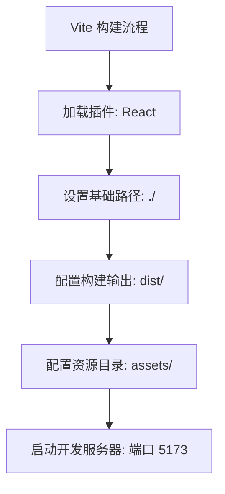
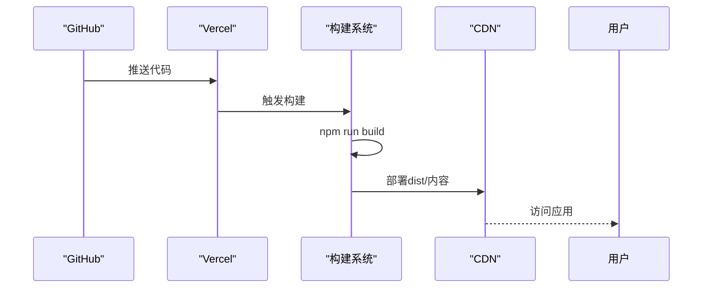
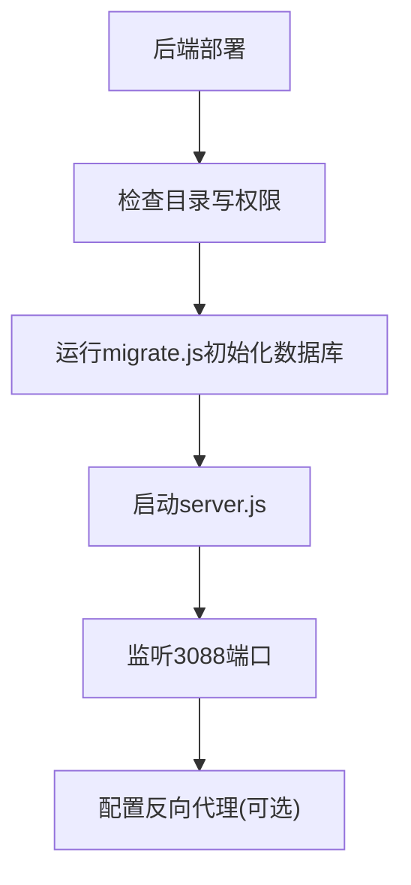
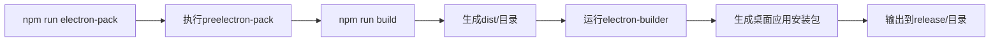
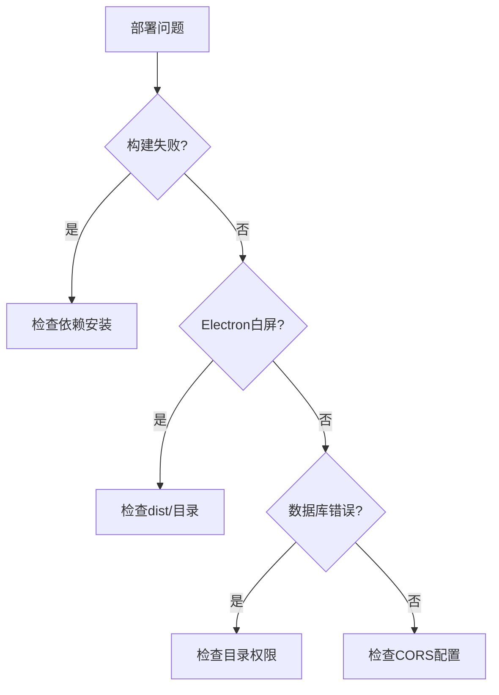

# 配置与部署

<cite>
**本文档引用的文件**  
- [vite.config.ts](file://vite.config.ts)
- [vercel.json](file://vercel.json)
- [package.json](file://package.json)
- [backend/package.json](file://backend/package.json)
- [backend/server.js](file://backend/server.js)
- [backend/migrate.js](file://backend/migrate.js)
- [public/electron.js](file://public/electron.js)
- [src/vite-env.d.ts](file://src/vite-env.d.ts)
</cite>

## 目录
1. [开发环境配置](#开发环境配置)
2. [构建配置分析](#构建配置分析)
3. [生产环境部署方案](#生产环境部署方案)
4. [Electron桌面应用打包](#electron桌面应用打包)
5. [环境变量管理](#环境变量管理)
6. [构建脚本详解](#构建脚本详解)
7. [常见部署问题排查](#常见部署问题排查)

## 开发环境配置

本项目使用Vite作为前端构建工具，Node.js作为后端运行环境。开发环境配置主要包括`.npmrc`设置和依赖安装。

尽管项目中未找到`.npmrc`文件，但根据`package.json`中的依赖配置，项目使用npm作为包管理器。开发环境搭建步骤如下：

1. **安装Node.js**：确保系统已安装Node.js（建议版本16以上）。
2. **安装依赖**：
   ```bash
   # 安装前端依赖
   npm install
   
   # 进入backend目录安装后端依赖
   cd backend && npm install
   ```

项目依赖包括React、Ant Design、CryptoJS、PDF-Lib、Tesseract.js等，支持文件压缩、图片处理、文本工具等多种功能。

**Section sources**
- [package.json](file://package.json#L45-L75)
- [backend/package.json](file://backend/package.json#L10-L19)

## 构建配置分析

Vite构建配置通过`vite.config.ts`文件定义，包含插件、构建输出路径和开发服务器设置。

```typescript
import { defineConfig } from 'vite'
import react from '@vitejs/plugin-react'

export default defineConfig({
  plugins: [react()],
  base: './',
  build: {
    outDir: 'dist',
    assetsDir: 'assets'
  },
  server: {
    port: 5173
  }
})
```

### 主要配置说明

- **plugins**：使用`@vitejs/plugin-react`插件支持React框架。
- **base**：设置为`./`，表示相对路径，适用于静态文件部署。
- **build.outDir**：构建输出目录为`dist`。
- **build.assetsDir**：静态资源存放目录为`assets`。
- **server.port**：开发服务器端口为5173。

该配置适合本地开发和静态站点部署，无需复杂别名或代理设置。



**Diagram sources**
- [vite.config.ts](file://vite.config.ts#L1-L13)

**Section sources**
- [vite.config.ts](file://vite.config.ts#L1-L13)

## 生产环境部署方案

### 前端部署（Vercel）

项目通过`vercel.json`配置文件实现前端部署，主要配置URL重写规则，支持单页应用（SPA）路由。

```json
{"rewrites":[{"source":"/(.*)","destination":"/index.html"}]}
```

此配置将所有路径请求重写到`index.html`，确保前端路由正常工作。部署步骤如下：

1. 将项目推送至GitHub仓库。
2. 在Vercel中导入项目。
3. Vercel自动检测为Vite项目，执行`npm run build`构建。
4. 构建完成后自动部署至CDN。

部署成功后，可通过自定义域名访问应用。



**Diagram sources**
- [vercel.json](file://vercel.json#L1-L1)
- [package.json](file://package.json#L7-L8)

**Section sources**
- [vercel.json](file://vercel.json#L1-L1)

### 后端服务部署注意事项

后端服务基于Express框架，使用SQLite数据库，部署时需注意以下事项：

1. **数据库文件路径**：`server.js`中定义`DB_FILE = path.join(__dirname, 'users.db')`，需确保运行目录有写权限。
2. **端口配置**：服务监听3088端口，部署时需检查端口占用。
3. **CORS配置**：仅允许`http://officetools.guluwater.com`和`http://localhost:5173`访问，生产环境需更新为实际域名。
4. **数据迁移**：首次部署需运行`migrate.js`初始化数据库结构。

启动命令：
```bash
cd backend && npm start
```



**Section sources**
- [backend/server.js](file://backend/server.js#L1-L160)
- [backend/migrate.js](file://backend/migrate.js#L1-L94)
- [backend/package.json](file://backend/package.json#L5-L8)

## Electron桌面应用打包

项目支持使用Electron将Web应用打包为桌面应用，相关配置位于`public/electron.js`和`package.json`中。

### electron.js配置分析

```javascript
import { app, BrowserWindow, Menu, shell, dialog } from 'electron';
import path from 'path';
import { fileURLToPath } from 'url';
import isDev from 'electron-is-dev';

const __filename = fileURLToPath(import.meta.url);
const __dirname = path.dirname(__filename);

function createWindow() {
  mainWindow = new BrowserWindow({
    width: 1200,
    height: 800,
    minWidth: 800,
    minHeight: 600,
    webPreferences: {
      nodeIntegration: false,
      contextIsolation: true,
      enableRemoteModule: false,
      webSecurity: true
    },
    icon: path.join(__dirname, 'icon.png'),
    show: false
  });

  const startUrl = isDev 
    ? 'http://localhost:5173' 
    : `file://${path.join(__dirname, '../dist/index.html')}`;
  
  mainWindow.loadURL(startUrl);
  
  // ...菜单配置、事件处理等
}
```

### 打包流程

1. **安装Electron相关依赖**：
   ```json
   "devDependencies": {
     "electron": "^28.0.0",
     "electron-builder": "^24.9.1",
     "electron-is-dev": "^2.0.0",
     "concurrently": "^8.2.2",
     "wait-on": "^7.2.0"
   }
   ```

2. **配置打包选项**（package.json）：
   ```json
   "build": {
     "appId": "com.officetools.app",
     "productName": "Office Tools",
     "directories": { "output": "release" },
     "files": ["dist/**/*", "public/electron.js", "public/icon.png"],
     "mac": { "target": "dmg" },
     "win": { "target": "nsis" },
     "linux": { "target": "AppImage" }
   }
   ```

3. **执行打包命令**：
   ```bash
   npm run electron-pack
   ```
   该命令会自动执行：
   - `preelectron-pack`: `npm run build`（构建前端）
   - `electron-pack`: `electron-builder`（打包桌面应用）

打包完成后，可在`release`目录下找到对应平台的安装包。



**Diagram sources**
- [public/electron.js](file://public/electron.js#L1-L131)
- [package.json](file://package.json#L10-L44)

**Section sources**
- [public/electron.js](file://public/electron.js#L1-L131)
- [package.json](file://package.json#L10-L44)

## 环境变量管理

项目通过Vite的环境变量机制进行配置管理，定义在`src/vite-env.d.ts`中：

```typescript
interface ImportMetaEnv {
  readonly VITE_API_BASE_URL?: string
}
```

此定义声明了可选的`VITE_API_BASE_URL`环境变量，用于配置API基础地址。使用时通过`import.meta.env.VITE_API_BASE_URL`访问。

虽然当前代码中未实际使用该变量，但此结构为后续API地址配置提供了类型安全支持。建议在实际请求中使用：

```typescript
const apiBaseUrl = import.meta.env.VITE_API_BASE_URL || 'http://localhost:3088';
fetch(`${apiBaseUrl}/api/users`);
```

**Section sources**
- [src/vite-env.d.ts](file://src/vite-env.d.ts#L3-L3)

## 构建脚本详解

`package.json`中的`scripts`字段定义了完整的开发和构建流程：

| 脚本命令 | 说明 |
|---------|------|
| `dev` | 启动Vite开发服务器 |
| `build` | 使用TypeScript编译并构建生产版本 |
| `preview` | 预览构建结果 |
| `electron` / `electron-dev` | 并行运行开发服务器和Electron应用 |
| `preelectron-pack` | 打包前自动执行构建 |
| `electron-pack` | 执行electron-builder打包桌面应用 |

这些脚本通过`concurrently`和`wait-on`实现多进程协作，确保开发和打包流程顺畅。

**Section sources**
- [package.json](file://package.json#L7-L22)

## 常见部署问题排查

### 1. 构建失败
- **问题**：`npm run build`报错
- **解决**：确保已安装TypeScript和Vite
  ```bash
  npm install -D typescript vite
  ```

### 2. Electron应用白屏
- **问题**：打包后Electron应用白屏
- **解决**：检查`dist/`目录是否存在，确保`preelectron-pack`正确执行构建

### 3. 后端数据库无法写入
- **问题**：`users.db`无法创建或写入
- **解决**：确保运行目录有写权限，或修改`DB_FILE`路径

### 4. Vercel部署后路由失效
- **问题**：刷新页面404
- **解决**：确认`vercel.json`重写规则已生效

### 5. 跨域请求被拒绝
- **问题**：前端无法访问后端API
- **解决**：检查`server.js`中CORS配置的`origin`列表



**Section sources**
- [vite.config.ts](file://vite.config.ts#L1-L13)
- [vercel.json](file://vercel.json#L1-L1)
- [backend/server.js](file://backend/server.js#L5-L10)
- [package.json](file://package.json#L7-L22)