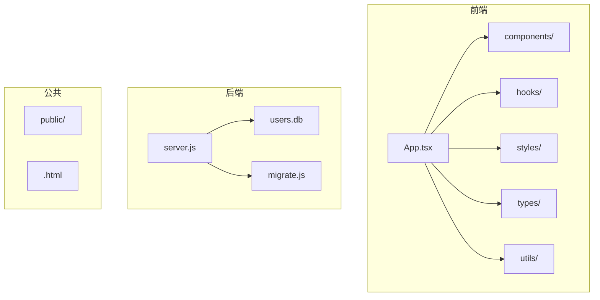
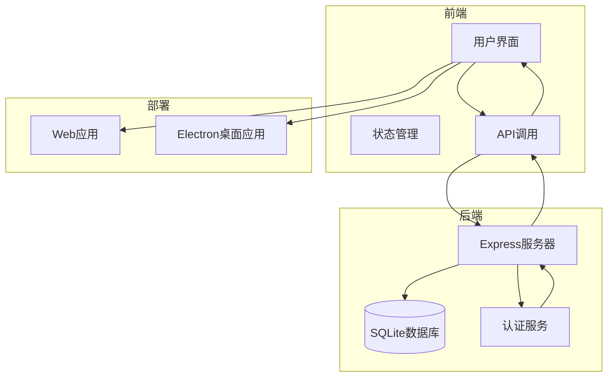
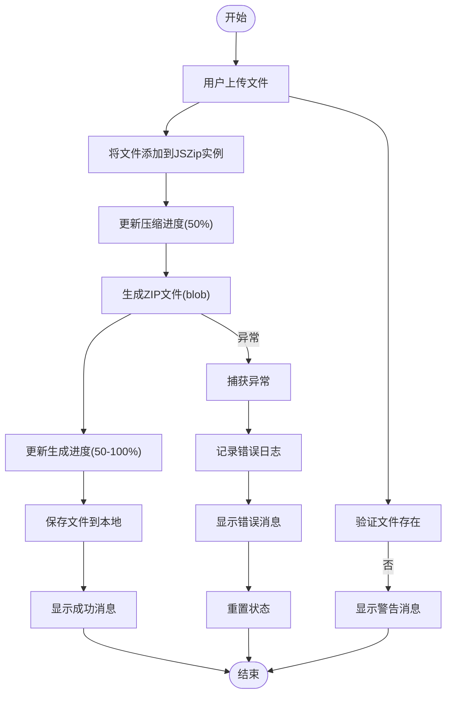
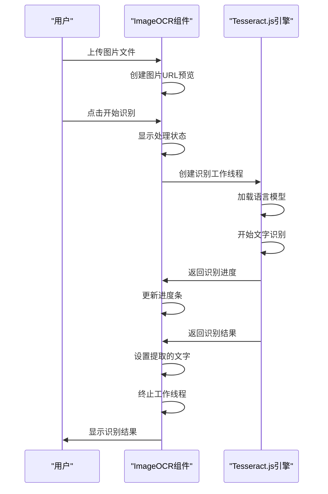
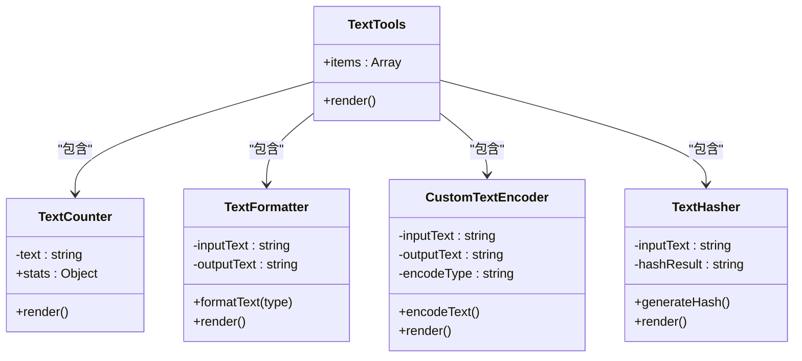
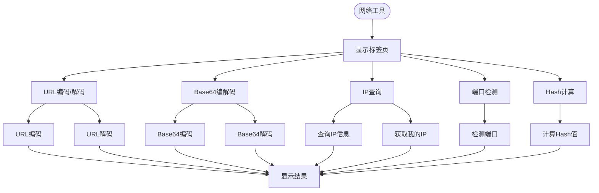
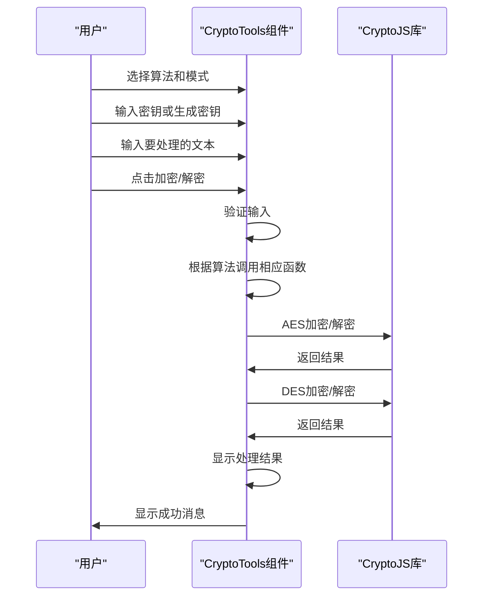
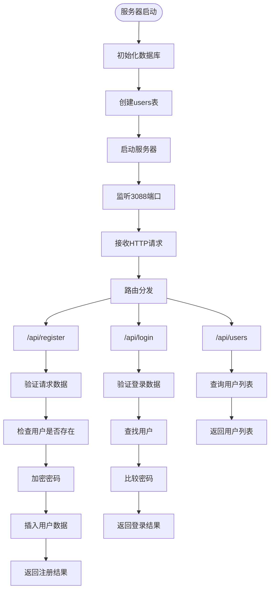
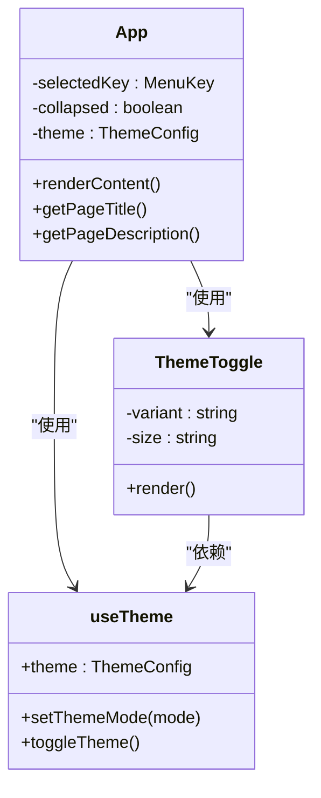

# 项目概述

<cite>
**本文档引用的文件**   
- [FileCompressor.tsx](file://src\components\FileCompressor.tsx)
- [ImageOCR.tsx](file://src\components\ImageOCR.tsx)
- [PDFTools.tsx](file://src\components\PDFTools.tsx)
- [TextTools.tsx](file://src\components\TextTools.tsx)
- [NetworkTools.tsx](file://src\components\NetworkTools.tsx)
- [CryptoTools.tsx](file://src\components\CryptoTools.tsx)
- [Settings.tsx](file://src\components\Settings.tsx)
- [useTheme.ts](file://src\hooks\useTheme.ts)
- [ThemeToggle.tsx](file://src\components\ThemeToggle.tsx)
- [App.tsx](file://src\App.tsx)
- [server.js](file://backend\server.js)
- [README.md](file://README.md)
</cite>

## 目录
1. [项目概述](#项目概述)
2. [项目结构](#项目结构)
3. [核心功能模块](#核心功能模块)
4. [系统架构](#系统架构)
5. [详细组件分析](#详细组件分析)
6. [后端服务](#后端服务)
7. [用户界面与交互](#用户界面与交互)
8. [技术特点与优势](#技术特点与优势)
9. [使用场景与目标用户](#使用场景与目标用户)
10. [学习路径与扩展潜力](#学习路径与扩展潜力)

## 项目概述

officeTools 是一个功能全面的全栈办公工具集，旨在为开发者、办公人员和技术爱好者提供一站式解决方案。该项目集成了文件处理、图像工具、文本处理、开发辅助、网络工具及实用小工具，通过一体化的设计理念，解决了用户在日常工作中需要频繁切换不同工具的痛点。

项目采用现代化的前后端分离架构，前端基于 React + TypeScript 构建，使用 Ant Design 组件库实现美观的用户界面；后端采用 Express 框架提供 RESTful API 服务；同时支持 Electron 桌面端集成，实现了跨平台的应用部署。这种架构设计不仅保证了应用的高性能和可维护性，还为未来的功能扩展提供了坚实的基础。

项目的核心价值在于其功能的全面性和使用的便捷性。从文件压缩、PDF处理到图片OCR识别，从文本格式化到代码美化，从网络工具到加密解密，涵盖了办公和开发中的常见需求。通过统一的界面和一致的操作体验，用户可以高效地完成各种任务，极大地提升了工作效率。

**本节内容基于项目整体定位和功能描述，未直接分析具体代码文件**

## 项目结构

**图示来源**
- [App.tsx](file://src\App.tsx)
- [server.js](file://backend\server.js)

**本节来源**
- [App.tsx](file://src\App.tsx)
- [server.js](file://backend\server.js)

## 核心功能模块

officeTools 项目按照功能划分为多个核心模块，每个模块都针对特定的使用场景提供了专业的工具集。这些模块包括文件处理、图像工具、文本处理、开发辅助、网络工具和实用小工具，共同构成了一个完整的办公工具生态系统。

文件处理模块提供了文件压缩、格式转换和PDF工具等功能，能够满足用户对文件管理的基本需求。图像工具模块集成了图片OCR识别、图片压缩和图片编辑功能，特别适合需要处理大量图像内容的用户。文本处理模块包含文本统计、格式转换、编码转换和哈希计算等功能，是处理文本数据的得力助手。

开发辅助模块专注于开发者的需求，提供了JSON格式化、代码格式化和正则表达式测试等专业工具。网络工具模块则涵盖了URL编码、Base64转换、IP查询、端口检测和Hash计算等网络相关的实用功能。实用小工具模块包含了计算器、生成器、时间戳转换、颜色取值器等日常使用频率较高的小工具。

这些功能模块通过统一的导航菜单组织，用户可以轻松地在不同工具之间切换，享受一致的操作体验。每个工具都经过精心设计，界面简洁直观，操作流程清晰，即使是初学者也能快速上手。

**本节来源**
- [App.tsx](file://src\App.tsx)
- [README.md](file://README.md)

## 系统架构

**图示来源**
- [App.tsx](file://src\App.tsx)
- [server.js](file://backend\server.js)

**本节来源**
- [App.tsx](file://src\App.tsx)
- [server.js](file://backend\server.js)

## 详细组件分析

### 文件压缩组件分析

文件压缩组件是文件处理模块的核心功能之一，它允许用户将多个文件打包成ZIP格式，从而节省存储空间和便于文件传输。

**图示来源**
- [FileCompressor.tsx](file://src\components\FileCompressor.tsx#L1-L167)

**本节来源**
- [FileCompressor.tsx](file://src\components\FileCompressor.tsx#L1-L167)

### 图片识字组件分析

图片识字组件利用Tesseract.js库实现了OCR（光学字符识别）功能，能够从上传的图片中提取文字内容，支持多种语言识别。

**图示来源**
- [ImageOCR.tsx](file://src\components\ImageOCR.tsx#L1-L200)

**本节来源**
- [ImageOCR.tsx](file://src\components\ImageOCR.tsx#L1-L200)

### 文本处理组件分析

文本处理组件提供了多种文本操作功能，包括字符统计、格式转换、编码转换和哈希计算，满足了用户对文本数据处理的各种需求。

**图示来源**
- [TextTools.tsx](file://src\components\TextTools.tsx#L1-L238)

**本节来源**
- [TextTools.tsx](file://src\components\TextTools.tsx#L1-L238)

### 网络工具组件分析

网络工具组件集成了多种网络相关的实用功能，包括URL编码/解码、Base64编码/解码、IP查询、端口检测和Hash计算，为网络开发和调试提供了便利。

**图示来源**
- [NetworkTools.tsx](file://src\components\NetworkTools.tsx#L1-L533)

**本节来源**
- [NetworkTools.tsx](file://src\components\NetworkTools.tsx#L1-L533)

### 加密解密组件分析

加密解密组件提供了对称加密（AES、DES）和哈希计算（MD5、SHA系列）功能，满足了用户对数据安全处理的需求。

**图示来源**
- [CryptoTools.tsx](file://src\components\CryptoTools.tsx#L1-L399)

**本节来源**
- [CryptoTools.tsx](file://src\components\CryptoTools.tsx#L1-L399)

## 后端服务

后端服务采用 Express 框架构建，提供了用户注册、登录和用户列表查询等基本功能。服务使用 SQLite 作为数据库，通过 better-sqlite3 库进行数据库操作，bcrypt 库用于密码加密，确保了用户数据的安全性。

**图示来源**
- [server.js](file://backend\server.js#L1-L160)

**本节来源**
- [server.js](file://backend\server.js#L1-L160)

## 用户界面与交互

用户界面采用现代化的设计风格，通过 Ant Design 组件库实现了美观且功能丰富的界面。应用主组件（App.tsx）负责整体布局和导航，使用 Layout 组件创建了侧边栏和内容区域的布局结构。

主题管理功能通过 useTheme 钩子和 ThemeToggle 组件实现，支持浅色、暗黑和自动三种模式。自动模式会根据系统偏好或时间（18:00-6:00）自动切换主题，为用户提供了最佳的视觉体验。

**图示来源**
- [useTheme.ts](file://src\hooks\useTheme.ts#L1-L119)
- [ThemeToggle.tsx](file://src\components\ThemeToggle.tsx#L1-L119)
- [App.tsx](file://src\App.tsx#L1-L784)

**本节来源**
- [useTheme.ts](file://src\hooks\useTheme.ts#L1-L119)
- [ThemeToggle.tsx](file://src\components\ThemeToggle.tsx#L1-L119)
- [App.tsx](file://src\App.tsx#L1-L784)

## 技术特点与优势

officeTools 项目在技术实现上具有多个显著特点和优势。首先，项目采用了前后端分离的架构设计，前端使用 React + TypeScript，后端使用 Express，这种架构不仅提高了开发效率，还增强了系统的可维护性和可扩展性。

其次，项目充分利用了现代 Web 技术栈的优势。前端使用 Vite 作为构建工具，提供了快速的开发服务器和高效的生产构建；使用 Tailwind CSS 进行样式设计，实现了响应式和现代化的用户界面；通过 Ant Design 组件库，保证了界面的一致性和专业性。

第三，项目在安全性方面也做了充分考虑。后端使用 bcrypt 库对用户密码进行加密存储，防止了密码泄露的风险；通过 CORS 中间件配置了安全的跨域策略，保护了 API 接口的安全。

最后，项目支持 Electron 桌面端集成，使得 Web 应用可以打包为桌面应用程序，实现了跨平台的部署。这种设计既保留了 Web 应用的开发优势，又获得了桌面应用的用户体验。

**本节来源**
- [App.tsx](file://src\App.tsx)
- [server.js](file://backend\server.js)
- [README.md](file://README.md)

## 使用场景与目标用户

officeTools 项目的典型使用场景非常广泛，主要面向三类目标用户：开发者、办公人员和技术爱好者。

对于开发者而言，项目提供的代码格式化、JSON格式化、正则表达式测试、加密解密等工具，可以极大地提高开发效率。在调试API时，网络工具模块的URL编码、Base64转换和Hash计算功能也非常实用。

对于办公人员而言，文件处理模块的文件压缩、PDF工具和图片处理功能，可以满足日常办公中的文档管理需求。文本处理模块的字符统计、格式转换等功能，也适用于处理各种文本数据。

对于技术爱好者而言，项目提供了一个学习和实践的平台。通过研究项目的源代码，可以学习到现代化的前端开发技术、前后端交互模式以及桌面应用开发等知识。

此外，项目还适用于教育场景，作为教学工具帮助学生理解各种技术概念和算法原理。无论是个人使用还是团队协作，officeTools 都能提供高效、便捷的工具支持。

**本节来源**
- [README.md](file://README.md)
- [App.tsx](file://src\App.tsx)

## 学习路径与扩展潜力

对于初学者，建议从以下几个步骤开始学习和使用 officeTools 项目：首先，了解项目的整体架构和功能模块；其次，选择一个感兴趣的工具模块，研究其源代码实现；然后，尝试修改和定制功能，加深理解；最后，可以尝试添加新的工具功能，进行实践。

对于高级用户，项目具有很大的扩展潜力。可以在现有基础上添加更多功能模块，如数据库管理工具、API测试工具、版本控制工具等。也可以改进现有功能，如增加文件压缩的压缩级别选择、优化OCR识别的准确率、增强加密算法的支持等。

此外，项目还可以在部署方式上进行扩展，除了现有的 Web 应用和 Electron 桌面应用，还可以考虑开发移动端应用，或者将部分功能作为浏览器扩展提供。通过 API 接口的完善，还可以构建一个开放的工具平台，允许第三方开发者贡献自己的工具插件。

**本节来源**
- [README.md](file://README.md)
- [App.tsx](file://src\App.tsx)
- [server.js](file://backend\server.js)